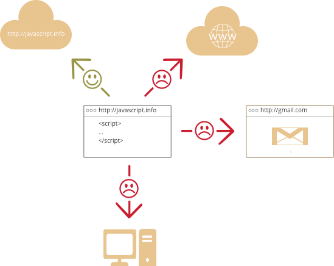

# JavaScript 简介

我们一起来聊一下 JavaScript，用它能做什么，它有哪些特性，以及一些跟它配合使用的技术。

## 什么是 JavaScript？

**JavaScript** 最初的目的是为了**“让网页动起来”**。

这种编程语言我们称之为**脚本**。它们可以写在 HTML 中，在页面加载的时候会自动执行。

脚本作为纯文本存在和执行。它们不需要特殊的准备或编译即可运行。

这方面，JavaScript 和 [Java](http://en.wikipedia.org/wiki/Java) 有很大的区别。

```smart header="Why <u>Java</u>Script?"
JavaScript 在刚诞生的时候，它的名字叫 “LiveScript”。但是因为当时 Java 很流行，所以决定将一种新语言定位为 Java 的“弟弟”会有所帮助。

随着 JavaScript 的发展，它已经变成了一门独立的语言，同时也有了自己的语言规范 [ECMAScript](http://en.wikipedia.org/wiki/ECMAScript)。现在，它和 Java 之间没有任何关系。
```

现在，JavaScript 不仅仅是在浏览器内执行，也可以在服务端执行。甚至在任意搭载了 [JavaScript 引擎](https://en.wikipedia.org/wiki/JavaScript_engine) 的环境中都可以执行。

浏览器中嵌入了 JavaScript 引擎，有时也称作 JavaScript 虚拟机。

不同的引擎有不同的名字，例如：

- [V8](https://en.wikipedia.org/wiki/V8_(JavaScript_engine)) -- Chrome 和 Opera 中的 JavaScript 引擎。
- [SpiderMonkey](https://en.wikipedia.org/wiki/SpiderMonkey) -- Firefox 中的 JavaScript 引擎。
- ... 也有一些其他的 JavaScript 引擎，例如，“Trident” 和 “Chakra” 是不同版本 IE 的 JavaScript 引擎，“ChakraCore” 是 Microsoft Edge 的 JavaScript 引擎，“Nitro” 和 “SquirrelFish” 是 Safari 的 JavaScript 引擎，等等。

上面这些很容易记忆，因为经常出现在网上关于开发的文章中。我们也会这样用。例如：某个新的功能，如果 JavaScript 引擎 V8 是支持的，那么我们可以认为这个功能在 Chrome 和 Opera 中可以正常运行。

```smart header="引擎是如何工作的？"

引擎很复杂，但是基本原理很简单。

1. 引擎（通常嵌入在浏览器中）读取（“解析”）脚本。
2. 然后将脚本转化（“编译”）为机器语言。
3. 然后就可以在机器上飞速的运行。

引擎会对流程中的每个阶段都进行优化。它甚至可以在运行时监视编译的脚本，分析数据流并根据这些对机器代码应用优化。最后，脚本会执行地非常快。
```

## 浏览器中的 JavaScript 能做什么 ?

现代的 JavaScript 是一种“安全”语言。它不提供对内存或 CPU 的底层访问，因为它最初是为浏览器创建的，不需要这些功能。

JavaScript 的能力依赖于它执行的环境。例如：[Node.js](https://wikipedia.org/wiki/Node.js) 允许 JavaScript 读写任意文件、执行网络请求等。

浏览器中的 JavaScript 可以完成所有和网页相关的操作、处理用户和 Web 服务器之间的交互。

例如，浏览器中的 JavaScript 可以完成下面这些事：

- 在网页中插入新的 HTML，修改现有的网页内容和网页的样式。
- 响应用户的行为，响应鼠标的点击或移动、键盘的敲击。
- 向远程服务器发送请求，使用 [AJAX](https://en.wikipedia.org/wiki/Ajax_(programming)) 和 [COMET](https://en.wikipedia.org/wiki/Comet_(programming)) 技术下载或上传文件。
- 获取或修改 cookie，向用访问者提出问题、发送消息。
- 记住客户端的数据（本地存储）。

## 浏览器中的 JavaScript 不能做什么？

为了用户的（信息）安全，在浏览器中的 JavaScript 的能力是有限的。这样主要是为了阻止邪恶的网站获得或修改用户的私人数据。

这些限制的例子有：

* 网页中的 JavaScript 不能读、写、复制及执行用户磁盘上的文件或程序。它没有直接访问操作系统的功能。

  现代浏览器允许 JavaScript 做一些文件相关的操作，但是这个操作是受到限制的。仅当用户使用某个特定的动作，JavaScript 才能操作这个文件。例如，把文件 “拖” 到浏览器中，或者通过 `<input>` 标签选择文件。

  JavaScript 有很多方式和设备的照相机/麦克风交互，但是这些都需要提前获得用户的授权许可。所以，JavaScript 并不会偷偷的通过你的摄像头观察你，更不会把你的信息发送到[美国国家安全局](https://en.wikipedia.org/wiki/National_Security_Agency)。
- 不同的浏览器标签页之间基本彼此不相关。有时候，也会有一些关系。例如，通过 JavaScript 打开另外一个新的标签页。但即使在这种情况下，如果两个标签页打开的不是同一个网站（域名、协议或者端口任一不相同的网站），他们都不能够相互通信。

  这就是 “同源策略”。为了解决不同标签页交互的问题，两个同源的网站必须**都**包含一些特殊的 JavaScript 代码，才能够实现数据交换。

  这个限制也是为了用户的信息安全。例如，用户打开的 `http://anysite.com` 网页的 JavaScript 不能访问 `http://gmail.com`（另外一个标签页打开的网页）也不能从那里窃取信息。
- JavaScript 通过互联网可以很容易的和服务器（当前网页域名的服务器）通讯。但是从其他的服务器中获取数据的功能是受限的，需要服务器（在 HTTP 头中）添加某些参数。这也是为了用户的数据安全。



浏览器环境外的 JavaScript 一般没有这些限制。例如服务端的 JavaScript 就没有这些限制。现代浏览器还允许通过 JavaScript 来安装浏览器插件或扩展，当然这也是在用户授权的前提下。

## JavaScript 为什么与众不同？

至少有 **3** 件事值得一提：

```compare
+ 和 HTML/CSS 完全的集成。
+ 使用简单的工具完成简单的任务。
+ 被所有的主流浏览器支持，并且默认开启。
```

满足这三条的浏览器技术也只有 JavaScript 了。

这就是为什么 JavaScript 与众不同！这也是为什么它是创建浏览器界面的最普遍的工具。

当然，学习一项新技术的时候，最好先看一下它的前景。所以，接下来我们继续讨论包括新语言和浏览器功能在内的现代趋势。


## 比 JavaScript “好” 的语言

不同的人喜欢不同的功能，JavaScript 的语法也不能够满足所有人。

这是正常的，因为每个人的项目和需求都不一样。

所以，最近出现了很多不同的语言，这些语言在浏览器中执行之前，都会被**编译**（转化）成 JavaScript。

现代化的工具使得编译速度非常快速和透明，实际上允许开发人员使用另一种语言编写代码并将其自动转换为 JavaScript。

这些语言的例子有：

- [CoffeeScript](http://coffeescript.org/) 是 JavaScript 的语法糖，它语法简短，明确简洁。通常使用 Ruby 的人喜欢用。
- [TypeScript](http://www.typescriptlang.org/) 将注意力集中在增加严格的数据类型。这样就能简化开发，也能用于开发复杂的系统。TypeScript 是微软开发的。
- [Dart](https://www.dartlang.org/) 是一门独立的语言。它拥有自己的引擎用于在非浏览器环境中运行（如：在手机应用中运行）。最开始是 Google 提供的用于替代 JavaScript 的，但是现在，它和其他上述的语言一样，浏览器也要求它被编译成 JavaScript 。

当然，还有更多其他的语言。即使我们在使用这些语言，我们也需要知道 JavaScript。因为学习 JavaScript 可以让我们真正明白我们自己在做什么。

## 总结

- JavaScript 最开始是为浏览器设计的一门语言，但是现在也可以在其它的环境中运行。
- 现在，JavaScript 是一门在浏览中使用最广、并且能够很好集成 HTML/CSS 的语言。
- 有很多其他的语言可以编译成 JavaScript，这些语言还提供更多的功能。最好要了解一下这些语言，至少在掌握 JavaScript 之后，需要简单的看一下。
