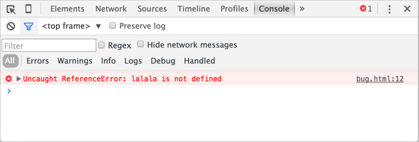

# 开发者控制台

代码是很容易出现错误的。你也很可能犯错误……哦，我在说什么？只要你是人，你 **一定** 会犯错误（在写代码的时候），除非你是 [机器人](https://en.wikipedia.org/wiki/Bender_(Futurama))。

但在浏览器中，默认情况下用户是看不到错误的。所以，如果脚本中有错误，我们看不到是什么错误，更不能够修复它。

为了发现错误并获得一些与脚本相关且有用的信息，浏览器内置了“开发者工具”。

通常，开发者倾向于使用 Chrome 或 Firefox 进行开发，因为它们有最好的开发者工具。一些其它的浏览器也提供开发者工具，有时还具有一些特殊的功能，通常它们都是在“追赶” Chrome 或 Firefox。所以大多数人都有“最喜欢”的浏览器，当遇到某个浏览器独有的问题的时候，人们就会切换到其它的浏览器。

开发者工具很强大，功能丰富。首先，我们将学习如何打开它们，查找错误和运行 JavaScript 命令。

## Google Chrome

打开网页 [bug.html](bug.html)。

在这个页面的 JavaScript 代码中有一个错误。一般的访问者看不到这个错误，所以让我们打开开发者工具看看吧。

按下 `key:F12` 键，如果你使用 Mac，试试 `key:Cmd+Opt+J`。

默认情况下，开发者工具会被在 Console 标签页中打开。

就像这样：



具体什么样，要看你的 Chrome 版本。它随着时间一直在变，但是都很类似。

- 在这我们能看到红色的错误提示信息。这个场景中，脚本里有一个未知的 "lalala" 命令。
- 在右边，有个可点击的链接 `bug.html:12`。这个链接会链接到错误发生的行号。

在错误信息的下方，有个 `>` 标志。它代表“命令行”，在“命令行”中，我们可以输入 JavaScript 命令，按下 `key:Enter` 来执行。

现在，我们能看到错误就够了。稍后，在 <info:debugging-chrome> 一节中，我们会重新更加深入地学习开发者工具。

```smart header="多行输入"
通常，当我们向控制台输入一行代码后，按 `key:Enter`，这行代码就会立即执行。

如果想要插入多行代码，请按 `key:Shift+Enter` 来进行换行。这样就可以输入长片段的 JavaScript 代码了。
```

## Firefox、Edge 和其它浏览器

大多数其它的浏览器都是通过 `key:F12` 来打开开发者工具。

它们的外观和感觉都非常相似，一旦你学会了它们中的一个（可以先尝试 Chrome），其它的也就很快就可以熟悉了。

## Safari

Safari（Mac 系统中的浏览器，Windows 和 Linux 系统不支持）有一点点不同。我们需要先开启“开发菜单”。

打开“偏好设置”，选择“高级”选项。选中最下方的那个选择框：


现在，我们通过 `key:Cmd+Opt+C` 就能打开或关闭控制台了。另外注意，有一个名字为“开发”的顶部菜单出现了。它有很多命令和选项。

## 总结

* 开发者工具允许我们查看错误、执行命令、检查变量等。
* 在 Windows 系统中，可以通过 `key:F12` 开启开发者工具。Mac 系统下，Chrome 需要使用 `key:Cmd+Opt+J`，Safari 使用 `key:Cmd+Opt+C`（需要提前开启）。

现在我们的环境准备好了。下一章，我们将正式开始学习 JavaScript。
