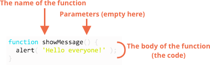

# 函数

我们经常需要在脚本的许多地方执行类似的操作。

例如，当访问者登录、注销或者其他地方时，我们需要显示一条漂亮的信息。

函数是程序的主要“构建模块”，它们允许不重复地多次调用代码。

我们已经看到了内置函数的示例，如 `alert(message)`、`prompt(message, default)` 和 `confirm(question)`。但我们也可以创建自己的函数。

## 函数声明

使用**函数声明**创建函数。

看起来就像这样：

```js
function showMessage() {
  alert( 'Hello everyone!' );
}
```

 `function` 关键字首先出现，然后是**函数名**，然后是括号（在上述示例中为空）之间的**参数**列表，最后是花括号之间的代码（即“函数体”）。



我们的新函数可以用名称调用 `showMessage()`。

例如：

```js run
function showMessage() {
  alert( 'Hello everyone!' );
}

*!*
showMessage();
showMessage();
*/!*
```

调用 `showMessage()` 执行函数的代码，这里我们会看到这个消息两次。

这个例子清楚地演示了函数的主要目的之一是：避免代码重复。

如果我们需要更改消息或显示方式，只需在一个地方修改代码：输出它的函数。

## 局部变量

在函数中声明的变量只在该函数内部可见。

例如：

```js run
function showMessage() {
*!*
  let message = "Hello, I'm JavaScript!"; // 局部变量
*/!*

  alert( message );
}

showMessage(); // Hello, I'm JavaScript!

alert( message ); // <-- 错误！变量是函数的局部变量
```

## 外部变量

函数也可以访问外部变量，例如：

```js run no-beautify
let *!*userName*/!* = 'John';

function showMessage() {
  let message = 'Hello, ' + *!*userName*/!*;
  alert(message);
}

showMessage(); // Hello, John
```

函数可以访问外部变量，也可以修改它。

例如：

```js run
let *!*userName*/!* = 'John';

function showMessage() {
  *!*userName*/!* = "Bob"; // (1) 改变外部变量

  let message = 'Hello, ' + *!*userName*/!*;
  alert(message);
}

alert( userName ); // *!*John*/!* 在函数调用之前

showMessage();

alert( userName ); // *!*Bob*/!*, 值被函数修改
```

只有在没有本地变量的情况下才会使用外部变量。因此如果我们忘记了 `let`，可能会发生意外修改的情况。

如果在函数中声明了同名变量，那么它**遮蔽**外部变量。例如，在如下代码中，函数使用本地的 `userName`，外部部分被忽略：

```js run
let userName = 'John';

function showMessage() {
*!*
  let userName = "Bob"; // 声明一个局部变量
*/!*

  let message = 'Hello, ' + userName; // *!*Bob*/!*
  alert(message);
}

//  函数会创建并使用它自己的 userName
showMessage();

alert( userName ); // *!*John*/!*，未更改，函数没有访问外部变量。
```

```smart header="Global variables"
任何函数之外声明的变量，例如上诉代码中的外部 `userName` 都称为**全局**。

全局变量在任意函数中都是可见的(除非被局部变量遮蔽)。

通常，函数声明与任务相关的所有变量。全局变量只存储项目级的数据，所以这些变量从任何地方都可以访问是很重要的事情。现代的代码有很少或没有全局变量。大多数变量存在于它们的函数中。
```

## 参数

我们可以使用参数（也称“函数参数”）来将任意数据传递给函数。

在如下示例中，函数有两个参数：`from` 和 `text`。

```js run
function showMessage(*!*from, text*/!*) { // 参数：from、text
  alert(from + ': ' + text);
}

*!*
showMessage('Ann', 'Hello!'); // Ann: Hello! (*)
showMessage('Ann', "What's up?"); // Ann: What's up? (**)
*/!*
```

当在行 `(*)` 和 `(**)` 中调用函数时，将给定的值复制到局部变量 `from` 和 `text`。然后函数使用它们。

这里有一个例子：我们有一个变量 `from`，将它传递给函数。请注意：函数会修改 `from`，但在外部看不到更改，因为函数修改的是变量的副本：


```js run
function showMessage(from, text) {

*!*
  from = '*' + from + '*'; // 让 "from" 看起来更优雅
*/!*

  alert( from + ': ' + text );
}

let from = "Ann";

showMessage(from, "Hello"); // *Ann*: Hello

// "from" 值相同，函数修改了本地副本。
alert( from ); // Ann
```

## 默认值

如果未提供参数，则其值是 `undefined`。

例如，之前提到的函数 `showMessage(from, text)` 可以用一个参数调用：

```js
showMessage("Ann");
```

那不是错误，这样调用将输出 `"Ann: undefined"`。没有 `text` 所以假设 `text === undefined`。

如果我们想在本例中使用“默认” `text`,那么我们可以在 `=` 之后指定它：

```js run
function showMessage(from, *!*text = "no text given"*/!*) {
  alert( from + ": " + text );
}

showMessage("Ann"); // Ann: 无文本
```

现在如果 `text` 参数未被传递，它将会得到 `"no text given"` 的值。

这里 `"no text given"` 是 string，但它可以是更复杂的表达式，只有在缺少参数时才会计算和分配改表达式。因此，这也是可能的：

```js run
function showMessage(from, text = anotherFunction()) {
  // anotherFunction() 仅在没有给定文本时执行
  // 其结果变成文本值
}
```


````smart header="Default parameters old-style"
旧版本的 JavaScript 不支持默认参数。所以有其他的方法来支持它们，您可以在旧的脚本中找到。

例如，用于 `undefined` 的显式检查：

```js
function showMessage(from, text) {
*!*
  if (text === undefined) {
    text = 'no text given';
  }
*/!*

  alert( from + ": " + text );
}
```

...Or the `||` operator:

```js
function showMessage(from, text) {
  // if text is falsy then text gets the "default" value
  text = text || 'no text given';
  ...
}
```


````


## 返回值

函数可以将一个值返回到调用代码中作为结果。

最简单的例子是将两个值相加的函数：

```js run no-beautify
function sum(a, b) {
  *!*return*/!* a + b;
}

let result = sum(1, 2);
alert( result ); // 3
```

指令 `return` 可以在函数的任意位置。当执行到达时，函数停止，并将值返回给调用代码（分配给上述 `result`）。

在一个函数中可能会出现很多次 `return`。例如：

```js run
function checkAge(age) {
  if (age > 18) {
*!*
    return true;
*/!*
  } else {
*!*
    return confirm('Got a permission from the parents?');
*/!*
  }
}

let age = prompt('How old are you?', 18);

if ( checkAge(age) ) {
  alert( 'Access granted' );
} else {
  alert( 'Access denied' );
}
```

在没有值的情况下使用 `return` 可能会导致函数立即退出。

例如：

```js
function showMovie(age) {
  if ( !checkAge(age) ) {
*!*
    return;
*/!*
  }

  alert( "Showing you the movie" ); // (*)
  // ...
}
```

在上诉代码中，如果 `checkAge(age)` 返回 `false`，那么 `showMovie` 将不会进入 `alert`。

````smart header="A function with an empty `return` or without it returns `undefined`"
如果函数无返回值，它就会像返回 `undefined` 一样：

```js run
function doNothing() { /* empty */ }

alert( doNothing() === undefined ); // true
```

空 `return` 也和 `return undefined` 一样：

```js run
function doNothing() {
  return;
}

alert( doNothing() === undefined ); // true
```
````

````warn header="Never add a newline between `return` and the value"
对于 `return` 的长表达式，可能会倾向于将其放在单独一行，如下所示：

```js
return
 (some + long + expression + or + whatever * f(a) + f(b))
```
这不起作用，因为 JavaScript 默认会在 `return` 之后加分号。它的工作原理如下：

```js
return*!*;*/!*
 (some + long + expression + or + whatever * f(a) + f(b))
```
因此它实际上变成了空返回。我们应该把值放在同一行。
````

## 函数命名 [#function-naming]

函数是行为。所以它们的名字通常是动词。它应该简短且尽可能准确地描述函数的作用。这样读代码的人就能得到正确的线索。

一种普遍的做法是用动词前缀来开始一个函数，这个前缀模糊地描述了这个动作。团队内部必须就前缀的含义达成一致。

例如，以 `"show"` 开头的函数通常会显示某些内容。

函数开始...

- `"get…"` —— 返回值，
- `"calc…"` —— 计算
- `"create…"` —— 创建，
- `"check…"` —— 检查并返回 boolean 值，等。

这类名字的示例：

```js no-beautify
showMessage(..)     // 显示信息
getAge(..)          // 返回 age (gets it somehow)
calcSum(..)         // 计算求和并返回结果
createForm(..)      // 创建表格 (通常会返回它)
checkPermission(..) // 检查权限并返回 true/false
```

有了前缀，浏览一下函数名就可以了解它做了什么工作，返回什么样的值。

```smart header="One function -- one action"
一个函数应该完全按照它的名字来做，而不是做更多和自身无关的功能。

两个独立的操作通常需要两个函数，即使它们通常被一起调用(在这种情况下，我们可以创建第三个函数来调用这两个函数)。

有几个违反这一规则的例子：

- `getAge` —— 如果它显示一个 `alert` 和这个 age（只应该得到），那就是有问题的。
- `createForm` —— 如果它修改文档，向它添加一个表单(只应该创建它并返回)，那就是有问题的。
- `checkPermission` —— 如果显示 `access granted/denied` 消息(只应执行检查并返回结果)，那就是错误的。

这些例子具有前缀的共同含义。它们对您的意义取决于您和您的团队。也许您的代码行为不同是很正常的。但是您应该对前缀意味着什么，前缀函数能做什么和不能做什么有一个明确的理解。所有相同的前缀函数都应遵守规则。团队应该分享知识。
```

```smart header="Ultrashort function names"
常用的函数有时会有**非常短**的名字。

例如，[jQuery](http://jquery.com) 框架定义函数用 `$`。[LoDash](http://lodash.com/) 库的核心函数命名用 `_`。

这些都是例外，一般而言，函数名应简明扼要且具有描述性。
```

## 函数 == 注释

函数应该简短且只有一个功能。如果函数太大，把该函数分成几个小的函数是值得的。有时候遵循这个规则并不是那么容易，但这绝对是件好事。

一个单独的函数不仅更容易测试和调试 —— 它的存在本身就是一个很好的注释！

例如，比较如下两个函数 `showPrimes(n)`。输出到 `n` 的[素数](https://en.wikipedia.org/wiki/Prime_number) 。

第一个变体使用标签：

```js
function showPrimes(n) {
  nextPrime: for (let i = 2; i < n; i++) {

    for (let j = 2; j < i; j++) {
      if (i % j == 0) continue nextPrime;
    }

    alert( i ); // a prime
  }
}
```

第二个变体使用附加函数 `isPrime(n)` 来检验素数：

```js
function showPrimes(n) {

  for (let i = 2; i < n; i++) {
    *!*if (!isPrime(i)) continue;*/!*

    alert(i);  // a prime
  }
}

function isPrime(n) {
  for (let i = 2; i < n; i++) {
    if ( n % i == 0) return false;
  }
  return true;
}
```

第二个变体更容易理解，不是吗？我们看到的不是代码块，而是操作的名称（`isPrime`）。有时人们把这样的代码称为**自我描述**。

因此，即使我们不打算重用它们，也可以创建函数。它们构造代码并使其可读性强。

## 总结

函数声明像这样：

```js
function name(parameters, delimited, by, comma) {
  /* code */
}
```

- 作为参数传递给函数，值被复制到其局部变量
- 函数可以访问外部变量。但它只能从内到外起作用。函数外部的代码看不到它的局部变量。
- 函数可以返回值。如果没有，则其结果是 `undefined`。

为了使代码简洁易懂，建议在函数中主要使用局部变量和参数，而不是外部变量。

与不获取参数但作为副作用修改外部变量的函数相比，理解获取参数、与它们一起工作并返回结果的函数总是更容易理解。

函数命名：

- 名称应该清楚地描述函数的功能。当我们在代码中看到一个函数调用时，一个好的名称立即让我们了解它所做的和返回的事情。
- 函数是一种行为，所以函数名通常是动词。
- 有许多优秀的函数前缀，如 `create…`、`show…`、`get…`、`check…` 等等。使用它们来提示函数的作用。

函数是脚本的主要构建块。现在我们已经介绍了基本知识，这样我们就可以开始创建和使用它们了。但这只是道路的开始。我们将多次回到它们身上，更深入地研究它们的先进特征。
