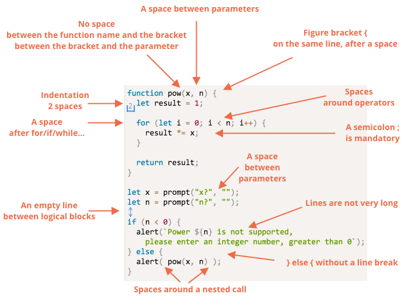
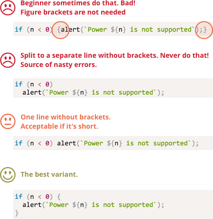

# 代码风格

我们的代码必须尽可能的清晰和易读。

这实际是一种编程艺术 —— 以一种正确并且人类易读的方式编码来完成一个复杂的任务。

有一个帮助你（实现上面的目标）的事情就是良好的代码风格。

[cut]

## 语法

一个含有规则的备忘录（更多细节如下）：


<!--
```js
function pow(x, n) {
  let result = 1;

  for (let i = 0; i < n; i++) {
    result *= x;
  }

  return result;
}

let x = prompt("x?", "");
let n = prompt("n?", "");

if (n < 0) {
  alert(`Power ${n} is not supported,
    please enter an integer number, greater than 0`);
} else {
  alert( pow(x, n) );
}
```

-->

现在我们来讨论一下图中的规则和它们的原因吧。

没有什么规则是“刻在石头上”的，每一条都是可选的而且可修改的：这些是编码规则，而不是宗教教条。

### Figure brackets（大括号）

在大多数的 JavaScript 中，大括号（的开始部分）都是写在同一行而不是新换一行。这就是所谓的 "egyptian" 风格。（译者注： "egyptian" 风格又称 K&R 风格 —— 代码段括号的开始位于一行的末尾，而不是另外起一行的风格。）对了，在括号的开始部分前面还有一个空格。

有一个比较特殊的情况是单行的 `if/for`。我们应该用大括号吗？如果是，那么在哪里呢？

下面是这几种情况的注释，你可以自己判断一下它们的可读性：

<!--
```js no-beautify
if (n < 0) {alert(`Power ${n} is not supported`);}

if (n < 0) alert(`Power ${n} is not supported`);

if (n < 0)
  alert(`Power ${n} is not supported`);

if (n < 0) {
  alert(`Power ${n} is not supported`);
}
```
-->


总结：
- 对于很短的代码，一行是可以接受的：例如 `if (cond) return null`.
- 但是括号中的每个语句单独一行通常更好些。

### 行的长度

一行的最大长度应该有所限制。没有人喜欢盯着一条长长的水平线。最好把它分割一下。

一行的最大长度在团队层面上达成一致即可。通常是 80 或 120 个字符。

### 缩进

有两种类型的缩进：

- **水平方向上的缩进: 2(4) 个空格。**

    一个水平缩进通常由 2 或 4 个空格或者 "Tab" 制表符构成。选择哪一个方式是一场古老的圣战。如今空格更普遍一点。

    选择空格而不是 tabs 的优点之一是它们允许你做出比 “Tab” 制表符更加灵活的缩进配置。

    例如，我们可以将参数和括号的开头对齐，像下面这样：

    ```js no-beautify
    show(parameters,
         aligned, // 左边有 5 个空格
         one,
         after,
         another
      ) {
      // ...
    }
    ```

- **垂直方向上的缩进：用于将逻辑块中的代码进行分割的空行。**

    即使是单个函数通常也被分割为数个逻辑块。在下面的例子中，初始化的变量、主要的循环结构和返回值都被垂直分割了。

    ```js
    function pow(x, n) {
      let result = 1;
      //              <--
      for (let i = 0; i < n; i++) {
        result *= x;
      }
      //              <--
      return result;
    }
    ```

    插入一个额外的空行有助于让代码更加地易读。连续超过 9 行都没有被垂直分割的代码是不应该出现的。

### 分号

每一个语句后面都应该有一个分号。即使它可能会被跳过。

有一些语言的分号是可选的。那些语言中很少使用分号。

但是在 JavaScript 中不会将换行解释为分号的情况很少。这些地方会造成编程错误，所以分号应该出现在这些位置。

### 嵌套的层级

你不应该嵌套太多的层级。

有时候在循环中使用 ["continue"](info:while-for#continue) 指令避免额外的 `if(..) { ... }` 嵌套是一个好主意：

例如：

```js
for (let i = 0; i < 10; i++) {
  if (cond) {
    ... // <- 又一层嵌套
  }
}
```

我们可以这样写：

```js
for (let i = 0; i < 10; i++) {
  if (!cond) *!*continue*/!*;
  ...  // <- 没有额外的嵌套
}
```

使用 `if/else` 和 `return` 可以做类似的事情。

例如，下面的两个结构是相同的。

第一个：

```js
function pow(x, n) {
  if (n < 0) {
    alert("Negative 'n' not supported");
  } else {
    let result = 1;

    for (let i = 0; i < n; i++) {
      result *= x;
    }

    return result;
  }
}
```

还有这个：

```js
function pow(x, n) {
  if (n < 0) {
    alert("Negative 'n' not supported");
    return;
  }

  let result = 1;

  for (let i = 0; i < n; i++) {
    result *= x;
  }

  return result;
}
```

但是第二个更加的可读，因为 `n < 0` 这个”边缘情况“已经提前被处理过，并且我们有一个 ”主“ 代码流，而不需要额外的嵌套。

## 函数在代码下面

如果你正在写几个”辅助类“的函数和一些使用它们的代码，有三种方式来放置它们。

1. 函数在调用它们的那些代码之上：

    ```js
    // *!*函数声明*/!*
    function createElement() {
      ...
    }

    function setHandler(elem) {
      ...
    }

    function walkAround() {
      ...
    }

    // *!*使用函数的代码*/!*
    let elem = createElement();
    setHandler(elem);
    walkAround();
    ```
2. 先写代码，再写函数

    ```js
    // *!*the code which uses the functions*/!*
    let elem = createElement();
    setHandler(elem);
    walkAround();

    // --- *!*helper functions*/!* ---

    function createElement() {
      ...
    }

    function setHandler(elem) {
      ...
    }

    function walkAround() {
      ...
    }
    ```
3. 混合，函数定义在它第一次被使用的地方。

大多数时候，第二种方式更好。

这是因为当在阅读代码时，我们首先想要知道的是“它做了什么”。如果代码先行，它就会提供这些信息。或许我们一点也不需要阅读这些函数，尤其是他们的名字足够表示出他们做了什么的时候。

## 风格指南

风格指南包含了“如果编写代码”的通用规则：使用什么引号、用多少空格来缩进、哪里放置换行等等很多的小细节。

总的来说，当团队中的所有成员都使用同样的风格指南时，代码看起来是统一的。无论团队中谁写的，都是一样的风格。

当然，一个团队可能会想一个他们自己的风格指南。但是现在，他们没必要这样做。现在有很多已经尝试过并制作好的风格指南，可以很容易采用。

例如：

- [Google JavaScript 风格指南](https://google.github.io/styleguide/javascriptguide.xml)
- [Airbnb JavaScript 风格指南](https://github.com/airbnb/javascript)
- [Idiomatic.JS](https://github.com/rwaldron/idiomatic.js)
- (还有很多)

如果你是一个初学者，你可以从本章中上面的内容开始，然后浏览风格指南并提取出常见规则或者选择一个。

## 自动检测器

有很多工具可以自动检查你的代码风格。他们叫做 "linters"。

它们有一个很棒的地方是风格检测也会发现一些 bug（问题），诸如变量名或者函数书写错误。

因此推荐你安装一个，即使你不想坚持某个 "code style"。它们会帮你找出书写错误 —— 这就已经足够好了。

最出名的工具有：

- [JSLint](http://www.jslint.com/) -- 第一批 linters 之一。
- [JSHint](http://www.jshint.com/) -- 比 JSHint 多了更多设置。
- [ESLint](http://eslint.org/) -- 可能是最新的一个。

它们都能够做这些工作。笔者使用 [ESLint](http://eslint.org/).

大多数 linters 都可以与编辑器集成在一起：只需在编辑器中启用插件并配置风格即可。

例如，要使用 ESLint 你应该这样做：

1. 安装 [Node.JS](https://nodejs.org/).
2. 使用 `npm install -g eslint` 命令（npm 是 Node.JS 的包安装工具）安装 ESLint。
3. 在你项目的根目录（包含你所有文件的那个目录）创建一个名叫 `.eslintrc` 的配置文件。

这有一个 `.eslintrc` 的例子：

```js
{
  "extends": "eslint:recommended",
  "env": {
    "browser": true,
    "node": true,
    "es6": true
  },
  "rules": {
    "no-console": 0,
  },
  "indent": 2
}
```

这里的 `"extends"` 指令表示我们是基于 "eslint:recommended" 的设置项而进行设置的，并且我们还指定了我们自己的规则。

在你的编辑器中安装 / 启用插件以和 ESLint 集成。大多数编辑都有的。

你也可以从网上下载一些风格规则然后扩展它们。查看 <http://eslint.org/docs/user-guide/getting-started> 以获得有关安装的更多详细信息。

使用一个 linter 会有一些很棒的边际效用。Linters 可以捕捉错别字。例如，当一个 undefined 变量被访问时，linter 会检测出并把它高亮（如果和编辑器集成了）。在大多数情况下，这都是你打错啦。所以我们可以在一开始就解决它。

因此即使你不关心风格，也推荐你使用一个 linter。

某些 IDE 还支持内置的 linting，但不像 ESLint 那么灵活可配置。

## 总结

本章的所有语法规则和样式指南旨在提高可读性，因此所有的内容都是值得商榷的。

当我们思考“如何写地更好”的时候，唯一的标准是“什么会让代码更加可读和容易理解，什么会帮助我们避免错误”。这是当选择一种风格或讨论哪一种更好的时候要牢记的主要原则。

阅读风格指南，以查看相关的最新想法，并遵循那些你发现的最好的。
