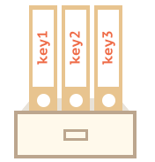
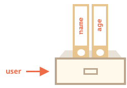
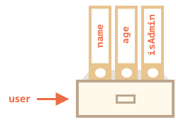
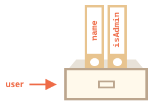
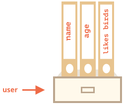
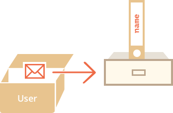

# 对象

正如我们从《引言：类型》中知道的那样，JS中有很多种类型。 有六种原始类型，因为他们只包含一种东西（字符串，数值或者什么之类）

相反，对象用来存储键值对和更复杂的实体。在JS中，对象深入到这门语言的方方面面。所以在我们深入理解这门语言之前，我们必须理解对象。

对象可以通过中括号`{…}`和其中包含一些可选的*属性*来创建。属性是一个键值对，键是一个字符串 （也叫做属性名），值可以是任何类型.

我们可以把对象想象成存放文件的橱柜。 文件按照他们的名字来排列。这样根据文件名我们就很容易找到，添加或删除一个文件了。



我们可以额用下面的语法来创建一个空的对象（“空柜子”）：

```js
let user = new Object(); // “构造函数” 的语法
let user = {};  // “对象文本” 的语法
```


通常，我们用中括号。这种方式我们叫做*对象文本*

## 文本和属性

我们可以在创建的时候立马给对象一些属性，在`{...}`里面放置一些键值对。

```js
let user = {     // 一个对象
  name: "John",  // 键“name”，值 "John"
  age: 30        // 键“age”，值 30
};
```

属相有键（或者也可以叫做名字，标识符），在冒号的前面`":"`，值在冒号的右边。

在 `user` 对象中, 有两个属性：

1. 第一个的键是 `"name"` 值是 `"John"`.
2. 第二个的键是 `"age"` 值是 `30`.

你可以想想`user`对象是一个陈列着两个"name" 和 "age"签名文件的橱柜。



任何时候我们都可以添加，删除，读取文件。

可以通过点语法来使用属性：

```js
// 读取文件的属性：
alert( user.name ); // John
alert( user.age ); // 30
```

属性的值可以是任意类型，让我们加个布尔类型：

```js
user.isAdmin = true;
```



移除一个属性，我们用`delete`操作：

```js
delete user.age;
```



我们也可以用多个但是来作为属性名，但是他们必须被包在一起：

```js
let user = {
  name: "John",
  age: 30,
  "likes birds": true  // 两个单词被包在一起
};
```




最后一个属性后面可以加一个逗号：
```js
let user = {
  name: "John",
  age: 30*!*,*/!*
}
```
这叫做尾逗号，或者悬挂逗号。这样无论我们添加，删除，移动属性，所有的行都是一样的。

## 方括号

对于多个单词的属性，点操作就不能用啦。

```js run
// 语法错误
user.likes birds = true
```

这是因为点操作需要键是一个有效的标识符，不能有空格和其他的一些限制。

中括号中可以使用任何字符串：


```js run
let user = {};

// set
user["likes birds"] = true;

// get
alert(user["likes birds"]); // true

// delete
delete user["likes birds"];
```

现在一切都很好。注意中括号中的字符串要放在引号中，单引号双引号都可以的。

中括号同样提供了通过其他表达式来获取属性名的方式 -- 跟语义上的字符串不同 -- 比如像下面一样的变量：

```js
let key = "likes birds";

// 跟 user["likes birds"] = true; 一样
user[key] = true;
```

在这里，变量`key`根据用户的输入，在运行的时候计算。
在这里， 变量`key`根据用户的输入在运行的时候计算，我们根据它来获取属性。这给了我们很大的灵活性，点属性就用不了了。

例如：

```js run
let user = {
  name: "John",
  age: 30
};

let key = prompt("What do you want to know about the user?", "name");

// 获取变量
alert( user[key] ); // John (如果输入"name")
```


### 计算属性

我们可以用中括号包裹一个属性语法。这叫做 *计算属性*。

例如:

```js run
let fruit = prompt("Which fruit to buy?", "apple");

let bag = {
*!*
  [fruit]: 5, // 属性名从fruit变量中计算
*/!*
};

alert( bag.apple ); // 5 if fruit="apple"
```

计算属性的含义很简单： `[fruit]` 含义是这个值从 `fruit` 变量中获取。

所以，如果一个人输入 `"apple"`, `bag` 将是 `{apple: 5}`.

本质上，这跟下面的语法相同：
```js run
let fruit = prompt("Which fruit to buy?", "apple");
let bag = {};

// 从fruit变量中获取值
bag[fruit] = 5;
```

...但是看起来好多了。

我们在中括号中可以用更复杂的表达式：

```js
let fruit = 'apple';
let bag = {
  [fruit + 'Computers']: 5 // bag.appleComputers = 5
};
```

中括号比点方法获取属性更强大。它允许属性名和变量，它写起来也笨重多了。

大部分时间里，当属性名是简答和确切的时候，用点方法。如果有一些复杂的操作，那么就用中括号。 


```smart header=“保留字段可以用作属性名”
变量名不能用保留字段，像： "for", "let", "return" 等。

对于对象的属性，没有这些限制，都可以的：

```js run
let obj = {
  for: 1,
  let: 2,
  return: 3
}

alert( obj.for + obj.let + obj.return );  // 6
```

基本上，什么都可以， 只有一个特殊的: `"__proto__"` 因为历史原因要特别对待. 比如，我们不能把它设置为非对象的值：

```js run
let obj = {};
obj.__proto__ = 5;
alert(obj.__proto__); // [object Object]，这样不行
```

我们从代码中可以看出来，把它赋值成 `5` 被忽略了。

如果我们随意的让一个访问者去指定键，那可能就会有bug了。

比如，访问者可能选择 "__proto__" 作为键，这个赋值的逻辑就失败了（像上面那样）。

有一种让对象把 `__proto__` 作为属性的方法，我们随后会讲到，现在我们再来学习对象的更多知识。
还有另外一种数据结构[Map](info:map-set-weakmap-weakset)，我们会在后面章节学到，它支持任意的键值。
````

## 便利的对象属性名

在实际应用中，我们通常用存在的变量当做属性名。

例如：

```js run
function makeUser(name, age) {
  return {
    name: name,
    age: age
    // ...other properties
  };
}

let user = makeUser("John", 30);
alert(user.name); // John
```

在上面的例子中，属性名跟变量名一样。这种应用场景很常见，所以提供一种很便利的方式来定义对象的属性值。

可以用 `name` 来代替 `name:name` 像下面那样：

```js
function makeUser(name, age) {
*!*
  return {
    name, // same as name: name
    age   // same as age: age
    // ...
  };
*/!*
}
```

我们可以把简便方式和正常方式混用：

```js
let user = {
  name,  // same as name:name
  age: 30
};
```

## 存在值检查

对象的一个显著的特点就是可以访问任何属性，如果这个属性名没有值也不会有错误。访问一个不存在的属性会返回`undefined`。它提供一种普遍的方法去检查属性是否存在 -- 获得值来与undefined比较：

```js run
let user = {};

alert( user.noSuchProperty === undefined ); // true means "no such property"
```

同样也有一个特别的操作符`"in"`来检查是否属性存在。

The syntax is:
```js
"key" in object
```

例如：

```js run
let user = { name: "John", age: 30 };

alert( "age" in user ); // true, user.age exists
alert( "blabla" in user ); // false, user.blabla doesn't exist
```

注意 `in`的左边必须是 *属性名*。通常是一个字符串，如果不用字符串，那就是一个字符串变量。

```js run
let user = { age: 30 };

let key = "age";
alert( *!*key*/!* in user ); // true, takes the name from key and checks for such property
```

````smart header="Using \"in\" for properties that store `undefined`"
通常，严格比较`"=== undefined"`就够用，但是也有一些特殊情况，`"in"`就可以胜任。

那就是属性存在，但是存储`undefined` ：

```js run
let obj = {
  test: undefined
};

alert( obj.test ); // it's undefined, so - no such property?

alert( "test" in obj ); // true, the property does exist!
```


在上面的代码中，属性 `obj.test` 事实上是存在的，所以 `in` 操作符可以。

这种情况很少发生，因为`undefined`通常情况下被赋值到属性，我们经常会用`null`来表示未知的或者空的值。
````


## "for..in" 循环

为了使用对象所有的属性，就可以利用`for..in`循环。这跟`for(;;)`是完全不一样的东西。

语法：

```js
for(key in object) {
  // executes the body for each key among object properties
}
```

例如，我们列出 `user`所有的属性值：

```js run
let user = {
  name: "John",
  age: 30,
  isAdmin: true
};

for(let key in user) {
  // keys
  alert( key );  // name, age, isAdmin
  // values for the keys
  alert( user[key] ); // John, 30, true
}
```

注意，所有的"for"都允许我们在循环中定义变量，像`let key`这样。

同样，我们可以用其他属性名来代替`key`。例如`"for(let prop in obj)"`也很常用。

### 像对象一样排序

对象有顺序吗？换句话说，如果我们便利一个对象，我们会按我们赋值属性的顺序来获得属性吗？这靠谱吗？

剪短的回答是：”有特别的顺序“：整数值属性有顺序，其他是创建的顺序，细节如下：

我们考虑下下面电话号码的例子：

```js run
let codes = {
  "49": "Germany",
  "41": "Switzerland",
  "44": "Great Britain",
  // ..,
  "1": "USA"
};

*!*
for(let code in codes) {
  alert(code); // 1, 41, 44, 49
}
*/!*
```

对象会给用户一些建议，如果我们是为德国用户使用的网站，我们可能想`49`来当做第一个。

然而如果我们执行代码，我们会看到完全不同的景象：

- USA (1) goes first
- then Switzerland (41) and so on.

这些电话码降序排序，因为他们是数字，所以我们看到 `1, 41, 44, 49`。

````smart header="数字属性？那是啥？"
数字属性这里代表字符串能转换成整数。

所以，"49"是一个数字属性名，因为我们把它转换成整数，在转换回来，它还是一样。但是"+49"和"1.2"就不行了：

```js run
// Math.trunc 是内置的去除小数点的方法。
alert( String(Math.trunc(Number("49"))) ); // "49", same, integer property
alert( String(Math.trunc(Number("+49"))) ); // "49", not same "+49" ⇒ not integer property
alert( String(Math.trunc(Number("1.2"))) ); // "1", not same "1.2" ⇒ not integer property
```
````

...另外一边，如果属性值不是数字，那它按照创建时候的顺序排序：

```js run
let user = {
  name: "John",
  surname: "Smith"
};
user.age = 25; // 增加一个

*!*
// 非数字属性是按照创建的顺序来排的。
*/!*
for (let prop in user) {
  alert( prop ); // name, surname, age
}
```

所以，这就解决了电话码的问题，我们把数字属性转换成非数字的，在前面增加一个`"+"`就行了。

像这样：

```js run
let codes = {
  "+49": "Germany",
  "+41": "Switzerland",
  "+44": "Great Britain",
  // ..,
  "+1": "USA"
};

for(let code in codes) {
  alert( +code ); // 49, 41, 44, 1
}
```

现在跟预想的一样了。

## 引用复制

对象和其他原始的类型相比有一个很重要的区别，对象都是按引用存储复制的。

原始类型是：字符串，数字，布尔类型 -- 是被整个赋值的。

例如：

```js
let message = "Hello!";
let phrase = message;
```

结果是我们得到了不同的值，每个存的都是`"Hello!"`。


对象跟这个不一样。

**变量不存对象本身，只是对象的“内存地址”，是对象的引用**

下面是对象的存储结构图：

```js
let user = {
  name: "John"
};
```



在这里，对象存在内存里面。`user`有一个对它的引用。

**当对象被复制的时候 -- 引用被复制了一份, 对象并没有被复制**

我们想象对象是一个抽屉，变量是一个钥匙，拷贝对象复制了钥匙，但是并没有复制抽屉本身。

例如：

```js no-beautify
let user = { name: "John" };

let admin = user; // copy the reference
```

现在我们有了两个变量，但是都指向同一个对象：


我们可以用任何变量去获取抽屉内容，改变它的内容：

```js run
let user = { name: 'John' };

let admin = user;

*!*
admin.name = 'Pete'; // changed by the "admin" reference
*/!*

alert(*!*user.name*/!*); // 'Pete', changes are seen from the "user" reference
```

上面的例子展示了只存在一个对象，如果我们的抽屉有两把钥匙，如果一个钥匙去使用了抽屉，另外一个钥匙打开的时候就会看到改变了。

### 比较引用

等号`==`和严格等`===`对于对象来说没差别。

**当两个引用指向同一个对象的时候他们相等**

例如，两个应用指向同一个对象，他们相等：

```js run
let a = {};
let b = a; // copy the reference

alert( a == b ); // true, both variables reference the same object
alert( a === b ); // true
```

如果是两个不同的属性，他们就不相等，甚至他们都是空的。

```js run
let a = {};
let b = {}; // two independent objects

alert( a == b ); // false
```

如果比较两个对象`obj1 > obj2`或者用一个对象比较原始值`obj == 5`，对象被转换成原始值。我们会学习到为什么对象的比较这么迅速，但是事实上，上面的比较真的没用，要不就是你代码写错了。

### 常量对象

一个被`const`修饰的对象*可以*修改

例如：

```js run
const user = {
  name: "John"
};

*!*
user.age = 25; // (*)
*/!*

alert(user.age); // 25
```

看起来好像`(*)`这行会报错，但是不是的，这根本没问题。这是因为`const`仅仅修饰`user`。在这里`user`存的是一个对象的引用。引用的地址没有变，只是引用的对象被修改了。

如果你想把`user`赋值给其他的什么，那就会报错了，例如：

```js run
const user = {
  name: "John"
};

*!*
// Error (can't reassign user)
*/!*
user = {
  name: "Pete"
};
```

...那么我们应该怎么样创建不可变的对象属性呢？如果想让 `user.age = 25` 这样的赋值报错呢。这也是可以的，我们会在<info:property-descriptors>这章讲解。

## 复制和合并，Object.assign

那么，复制一个对象的引用创建了另外一个对象的引用。

那么我们该怎么复制一个对象呢？创建一份独立的拷贝，一份复制？

这也是可行的，但是有一点麻烦，因为JS并没有原生的方法支持这么做。实际上，我们很少这么做。复制引用很多时候是好用的。

如果我们真的想这么做，我们需要创建一个新的对象并且把现有对象的属性已原始值的形式复制给新的对象。

像这样：

```js run
let user = {
  name: "John",
  age: 30
};

*!*
let clone = {}; // 新的空对象

// 复制所有的属性值
for (let key in user) {
  clone[key] = user[key];
}
*/!*

// 现在复制是独立的复制了
clone.name = "Pete"; // 改变它的值

alert( user.name ); // 原对象属性值不变
```

我们也可以用[Object.assign](mdn:js/Object/assign) 来实现。

语法是：

```js
Object.assign(dest[, src1, src2, src3...])
```

- 参数 `dest` 和 `src1, ..., srcN` 可以是对象。
- 这个方法复制了的所有对象到 `dest`。换句话说，第二个参数里面的对象的所有属性都复制给了第一个参数对象，然后返回`dest`。

例如，我们可以用这个方法来把几个对象合并成一个：
```js
let user = { name: "John" };

let permissions1 = { canView: true };
let permissions2 = { canEdit: true };

*!*
// 把 permissions1 和 permissions2 的所有属性都拷贝给 user
Object.assign(user, permissions1, permissions2);
*/!*

// now user = { name: "John", canView: true, canEdit: true }
```

如果接收的对象（`user`）已经有了同样属性名的属性，前面的会被覆盖：

```js
let user = { name: "John" };

// overwrite name, add isAdmin
Object.assign(user, { name: "Pete", isAdmin: true });

// now user = { name: "Pete", isAdmin: true }
```

我们可以用`Object.assign`来代理简单的复制方法：

```js
let user = {
  name: "John",
  age: 30
};

*!*
let clone = Object.assign({}, user);
*/!*
```

它复制了所有 `user` 对象的属性给了一个空对象，然后返回拷贝后的对象。事实上，这跟循环赋值一样，但是更短。

直到现在，我们是假设所有的 `user` 属性都是原始值，但是如果对象属性指向对象呢？

像这样：
```js run
let user = {
  name: "John",
  sizes: {
    height: 182,
    width: 50
  }
};

alert( user.sizes.height ); // 182
```

现在，并不能拷贝`clone.sizes = user.sizes`，因为`user.sizes`是一个对象，它按引用拷贝。所以`clone` 和 `user`共享了一个对象。

像这样：
```js run
let user = {
  name: "John",
  sizes: {
    height: 182,
    width: 50
  }
};

let clone = Object.assign({}, user);

alert( user.sizes === clone.sizes ); // true, same object

// user 和 clone 共享 sizes 对象
user.sizes.width++;       // change a property from one place
alert(clone.sizes.width); // 51, see the result from the other one
```

为了解决上面的的问题，我们在复制的时候应该检查`user[key]`的每一个值，如果是一个对象，我们再复制一遍这个对象，这叫做深拷贝。

有一个标准的深拷贝算法，解决上面和一些更复杂的情况，叫做[Structured cloning algorithm](https://w3c.github.io/html/infrastructure.html#internal-structured-cloning-algorithm)。为了不重复造轮子，我们使用它的一个JS实现的库 [lodash](https://lodash.com), 方法名叫做 [_.cloneDeep(obj)](https://lodash.com/docs#cloneDeep)。

## 总结

对象是联合的数组加上一些特别的特性。

他们存储键值对：
- 属性的键必须是字符串或者符号（通常也是字符串）。
- 值可以是任何类型。

我们可以用下面的方法获取属性：
- 点符号: `obj.property`.
- 中括号 `obj["property"]`. 中括号中可以使用变量 `obj[varWithKey]`.

其他操作：
- 删除属性： `delete obj.prop`。
- 检查属性是否存在： `"key" in obj`。
- 枚举属性： `for(let key in obj)` 循环。

对象根据引用来赋值或者复制。换句话说，对象中不存 "值", 而是 "引用" (内存地址)。 
所以复制变量或者传递变量到方法中只是复制了对象的引用。
所有的引用操作（像增加，删除属性）都作用于原始的对象。

深拷贝的话我们用`Object.assign` 或者 [_.cloneDeep(obj)](https://lodash.com/docs#cloneDeep).

我们在这里学到的叫做“基本对象” -- 对象。

还有其他一些对象。

- `Array` 存储队列数组。
- `Date` 存储时间日期。
- `Error` 存储错误信息
- ...等等。

他们有一些特别的特性，我们将在后面学习到。有时候大家说“数组类型”，“时间类型”，他们都属于对象类型的一种，都对对象类型做了一些延伸。

对象在JS中是很强大的，我们仅仅抓住庞然大物的表面一点谈了谈。我们将在后面的章节更进一步学习。
