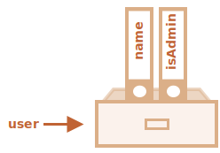
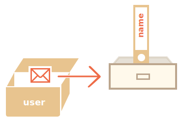
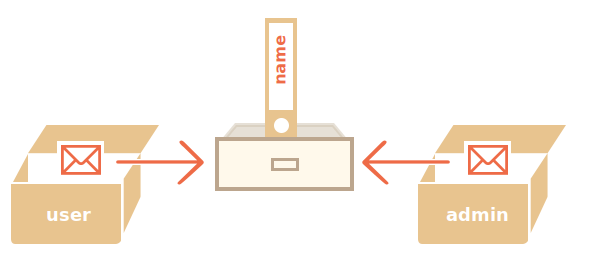

# 对象

正如我们在 <info:types> 一章学到的，JavaScript 中有七种数据类型。有六种原始类型，因为它们的值只包含一种东西（字符串，数字或者其他）。

相反，对象则用来存储键值对和更复杂的实体。在 JavaScript 中，对象几乎渗透到了这门编程语言的方方面面。所以，在我们深入理解这门语言之前，必须先理解对象。

我们可以通过使用带有可选 **属性列表** 的花括号 `{…}` 来创建对象。一个属性就是一个键值对（"key: value"），其中键（`key`）是一个字符串（也叫做属性名），值（`value`）可以是任何值。

我们可以把对象想象成一个带有签名文件的文件柜。每一条数据都基于键（`key`）存储在文件中。这样我们就可以很容易根据文件名（也就是“键”）查找文件或添加/删除文件了。


我们可以用下面两种语法中的任一种来创建一个空的对象（“空柜子”）：

```js
let user = new Object(); // “构造函数” 的语法
let user = {};  // “字面量” 的语法
```


通常，我们用花括号。这种方式我们叫做**字面量**。

## 文本和属性

我们可以在创建对象的时候，立即将一些属性以键值对的形式放到 `{...}` 中。

```js
let user = {     // 一个对象
  name: "John",  // 键 "name"，值 "John"
  age: 30        // 键 "age"，值 30
};
```

属性有键（或者也可以叫做“名字”或“标识符”），位于冒号 `":"` 的前面，值在冒号的右边。

在 `user` 对象中，有两个属性：

1. 第一个的键是 `"name"`，值是 `"John"`。
2. 第二个的键是 `"age"`，值是 `30`。

生成的 `user` 对象可以被想象为一个放置着两个标记有 "name" 和 "age" 的文件的柜子。


我们可以随时添加、删除和读取文件。

可以使用点符号访问属性值：

```js
// 读取文件的属性：
alert( user.name ); // John
alert( user.age ); // 30
```

属性的值可以是任意类型，让我们加个布尔类型：

```js
user.isAdmin = true;
```


我们可以用 `delete` 操作符移除属性：

```js
delete user.age;
```



我们也可以用多字词语来作为属性名，但必须给它们加上引号：

```js
let user = {
  name: "John",
  age: 30,
  "likes birds": true  // 多词属性名必须加引号
};
```


列表中的最后一个属性应以逗号结尾：
```js
let user = {
  name: "John",
  age: 30*!*,*/!*
}
```
这叫做尾随（trailing）或悬挂（hanging）逗号。这样便于我们添加、删除和移动属性，因为所有的行都是相似的。

## 方括号

对于多词属性，点操作就不能用了：

```js run
// 这将提示有语法错误
user.likes birds = true
```

JavaScript 理解不了。它认为我们在处理 `user.likes`，然后在遇到意外的 `birds` 时给出了语法错误。

点符号要求 `key` 是有效的变量标识符。这意味着：不包含空格，不以数字开头，也不包含特殊字符（允许使用 `$` 和 `_`）。

有另一种方法，就是使用方括号，可用于任何字符串：

```js run
let user = {};

// 设置
user["likes birds"] = true;

// 读取
alert(user["likes birds"]); // true

// 删除
delete user["likes birds"];
```

现在一切都可行了。请注意方括号中的字符串要放在引号中，单引号或双引号都可以。

方括号同样提供了一种可以通过任意表达式来获取属性名的方法 —— 跟语义上的字符串不同 —— 比如像类似于下面的变量：

```js
let key = "likes birds";

// 跟 user["likes birds"] = true; 一样
user[key] = true;
```

在这里，变量 `key` 可以是程序运行时计算得到的，也可以是根据用户的输入得到的。然后我们可以用它来访问属性。这给了我们很大的灵活性。

例如：

```js run
let user = {
  name: "John",
  age: 30
};

let key = prompt("What do you want to know about the user?", "name");

// 访问变量
alert( user[key] ); // John（如果输入 "name"）
```

点符号不能以类似的方式使用：

```js run
let user = {
  name: "John",
  age: 30
};

let key = "name";
alert( user.key ) // undefined
```

### 计算属性

我们可以在对象字面量中使用方括号。这叫做 **计算属性**。

例如：

```js run
let fruit = prompt("Which fruit to buy?", "apple");

let bag = {
*!*
  [fruit]: 5, // 属性名是从 fruit 变量中得到的
*/!*
};

alert( bag.apple ); // 5 如果 fruit="apple"
```

计算属性的含义很简单：`[fruit]` 含义是属性名应该从 `fruit` 变量中获取。

所以，如果一个用户输入 `"apple"`，`bag` 将变为 `{apple: 5}`。

本质上，这跟下面的语法效果相同：
```js run
let fruit = prompt("Which fruit to buy?", "apple");
let bag = {};

// 从 fruit 变量中获取值
bag[fruit] = 5;
```

……但是看起来更好。

我们可以在方括号中使用更复杂的表达式：

```js
let fruit = 'apple';
let bag = {
  [fruit + 'Computers']: 5 // bag.appleComputers = 5
};
```

方括号比点符号更强大。它允许任何属性名和变量，但写起来也更加麻烦。

所以大部分时间里，当属性名是已知且简单的时候，就是用点符号。如果我们需要一些更复杂的内容，那么就用方括号。

## 属性值简写

在实际开发中，我们通常用已存在的变量当做属性名。

例如：

```js run
function makeUser(name, age) {
  return {
    name: name,
    age: age
    // ……其他的属性
  };
}

let user = makeUser("John", 30);
alert(user.name); // John
```

在上面的例子中，属性名跟变量名一样。这种通过变量生成属性的应用场景很常见，在这有一种特殊的 **属性值缩写** 方法，使属性名变得更短。

可以用 `name` 来代替 `name:name` 像下面那样：

```js
function makeUser(name, age) {
*!*
  return {
    name, // 与 name: name 相同
    age   // 与 age: age 相同
    // ...
  };
*/!*
}
```

我们可以把属性名简写方式和正常方式混用：

```js
let user = {
  name,  // 与 name:name 相同
  age: 30
};
```

## 属性名称限制

属性名（key）必须是字符串或 Symbol（标识符的一种特殊类型，稍后将介绍）。

其它类型将被自动地转化为字符串。

例如当我们使用数字 `0` 作为属性 `key` 时，它将被转化为字符串 `"0"`：

```js run
let obj = {
  0: "test" // 和 "0": "test" 相同
};

// 两个 alert 访问的是同一个属性（数字 `0` 被转化为了字符串 "0"）
alert( obj["0"] ); // test
alert( obj[0] ); // test（同一个属性）
```

**保留字段可以被用作属性名。**

正如我们所知道的，像 "for"、"let" 和 "return" 等保留字段不能用作变量名。

但是对于对象的属性，没有这些限制。任何名字都可以：

```js run
let obj = {
  for: 1,
  let: 2,
  return: 3
}

alert( obj.for + obj.let + obj.return );  // 6
```

我们可以将任意字符串作为属性键（key），只有一个特殊的：`__proto__` 因为历史原因要特别对待。

比如，我们不能把它设置为非对象的值：

```js run
let obj = {};
obj.__proto__ = 5; // 分配一个数字
alert(obj.__proto__); // [object Object] — 值为对象，与预期结果不同
```

我们从代码中可以看出来，把它赋值为 `5` 的操作被忽略了。

关于 `__proto__` 的详细信息将在稍后的 [](info:prototype-inheritance) 一章中详细介绍。

到目前为止，重要的是要知道，如果我们打算将用户提供的密钥存储在对象中，则 `__proto__` 的这种行为可能会成为错误甚至漏洞的来源。

因为用户可能会选择 `__proto__` 作为键，这个赋值的逻辑就失败了（像上面那样）。

有两个解决该问题的方法：
1. 修改对象的行为，使其将 `__proto__` 作为常规属性对待。我们将在 [](info:prototype-methods) 一章中学习如何进行修改。
2. 使用支持任意键的数据结构 [Map](info:map-set)。我们将在 <info:map-set> 章节学习它。

## 属性存在性测试，"in" 操作符

对象的一个显著的特点就是其所有的属性都是可访问的。如果某个属性不存在也不会报错！访问一个不存在的属性只是会返回 `undefined`。这提供了一种普遍的用于检查属性是否存在的方法 —— 获取值来与 undefined 比较：

```js run
let user = {};

alert( user.noSuchProperty === undefined ); // true 意思是没有这个属性
```

这里同样也有一个特别的操作符 `"in"` 来检查属性是否存在。

语法是：
```js
"key" in object
```

例如：

```js run
let user = { name: "John", age: 30 };

alert( "age" in user ); // true，user.age 存在
alert( "blabla" in user ); // false，user.blabla 不存在。
```

请注意，`in` 的左边必须是 **属性名**。通常是一个带引号的字符串。

如果我们省略引号，则意味着将测试包含实际名称的变量。例如：

```js run
let user = { age: 30 };

let key = "age";
alert( *!*key*/!* in user ); // true，从 key 获取属性名并检查这个属性
```

````smart header="对存储值为 `undefined` 的属性使用 \"in\""
通常，检查属性是否存在时，使用严格比较 `"=== undefined"` 就够了。但在一种特殊情况下，这种方式会失败，而 `"in"` 却可以正常工作。

那就是属性存在，但是存储值为 `undefined`：

```js run
let obj = {
  test: undefined
};

alert( obj.test ); // 显示 undefined，所以属性不存在？

alert( "test" in obj ); // true，属性存在！
```


在上面的代码中，属性 `obj.test` 事实上是存在的，所以 `in` 操作符检查通过。

这种情况很少发生，因为通常情况下是不会给对象赋值 undefined 的，我们经常会用 `null` 来表示未知的或者空的值。
````

## "for..in" 循环

为了遍历一个对象的所有键（key），可以使用一个特殊形式的循环：`for..in`。这跟我们在前面学到的 `for(;;)` 循环是完全不一样的东西。

语法：

```js
for (key in object) {
  // 对此对象属性中的每个键执行的代码
}
```

例如，让我们列出 `user` 所有的属性：

```js run
let user = {
  name: "John",
  age: 30,
  isAdmin: true
};

for (let key in user) {
  // keys
  alert( key );  // name, age, isAdmin
  // 属性键的值
  alert( user[key] ); // John, 30, true
}
```

注意，所有的 "for" 结构体都允许我们在循环中定义变量，像这里的 `let key`。

同样，我们可以用其他属性名来替代 `key`。例如 `"for(let prop in obj)"` 也很常用。


### 像对象一样排序

对象有顺序吗？换句话说，如果我们遍历一个对象，我们获取属性的顺序是和属性添加时的顺序相同吗？这靠谱吗？

简短的回答是：“有特别的顺序”：整数属性会被进行排序，其他属性则按照创建的顺序显示。详情如下：

例如，让我们考虑一个带有电话号码的对象：

```js run
let codes = {
  "49": "Germany",
  "41": "Switzerland",
  "44": "Great Britain",
  // ..,
  "1": "USA"
};

*!*
for(let code in codes) {
  alert(code); // 1, 41, 44, 49
}
*/!*
```

对象可用于面向用户的建议选项列表。如果我们的网站主要面向德国观众，那么我们可能希望 `49` 排在第一。

但如果我们执行代码，会看到完全不同的景象：

- USA (1) 排在了最前面
- 然后是 Switzerland (41) 及其它。

因为这些电话号码是整数，所以它们以升序排列。所以我们看到的是 `1, 41, 44, 49`。

````smart header="整数属性？那是什么？"
这里的“整数属性”指的是一个可以在不作任何更改的情况下转换为整数的字符串（包括整数到整数）。

所以，"49" 是一个整数属性名，因为我们把它转换成整数，再转换回来，它还是一样。但是 "+49" 和 "1.2" 就不行了：

```js run
// Math.trunc 是内置的去除小数部分的方法。
alert( String(Math.trunc(Number("49"))) ); // "49"，相同，整数属性
alert( String(Math.trunc(Number("+49"))) ); // "49"，不同于 "+49" ⇒ 不是整数属性
alert( String(Math.trunc(Number("1.2"))) ); // "1"，不同于 "1.2" ⇒ 不是整数属性
```
````

……此外，如果属性名不是整数，那它们就按照创建时候的顺序来排序，例如：

```js run
let user = {
  name: "John",
  surname: "Smith"
};
user.age = 25; // 增加一个

*!*
// 非整数属性是按照创建的顺序来排列的
*/!*
for (let prop in user) {
  alert( prop ); // name, surname, age
}
```

所以，为了解决电话号码的问题，我们可以使用非整数属性名来 **欺骗** 程序。只需要给每个键名加一个加号 `"+"` 前缀就行了。

像这样：

```js run
let codes = {
  "+49": "Germany",
  "+41": "Switzerland",
  "+44": "Great Britain",
  // ..,
  "+1": "USA"
};

for (let code in codes) {
  alert( +code ); // 49, 41, 44, 1
}
```

现在跟预想的一样了。

## 引用复制

对象和其他原始类型的一个根本的区别是，对象都是“通过引用”存储和复制的。

原始类型：字符串，数字，布尔类型 — 作为整体值被赋值或复制。

例如：

```js
let message = "Hello!";
let phrase = message;
```

结果是我们得到了两个独立变量，每个变量存的都是 `"Hello!"`。


对象跟这个不一样。

**变量存储的不是对象本身，而是“内存中的地址”，换句话说就是对象的“引用”。**

下面是这个对象的存储结构图：

```js
let user = {
  name: "John"
};
```



在这里，对象被存储在内存中的某个位置。变量 `user` 有一个对它的引用。

**当对象被复制的时候 — 引用被复制了一份, 对象并没有被复制。**

如果我们将对象想象成是一个抽屉，那么变量就是一把钥匙。拷贝对象是复制了钥匙，但是并没有复制抽屉本身。

例如：

```js no-beautify
let user = { name: "John" };

let admin = user; // 复制引用
```

现在我们有了两个变量，但是都指向同一个对象：



我们可以通过其中任意一个变量访问抽屉并改变其中的内容：

```js run
let user = { name: 'John' };

let admin = user;

*!*
admin.name = 'Pete'; //  被通过名为 "admin" 的引用修改了
*/!*

alert(*!*user.name*/!*); // 'Pete'，通过名为 "user" 的引用查看修改
```

上面的例子证实了只存在一个对象。就像我们的一个抽屉带有两把钥匙，如果使用其中一把钥匙（`admin`）打开抽屉并改变抽屉里放的东西，稍后使用另外一把钥匙（`user`）打开抽屉的时候，就会看到变化。

### 比较引用

等号 `==` 和严格相等 `===` 操作符对于对象来说没差别。

**两个对象只有在它们其实是一个对象时才会相等。**

例如，如果两个变量引用指向同一个对象，那么它们相等：

```js run
let a = {};
let b = a; // 复制引用

alert( a == b ); // true，两个变量指向同一个对象
alert( a === b ); // true
```

以下两个独立的对象不相等，即使都是空对象。

```js run
let a = {};
let b = {}; // 两个独立的对象

alert( a == b ); // false
```

对于像 `obj1 > obj2` 这样两个对象的比较，或对象与原始值的比较 `obj == 5`，对象会被转换成原始值。我们很快就会学习到对象的转化是如何实现的，但是事实上，这种比较真的极少用到，这种比较的出现经常是代码的 BUG 导致的。

### 常量对象

一个被 `const` 修饰的对象是 **可以** 被修改。

例如：

```js run
const user = {
  name: "John"
};

*!*
user.age = 25; // (*)
*/!*

alert(user.age); // 25
```

看起来好像 `(*)` 这行代码会导致错误，但并没有，这里完全没问题。这是因为 `const` 修饰的只是 `user` 本身存储的值。在这里 `user` 始终存储的都是对同一个对象的引用。`(*)` 这行代码修改的是对象内部的内容，并没有改变 `user` 存储的对象的引用。

如果你想把其他内容赋值给 `user`，那就会报错了，例如：

```js run
const user = {
  name: "John"
};

*!*
// 错误（不能再给 user 赋值）
*/!*
user = {
  name: "Pete"
};
```

……那么如果我们想要创建不可变的对象属性，应该怎么做呢？想让 `user.age = 25` 这样的赋值报错，这也是可以的。我们会在 <info:property-descriptors> 这章学习这部分内容。

## 复制和合并，Object.assign

复制一个对象变量会创建指向此对象的另一个引用。

那如果我们需要复制一个对象呢？创建一份独立的拷贝，一份克隆？

这也是可行的，但是有一点麻烦，因为 JavaScript 中没有支持这种操作的内置函数。实际上，我们很少这么做。在大多数时候，复制引用都很好用。

但如果我们真想这么做，就需要创建一个新的对象，然后遍历现有对象的属性，在原始级别的状态下复制给新的对象。

像这样：

```js run
let user = {
  name: "John",
  age: 30
};

*!*
let clone = {}; // 新的空对象

// 复制所有的属性值
for (let key in user) {
  clone[key] = user[key];
}
*/!*

// 现在的复制是独立的了
clone.name = "Pete"; // 改变它的值

alert( user.name ); // 原对象属性值不变
```

我们也可以用 [Object.assign](mdn:js/Object/assign) 来实现。

语法是：

```js
Object.assign(dest,[ src1, src2, src3...])
```

- 参数 `dest` 和 `src1, ..., srcN`（你需要多少就可以设置多少，没有限制）是对象。
- 这个方法将 `src1, ..., srcN` 这些所有的对象复制到 `dest`。换句话说，从第二个参数开始，所有对象的属性都复制给了第一个参数对象，然后返回 `dest`。

例如，我们可以用这个方法来把几个对象合并成一个：
```js
let user = { name: "John" };

let permissions1 = { canView: true };
let permissions2 = { canEdit: true };

*!*
// 把 permissions1 和 permissions2 的所有属性都拷贝给 user
Object.assign(user, permissions1, permissions2);
*/!*

// 现在 user = { name: "John", canView: true, canEdit: true }
```

如果用于接收的对象（`user`）已经有了同样属性名的属性，已有的则会被覆盖：

```js
let user = { name: "John" };

// 覆盖 name，增加 isAdmin
Object.assign(user, { name: "Pete", isAdmin: true });

// 现在 user = { name: "Pete", isAdmin: true }
```

我们可以用 `Object.assign` 来替代循环赋值进行简单的克隆操作：

```js
let user = {
  name: "John",
  age: 30
};

*!*
let clone = Object.assign({}, user);
*/!*
```

它将对象 `user` 的所有的属性复制给了一个空对象并返回。实际上和循环赋值没什么区别，只是更短了。

直到现在，我们都是假设 `user` 的所有属性都是原始值。但是属性也可以是其他对象的引用。这种我们应该怎么操作呢？

例如：
```js run
let user = {
  name: "John",
  sizes: {
    height: 182,
    width: 50
  }
};

alert( user.sizes.height ); // 182
```

现在，仅仅进行 `clone.sizes = user.sizes` 复制是不够的，因为 `user.sizes` 是一个对象，这个操作只能复制这个对象的引用。所以 `clone` 和 `user` 共享了一个对象。

像这样：
```js run
let user = {
  name: "John",
  sizes: {
    height: 182,
    width: 50
  }
};

let clone = Object.assign({}, user);

alert( user.sizes === clone.sizes ); // true，同一个对象

// user 和 clone 共享 sizes 对象
user.sizes.width++;       // 在这里改变一个属性的值
alert(clone.sizes.width); // 51，在这里查看属性的值
```

为了解决这个问题，我们在复制的时候应该检查 `user[key]` 的每一个值，如果它是一个对象，那么把它也复制一遍，这叫做深拷贝（deep cloning）。

有一个标准的深拷贝算法，用于解决上面这种和一些更复杂的情况，叫做 [结构化克隆算法（Structured cloning algorithm）](https://html.spec.whatwg.org/multipage/structured-data.html#safe-passing-of-structured-data)。为了不重复造轮子，我们可以使用它的一个 JavaScript 实现的库 [lodash](https://lodash.com)，方法名叫做 [\_.cloneDeep(obj)](https://lodash.com/docs#cloneDeep)。


## 总结

对象是具有一些特殊特性的关联数组。

它们存储属性（键值对），其中：
- 属性的键必须是字符串或者 symbol（通常是字符串）。
- 值可以是任何类型。

我们可以用下面的方法访问属性：
- 点符号: `obj.property`。
- 方括号 `obj["property"]`，方括号允许从变量中获取键，例如 `obj[varWithKey]`。

其他操作：
- 删除属性：`delete obj.prop`。
- 检查是否存在给定键的属性：`"key" in obj`。
- 遍历对象：`for(let key in obj)` 循环。

对象是通过引用被赋值或复制的。换句话说，变量存储的不是“对象的值”，而是值的“引用”（内存地址）。所以复制这样的变量或者将其作为函数参数进行传递时，复制的是引用，而不是对象。基于复制的引用（例如添加/删除属性）执行的所有的操作，都是在同一个对象上执行的。

我们可以使用 `Object.assign` 或者 [\_.cloneDeep(obj)](https://lodash.com/docs#cloneDeep) 进行“真正的复制”（一个克隆）。

我们在这一章学习的叫做“基本对象”，或者就叫对象。

JavaScript 中还有很多其他类型的对象：

- `Array` 用于存储有序数据集合，
- `Date` 用于存储时间日期，
- `Error` 用于存储错误信息。
- ……等等。

它们有着各自特别的特性，我们将在后面学习到。有时候大家会说“数组类型”或“日期类型”，但其实它们并不是自身所属的类型，而是属于一个对象类型即 "object"。它们以不同的方式对 "object" 做了一些扩展。

JavaScript 中的对象非常强大。这里我们只接触了冰山一角。在后面的章节中，我们将频繁使用对象进行编程，并学习更多关于对象的知识。
