# 垃圾回收

对于开发者来说，JavaScript 的内存管理是自动的、无形的。我们创建的原始值、对象、函数……这一切都会占用内存。

当某个东西我们不再需要时会发生什么？JavaScript 引擎如何发现它、清理它？

## 可达性

JavaScript 中主要的内存管理概念是**可达性**。

简而言之，『可达』值是那些以某种方式可访问或可用的值。它们保证存储在内存中。

1. 这里列出固有的可达值基本集合，这些值明显不能被释放。

    比方说：

    - 当前函数的局部变量和参数。
    - 嵌套调用时，当前调用链上所有函数的变量与参数。
    - 全局变量。
    - （还有一些内部的）

    这些值被称作**根**。

2. 如果一个值可以通过引用或引用链，从根值访问到，则认为这个值是可达的。

    比方说，如果局部变量中有一个对象，并且该对象具有引用另一个对象的 property，则该对象被认为是可达的。而且它引用的内容也是可达的。下面是详细的例子。

在 JavaScript 引擎中有一个被称作[垃圾回收器](https://en.wikipedia.org/wiki/Garbage_collection_(computer_science))的东西在后台执行。它监控着所有对象的状态，并删除掉那些已经不可达的。

## 一个简单的例子

这里有一个最简的例子:

```js
// user 引用了这个对象
let user = {
  name: "John"
};
```

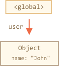

这里的箭头描述了一个对象引用。全局变量 `user` 引用了对象 `{name：“John”}`（为简洁起见，我们称它为 John）。John 的 `name` 属性存储一个原始值，所以它被写在对象内部。

如果 `user` 的值被覆盖了，这个引用就没了：

```js
user = null;
```

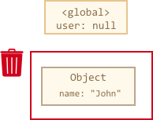

现在 John 变成不可达的了。因为没有引用了，就不能访问到它了。垃圾回收器会认为它是垃圾数据，然后释放内存。

## 两个引用

现在让我们想象下，我们把 `user` 的引用复制给 `admin`：

```js
// user 对对象有一个引用
let user = {
  name: "John"
};

*!*
let admin = user;
*/!*
```

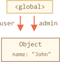

现在如果像刚才一样：
```js
user = null;
```

……然后对象仍然可以通过 `admin` 这个全局变量访问到，所以对象还在内存中。如果我们又覆盖了 `admin`，对象就会被删除。

## 相互关联的对象

现在来看一个更复杂的例子。这是个家庭：

```js
function marry(man, woman) {
  woman.husband = man;
  man.wife = woman;

  return {
    father: man,
    mother: woman
  }
}

let family = marry({
  name: "John"
}, {
  name: "Ann"
});
```

`marry` 方法通过两个对象的引用，让它们『结婚』了，并返回了一个包含这两个对象的新对象。

由此产生的内存结构：

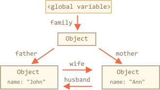

到目前位置，所有对象都是可达的。

现在让我们移除两个引用：

```js
delete family.father;
delete family.mother.husband;
```

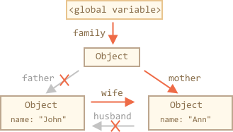

仅删除这两个引用中的一个是不够的，因为所有的对象仍然可以访问。

但是，如果我们把这两个都删除，那么我们可以看到再也没有对 John 的引用：

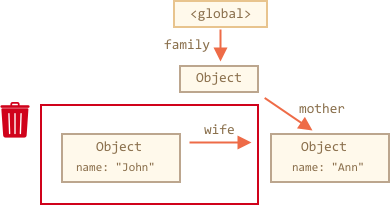

对外引用不重要，只有传入引用才可以使对象可达。所以，John 现在无法访问，并且将从内存中释放，同时 John 的所有数据也变得无法访问。

经过垃圾回收：

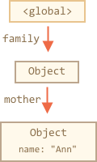

## 无法到达的岛屿

几个对象相互引用，但外部没有对其任意对象的引用，这些对象可能是不可达的，并会从内存中释放。

源对象与上面相同。然后:

```js
family = null;
```

内存内部状态将变成：

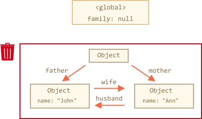

这个例子展示了可达性概念的重要性。

显而易见，John 和 Ann 仍然连着，都有传入的引用。但是，这样还是不够。

前面说的 `family` 对象已经不再连着根，再也没有引用，所以它将变成一座『孤岛』并且将被移除。

## 内部算法

垃圾回收的基本算法被称为『mark-and-sweep』。

定期执行以下“垃圾回收”步骤：

- 垃圾收集器找到所有的根，并『标记』（记住）它们。
- 然后它遍历并『标记』来自它们的所有参考。
- 然后它遍历到标记的对象并标记**他们的**引用。所有被遍历到的对象都会被记住，以免将来再次遍历到同一个对象。
- ……一直这样，直到有未访问的引用（从根访问到）。
- 没有被标记的所有对象都被删除。

例如，让我们的对象结构如下所示：


我们可以在右侧清楚地看到一个『无法到达的岛屿』。现在我们来看看『mark-and-sweep』垃圾收集器如何处理它。

第一步标记所有的根

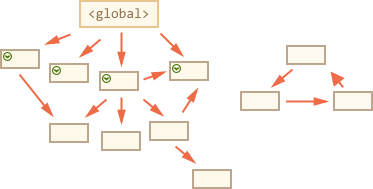

然后他们的引用被标记了


……如果还有引用的话，继续标记:

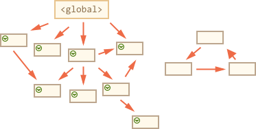

现在，这个过程中没有被遍历过的对象将会被删除。

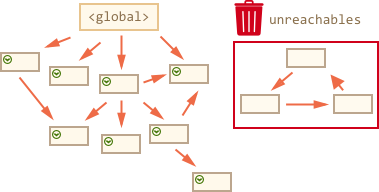

这是垃圾收集如何工作的概念。

JavaScript 引擎做了许多优化，使其运行速度更快，并且不会影响代码运行。

一些优化点：

- **分代收集** —— 对象被分成两组：『新的』和『旧的』。许多对象出现，完成他们的工作并快速释放，他们可以很快被清理。那些长期存活下来的对象会变得『老旧』，而且检查的次数也会减少。
- **增量收集** —— 如果有许多对象，并且我们试图一次遍历并标记整个对象集，则可能需要一些时间并在执行过程中带来明显的延迟。所以引擎试图将垃圾收集工作分成几部分来做，然后将这几部分逐一处理。这需要他们之间额外的标记来追踪变化，但是会有许多微小的延迟而不是大的延迟。
- **闲时收集** —— 垃圾收集器只会在 CPU 空闲时尝试运行，以减少可能对代码执行的影响。

还有其他垃圾收集算法的优化和风格。尽管我想在这里描述它们，但我必须打住了，因为不同的引擎会有不同的调整和技巧。而且，更重要的是，随着引擎的发展，情况会发生变化，所以除非必须，我们了解那么多可能就不值得。当然，后面会给出一些链接可以供你了解参考。

## 总结

主要需要掌握的东西：

- 垃圾回收是自动完成的，我们不能强制执行或是阻止执行。
- 当对象是可达状态时，它在内存中是可达的。
- 被引用与可访问（从一个根）不同：一组相互连接的对象可能整体都无法访问。

现代引擎实现了垃圾回收的高级算法。

有一本通用的书，叫《The Garbage Collection Handbook: The Art of Automatic Memory Management》（R. Jones 等人著）讲到了一些。

如果你熟悉低级编程，关于 V8 引擎垃圾回收器的更详细信息请参阅文章 [V8 的垃圾回收：垃圾回收](http://jayconrod.com/posts/55/a-tour-of-v8-garbage-collection)。

[V8 博客](http://v8project.blogspot.com/)还不时发布关于内存管理变化的文章。当然，为了学习垃圾收集，你最好通过学习 V8 引擎内部知识来进行准备，并阅读一个叫 [Vyacheslav Egorov](http://mrale.ph) 的 V8 引擎工程师的博客。我之所以说『V8』，因为它最容易在互联网上找到文章。对于其他引擎，许多方法是相似的，但在垃圾收集上许多方面有所不同。

当你需要低级别的优化时，对引擎的深入了解是很好的。在熟悉了该语言之后，把熟悉引擎作为下一步是明智的。
