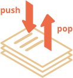
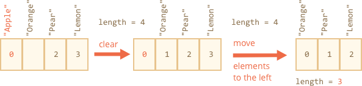
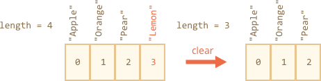

<<<<<<< HEAD
# 数组

对象允许存储键值化的集合，这很好。
 
但很多时候我们需要的是**有序集合**，里面的元素都是按顺序排列的。例如，我们可能需要存储一些列表，比如用户、商品以及 HTML 元素等。
=======
# Arrays

Objects allow you to store keyed collections of values. That's fine.

But quite often we find that we need an *ordered collection*, where we have a 1st, a 2nd, a 3rd element and so on. For example, we need that to store a list of something: users, goods, HTML elements etc.
>>>>>>> 027933531e121650120f7e8385f691de99af12d2

这里使用对象就不是很方便了，因为对象不提供能够管理元素顺序的方法。我们不能在已有的元素“之间”插入一个新的属性。这种场景下对象就不太适用了。

<<<<<<< HEAD
这时一个特殊的数据结构数组（`Array`）就派上用场了，它能存储有序的集合。
=======
There exists a special data structure named `Array`, to store ordered collections.
>>>>>>> 027933531e121650120f7e8385f691de99af12d2

## 声明

创建一个空数组有两种语法：

```js
let arr = new Array();
let arr = [];
```

绝大多数情况下使用的都是第二种语法。我们可以在方括号中添加初始元素：

```js
let fruits = ["Apple", "Orange", "Plum"];
```

数组元素从 0 开始编号。

我们可以将元素的索引值填写在方括号内来获取元素：

```js run
let fruits = ["Apple", "Orange", "Plum"];

alert( fruits[0] ); // Apple
alert( fruits[1] ); // Orange
alert( fruits[2] ); // Plum
```

可以替换元素：

```js
fruits[2] = 'Pear'; // 现在变成 ["Apple", "Orange", "Pear"]
```

...或者新加一个元素：

```js
fruits[3] = 'Lemon'; // 现在变成 ["Apple", "Orange", "Pear", "Lemon"]
```

`length` 属性的值是数组中元素的总个数

```js run
let fruits = ["Apple", "Orange", "Plum"];

alert( fruits.length ); // 3
```

也可以用 `alert` 来显示整个数组。

```js run
let fruits = ["Apple", "Orange", "Plum"];

alert( fruits ); // Apple,Orange,Plum
```

数组可以存储任何类型的元素。

例如:

```js run no-beautify
// 混合值
let arr = [ 'Apple', { name: 'John' }, true, function() { alert('hello'); } ];

// 获取索引为 1 的对象然后显示它的 name
alert( arr[1].name ); // John

// 获取索引为 3 的函数并执行
arr[3](); // hello
```


<<<<<<< HEAD
````smart header="以逗号结尾"
数组和对象一样，都可以在末尾冗余一个逗号：
```js 
=======
````smart header="Trailing comma"
An array, just like an object, may end with a comma:
```js
>>>>>>> 027933531e121650120f7e8385f691de99af12d2
let fruits = [
  "Apple",
  "Orange",
  "Plum"*!*,*/!*
];
```

因为每一行都是相似的，所以这种以“逗号结尾”的方式使得插入/移除项变得更加简单。
````


## pop/push, shift/unshift 方法

<<<<<<< HEAD
[队列](https://en.wikipedia.org/wiki/Queue_(abstract_data_type))是最常见的使用数组的方法之一. 在计算机科学中，这意味着一个有序的元素的集合支持两个操作：
=======
A [queue](https://en.wikipedia.org/wiki/Queue_(abstract_data_type)) is one of the most common uses of an array. In computer science, this means an ordered collection of elements which supports two operations:
>>>>>>> 027933531e121650120f7e8385f691de99af12d2

- `push` 在末端添加一个元素.
- `shift` 取出队列最前端的一个元素，整个队列往前移，这样原先排第二的元素现在排在了第一。


这两种操作数组都支持.

<<<<<<< HEAD
队列的应用在实践中经常会碰到，例如需要在屏幕上显示消息队列。

数组还有另一个用例，就是数据结构[栈](https://en.wikipedia.org/wiki/Stack_(abstract_data_type))。
=======
In practice we need it very often. For example, a queue of messages that need to be shown on-screen.

There's another use case for arrays -- the data structure named [stack](https://en.wikipedia.org/wiki/Stack_(abstract_data_type)).
>>>>>>> 027933531e121650120f7e8385f691de99af12d2

它支持两种操作：

- `push` 在末端添加一个元素.
- `pop` 从末端取出一个元素.

所以新元素的添加和取出都是从“末端”开始的。

栈通常被被形容成一叠卡片：要么添加卡片放到最上面，要么从最上面拿走卡片：



对于栈来说，最后放进去的是最先接收的，也叫做 LIFO（后进先出）法则。而与队列相对应的叫做 FIFO（先进先出）。

<<<<<<< HEAD
JavaScript 中的数组既可以用作队列，也可以用作栈。它们允许从前端/末端来添加/删除元素。
=======
Arrays in JavaScript can work both as a queue and as a stack. They allow you to add/remove elements both to/from the beginning or the end.
>>>>>>> 027933531e121650120f7e8385f691de99af12d2

这在计算机科学中叫做[双端队列](https://en.wikipedia.org/wiki/Double-ended_queue)。

**作用于数组末端的方法：**

`pop`
: 取出并返回数组的最后一个元素：

    ```js run
    let fruits = ["Apple", "Orange", "Pear"];

    alert( fruits.pop() ); // 移除 "Pear" 然后 alert 显示出来

    alert( fruits ); // Apple, Orange
    ```

`push`
: 在数组末端添加元素：

    ```js run
    let fruits = ["Apple", "Orange"];

    fruits.push("Pear");

    alert( fruits ); // Apple, Orange, Pear
    ```

    调用 `fruits.push(...)` 与 `fruits[fruits.length] = ...` 是一样的。

**作用于数组前端的方法：**

`shift`
: 取出数组的第一个元素并返回它：

    ```js
    let fruits = ["Apple", "Orange", "Pear"];

    alert( fruits.shift() ); // 移除 Apple 然后 alert 显示出来

    alert( fruits ); // Orange, Pear
    ```

`unshift`
: 在数组的前端添加元素：

    ```js
    let fruits = ["Orange", "Pear"];

    fruits.unshift('Apple');

    alert( fruits ); // Apple, Orange, Pear
    ```

 `push` 和 `unshift` 可以一次添加多个元素：

```js run
let fruits = ["Apple"];

fruits.push("Orange", "Peach");
fruits.unshift("Pineapple", "Lemon");

// ["Pineapple", "Lemon", "Apple", "Orange", "Peach"]
alert( fruits );
```

## 内部

<<<<<<< HEAD
数组是一种特殊的对象。使用方括号来访问属性 `arr[0]` 实际上是来自于对象的语法。这个数字被用作键值。
=======
An array is a special kind of object. The square brackets used to access a property `arr[0]` actually come from the object syntax. That's essentially the same as `obj[key]`, where `arr` is the object, while numbers are used as keys.
>>>>>>> 027933531e121650120f7e8385f691de99af12d2

他们扩展了对象，提供了特殊的方法来处理有序的数据集合，还添加了 `length` 属性。但是核心还是一个对象。

<<<<<<< HEAD
记住，在 JavaScript 中只有 7 种基本类型。数组是一个对象因此其行为也像一个对象。
=======
Remember, there are only 7 basic types in JavaScript. Array is an object and thus behaves like an object.
>>>>>>> 027933531e121650120f7e8385f691de99af12d2

例如，它是通过引用来复制的：

```js run
let fruits = ["Banana"]

let arr = fruits; // 通过引用复制 (两个变量引用的是相同的数组)

alert( arr === fruits ); // true
<<<<<<< HEAD
=======

arr.push("Pear"); // modify the array by reference
>>>>>>> 027933531e121650120f7e8385f691de99af12d2

arr.push("Pear"); // 通过引用修改数组

alert( fruits ); // Banana, Pear — 现在有 2 项了
```

...但是数组真正特殊的是它们的内部实现。JavaScript 引擎尝试把这些元素一个接一个地存储在连续的内存区域，就像本章的插图显示的一样，而且还有一些其它的优化，以使数组运行得非常快。

但是如果我们放弃以“有序集合”的方式使用数组，而是像一个常规对象一样使用它，这些就都不生效了。

例如可以这样做:

```js
let fruits = []; // 创建一个数组

fruits[99999] = 5; // 用一个远大于数组长度的索引分配属性

fruits.age = 25; // 用任意的名字创建属性
```

这是可能的，因为数组是基于对象的。我们可以给它们添加任何属性。

但是 Javascript 引擎会发现我们在像使用常规对象一样使用数组，那么针对数组的优化就不再适用了，而且还会被关闭，这些优化所带来的优势也就荡然无存了。

数组误用的几种方式:

<<<<<<< HEAD
- 添加一个非数字的属性比如 `arr.test = 5`。
- 制造空洞，比如：添加 `arr[0]` 后添加 `arr[1000]` (它们中间什么都没有)。
- 以倒序填充数组, 比如 `arr[1000]`，`arr[999]` 等等。
=======
- Add a non-numeric property like `arr.test = 5`.
- Make holes, like: add `arr[0]` and then `arr[1000]` (and nothing between them).
- Fill the array in the reverse order, like `arr[1000]`, `arr[999]` and so on.
>>>>>>> 027933531e121650120f7e8385f691de99af12d2

请将数组视为作用于**有序数据**的特殊结构，它们为此提供了特殊的方法。数组在 JavaScript 引擎内部是经过特殊调整的，使得更好的作用于连续的有序数据，所以请以这种方式使用数组。如果你需要任意键值，那很有可能实际上你需要的是常规对象 `{}`。

## 性能

`push/pop` 方法运行的比较快，而 `shift/unshift` 比较慢。


为什么作用于数组的末端会比前端快呢？让我们看看在执行期间都发生了什么：

```js
fruits.shift(); // 从前端取出一个元素
```

只获取并移除数字 `0` 对应的元素是不够的。其它元素也需要被重新编号。

`shift` 操作必须做三件事:

1. 移除索引为 `0` 的元素。
2. 把所有的元素向左移动，将索引从 `1` 改成 `0`，`2` 改成 `1` 以此类推，对其重新编号。
3. 更新 `length` 属性。



**数组里的元素越多，移动它们就要花越多的时间，也就意味着越多的内存操作。**

`unshift` 也是一样：为了在数组的前端添加元素，我们首先需要将现有的元素向右移动，增加它们的索引值。

那`push/pop` 是什么样的呢？它们不需要移动任何东西。如果从末端移除一个元素，`pop` 方法只需要清理索引值和缩短 `length` 就可以了。

`pop` 操作的动作:

```js
fruits.pop(); // 从末端取走一个元素
```



**`pop` 方法不需要移动任何东西，因为其它元素都保留了各自的索引。这就是为什么 `pop` 会特别快。**

`push` 方法也是一样的。

## 循环

遍历数组最古老的方式就是 `for` 循环

```js run
let arr = ["Apple", "Orange", "Pear"];

*!*
for (let i = 0; i < arr.length; i++) {
*/!*
  alert( arr[i] );
}
```

但对于数组来说还有另一种循环方式，`for..of` ：

```js run
let fruits = ["Apple", "Orange", "Plum"];

// 迭代数组元素
for (let fruit of fruits) {
  alert( fruit );
}
```

`for..of` 不能获取当前元素的索引，但大多数情况是够用的。而且这样写更短。

技术上来讲，因为数组也是对象，所以使用 `for..in` 也是可能的：

```js run
let arr = ["Apple", "Orange", "Pear"];

*!*
for (let key in arr) {
*/!*
  alert( arr[key] ); // Apple, Orange, Pear
}
```

但这其实不是个好想法。会有一些潜在问题存在：

1. `for..in` 循环会迭代**所有属性**，不仅仅是这些数字属性。

    在浏览器和其它环境中有一种“类数组”的对象，它们**看似是数组**，也就是说，它们有 `length` 和索引属性，但是也可能有其它的非数字的属性和方法，这通常是我们不需要的。`for..in` 循环会把它们都列出来。所以如果我们需要处理类数组对象，这些“额外”的属性就会存在问题。

<<<<<<< HEAD
2. `for..in` 循环适用于普通对象，不适用于数组，而且会慢 10-100 倍。当然即使是这样也依然非常快。只有在遇到瓶颈或者一些不相关的场景增速可能会有问题。但是我们仍然应该了解这其中的不同。
=======
2. The `for..in` loop is optimized for generic objects, not arrays, and thus is 10-100 times slower. Of course, it's still very fast. The speedup may only matter in bottlenecks. But still we should be aware of the difference.
>>>>>>> 027933531e121650120f7e8385f691de99af12d2

通常来说，我们不应该用 `for..in` 来处理数组。


## 关于 "length"

当我们修改数组的时候，`length` 属性会自动更新。准确来说，它实际上不是数组里元素的个数，而是最大的数字索引值加一。

例如，一个数组只有一个元素，但是这个元素的索引值很大，那么这个数组的 `length` 也会很大：

```js run
let fruits = [];
fruits[123] = "Apple";

alert( fruits.length ); // 124
```

<<<<<<< HEAD
要知道的是我们通常不会这样使用数组。
=======
Note that we usually don't use arrays like that.
>>>>>>> 027933531e121650120f7e8385f691de99af12d2

`length` 属性的另一个有意思的点是它是可写的。

如果我们手动增加长度，一切正常。但是如果我们减少长度，数组就会变短。这种处理是不可逆的，下面是一个例子：

```js run
let arr = [1, 2, 3, 4, 5];

arr.length = 2; // 只剩 2 个元素
alert( arr ); // [1, 2]

arr.length = 5; // 又把 length 加回来
alert( arr[3] ); // undefined: 被截断的那些数值并没有回来
```

所以，清空数组最好的方法就是：`arr.length = 0;`。


## new Array() [#new-array]

创建数组还有另一种语法：

```js
let arr = *!*new Array*/!*("Apple", "Pear", "etc");
```

它很少被使用，因为方括号 `[]` 更短更简洁。而且这种语法还存在一些诡异的特性。

如果调用 `new Array` 使用的是一个单独的数字作为参数，那么就会创建一个**指定了长度，却没有任何项**的数组。

<<<<<<< HEAD
让我们看看如何搬起石头砸自己的脚:
=======
Let's see how one can shoot themself in the foot:
>>>>>>> 027933531e121650120f7e8385f691de99af12d2

```js run
let arr = new Array(2); // 会创建一个数组 [2] 吗？

alert( arr[0] ); // undefined！没有元素.

alert( arr.length ); // length 2
```

在上面的代码中，`new Array(number)` 所有的元素都是 `undefined`

为了避免这种乌龙事件，我们通常都是使用方括号的，除非我们清楚地知道自己正在做什么。

## 多维数组

<<<<<<< HEAD
数组里的项也可以是数组。我们可以以多维数组的方式存储矩阵：
=======
Arrays can have items that are also arrays. We can use it for multidimensional arrays, for example to store matrices:
>>>>>>> 027933531e121650120f7e8385f691de99af12d2

```js run
let matrix = [
  [1, 2, 3],
  [4, 5, 6],
  [7, 8, 9]
];

alert( matrix[1][1] ); // 最中间的那个数
```

## toString

数组有自己的 `toString` 方法的实现，会返回以逗号隔开的元素列表。

例如：


```js run
let arr = [1, 2, 3];

alert( arr ); // 1,2,3
alert( String(arr) === '1,2,3' ); // true
```

或者尝试一下这个：

```js run
alert( [] + 1 ); // "1"
alert( [1] + 1 ); // "11"
alert( [1,2] + 1 ); // "1,21"
```

数组没有 `Symbol.toPrimitive`，也没有 `valueOf`，它们只能执行 `toString` 进行转换，所以这里 `[]` 就变成了一个空字符串，`[1]` 变成了 `"1"` 然后 `[1,2]` 变成了 `"1,2"`。

当 `"+"` 操作符把一些项加到字符串后面时，加号后面的项也会被转换成字符串，所以下一步就会是这样：

```js run
alert( "" + 1 ); // "1"
alert( "1" + 1 ); // "11"
alert( "1,2" + 1 ); // "1,21"
```

## 总结

<<<<<<< HEAD
数组是一种特殊的对象，适用于存储和管理有序的数据项。
=======
Array is a special kind of object, suited to storing and managing ordered data items.
>>>>>>> 027933531e121650120f7e8385f691de99af12d2

- 声明:

    ```js
    // 方括号 (常见用法)
    let arr = [item1, item2...];

    // new Array (极其少见)
    let arr = new Array(item1, item2...);
    ```

<<<<<<< HEAD
    调用 `new Array(number)` 会创建一个指定长度的数组，且不含有任何项。
=======
    The call to `new Array(number)` creates an array with the given length, but without elements.

- The `length` property is the array length or, to be precise, its last numeric index plus one. It is auto-adjusted by array methods.
- If we shorten `length` manually, the array is truncated.
>>>>>>> 027933531e121650120f7e8385f691de99af12d2

- `length` 属性是数组的长度，准确地说，是它的最后一个数字索引值加一。它由数组方法自动调整。
- 如果我们手动缩短 `length`，那么数组就会被截断。

<<<<<<< HEAD
我们可以通过下列操作以双端队列的方式使用数组：
=======
- `push(...items)` adds `items` to the end.
- `pop()` removes the element from the end and returns it.
- `shift()` removes the element from the beginning and returns it.
- `unshift(...items)` adds `items` to the beginning.
>>>>>>> 027933531e121650120f7e8385f691de99af12d2

- `push(...items)` 在末端添加项 `items`。
- `pop()` 从末端移除并返回该元素。
- `shift()` 从前端移除并返回该元素。
- `unshift(...items)` 从前端添加项 `items`。

<<<<<<< HEAD
遍历数组的元素：
  - `for (let i=0; i<arr.length; i++)` — 运行的最快, 可兼容旧版本浏览器。
  - `for (let item of arr)` — 现代语法，只能访问 items。
  - `for (let i in arr)` — 永远不会使用。

在下一章节我们会回顾数组然后学习更多添加、移动、提取元素和数组排序的方法。 <info:array-methods>。
=======
We will return to arrays and study more methods to add, remove, extract elements and sort arrays in the chapter <info:array-methods>.
>>>>>>> 027933531e121650120f7e8385f691de99af12d2
