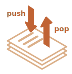

# 数组

对象允许存储键值集合，这很好。
 
但很多时候我们发现还需要 **有序集合**，里面的元素都是按顺序排列的。例如，我们可能需要存储一些列表，比如用户、商品以及 HTML 元素等。

这里使用对象就不是很方便了，因为对象不能提供能够管理元素顺序的方法。我们不能在已有的元素“之间”插入一个新的属性。这种场景下对象就不太适用了。

这时一个特殊的数据结构数组（`Array`）就派上用场了，它能存储有序的集合。

## 声明

创建一个空数组有两种语法：

```js
let arr = new Array();
let arr = [];
```

绝大多数情况下使用的都是第二种语法。我们可以在方括号中添加初始元素：

```js
let fruits = ["Apple", "Orange", "Plum"];
```

数组元素从 0 开始编号。

我们可以通过方括号中的数字获取元素：

```js run
let fruits = ["Apple", "Orange", "Plum"];

alert( fruits[0] ); // Apple
alert( fruits[1] ); // Orange
alert( fruits[2] ); // Plum
```

可以替换元素：

```js
fruits[2] = 'Pear'; // 现在变成了 ["Apple", "Orange", "Pear"]
```

……或者向数组新加一个元素：

```js
fruits[3] = 'Lemon'; // 现在变成 ["Apple", "Orange", "Pear", "Lemon"]
```

`length` 属性的值是数组中元素的总个数：

```js run
let fruits = ["Apple", "Orange", "Plum"];

alert( fruits.length ); // 3
```

也可以用 `alert` 来显示整个数组。

```js run
let fruits = ["Apple", "Orange", "Plum"];

alert( fruits ); // Apple,Orange,Plum
```

数组可以存储任何类型的元素。

例如:

```js run no-beautify
// 混合值
let arr = [ 'Apple', { name: 'John' }, true, function() { alert('hello'); } ];

// 获取索引为 1 的对象然后显示它的 name
alert( arr[1].name ); // John

// 获取索引为 3 的函数并执行
arr[3](); // hello
```


````smart header="以逗号结尾"
数组就像对象一样，可以以逗号结尾：
```js 
let fruits = [
  "Apple", 
  "Orange", 
  "Plum"*!*,*/!*
];
```

因为每一行都是相似的，所以这种以“逗号结尾”的方式使得插入/移除项变得更加简单。
````


## pop/push, shift/unshift 方法

[队列（queue）](https://en.wikipedia.org/wiki/Queue_(abstract_data_type))是最常见的使用数组的方法之一。在计算机科学中，这表示支持两个操作的一个有序元素的集合：

- `push` 在末端添加一个元素.
- `shift` 取出队列首端的一个元素，整个队列往前移，这样原先排第二的元素现在排在了第一。


这两种操作数组都支持。

队列的应用在实践中经常会碰到。例如需要在屏幕上显示消息队列。

数组还有另一个用例，就是数据结构 [栈](https://en.wikipedia.org/wiki/Stack_(abstract_data_type))。

它支持两种操作：

- `push` 在末端添加一个元素.
- `pop` 从末端取出一个元素.

所以新元素的添加和取出都是从“末端”开始的。

栈通常被被形容成一叠卡片：要么在最上面添加卡片，要么从最上面拿走卡片：



对于栈来说，最后放进去的内容是最先接收的，也叫做 LIFO（Last-In-First-Out），即后进先出法则。而与队列相对应的叫做 FIFO（First-In-First-Out），即先进先出。

JavaScript 中的数组既可以用作队列，也可以用作栈。它们允许你从首端/末端来添加/删除元素。

这在计算机科学中，允许这样的操作的数据结构被称为 [双端队列（deque）](https://en.wikipedia.org/wiki/Double-ended_queue)。

**作用于数组末端的方法：**

`pop`
: 取出并返回数组的最后一个元素：

    ```js run
    let fruits = ["Apple", "Orange", "Pear"];

    alert( fruits.pop() ); // 移除 "Pear" 然后 alert 显示出来

    alert( fruits ); // Apple, Orange
    ```

`push`
: 在数组末端添加元素：

    ```js run
    let fruits = ["Apple", "Orange"];

    fruits.push("Pear");

    alert( fruits ); // Apple, Orange, Pear
    ```

    调用 `fruits.push(...)` 与 `fruits[fruits.length] = ...` 是一样的。

**作用于数组首端的方法：**

`shift`
: 取出数组的第一个元素并返回它：

    ```js run
    let fruits = ["Apple", "Orange", "Pear"];

    alert( fruits.shift() ); // 移除 Apple 然后 alert 显示出来

    alert( fruits ); // Orange, Pear
    ```

`unshift`
: 在数组的首端添加元素：

    ```js run
    let fruits = ["Orange", "Pear"];

    fruits.unshift('Apple');

    alert( fruits ); // Apple, Orange, Pear
    ```

`push` 和 `unshift` 方法都可以一次添加多个元素：

```js run
let fruits = ["Apple"];

fruits.push("Orange", "Peach");
fruits.unshift("Pineapple", "Lemon");

// ["Pineapple", "Lemon", "Apple", "Orange", "Peach"]
alert( fruits );
```

## 内部

数组是一种特殊的对象。使用方括号来访问属性 `arr[0]` 实际上是来自于对象的语法。它其实与 `obj[key]` 相同，其中 `arr` 是对象，而数字用作键（key）。

它们扩展了对象，提供了特殊的方法来处理有序的数据集合以及 `length` 属性。但从本质上讲，它仍然是一个对象。

记住，在 JavaScript 中只有 8 种基本的数据类型（详见 [数据类型](info:types) 一章）。数组是一个对象，因此其行为也像一个对象。

例如，它是通过引用来复制的：

```js run
let fruits = ["Banana"]

let arr = fruits; // 通过引用复制 (两个变量引用的是相同的数组)

alert( arr === fruits ); // true

arr.push("Pear"); // 通过引用修改数组

alert( fruits ); // Banana, Pear — 现在有 2 项了
```

……但是数组真正特殊的是它们的内部实现。JavaScript 引擎尝试把这些元素一个接一个地存储在连续的内存区域，就像本章的插图显示的一样，而且还有一些其它的优化，以使数组运行得非常快。

但是，如果我们不像“有序集合”那样使用数组，而是像常规对象那样使用数组，这些就都不生效了。

例如，从技术上讲，我们可以这样做:

```js
let fruits = []; // 创建一个数组

fruits[99999] = 5; // 分配索引远大于数组长度的属性

fruits.age = 25; // 创建一个具有任意名称的属性
```

这是可以的，因为数组是基于对象的。我们可以给它们添加任何属性。

但是 Javascript 引擎会发现，我们在像使用常规对象一样使用数组，那么针对数组的优化就不再适用了，然后对应的优化就会被关闭，这些优化所带来的优势也就荡然无存了。

数组误用的几种方式:

- 添加一个非数字的属性，比如 `arr.test = 5`。
- 制造空洞，比如：添加 `arr[0]`，然后添加 `arr[1000]` (它们中间什么都没有)。
- 以倒序填充数组，比如 `arr[1000]`，`arr[999]` 等等。

请将数组视为作用于 **有序数据** 的特殊结构。它们为此提供了特殊的方法。数组在 JavaScript 引擎内部是经过特殊调整的，使得更好地作用于连续的有序数据，所以请以正确的方式使用数组。如果你需要任意键值，那很有可能实际上你需要的是常规对象 `{}`。

## 性能

`push/pop` 方法运行的比较快，而 `shift/unshift` 比较慢。


为什么作用于数组的末端会比首端快呢？让我们看看在执行期间都发生了什么：

```js
fruits.shift(); // 从首端取出一个元素
```

只获取并移除数字 `0` 对应的元素是不够的。其它元素也需要被重新编号。

`shift` 操作必须做三件事:

1. 移除索引为 `0` 的元素。
2. 把所有的元素向左移动，把索引 `1` 改成 `0`，`2` 改成 `1` 以此类推，对其重新编号。
3. 更新 `length` 属性。


**数组里的元素越多，移动它们就要花越多的时间，也就意味着越多的内存操作。**

`unshift` 也是一样：为了在数组的首端添加元素，我们首先需要将现有的元素向右移动，增加它们的索引值。

那 `push/pop` 是什么样的呢？它们不需要移动任何东西。如果从末端移除一个元素，`pop` 方法只需要清理索引值并缩短 `length` 就可以了。

`pop` 操作的行为：

```js
fruits.pop(); // 从末端取走一个元素
```


**`pop` 方法不需要移动任何东西，因为其它元素都保留了各自的索引。这就是为什么 `pop` 会特别快。**

`push` 方法也是一样的。

## 循环

遍历数组最古老的方式就是 `for` 循环：

```js run
let arr = ["Apple", "Orange", "Pear"];

*!*
for (let i = 0; i < arr.length; i++) {
*/!*
  alert( arr[i] );
}
```

但对于数组来说还有另一种循环方式，`for..of`：

```js run
let fruits = ["Apple", "Orange", "Plum"];

// 遍历数组元素
for (let fruit of fruits) {
  alert( fruit ); 
}
```

`for..of` 不能获取当前元素的索引，只是获取元素值，但大多数情况是够用的。而且这样写更短。

技术上来讲，因为数组也是对象，所以使用 `for..in` 也是可以的：

```js run
let arr = ["Apple", "Orange", "Pear"];

*!*
for (let key in arr) {
*/!*
  alert( arr[key] ); // Apple, Orange, Pear
}
```

但这其实是一个很不好的想法。会有一些潜在问题存在：

1. `for..in` 循环会遍历 **所有属性**，不仅仅是这些数字属性。

    在浏览器和其它环境中有一种称为“类数组”的对象，它们 **看似是数组**。也就是说，它们有 `length` 和索引属性，但是也可能有其它的非数字的属性和方法，这通常是我们不需要的。`for..in` 循环会把它们都列出来。所以如果我们需要处理类数组对象，这些“额外”的属性就会存在问题。

2. `for..in` 循环适用于普通对象，并且做了对应的优化。但是不适用于数组，因此速度要慢 10-100 倍。当然即使是这样也依然非常快。只有在遇到瓶颈时可能会有问题。但是我们仍然应该了解这其中的不同。

通常来说，我们不应该用 `for..in` 来处理数组。


## 关于 "length"

当我们修改数组的时候，`length` 属性会自动更新。准确来说，它实际上不是数组里元素的个数，而是最大的数字索引值加一。

例如，一个数组只有一个元素，但是这个元素的索引值很大，那么这个数组的 `length` 也会很大：

```js run
let fruits = [];
fruits[123] = "Apple";

alert( fruits.length ); // 124
```

要知道的是我们通常不会这样使用数组。

`length` 属性的另一个有意思的点是它是可写的。

如果我们手动增加它，则不会发生任何有趣的事儿。但是如果我们减少它，数组就会被截断。该过程是不可逆的，下面是例子：

```js run
let arr = [1, 2, 3, 4, 5];

arr.length = 2; // 截断到只剩 2 个元素
alert( arr ); // [1, 2]

arr.length = 5; // 又把 length 加回来
alert( arr[3] ); // undefined：被截断的那些数值并没有回来
```

所以，清空数组最简单的方法就是：`arr.length = 0;`。


## new Array() [#new-array]

这是创建数组的另一种语法：

```js
let arr = *!*new Array*/!*("Apple", "Pear", "etc");
```

它很少被使用，因为方括号 `[]` 更短更简洁。而且，这种语法还有一个棘手的特性。

如果使用单个参数（即数字）调用 `new Array`，那么它会创建一个 **指定了长度，却没有任何项** 的数组。

让我们看看如何搬起石头砸自己的脚:

```js run
let arr = new Array(2); // 会创建一个 [2] 的数组吗？

alert( arr[0] ); // undefined！没有元素。

alert( arr.length ); // length 2
```

在上面的代码中，`new Array(number)` 创建的数组的所有元素都是 `undefined`。

为了避免这种乌龙事件，我们通常都是使用方括号的，除非我们清楚地知道自己正在做什么。

## 多维数组

数组里的项也可以是数组。我们可以将其用于多维数组，例如存储矩阵：

```js run
let matrix = [
  [1, 2, 3],
  [4, 5, 6],
  [7, 8, 9]
];

alert( matrix[1][1] ); // 最中间的那个数
```

## toString

数组有自己的 `toString` 方法的实现，会返回以逗号隔开的元素列表。

例如：


```js run
let arr = [1, 2, 3];

alert( arr ); // 1,2,3
alert( String(arr) === '1,2,3' ); // true
```

此外，我们试试运行一下这个：

```js run
alert( [] + 1 ); // "1"
alert( [1] + 1 ); // "11"
alert( [1,2] + 1 ); // "1,21"
```

数组没有 `Symbol.toPrimitive`，也没有 `valueOf`，它们只能执行 `toString` 进行转换，所以这里 `[]` 就变成了一个空字符串，`[1]` 变成了 `"1"`，`[1,2]` 变成了 `"1,2"`。

当 `"+"` 运算符把一些项加到字符串后面时，加号后面的项也会被转换成字符串，所以下一步就会是这样：

```js run
alert( "" + 1 ); // "1"
alert( "1" + 1 ); // "11"
alert( "1,2" + 1 ); // "1,21"
```

## 不要使用 == 比较数组

JavaScript 中的数组与其它一些编程语言的不同，不应该使用 `==` 运算符比较 JavaScript 中的数组。

该运算符不会对数组进行特殊处理，它会像处理任意对象那样处理数组。

让我们回顾一下规则：

- 仅当两个对象引用的是同一个对象时，它们才相等 `==`。
- 如果 `==` 左右两个参数之中有一个参数是对象，另一个参数是原始类型，那么该对象将会被转换为原始类型，转换规则如 <info:object-toprimitive> 一章所述。
- ……`null` 和 `undefined` 相等 `==`，且各自不等于任何其他的值。

严格比较 `===` 更简单，因为它不会进行类型转换。 

所以，如果我们使用 `==` 来比较数组，除非我们比较的是两个引用同一数组的变量，否则它们永远不相等。

例如：
```js run
alert( [] == [] ); // false
alert( [0] == [0] ); // false
```

从技术上讲，这些数组是不同的对象。所以它们不相等。`==` 运算符不会进行逐项比较。

与原始类型的比较也可能会产生看似很奇怪的结果：

```js run
alert( 0 == [] ); // true

alert('0' == [] ); // false
```

在这里的两个例子中，我们将原始类型和数组对象进行比较。因此，数组 `[]` 被转换为原始类型以进行比较，被转换成了一个空字符串 `''`。

然后，接下来的比较就是原始类型之间的比较，如 <info:type-conversions> 一章所述：

```js run
// 在 [] 被转换为 '' 后
alert( 0 == '' ); // true，因为 '' 被转换成了数字 0

alert('0' == '' ); // false，没有进一步的类型转换，是不同的字符串
```

那么，我们应该如何对数组进行比较呢？

很简单，不要使用 `==` 运算符。而是，可以在循环中或者使用下一章中我们将介绍的迭代方法逐项地比较它们。

## 总结

数组是一种特殊的对象，适用于存储和管理有序的数据项。

- 声明:

    ```js
    // 方括号 (常见用法)
    let arr = [item1, item2...];

    // new Array (极其少见)
    let arr = new Array(item1, item2...);
    ```

    调用 `new Array(number)` 会创建一个给定长度的数组，但不含有任何项。

- `length` 属性是数组的长度，准确地说，它是数组最后一个数字索引值加一。它由数组方法自动调整。
- 如果我们手动缩短 `length`，那么数组就会被截断。

我们可以通过下列操作以双端队列的方式使用数组：

- `push(...items)` 在末端添加 `items` 项。
- `pop()` 从末端移除并返回该元素。
- `shift()` 从首端移除并返回该元素。
- `unshift(...items)` 从首端添加 `items` 项。

遍历数组的元素：
  - `for (let i=0; i<arr.length; i++)` — 运行得最快，可兼容旧版本浏览器。
  - `for (let item of arr)` — 现代语法，只能访问 items。
  - `for (let i in arr)` — 永远不要用这个。

比较数组时，不要使用 `==` 运算符（当然也不要使用 `>` 和 `<` 等运算符），因为它们不会对数组进行特殊处理。它们通常会像处理任意对象那样处理数组，这通常不是我们想要的。

但是，我们可以使用 `for..of` 循环来逐项比较数组。

在下一章 <info:array-methods> 中，我们将继续学习数组，学习更多添加、移除、提取元素和数组排序的方法。 
