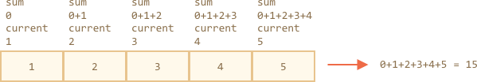

# 数组方法

因为数组提供的方法很多。为了方便起见，在本章中，我们将按组讲解。

## 添加/移除数组元素

已知从开头或结尾添加删除元素的方法：

- `arr.push(...items)` — 从结尾添加元素，
- `arr.pop()` — 从结尾提取元素，
- `arr.shift()` — 从开头提取元素，
- `arr.unshift(...items)` — 从开头添加元素，

这里还有其他几种方法。

### splice

如何从数组中删除元素？

数组是对象，所以我们可以尝试使用 `delete`：

```js run
let arr = ["I", "go", "home"];

delete arr[1]; // remove "go"

alert( arr[1] ); // undefined

// now arr = ["I",  , "home"];
alert( arr.length ); // 3
```

元素被删除，但数组仍然有 3 个元素，我们可以看到 `arr.length == 3`。

这很正常，因为 `delete obj.key` 是通过 `key` 来移除对应的值。但是对于数组，我们通常希望剩下的元素移除并释放占用的位置，得到一个更短的数组。

所以应该使用特殊的方法。

<<<<<<< HEAD
[arr.splice(str)](mdn:js/Array/splice) 方法可以说是数组界的瑞士军刀。它可以做所有事情：添加，删除和插入元素。
=======
The [arr.splice(str)](mdn:js/Array/splice) method is a swiss army knife for arrays. It can do everything: insert, remove and replace elements.
>>>>>>> 9cb33f4039e5751bfd0e2bca565a37aa463fb477

语法是：

```js
arr.splice(index[, deleteCount, elem1, ..., elemN])
```

从 `index` 开始：删除 `deleteCount` 元素并在当前位置插入 `elem1, ..., elemN`。最后返回已删除元素的数组。

这个方法很容易通过例子来掌握。

让我们从删除开始：

```js run
let arr = ["I", "study", "JavaScript"];

*!*
arr.splice(1, 1); // from index 1 remove 1 element
*/!*

alert( arr ); // ["I", "JavaScript"]
```

简单，对吧？从索引 `1` 开始删除 `1` 个元素。

在下一个例子中，我们删除了 3 个元素，并用另外两个元素替换它们：

```js run
let arr = [*!*"I", "study", "JavaScript",*/!* "right", "now"];

// remove 3 first elements and replace them with another
arr.splice(0, 3, "Let's", "dance");

alert( arr ) // now [*!*"Let's", "dance"*/!*, "right", "now"]
```

在这里我们可以看到 `splice` 返回已删除元素的数组：

```js run
let arr = [*!*"I", "study",*/!* "JavaScript", "right", "now"];

// remove 2 first elements
let removed = arr.splice(0, 2);

alert( removed ); // "I", "study" <-- 被删除元素的数组
```

我们可以将 `deleteCount` 设置为 `0`，`splice` 方法就能够插入元素而不用删除：

```js run
let arr = ["I", "study", "JavaScript"];

// from index 2
// delete 0
// then insert "complex" and "language"
arr.splice(2, 0, "complex", "language");

alert( arr ); // "I", "study", "complex", "language", "JavaScript"
```

````smart header="允许负向索引"
在这里和其他数组方法中，负向索引是允许的。它们从数组末尾计算位置，如下所示：

```js run
let arr = [1, 2, 5];

// from index -1 (one step from the end)
// delete 0 elements,
// then insert 3 and 4
arr.splice(-1, 0, 3, 4);

alert( arr ); // 1,2,3,4,5
```
````

### slice

[arr.slice](mdn:js/Array/slice) 方法比 `arr.splice` 简单得多。

语法是：

```js
arr.slice(start, end)
```

<<<<<<< HEAD
它从所有元素的开始索引 `"start"` 复制到 `"end"` (不包括 `"end"`) 返回一个新的数组。`start` 和 `end` 都可以是负数，在这种情况下，从末尾计算索引。
=======
It returns a new array containing all items from index `"start"` to `"end"` (not including `"end"`). Both `start` and `end` can be negative, in that case position from array end is assumed.
>>>>>>> 9cb33f4039e5751bfd0e2bca565a37aa463fb477

它和字符串的 `str.slice` 有点像，就是把子字符串替换成子数组。

例如：

```js run
let str = "test";
let arr = ["t", "e", "s", "t"];

alert( str.slice(1, 3) ); // es
alert( arr.slice(1, 3) ); // e,s

alert( str.slice(-2) ); // st
alert( arr.slice(-2) ); // s,t
```

### concat

[arr.concat](mdn:js/Array/concat) 将数组与其他数组和/或元素结合在一起。

语法：

```js
arr.concat(arg1, arg2...)
```

它接受任意数量的参数 — 数组或值。

结果是一个包含`arr`，`arg1`，`arg2`等元素的新数组。

如果参数是一个数组或具有 `Symbol.isConcatSpreadable` 属性，则其所有元素都将被复制。否则，复制参数本身。

例如：

```js run
let arr = [1, 2];

// merge arr with [3,4]
alert( arr.concat([3, 4])); // 1,2,3,4

// merge arr with [3,4] and [5,6]
alert( arr.concat([3, 4], [5, 6])); // 1,2,3,4,5,6

// merge arr with [3,4], then add values 5 and 6
alert( arr.concat([3, 4], 5, 6)); // 1,2,3,4,5,6
```

通常，它只复制数组中的元素（“扩展”它们）。其他对象，即使它们看起来像数组一样，仍然作为一个整体添加：

```js run
let arr = [1, 2];

let arrayLike = {
  0: "something",
  length: 1
};

alert( arr.concat(arrayLike) ); // 1,2,[object Object]
//[1, 2, arrayLike]
```

...但是，如果类似数组的对象具有 `Symbol.isConcatSpreadable` 属性，将替换其元素：

```js run
let arr = [1, 2];

let arrayLike = {
  0: "something",
  1: "else",
*!*
  [Symbol.isConcatSpreadable]: true,
*/!*
  length: 2
};

alert( arr.concat(arrayLike) ); // 1,2,something,else
```

<<<<<<< HEAD
## 查询数组
=======
## Iterate: forEach

The [arr.forEach](mdn:js/Array/forEach) method allows to run a function for every element of the array.

The syntax:
```js
arr.forEach(function(item, index, array) {
  // ... do something with item
});
```

For instance, this shows each element of the array:

```js run
// for each element call alert
["Bilbo", "Gandalf", "Nazgul"].forEach(alert);
```

And this code is more elaborate about their positions in the target array:

```js run
["Bilbo", "Gandalf", "Nazgul"].forEach((item, index, array) => {
  alert(`${item} is at index ${index} in ${array}`);
});
```

The result of the function (if it returns any) is thrown away and ignored.


## Searching in array
>>>>>>> 9cb33f4039e5751bfd0e2bca565a37aa463fb477

这些是在数组中查询某些内容的方法。

### indexOf/lastIndexOf 和 includes

[arr.indexOf](mdn:js/Array/indexOf)、[arr.lastIndexOf](mdn:js/Array/lastIndexOf) 和 [arr.includes](mdn:js/Array/includes) 方法与字符串操作具有相同的语法，只不过这里是对数组元素而不是字符进行操作：

<<<<<<< HEAD
- `arr.indexOf(item, from)` 从索引 `from` 查询 `item`，如果找到返回索引，否则返回 `-1`。
- `arr.lastIndexOf(item, from)` — 和上面相同，只是从尾部开始查询。
- `arr.includes(item, from)` — 从索引 `from` 查询 `item`，如果找到则返回 `true`。
=======
- `arr.indexOf(item, from)` looks for `item` starting from index `from`, and returns the index where it was found, otherwise `-1`.
- `arr.lastIndexOf(item, from)` -- same, but looks for from right to left.
- `arr.includes(item, from)` -- looks for `item` starting from index `from`, returns `true` if found.
>>>>>>> 9cb33f4039e5751bfd0e2bca565a37aa463fb477

例如：

```js run
let arr = [1, 0, false];

alert( arr.indexOf(0) ); // 1
alert( arr.indexOf(false) ); // 2
alert( arr.indexOf(null) ); // -1

alert( arr.includes(1) ); // true
```

请注意，这些方法使用 `===` 比较。所以如果我们查询 `false`，会精确到是 `false` 而不是零。

如果我们想检查是否包含需要的元素，并且不想知道确切的索引，那么 `arr.includes` 是首选。

此外，`includes` 的一个非常小的差别是它能正确处理`NaN`，而不像 `indexOf/lastIndexOf`：

```js run
const arr = [NaN];
alert( arr.indexOf(NaN) ); // -1 (should be 0, but === equality doesn't work for NaN)
alert( arr.includes(NaN) );// true (correct)
```

### find 和 findIndex

想象一下，我们有一个对象数组。我们如何找到具有特定条件的对象？

这时可以用 [arr.find](mdn:js/Array/find) 方法。

语法：
```js
let result = arr.find(function(item, index, array) {
<<<<<<< HEAD
  // 如果查询到返回 true
=======
  // if true is returned, item is returned and iteration is stopped
  // for falsy scenario returns undefined
>>>>>>> 9cb33f4039e5751bfd0e2bca565a37aa463fb477
});
```

该函数对数组中的每个元素重复调用：

- `item` 是元素。
- `index` 是它的索引。
- `array` 是数组本身。

如果它返回`true`，则查询停止，返回 `item`。如果没有查询到，则返回 `undefined`。

例如，我们有一组用户，每个用户都有 `id` 和 `name` 字段。让我们找到一个 `id == 1`：

```js run
let users = [
  {id: 1, name: "John"},
  {id: 2, name: "Pete"},
  {id: 3, name: "Mary"}
];

let user = users.find(item => item.id == 1);

alert(user.name); // John
```

在现实生活中，对象数组是很常见，所以`find` 方法非常有用。

<<<<<<< HEAD
注意在这个例子中我们传给了 `find` 一个单参数函数 `item => item.id == 1`。其他参数 `find` 很少使用。

与 [arr.findIndex](mdn:js/Array/findIndex) 方法本质上是相同的，但它返回找到元素的索引而不是元素本身。
=======
Note that in the example we provide to `find` the function `item => item.id == 1` with one argument. Other arguments of this function are rarely used.

The [arr.findIndex](mdn:js/Array/findIndex) method is essentially the same, but it returns the index where the element was found instead of the element itself and `-1` is returned when nothing is found.
>>>>>>> 9cb33f4039e5751bfd0e2bca565a37aa463fb477

### filter

`find` 方法查询的是使函数返回 `true` 的第一个元素。

如果需要匹配的有很多，我们可以使用 [arr.filter(fn)](mdn:js/Array/filter)。

<<<<<<< HEAD
语法与 `find` 大致相同，但是它返回的是所有匹配元素组成的数组：

```js
let results = arr.filter(function(item, index, array) {
  // 在元素通过过滤器时返回 true
=======
The syntax is similar to `find`, but filter continues to iterate for all array elements even if `true` is already returned:

```js
let results = arr.filter(function(item, index, array) {
  // if true item is pushed to results and iteration continues
  // returns empty array for complete falsy scenario
>>>>>>> 9cb33f4039e5751bfd0e2bca565a37aa463fb477
});
```

例如：

```js run
let users = [
  {id: 1, name: "John"},
  {id: 2, name: "Pete"},
  {id: 3, name: "Mary"}
];

// 返回前两个用户的数组
let someUsers = users.filter(item => item.id < 3);

alert(someUsers.length); // 2
```

## 转换数组

本节介绍转换或重新排序数组的方法。


### map

[arr.map](mdn:js/Array/map) 方法是最有用和经常使用的方法之一。

语法：

```js
let result = arr.map(function(item, index, array) {
  // 返回新值而不是当前元素
})
```

它对数组中每个元素调用函数并返回符合结果的数组。

例如，在这里我们将每个元素转换为它的字符串长度：

```js run
let lengths = ["Bilbo", "Gandalf", "Nazgul"].map(item => item.length);
alert(lengths); // 5,7,6
```

### sort(fn)

[arr.sort](mdn:js/Array/sort) 方法对数组**进行排序**

语法：

```js run
let arr = [ 1, 2, 15 ];

// 该方法重新排列 arr 的内容（并返回它）
arr.sort();

alert( arr );  // *!*1, 15, 2*/!*
```

你有没有注意到结果有什么奇怪的地方？

顺序变成了 `1, 15, 2`。不对，但为什么呢？

**这些元素默认情况下按字符串排序。**

从字面上看，所有元素都被转换为字符串，然后进行比较。因此，按照词典顺序排序，实际上应该是`"2" > "15"`。

要使用我们自己的排序顺序，我们需要提供带两个参数的函数作为 `arr.sort()` 的参数。

该函数像这样工作：
```js
function compare(a, b) {
  if (a > b) return 1;
  if (a == b) return 0;
  if (a < b) return -1;
}
```

例如：

```js run
function compareNumeric(a, b) {
  if (a > b) return 1;
  if (a == b) return 0;
  if (a < b) return -1;
}

let arr = [ 1, 2, 15 ];

*!*
arr.sort(compareNumeric);
*/!*

alert(arr);  // *!*1, 2, 15*/!*
```

现在结果符合预期了。

让我们搁置一边，思考发生了什么。`arr` 可以是由任何东西组成的数组。它可能包含数字或字符串或 html 元素或其他。我们对一组数据进行排序时，需要一个**排序函数**来确认如何比较这些元素。默认是按字符串排序的。

`arr.sort(fn)` 方法内置实现排序算法。我们不需要关心它是如何工作的(大多数情况下是优化过的[快速排序](https://en.wikipedia.org/wiki/Quicksort)算法)。它将自动遍历数组，使用提供的函数比较它的元素并对它们重新排序，我们所需要的只是提供用于比较的函数 `fn`。

顺便说一句，如果我们想知道哪些元素进行了比较 — alert 是没有作用的：

```js run
[1, -2, 15, 2, 0, 8].sort(function(a, b) {
  alert( a + " <> " + b );
});
```

该算法可以在过程中多次比较元素，但它会尽可能少地进行比较。


````smart header="比较函数可以返回任何数字"
实际上，比较函数只需要返回一个正数表示更大，而负数表示更少。

通过这个原理我们可以编写更短的函数：

```js run
let arr = [ 1, 2, 15 ];

arr.sort(function(a, b) { return a - b; });

alert(arr);  // *!*1, 2, 15*/!*
```
````

<<<<<<< HEAD
````smart header="箭头函数最好"
[箭头函数](info:function-expression#arrow-functions)还记得吗？这里使用箭头函数会更加简洁：
=======
````smart header="Arrow functions for the best"
Remember [arrow functions](info:function-expressions-arrows#arrow-functions)? We can use them here for neater sorting:
>>>>>>> 9cb33f4039e5751bfd0e2bca565a37aa463fb477

```js
arr.sort( (a, b) => a - b );
```

这与上面的那些更长的其它写法是完全相同的。
````

### reverse

[arr.reverse](mdn:js/Array/reverse) 方法颠倒 `arr` 中元素的顺序。

例如：

```js run
let arr = [1, 2, 3, 4, 5];
arr.reverse();

alert( arr ); // 5,4,3,2,1
```

它也在返回后返回数组 `arr`。

### split 和 join

举一个现实生活的场景的例子，我们正在编写一个消息应用程序，并且该人员输入以逗号分隔的接收者列表：`John，Pete，Mary`。但对我们来说，数组比单个字符串更舒适。怎么做才能获得这个数组呢？

[str.split(delim)](mdn:js/String/split) 方法可以做到。它通过给定的分隔符 `delim` 将字符串分割成一个数组。

在下面的例子中，我们用逗号分隔空格：

```js run
let names = 'Bilbo, Gandalf, Nazgul';

let arr = names.split(', ');

for (let name of arr) {
  alert( `A message to ${name}.` ); // A message to Bilbo  (and other names)
}
```

`split` 方法有一个可选的第二个数字参数 — 对数组长度的限制。如果提供了，那么额外的元素将被忽略。但实际上它很少使用：

```js run
let arr = 'Bilbo, Gandalf, Nazgul, Saruman'.split(', ', 2);

alert(arr); // Bilbo, Gandalf
```

````smart header="拆分为字母"
调用空的参数 `split(s)` 会将字符串分成一个字母数组：

```js run
let str = "test";

alert( str.split('') ); // t,e,s,t
```
````

<<<<<<< HEAD
[arr.join(str)](mdn:js/Array/join) 与 `split` 相反。它会在它们之间创建一串由 `str` 粘合的 `arr` 项。
=======
The call [arr.join(separator)](mdn:js/Array/join) does the reverse to `split`. It creates a string of `arr` items glued by `separator` between them.
>>>>>>> 9cb33f4039e5751bfd0e2bca565a37aa463fb477

例如：

```js run
let arr = ['Bilbo', 'Gandalf', 'Nazgul'];

let str = arr.join(';');

alert( str ); // Bilbo;Gandalf;Nazgul
```

### reduce/reduceRight

<<<<<<< HEAD
当我们需要遍历一个数组时 — 我们可以使用 `forEach`。
=======
When we need to iterate over an array -- we can use `forEach`, `for` or `for..of`.
>>>>>>> 9cb33f4039e5751bfd0e2bca565a37aa463fb477

当我们需要迭代并返回每个元素的数据时 — 我们可以使用 `map`。

[arr.reduce](mdn:js/Array/reduce) 和 [arr.reduceRight](mdn:js/Array/reduceRight) 和上面差不多，但有点复杂。它们用于根据数组计算单个值。

语法是：

```js
let value = arr.reduce(function(previousValue, item, index, array) {
  // ...
}, initial);
```

该函数应用于元素。从第二个参数开始你可能就会觉得很眼熟了：

<<<<<<< HEAD
- `item` — 当前的数组元素。
- `index` — 当前索引。
- `arr` — 数组本身。
=======
- `item` -- is the current array item.
- `index` -- is its position.
- `array` -- is the array.
>>>>>>> 9cb33f4039e5751bfd0e2bca565a37aa463fb477

目前为止，这很像 `forEach/map`。但还有一个参数不同就是：

- `previousValue` — 是前一个函数调用的结果，第一次调用是初始化。

我们写个例子试试。

这里我们得到一行数组的总和：

```js run
let arr = [1, 2, 3, 4, 5];

let result = arr.reduce((sum, current) => sum + current, 0);

alert(result); // 15
```

在这里，我们使用了 `reduce` 的最常见类型，它只使用 2 个参数。

让我们看看发生了什么的细节。

1. 在第一次运行时，`sum` 是初始值（`reduce` 的最后一个参数），等于 0，`current` 是第一个数组元素，等于 1。所以结果是 `1`。
2. 在第二次运行时，`sum = 1`，我们添加第二个数组元素（`2`）并返回。
3. 在第三次运行中，`sum = 3`，我们再添加一个元素，等等......

计算流程：



<<<<<<< HEAD
或者以表格的形式出现，每行代表的是下一个数组元素的函数调用：
=======
Or in the form of a table, where each row represents a function call on the next array element:
>>>>>>> 9cb33f4039e5751bfd0e2bca565a37aa463fb477

|   |`sum`|`current`|`result`|
|---|-----|---------|---------|
|the first call|`0`|`1`|`1`|
|the second call|`1`|`2`|`3`|
|the third call|`3`|`3`|`6`|
|the fourth call|`6`|`4`|`10`|
|the fifth call|`10`|`5`|`15`|


正如我们所看到的，先前调用的结果成为下一个调用的第一个参数。

我们也可以省略初始值：

```js run
let arr = [1, 2, 3, 4, 5];

// 删除初始值
let result = arr.reduce((sum, current) => sum + current);

alert( result ); // 15
```

结果是一样的。这是因为如果没有初始值，那么 `reduce` 将数组的第一个元素作为初始值，并从第二个元素开始迭代。

计算表与上面相同，减去第一行

但是这种使用需要非常小心。如果数组为空，那么在没有初始值的情况下调用 `reduce` 会导致错误。

例如：

```js run
let arr = [];

// Error: Reduce of empty array with no initial value
// 如果初始值存在，reduce 将返回空 arr。
arr.reduce((sum, current) => sum + current);
```


所以建议始终指定初始值。

[arr.reduceRight](mdn:js/Array/reduceRight) 也一样，但是遍历是从右到左。


<<<<<<< HEAD
## 迭代：forEach

[arr.forEach](mdn:js/Array/forEach) 方法允许为数组的每个元素运行一个函数。

语法：
```js
arr.forEach(function(item, index, array) {
  // ... do something with item
});
```

例如，这显示了数组的每个元素：

```js run
// 为每个元素调用 alert
["Bilbo", "Gandalf", "Nazgul"].forEach(alert);
```

而这段代码更详细地介绍了它们在数组中的位置

```js run
["Bilbo", "Gandalf", "Nazgul"].forEach((item, index, array) => {
  alert(`${item} is at index ${index} in ${array}`);
});
```

该函数的结果（如果它返回的话）被抛弃并被忽略。

=======
>>>>>>> 9cb33f4039e5751bfd0e2bca565a37aa463fb477
## Array.isArray

数组基于对象。不构成单独的语言类型。

所以 `typeof` 无法从对象中区分出数组来：

```js run
alert(typeof {}); // object
alert(typeof []); // same
```

......但是数组经常被使用，以至于有一种特殊的方法用于判断：[Array.isArray(value)](mdn:js/Array/isArray)。如果 `value` 是一个数组，则返回 `true`；否则返回 `false`。

```js run
alert(Array.isArray({})); // false

alert(Array.isArray([])); // true
```

## 大多数方法支持 "thisArg"

几乎所有调用函数的数组方法 - 比如 `find`，`filter`，`map`，与带有 `sort` 的不同，他们接受一个可选的附加参数 `thisArg`。

该参数在上面的部分没有解释，因为它很少使用。但为了完整性，我们还需要解释下。

以下是这些方法的完整语法：

```js
arr.find(func, thisArg);
arr.filter(func, thisArg);
arr.map(func, thisArg);
// ...
// thisArg 是可选的最后一个参数
```

`thisArg` 参数的值在 `func` 中变为 `this`。

例如，在这里我们使用一个对象方法作为过滤器，`thisArg` 派上用场：

```js run
let user = {
  age: 18,
  younger(otherUser) {
    return otherUser.age < this.age;
  }
};

let users = [
  {age: 12},
  {age: 16},
  {age: 32}
];

*!*
// 找到比 user 小的所有 users
let youngerUsers = users.filter(user.younger, user);
*/!*

alert(youngerUsers.length); // 2
```

在上面我们使用 `user.younger` 作为过滤器，并提供 `user` 作为它的上下文。如果我们没有提供上下文，`users.filter(user.younger)` 会调用`user.younger` 作为一个独立的函数，这时 `this=undefined`。

## 总结

数组方法备忘录：

- 添加/删除元素：
  - `push(...items)` — 从结尾添加元素，
  - `pop()` — 从结尾提取元素，
  - `shift()` — 从开头提取元素，
  - `unshift(...items)` — 从开头添加元素，
  - `splice(pos, deleteCount, ...items)` — 从 `index` 开始：删除 `deleteCount` 元素并在当前位置插入元素。
  - `slice(start, end)` — 它从所有元素的开始索引 `"start"` 复制到 `"end"` (不包括 `"end"`) 返回一个新的数组。
  - `concat(...items)` — 返回一个新数组：复制当前数组的所有成员并向其中添加 `items`。如果有任何` items` 是一个数组，那么就取其元素。

<<<<<<< HEAD
- 查询元素：
  - `indexOf/lastIndexOf(item, pos)` —  从 `pos` 找到 `item`，则返回索引否则返回 `-1`。
  - `includes(value)` — 如果数组有 `value`，则返回 `true`，否则返回 `false`。
  - `find/filter(func)` — 通过函数过滤元素，返回 `true` 条件的符合 find 函数的第一个值或符合 filter 函数的全部值。 
  - `findIndex` 和 `find` 类似，但返回索引而不是值。
=======
- To search among elements:
  - `indexOf/lastIndexOf(item, pos)` -- look for `item` starting from position `pos`, return the index or `-1` if not found.
  - `includes(value)` -- returns `true` if the array has `value`, otherwise `false`.
  - `find/filter(func)` -- filter elements through the function, return first/all values that make it return `true`.
  - `findIndex` is like `find`, but returns the index instead of a value.
  
- To iterate over elements:
  - `forEach(func)` -- calls `func` for every element, does not return anything.
>>>>>>> 9cb33f4039e5751bfd0e2bca565a37aa463fb477

- 转换数组：
  - `map(func)` — 从每个元素调用 `func` 的结果创建一个新数组。
  - `sort(func)` — 将数组倒序排列，然后返回。
  - `reverse()` — 在原地颠倒数组，然后返回它。
  - `split/join` — 将字符串转换为数组并返回。
  - `reduce(func, initial)` — 通过为每个元素调用 `func` 计算数组上的单个值并在调用之间传递中间结果。

<<<<<<< HEAD
- 迭代元素：
  - `forEach(func)` — 为每个元素调用 `func`，不返回任何东西。

- 其他：
  - `Array.isArray(arr)` 检查 `arr` 是否是一个数组。
=======
- Additionally:
  - `Array.isArray(arr)` checks `arr` for being an array.
>>>>>>> 9cb33f4039e5751bfd0e2bca565a37aa463fb477

请注意，`sort`，`reverse` 和 `splice` 方法修改数组本身。

这些方法是最常用的方法，它们覆盖 99％ 的用例。但是还有其他几个：

- [arr.some(fn)](mdn:js/Array/some)/[arr.every(fn)](mdn:js/Array/every) 检查数组。

  在类似于 `map` 的数组的每个元素上调用函数 `fn`。如果任何/所有结果为 `true`，则返回 `true`，否则返回 `false`。

- [arr.fill(value, start, end)](mdn:js/Array/fill) — 从 `start` 到 `end` 用 `value` 重复填充数组。

- [arr.copyWithin(target, start, end)](mdn:js/Array/copyWithin) — copies its elements from position `start` till position `end` into *itself*, at position `target` (overwrites existing).将其元素从 `start` 到 `end` 在 `target` 位置复制到 **本身**（覆盖现有）。

有关完整列表，请参阅[手册](mdn:js/Array)。

从第一眼看来，似乎有很多方法，很难记住。但实际上这比看起来要容易得多。

为了您有数组方法的经验，请仔细查看备忘单了解它们。然后解决本章的任务练习。

以后，当你需要对某个数组操作，而无从下手 — 可以来到这，查看备忘录并找到正确的方法。示例将帮助您正确编写它。很快你会自动记住这些方法，而无需你额外的努力。
