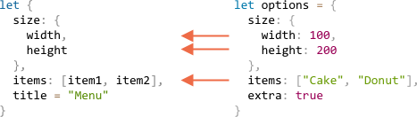

# 解构赋值

JavaScript 中最常用的两种数据结构是 `Object`（对象）和 `Array`（数组）。

对象让我们能够把许多信息打包到一个单一的实体中，数组则让我们能够存放有序的集合。所以我们可以创建一个对象或一个数组，把它当作一个实体进行处理，或者把它当作参数传递给一个函数调用。

**解构赋值**是一种特殊的语法，它让我们可以将数组或对象进行“拆包”，存放到一系列的变量中，因为有时候使用变量更加方便。解构操作在那些具有很多参数和默认参数值的函数中也很奏效，很快我们就会看到这些都是怎么处理的。

## 数组解构

以下是将数组解构到变量中的一个例子：

```js
// 有一个存放了名字和姓氏的数组
let arr = ["Ilya", "Kantor"]

*!*
// 解构赋值
let [firstName, surname] = arr;
*/!*

alert(firstName); // Ilya
alert(surname);  // Kantor
```

现在我们就可以针对这些变量进行操作，而不是针对原来的数组元素。

当与 `split` 函数（或其他返回值是数组的函数）结合使用时，看起来就更优雅了：

```js
let [firstName, surname] = "Ilya Kantor".split(' ');
```

````smart header="\"解构\"并不意味着\"破坏\""
这种语法叫做“解构赋值”，因为它通过将结构中的各元素复制到变量中来达到“解构”的目的。但数组本身是没有被修改的。

也就是以下代码的更精简写法而已：
```js
// let [firstName, surname] = arr;
let firstName = arr[0];
let surname = arr[1];
```
````

````smart header="忽略第一个元素"
数组中不想要的元素也可以通过添加额外的逗号来把它丢弃：

```js run
*!*
// 不需要第一个和第二个元素
let [, , title] = ["Julius", "Caesar", "Consul", "of the Roman Republic"];
*/!*

alert( title ); // Consul
```

在以上的代码中，数组的第一个和第二个元素被跳过，第三个元素被赋值给了 `title` 变量，剩下的元素也被跳过了。
````

````smart header="用于等号右侧的任何可迭代对象"

...事实上我们也可以在任何可迭代对象中使用，不仅仅是数组：

```js
let [a, b, c] = "abc"; // ["a", "b", "c"]
let [one, two, three] = new Set([1, 2, 3]);
```

````


````smart header="赋值给等号左侧的任何类型"

我们可以在等号左侧使用任何“可以被赋值的”变量。

例如，一个对象的属性：
```js run
let user = {};
[user.name, user.surname] = "Ilya Kantor".split(' ');

alert(user.name); // Ilya
```

````

````smart header="使用 .entries() 循环"

在前面的章节中我们已经见过了 [Object.entries(obj)](mdn:js/Object/entries) 方法。

我们可以使用 .entries() 方法和解构语法来遍历一个对象的键-值对：

```js run
let user = {
  name: "John",
  age: 30
};

// 循环遍历键-值对
*!*
for (let [key, value] of Object.entries(user)) {
*/!*
  alert(`${key}:${value}`); // name:John, then age:30
}
```

...对于 map 对象也类似：

```js run
let user = new Map();
user.set("name", "John");
user.set("age", "30");

*!*
for (let [key, value] of user.entries()) {
*/!*
  alert(`${key}:${value}`); // name:John, then age:30
}
```
````
### 剩余的 '...'

如果我们不仅要获得第一个值，还要将后续的所有元素也收集起来——我们可以使用三个点 `“...”` 加一个参数来接收“剩余的”元素：

```js run
let [name1, name2, *!*...rest*/!*] = ["Julius", "Caesar", *!*"Consul", "of the Roman Republic"*/!*];

alert(name1); // Julius
alert(name2); // Caesar

*!*
alert(rest[0]); // Consul
alert(rest[1]); // of the Roman Republic
alert(rest.length); // 2
*/!*
```

`rest` 变量的值就是数组中剩下的元素组成的数组。不一定要使用变量名 `rest`，我们也可以使用其他的变量名，只要确保它前面有三个点，并且在解构赋值的最后一个参数位置上就行了。

### 默认值

如果赋值语句中变量的数量多于数组中实际元素的数量，赋值不会报错。未赋值的变量被当作 `undifined`：

```js run
*!*
let [firstName, surname] = [];
*/!*

alert(firstName); // undefined
```

如果我们想要提供一个“默认值”给未赋值的变量，我们可以使用 `=` 来提供：

```js run
*!*
// 默认值
let [name = "Guest", surname = "Anonymous"] = ["Julius"];
*/!*

alert(name);    // Julius (来自数组的值)
alert(surname); // Anonymous (默认值被使用了)
```

默认值可以是更加复杂的表达式甚至可以是函数调用，这些表达式或函数只会在这个变量未被赋值的时候才会被计算。

举个例子，我们使用了 `prompt` 函数来提供两个默认值，但它只会在未被赋值的那个变量上进行调用：

```js run
// 只会提示输入姓氏
let [name = prompt('name?'), surname = prompt('surname?')] = ["Julius"];

alert(name);    // Julius (来自数组)
alert(surname); // 你输入的值
```


## 对象解构

解构赋值同样适用于对象。

基本的语法是：

```js
let {var1, var2} = {var1:…, var2…}
```

在等号右侧有一个已经存在的对象，我们想把它拆开到变量中。等号左侧包含了对象相应属性的一个“模式”。以下简单例子中就是 `{...}` 中一系列变量。

举个例子：

```js run
let options = {
  title: "Menu",
  width: 100,
  height: 200
};

*!*
let {title, width, height} = options;
*/!*

alert(title);  // Menu
alert(width);  // 100
alert(height); // 200
```

属性 `options.title`、`options.width` 和 `options.height` 的值被赋给了对应的变量。变量的顺序并不重要，以下的代码也奏效：

```js
// 改变 let {...} 中属性的顺序
let {height, width, title} = { title: "Menu", height: 200, width: 100 }
```

等号左侧的模式可以更加复杂，并给属性和变量之间指定一个映射关系。

如果我们想把一个属性赋值给不同名字的变量，比如把 `options.width` 属性赋值给变量 `w`，那可以使用冒号来指定：

```js run
let options = {
  title: "Menu",
  width: 100,
  height: 200
};

*!*
// { 原属性: 目标变量 }
let {width: w, height: h, title} = options;
*/!*

// width -> w
// height -> h
// title -> title

alert(title);  // Menu
alert(w);      // 100
alert(h);      // 200
```

冒号表示了“什么值 : 赋值给谁”。以上的例子中就是属性 `width` 赋值给 `w`，属性 `height` 赋值给 `h`，属性 `title` 赋值给同名变量。

对于可能缺失的属性，我们可以使用 `“=”` 来指定默认值，如下：

```js run
let options = {
  title: "Menu"
};

*!*
let {width = 100, height = 200, title} = options;
*/!*

alert(title);  // Menu
alert(width);  // 100
alert(height); // 200
```

就像数组或函数参数一样，默认值可以是表达式甚至是函数调用。只会在这个变量未被赋值的时候才会被计算/调用。

以下的代码提示输入宽度 width，但不会提示输入标题 title。

```js run
let options = {
  title: "Menu"
};

*!*
let {width = prompt("宽度?"), title = prompt("标题?")} = options;
*/!*

alert(title);  // Menu
alert(width);  // 你输入的宽度值
```

我们也可以结合冒号和等号一起使用：

```js run
let options = {
  title: "Menu"
};

*!*
let {width: w = 100, height: h = 200, title} = options;
*/!*

alert(title);  // Menu
alert(w);      // 100
alert(h);      // 200
```

### 剩余操作符

如果对象拥有的属性数量比我们提供的变量数量还多怎么办？我们可以只取其中的某一些属性然后把“剩余的”赋值到其他地方吗？

关于剩余操作符（即三个点）的文档几乎已经要被列为标准了，但大部分的浏览器还尚未支持。

看起来就像这样：

```js run
let options = {
  title: "Menu",
  height: 200,
  width: 100
};

*!*
let {title, ...rest} = options;
*/!*

// now title="Menu", rest={height: 200, width: 100}
alert(rest.height);  // 200
alert(rest.width);   // 100
```


````smart header="不使用 `let` 的疑难病症"
在以上的例子中，变量都是在赋值前才被声明的：`let {…} = {…}`。当然，我们也可以使用已有的变量。但这里有一个问题需要注意。

以下代码无法正常运行：
```js run
let title, width, height;

// 这一行发生错误
{title, width, height} = {title: "Menu", width: 200, height: 100};
```

问题在于 JavaScript 把主代码流（即不在其他表达式中）的 `{...}` 当做一个代码块，这样的代码块可以被用来组织语句，如下：

```js run
{
  // 一个代码块
  let message = "Hello";
  // ...
  alert( message );
}
```

为了告诉 JavaScript 这不是一个代码块，我们可以把整个赋值表达式用括号 `(...)` 包起来：

```js run
let title, width, height;

// 现在就正确了
*!*(*/!*{title, width, height} = {title: "Menu", width: 200, height: 100}*!*)*/!*;

alert( title ); // Menu
```

````

## 嵌套解构

如果一个对象或数组包含了其他的对象和数组，我们可以在等号左侧使用更复杂的模式来抽取深层的数据。

在以下代码中 `options` 的属性 `size` 是另一个对象，属性 `items` 是另一个数组。赋值语句中等号左侧的模式拥有相同的结构：

```js run
let options = {
  size: {
    width: 100,
    height: 200
  },
  items: ["Cake", "Donut"],
  extra: true    // 一些不会被解构的额外属性
};

// 为了清晰起见，解构赋值语句被写成多行
let {
  size: { // 把 size 赋值到这里
    width,
    height
  },
  items: [item1, item2], // 把 items 赋值到这里
  title = "Menu" // 在对象中不存在的属性（会使用默认值）
} = options;

alert(title);  // Menu
alert(width);  // 100
alert(height); // 200
alert(item1);  // Cake
alert(item2);  // Donut
```

除了 `extra` 属性的整个 `options` 对象都能被赋值给对应的变量。



最终，我们得到了 `width`、 `height`、 `item1`、 `item2` 和具有默认值的 `title` 变量。

有一个拥有很多属性的复杂对象，我们只想要抽取我们所需要的其中某些属性。这在解构赋值语句中是很常见的。

甚至还可能是这样的情况：
```js
// 将 size 作为一个整体取出赋值给一个变量，忽略剩下的所有
let { size } = options;
```

## 智能函数参数

有时候一个函数可能有很多参数，大部分的参数是可选的，对用户界面来说就尤其如此。想象一下这种情况：有一个创建菜单的函数，可能有宽度参数，高度参数，标题参数和菜单中的菜单项等等。

以下是这种函数的一个不好的写法：

```js
function showMenu(title = "Untitled", width = 200, height = 100, items = []) {
  // ...
}
```

现实情况下的问题就是你怎么记得住这么多参数的顺序，通常集成开发环境工具（IDE）会尽力帮助我们，特别是当代码有良好的文档注释的时候，但…… 另一个问题就是当大部分的参数采用默认值就好的情况下，怎么调用这个函数。

难道像这样？

```js
showMenu("My Menu", undefined, undefined, ["Item1", "Item2"])
```

这太难看了。而且当我们处理更多参数的时候可读性还会变得更差。

解构赋值语法前来救援！

我们可以把所有参数当作一个对象来传递，然后函数马上把这个对象解构成多个变量：

```js run
// 我们传递一个对象给函数
let options = {
  title: "My menu",
  items: ["Item1", "Item2"]
};

// ...然后函数马上把对象展开成变量
function showMenu(*!*{title = "Untitled", width = 200, height = 100, items = []}*/!*) {
  // title, items – 从 options 参数提取出来,
  // width, height – 使用默认值
  alert( `${title} ${width} ${height}` ); // My Menu 200 100
  alert( items ); // Item1, Item2
}

showMenu(options);
```

我们同样可以对含有嵌套对象的对象使用更加复杂的结构语句和冒号映射：

```js run
let options = {
  title: "My menu",
  items: ["Item1", "Item2"]
};

*!*
function showMenu({
  title = "Untitled",
  width: w = 100,  // width 赋值给 w
  height: h = 200, // height 赋值给 h
  items: [item1, item2] // items 第一个元素赋值给 item1, 第二个元素赋值给 item2
}) {
*/!*
  alert( `${title} ${w} ${h}` ); // My Menu 100 200
  alert( item1 ); // Item1
  alert( item2 ); // Item2
}

showMenu(options);
```

语法和解构赋值是一样的：
```js
function({
  incomingProperty: parameterName = defaultValue
  ...
})
```

请注意，这种解构假定了调用 `showMenu()` 函数时传递了一个参数，如果我们想让所有的参数都使用默认值，那我们应该传递一个空的对象：

```js
showMenu({});


showMenu(); // 这样会导致错误
```

我们可以通过指定空对象 `{}` 为整个函数参数的默认值：


```js run
// 清晰起见，精简了部分参数
function showMenu(*!*{ title = "Menu", width = 100, height = 200 } = {}*/!*) {
  alert( `${title} ${width} ${height}` );
}

showMenu(); // Menu 100 200
```

在以上的代码中，整个参数对象默认就是 `{}`，因此总会有对象可以用来解构。

## 总结

- 解构赋值允许将对象或数组立即映射到多个变量上。
- 解构对象的语法：
    ```js
    let {prop : varName = default, ...} = object
    ```

	这表示属性 `prop` 会被赋值给变量 `varName`，如果没有这个属性的话，就会使用 `default` 的值。

- 解构数组的语法：

    ```js
    let [item1 = default, item2, ...rest] = array
    ```

	数组的第一个元素赋值给 `item1`，第二个元素赋值给 `item2`，剩下的所有组成另一个数组 `rest`。

- 更多复杂的案例情况下，等号左侧必须和等号右侧有相同的结构。
