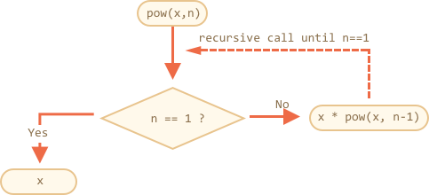
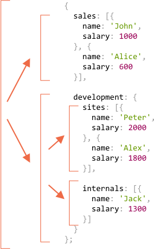
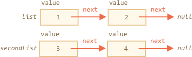
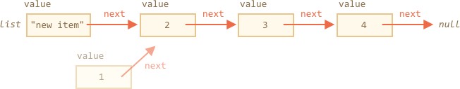

# 递归和堆栈

我们回到函数，深入研究一下。

我们的第一个主题是**递归**。

如果你不是刚接触编程，那么你可能已经很熟悉它，可以跳过这一章了。

递归是一种编程模式，用于一个任务可以被分割为多个相似的更简单的任务的场景。或者用于一个任务可以被简化为一个容易的行为加上更简单的任务变体。或者像我们随后会看到的，用来处理特定类型的数据结构。

当一个函数解决一个任务时，在该过程中它可以调用很多其它函数。那么当一个函数调用**自身**时，就称其为**递归**。

## 两种思考方式

简单起见，我们写一个函数 `pow(x, n)`，它可以计算 `x` 的 `n` 次方，即用 `x` 乘以自身 `n` 次。

```js
pow(2, 2) = 4
pow(2, 3) = 8
pow(2, 4) = 16
```

有两种实现方式。

1. 迭代思路：`for` 循环：

    ```js run
    function pow(x, n) {
      let result = 1;

      // 在循环中用 x 乘以 result
      for (let i = 0; i < n; i++) {
        result *= x;
      }

      return result;
    }

    alert( pow(2, 3) ); // 8
    ```

2. 递归思路：简化任务，调用自身：

    ```js run
    function pow(x, n) {
      if (n == 1) {
        return x;
      } else {
        return x * pow(x, n - 1);
      }
    }

    alert( pow(2, 3) ); // 8
    ```

注意递归方式完全不相同。

当 `pow(x, n)` 被调用时，执行分为两个分支：

```js
              if n==1  = x
             /
pow(x, n) =
             \       
              else     = x * pow(x, n - 1)
```

1. 如果 `n == 1`，所有事情都会很简单，这叫做递归的**基础**，因为它立即得到显而易见的结果：`pow(x, 1)` 等于 `x`。
2. 否则，我们可以用 `x * pow(x, n - 1)` 表示 `pow(x, n)`。在数学里，可能会这么写 <code>x<sup>n</sup> = x * x<sup>n-1</sup></code>。这叫做**一个递归步骤**：我们将任务转变为更简单的行为（`x` 的乘法）和更简单的同类任务调用（更小的 `n` 给 `pow`）。后面步骤继续简化直到 `n` 等于 `1`。

我们也可以说 `pow` **递归的调用自身** 直到 `n == 1`。




比如，为了计算 `pow(2, 4)`，递归变体经过了下面几个步骤：

1. `pow(2, 4) = 2 * pow(2, 3)`
2. `pow(2, 3) = 2 * pow(2, 2)`
3. `pow(2, 2) = 2 * pow(2, 1)`
4. `pow(2, 1) = 2`

所以，递归生成了更简单的函数调用，然后 —— 更加简单，继续，直到结果变得很明显。

````smart header="递归一般更简洁"
递归解决方案一般比迭代更简洁。

这里我们可以使用三元运算符 `?` 来替换 `if` 语句，从而让 `pow(x, n)` 更简洁并且可读性依然很高：

```js run
function pow(x, n) {
  return (n == 1) ? x : (x * pow(x, n - 1));
}
```
````

最大的嵌套调用次数（包括首次）称为**递归深度**。在我们的例子中，它正好等于 `n`。

最大递归深度受限于 JavaScript 引擎。我们可以确信基本是 10000，有些引擎可能允许更大，但是 100000 很可能就超过了限制。有一些自动优化能够缓解这个（「尾部调用优化」），但是它们还没有被完全支持，只能用于简单场景。

这就限制了递归的应用，但是递归仍然被广泛使用。有很多任务使用递归思路会让代码更简单，更容易维护。

## 执行堆栈

现在我们来研究下递归调用如何工作的。为此，我们会先看看函数底层工作原理。

一个函数运行的信息被存储在它的**执行上下文**里。

[执行上下文](https://tc39.github.io/ecma262/#sec-execution-contexts)是一个内部数据结构，它包含一个函数执行时的细节：当前工作流在哪里，当前的变量，`this` 的值（这里我们不使用它），以及其它一些内部细节。

每个函数调用都有与其相关联的执行上下文。

当一个函数有嵌套调用时，下面的事情会发生：

- 当前函数被暂停；
- 与它关联的执行上下文被一个叫做**执行上下文堆栈**的特殊数据结构保存；
- 执行嵌套调用；
- 嵌套调用结束后，之前的执行上下文从堆栈中恢复，外部函数从停止的地方继续执行。

我们看看调用 `pow(2, 3)` 都发生了什么。

### pow(2, 3)

在调用 `pow(2, 3)` 的开始，执行上下文会存储变量：`x = 2, n = 3`，执行流程在函数的第 `1` 行。

我们将其描绘如下：

<ul class="function-execution-context-list">
  <li>
    <span class="function-execution-context">Context: { x: 2, n: 3, at line 1 }</span>
    <span class="function-execution-context-call">pow(2, 3)</span>
  </li>
</ul>

这是函数开始执行的时候。条件 `n == 1` 结果为否，所以流程进入 `if` 的第二分支。

```js run
function pow(x, n) {
  if (n == 1) {
    return x;
  } else {
*!*
    return x * pow(x, n - 1);
*/!*
  }
}

alert( pow(2, 3) );
```


变量相同，但是函数变化了，所以现在上下文是：

<ul class="function-execution-context-list">
  <li>
    <span class="function-execution-context">Context: { x: 2, n: 3, at line 5 }</span>
    <span class="function-execution-context-call">pow(2, 3)</span>
  </li>
</ul>

为了计算 `x * pow(x, n - 1)`，我们需要用新的参数 `pow(2, 2)` 子调用 `pow`。

### pow（2, 2)

为了执行嵌套调用，JavaScript 会记住**执行上下文堆栈**中的当前执行上下文。

这里我们调用相同的函数 `pow`，但是没关系。所有函数的处理都是一样的：

1. 当前上下文被「记录」在堆栈的顶部；
2. 为子调用创建新上下文；
3. 当子调用结束后 —— 前一上下文从堆栈弹出，继续执行。

下面是进入子调用 `pow(2, 2)` 的上下文堆栈：

<ul class="function-execution-context-list">
  <li>
    <span class="function-execution-context">Context: { x: 2, n: 2, at line 1 }</span>
    <span class="function-execution-context-call">pow(2, 2)</span>
  </li>
  <li>
    <span class="function-execution-context">Context: { x: 2, n: 3, at line 5 }</span>
    <span class="function-execution-context-call">pow(2, 3)</span>
  </li>
</ul>

新的当前执行上下文位于顶部（加粗），前面的在下方。

当我们完成子调用后 —— 很容恢复前面的上下文，因为它保留这变量和代码停止时的准确位置。图中我们使用了单词「行」，但实际比这更精确。

### pow(2, 1)

重复该过程：在第 `5` 行生成新的子调用，现在使用参数 `x=2`，`n=1`。

新的执行上下文被创建，前一个被压入堆栈顶部：

<ul class="function-execution-context-list">
  <li>
    <span class="function-execution-context">Context: { x: 2, n: 1, at line 1 }</span>
    <span class="function-execution-context-call">pow(2, 1)</span>
  </li>
  <li>
    <span class="function-execution-context">Context: { x: 2, n: 2, at line 5 }</span>
    <span class="function-execution-context-call">pow(2, 2)</span>
  </li>
  <li>
    <span class="function-execution-context">Context: { x: 2, n: 3, at line 5 }</span>
    <span class="function-execution-context-call">pow(2, 3)</span>
  </li>
</ul>

此时，有 2 个旧的上下文和 1 个当前正在运行的给 `pow(2, 1)` 的上下文。

### 出口

在 `pow(2, 1)` 时，不像之前，条件 `n == 1` 成了是，所以 `if` 的第一分支生效：

```js
function pow(x, n) {
  if (n == 1) {
*!*
    return x;
*/!*
  } else {
    return x * pow(x, n - 1);
  }
}
```

此时不再有嵌套调用，所以函数结束，返回 `2`。

函数结束后，它的执行上下文不再有用，会从内存中移除。前一上下文从栈顶恢复：


<ul class="function-execution-context-list">
  <li>
    <span class="function-execution-context">Context: { x: 2, n: 2, at line 5 }</span>
    <span class="function-execution-context-call">pow(2, 2)</span>
  </li>
  <li>
    <span class="function-execution-context">Context: { x: 2, n: 3, at line 5 }</span>
    <span class="function-execution-context-call">pow(2, 3)</span>
  </li>
</ul>

恢复执行 `pow(2, 2)`，它有子调用 `pow(2, 1)` 的结果，所以它也可以结束 `x * pow(x, n - 1)` 的执行，返回 `4`。

然后前一上下文被恢复：

<ul class="function-execution-context-list">
  <li>
    <span class="function-execution-context">Context: { x: 2, n: 3, at line 5 }</span>
    <span class="function-execution-context-call">pow(2, 3)</span>
  </li>
</ul>

当它结束后，我们得到结果 `pow(2, 3) = 8`。

递归深度是：**3**。

从上面的图解可以看到，递归深度等于堆栈中上下文的最大个数。

注意内存要求。上下文消耗内存，在我们的例子中，求 `n` 次方需要存储 `n` 个上下文，以便减一后的 `n` 使用。

而循环算法更省内存：

```js
function pow(x, n) {
  let result = 1;

  for (let i = 0; i < n; i++) {
    result *= x;
  }

  return result;
}
```

迭代 `pow` 仅使用一个上下文，在处理中修改 `i` 和 `result`。它的内存要求比较小，且固定不依赖 `n`。

**任何递归都可以用循环来重写。循环变体一般更加有效。**

...但有时重写很难，尤其是函数根据条件使用不同的子调用，然后合并它们的结果，或者分支比较复杂。而且有些优化可能没有必要，完全不值得。

递归能提供更简洁的代码，容易理解和维护。优化并不是处处需要，大多数时候我们需要一个好代码，这就是它被使用的原因。

## 递归遍历

递归另一个重要应用就是递归遍历。

设想，有一家公司。职员结构可以用这个对象描述：

```js
let company = {
  sales: [{
    name: 'John',
    salary: 1000
  }, {
    name: 'Alice',
    salary: 600
  }],

  development: {
    sites: [{
      name: 'Peter',
      salary: 2000
    }, {
      name: 'Alex',
      salary: 1800
    }],

    internals: [{
      name: 'Jack',
      salary: 1300
    }]
  }
};
```

或者说，一家公司有很多部门。

<<<<<<< HEAD
- 一个部门有员工列表，比如，`销售`部有 2 名员工：John 和 Alice。
- 或者一个部门可能划分为几个子部门，比如`开发`有两个分支：`网站`和`内部`，它们都有自己的员工。
- 当一个子部门增长时，它可能会划分为子部门（或者团队）。
=======
- A department may have an array of staff. For instance, `sales` department has 2 employees: John and Alice.
- Or a department may split into subdepartments, like `development` has two branches: `sites` and `internals`. Each of them has their own staff.
- It is also possible that when a subdepartment grows, it divides into subsubdepartments (or teams).
>>>>>>> 08734734021aa128c13da2382fe8fa062677bb9f

    比如，`网站`部门在未来可能会分为`网站 A` 和 `网站 B`。它们可能还会再分，没有图示，脑补一下吧。

现在，如果我们需要获得所有薪酬总数，我们该如何做？

迭代方式并不容易，因为结构比较复杂。首先想到是使用 `for` 循环 `公司`，然后嵌套子循环第 1 层部门。然后我们需要更多嵌套子循环来迭代第 2 层部门，比如 `网站`。...然后另一个嵌套子循环给将来会有的第 3 层部门？我们应该在第 3 或第 4 层循环停止吗？如果我们将 3-4 嵌套子循环放到代码里来遍历单个对象，它会变得很丑。

我们试试递归。

可以看到，当函数计算一个部门的和时，有两种可能情况：

1. 这个部门是有**一组人**的『简单』部门 —— 这样我们就可以使用简单循环来求薪酬总额。
2. 或者它是**一个有 `N` 个子部门的对象** —— 这样我们可以用 `N` 个递归调用来求每一个子部门的总额然后合并它们。

(1) 是递归的基础，简单的情况。

(2) 是递归步骤。复杂的任务被划分为适于更小部门的子任务。它们可能还会在划分，但是最终都会在 (1) 那里完成。

算法从代码来看会更简单些：


```js run
let company = { // 是同样的对象，简洁起见做了压缩
  sales: [{name: 'John', salary: 1000}, {name: 'Alice', salary: 600 }],
  development: {
    sites: [{name: 'Peter', salary: 2000}, {name: 'Alex', salary: 1800 }],
    internals: [{name: 'Jack', salary: 1300}]
  }
};

// 用来完成作业的函数
*!*
function sumSalaries(department) {
  if (Array.isArray(department)) { // 情况 (1)
    return department.reduce((prev, current) => prev + current.salary, 0); // 求数组的和
  } else { // 情况 (2)
    let sum = 0;
    for (let subdep of Object.values(department)) {
      sum += sumSalaries(subdep); // 递归调用子部门，对结果求和
    }
    return sum;
  }
}
*/!*

alert(sumSalaries(company)); // 6700
```

代码很短也容易理解（希望是这样）。这就是递归的能力。它对任何层次的子部门嵌套都有效。

以下是调用图：



很容易可以看到原理：对对象 `{...}` 会生成子调用，而数组 `[...]` 因为是递归树的「叶子」，它们会立即得到结果。

注意这段代码使用了我们之前讲过的便利特性：

- 章节 <info:array-methods> 中的 `arr.reduce` 方法做数组求和。
- 循环 `for(val of Object.values(obj))` 迭代对象的（属性）值：`Object.values` 返回它们组成的数组。


## 递归结构

递归（递归定义的）数据结构是一种复制自身的结构。

我们在上面公司结构的例子中已经见过。

一个公司的**部门**是：
- 不是一组人。
- 就是一个**部门**对象。

对 web 开发者而言，有更熟知的例子：HTML 和 XML 文档。

在 HTML 文档中，一个 **HTML 标签**可能包括一组：
- 文本片段。
- HTML 注释。
- 其它 **HTML 标签**（它有可能又包括文本片段、注释或其它标签等等）

那就是一个递归定义。

为了更好的理解，我们会再讲一个递归结构的例子「链表」，在某些情况下，它是优于数组的选择。

### 链表

想象一下，我们要存储一个有序的对象列表。

自然选择将是一个数组：

```js
let arr = [obj1, obj2, obj3];
```

...但是用数组有个问题。「删除元素」和「插入元素」操作代价非常大。例如，`arr.unshift(obj)` 操作必须对所有元素重新编号以便为新的元素 `obj` 腾出空间，而且如果数组很大，会很耗时。`arr.shift()` 同理。

唯一对数组结构做修改而不需要大量重排的操作就是在数组的两端：`arr.push/pop`。所以对大队列来说，数组会很慢。

如果我们真的需要快速插入、删除的话，我们可以选择另一种叫做[链表](https://en.wikipedia.org/wiki/Linked_list)的数据结构。

**链表元素**是一个被递归定义的对象，它有：
- `value`。
- `next` 属性引用下一个**链表元素**或者代表末尾的 `null`。

举个例子：

```js
let list = {
  value: 1,
  next: {
    value: 2,
    next: {
      value: 3,
      next: {
        value: 4,
        next: null
      }
    }
  }
};
```

列表的图形表示：


一段用来创建的代码：

```js no-beautify
let list = { value: 1 };
list.next = { value: 2 };
list.next.next = { value: 3 };
list.next.next.next = { value: 4 };
```

这里我们清楚的看到有很多个对象，每一个都有 `value` 和 指向邻居的 `next`。`list` 是链条的第一个对象，顺着 `next` 指针，我们可以抵达任何元素。

列表可以很容易被分为几个部分，然后重新组装回去：

```js
let secondList = list.next.next;
list.next.next = null;
```



合并：

```js
list.next.next = secondList;
```

当然我们可以在任何位置插入或移除元素。

比如，为了在前面增加一个新值，我们需要更新列表的头：

```js
let list = { value: 1 };
list.next = { value: 2 };
list.next.next = { value: 3 };
list.next.next.next = { value: 4 };

*!*
// 将新值添加到列表头部
list = { value: "new item", next: list };
*/!*
```


为了移除中间的一个值，修改前一个元素的 `next`：

```js
list.next = list.next.next;
```



我们让 `list.next` 从 `1` 跳到值 `2`。值 `1` 就从链上被去除。如果没有被存储在其它地方，那么它会自动的从内存中被移除。

与数组不同，没有大规模重排，我们可以很容易的重新排列元素。

当然，链表不总是优于数组。不然大家都去使用链表了。

主要的不足就是我们无法轻易通过它的编号获取元素。在数组中却很容易：`arr[n]` 是一个直接引用。而在列表中，我们需要从起点元素顺着 `next` 找 `N` 次才能获取到第 N 个元素。

...但是我们并不总需要这样的操作。比如，当我们需要一个队列或者甚至一个[双向队列](https://en.wikipedia.org/wiki/Double-ended_queue) —— 有序结构必须可以快速的从两端添加、移除元素。

有时也值得添加一个名为 `tail` 的变量来跟踪列表的末尾元素（并且当从尾部添加、删除元素时更新它）。对大型数据集来说，它与数组的速度差异巨大。

## 总结

术语：
- **递归**是函数「自调用」的编程术语。这种函数可以被用来优雅解决特定的任务。

    当一个函数调用自身时，我们称其为**递归步骤**。递归**基础**是函数参数使得任务很简单，不需要其它更进一步调用。

- 一个[递归定义](https://en.wikipedia.org/wiki/Recursive_data_type)的数据结构是指可以使用自身来定义的数据结构。

    比如，链表可以被定义为由对象引用一个列表（或 `null`）的组成的数据结构。

    ```js
    list = { value, next -> list }
    ```

    像 HTML 元素树或者本章的部门树等树结构本质上也是递归：它们有分支，而且分支又可以有分支。

    如我们在例子 `sumSalary` 中看到的，递归函数可以被用来遍历它们。

任何递归函数都可以被重写为迭代形式。这是优化时做的事情。对多数任务，递归解决方式足够快且容易编写和维护。
