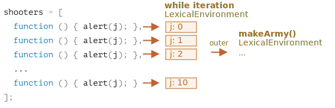

让我们检查一下 `makeArmy` 内部到底发生了什么，那样答案就显而易见了。

1. 它创建了一个空数组 `shooters`：

    ```js
    let shooters = [];
    ```
2. 在循环中，通过 `shooters.push(function)` 用函数填充它。

    每个元素都是函数，所以数组看起来是这样的：

    ```js no-beautify
    shooters = [
      function () { alert(i); },
      function () { alert(i); },
      function () { alert(i); },
      function () { alert(i); },
      function () { alert(i); },
      function () { alert(i); },
      function () { alert(i); },
      function () { alert(i); },
      function () { alert(i); },
      function () { alert(i); }
    ];
    ```

3. 该数组返回自函数。

    然后，对数组中的任意数组项的调用，例如调用 `army[5]()`（它是一个函数），将首先从数组中获取元素 `army[5]()` 并调用它。

    那么，为什么所有此类函数都显示的是相同的值，`10` 呢？

    这是因为 `shooter` 函数内没有局部变量 `i`。当一个这样的函数被调用时，`i` 是来自于外部词法环境的。

    那么，`i` 的值是什么呢？

    如果我们看一下源代码：

    ```js
    function makeArmy() {
      ...
      let i = 0;
      while (i < 10) {
        let shooter = function() { // shooter 函数
          alert( i ); // 应该显示它自己的编号
        };
        shooters.push(shooter); // 将 shooter 函数添加到该数组中
          i++;
      }
      ...
    }
    ```

    ……我们可以看到，所有的 `shooter` 函数都是在 `makeArmy()` 的词法环境中被创建的。但当 `army[5]()` 被调用时，`makeArmy` 已经运行完了，最后 `i` 的值为 `10`（`while` 循环在 `i=10` 时停止）。

    因此，所有的 `shooter` 函数获得的都是外部词法环境中的同一个值，即最后的 `i=10`。

    

    正如你在上边所看到的那样，在 `while {...}` 块的每次迭代中，都会创建一个新的词法环境。因此，要解决此问题，我们可以将 `i` 的值复制到 `while {...}` 块内的变量中，如下所示：

    ```js run
    function makeArmy() {
      let shooters = [];
    
      let i = 0;
      while (i < 10) {
        *!*
          let j = i;
        */!*
          let shooter = function() { // shooter 函数
            alert( *!*j*/!* ); // 应该显示它自己的编号
          };
        shooters.push(shooter);
        i++;
      }
    
      return shooters;
    }
    
    let army = makeArmy();
    
    // 现在代码正确运行了
    army[0](); // 0
    army[5](); // 5
    ```

    在这里，`let j = i` 声明了一个“局部迭代”变量 `j`，并将 `i` 复制到其中。原始类型是“按值”复制的，因此实际上我们得到的是属于当前循环迭代的独立的 `i` 的副本。

    shooter 函数正确运行了，因为 `i` 值的位置更近了（译注：指转到了更内部的词法环境）。不是在 `makeArmy()` 的词法环境中，而是在与当前循环迭代相对应的词法环境中：

    

    如果我们一开始使用 `for` 循环，也可以避免这样的问题，像这样：

    ```js run demo
    function makeArmy() {
    
      let shooters = [];
    
    *!*
      for(let i = 0; i < 10; i++) {
    */!*
        let shooter = function() { // shooter 函数
          alert( i ); // 应该显示它自己的编号
        };
        shooters.push(shooter);
      }
    
      return shooters;
    }
    
    let army = makeArmy();
    
    army[0](); // 0
    army[5](); // 5
    ```

    这本质上是一样的，因为 `for` 循环在每次迭代中，都会生成一个带有自己的变量 `i` 的新词法环境。因此，在每次迭代中生成的 `shooter` 函数引用的都是自己的 `i`。

    

至此，你已经花了很长时间来阅读本文，发现最终的解决方案就这么简单 — 使用 `for` 循环，你可能会疑问 —— 我花了这么长时间读这篇文章，值得吗？

其实，如果你可以轻松地明白并答对本题目，你应该就不会阅读它的答案。所以，希望这个题目可以帮助你更好地理解闭包。

此外，确实存在有些人相较于 `for` 更喜欢 `while`，以及其他情况。
