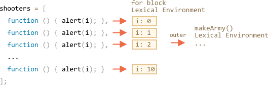

如果让我们看一下 `makeArmy` 内做了些什么，那么解答就会变得显而易见。

1. 它创建了一个空数组 `shooters`：

    ```js
    let shooters = [];
    ```
2. 在循环中，通过 `shooters.push(function...)` 填充它（数组）。

    每个元素都是函数，所以数组看起来是这样的：

    ```js no-beautify
    shooters = [
      function () { alert(i); },
      function () { alert(i); },
      function () { alert(i); },
      function () { alert(i); },
      function () { alert(i); },
      function () { alert(i); },
      function () { alert(i); },
      function () { alert(i); },
      function () { alert(i); },
      function () { alert(i); }
    ];
    ```

3. 该数组返回自函数。

随后，`army[5]()` 从数组中获得元素 `army[5]`（函数）并调用。

为什么现在全部的函数都显示一样呢？

这是因为 `shooter` 函数内没有局部变量 `i`。当调用一个这样的函数时，`i` 是来自于外部词法环境的。

`i` 的值是什么呢？

如果我们查看一下源头：

```js
function makeArmy() {
  ...
  let i = 0;
  while (i < 10) {
    let shooter = function() { // shooter 函数
      alert( i ); // 应该显示它自己的数字
    };
    ...
  }
  ...
}
```

...我们可以看到它存在于当前 `makeArmy()` 运行相关的词法环境中。但调用 `army[5]()` 时，`makeArmy` 已经完成它的工作，`i` 已经为结束的值：`10`（`while` 结束后）。

作为结果，所有的 `shooter` 都是从外部词法环境获得同样一个值最后的 `i=10`。

<<<<<<< HEAD
修改起来是很简单的：
=======
We can fix it by moving the variable definition into the loop:
>>>>>>> 6bbe0b4313a7845303be835d632ef8e5bc7715cd

```js run demo
function makeArmy() {

  let shooters = [];

*!*
  for(let i = 0; i < 10; i++) {
*/!*
    let shooter = function() { // shooter 函数
      alert( i ); // 应该显示它自己的数字
    };
    shooters.push(shooter);
  }

  return shooters;
}

let army = makeArmy();

army[0](); // 0
army[5](); // 5
```

<<<<<<< HEAD
现在正常工作了，因为`for (..) {...}` 内的代码块每次执行都会创建一个新的词法环境，其中具有对应的 `i` 的值。

所以，现在 `i` 值的距离（显示数字的地方更近了。现在它不是在 `makeArmy()` 词法环境中，而是在对应的当前循环迭代的词法环境中。`shooter` 从它创建的位置获得值。
=======
Now it works correctly, because every time the code block in `for (let i=0...) {...}` is executed, a new Lexical Environment is created for it, with the corresponding variable `i`.

So, the value of `i` now lives a little bit closer. Not in `makeArmy()` Lexical Environment, but in the Lexical Environment that corresponds the current loop iteration. That's why now it works.
>>>>>>> 6bbe0b4313a7845303be835d632ef8e5bc7715cd



这里我们把 `while` 改写为了 `for`。

其他技巧也是可以的，让我们了解一下，以便让我们更好地理解这个问题：

```js run
function makeArmy() {
  let shooters = [];

  let i = 0;
  while (i < 10) {
*!*
    let j = i;
*/!*
    let shooter = function() { // shooter 函数
      alert( *!*j*/!* ); // 应该显示它自己的数字
    };
    shooters.push(shooter);
    i++;
  }

  return shooters;
}

let army = makeArmy();

army[0](); // 0
army[5](); // 5
```

`while` 和 `for` 循环差不多，每次运行都会创建了一个新的词法环境。所以在这里它能确保 `shooter` 能获得正确的值。

我们复制 `let j = i`。复制 `i` 的值给循环体内的局部（变量）`j`。基本值是按值传递的，所以实际上，我们获得了属于当前循环迭代的完全独立的副本 `i`。
