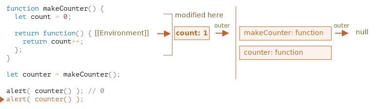

# 变量作用域

JavaScript 是一种非常面向函数的语言。它给了我们很大的自由度。在 JavaScript 中，我们可以动态创建函数，可以将函数作为参数传递给另一个函数，并在完全不同的代码位置进行调用。

我们已经知道函数可以访问其外部的变量。

现在，让我们扩展知识，来看看更复杂的场景。

```smart header="我们将在这探讨一下 `let/const`"
在 JavaScript 中，有三种声明变量的方式：`let`，`const`（现代方式），`var`（过去留下来的方式）。

- 在本文的示例中，我们将使用 `let` 声明变量。
- 用 `const` 声明的变量的行为也相同（译注：与 `let` 在作用域等特性上是相同的），因此，本文也涉及用 `const` 进行变量声明。
- 旧的 `var` 与上面两个有着明显的区别，我们将在 <info:var> 中详细介绍。
```

## 代码块

如果在代码块 `{...}` 内声明了一个变量，那么这个变量只在该代码块内可见。

例如：

```js run
{
  // 使用在代码块外不可见的局部变量做一些工作

  let message = "Hello"; // 只在此代码块内可见

  alert(message); // Hello
}

alert(message); // Error: message is not defined
```

我们可以使用它来隔离一段代码，该段代码执行自己的任务，并使用仅属于自己的变量：

```js run
{
  // 显示 message
  let message = "Hello";
  alert(message);
}

{
  // 显示另一个 message
  let message = "Goodbye";
  alert(message);
}
```

````smart header="这里如果没有代码块则会报错"
请注意，如果我们使用 `let` 对已存在的变量进行重复声明，如果对应的变量没有单独的代码块，则会出现错误：

```js run
// 显示 message
let message = "Hello";
alert(message);

// 显示另一个 message
*!*
let message = "Goodbye"; // Error: variable already declared
*/!*
alert(message);
```
````

对于 `if`，`for` 和 `while` 等，在 `{...}` 中声明的变量也仅在内部可见：

```js run
if (true) {
  let phrase = "Hello!";

  alert(phrase); // Hello!
}

alert(phrase); // Error, no such variable!
```

在这儿，当 `if` 执行完毕，则下面的 `alert` 将看不到 `phrase`，因此会出现错误。（译注：就算下面的 `alert` 想在 `if` 没执行完成时去取 `phrase`（虽然这种情况不可能发生）也是取不到的，因为 `let` 声明的变量在代码块外不可见。）

太好了，因为这就允许我们创建特定于 `if` 分支的块级局部变量。

对于 `for` 和 `while` 循环也是如此：

```js run
for (let i = 0; i < 3; i++) {
  // 变量 i 仅在这个 for 循环的内部可见
  alert(i); // 0，然后是 1，然后是 2
}

alert(i); // Error, no such variable
```

从视觉上看，`let i` 位于 `{...}` 之外。但是 `for` 构造在这里很特殊：在其中声明的变量被视为块的一部分。

## 嵌套函数

当一个函数是在另一个函数中创建的时，那么该函数就被称为“嵌套”的。

在 JavaScript 中很容易实现这一点。

我们可以使用嵌套来组织代码，比如这样：

```js
function sayHiBye(firstName, lastName) {

  // 辅助嵌套函数使用如下
  function getFullName() {
    return firstName + " " + lastName;
  }

  alert( "Hello, " + getFullName() );
  alert( "Bye, " + getFullName() );

}
```

这里创建的 **嵌套** 函数 `getFullName()` 是为了更加方便。它可以访问外部变量，因此可以返回全名。嵌套函数在 JavaScript 中很常见。

更有意思的是，可以返回一个嵌套函数：作为一个新对象的属性或作为结果返回。之后可以在其他地方使用。不论在哪里调用，它仍然可以访问相同的外部变量。

下面的 `makeCounter` 创建来一个 "counter" 函数，该函数在每次调用时返回下一个数字：

```js run
function makeCounter() {
  let count = 0;

  return function() {
    return count++;
  };
}

let counter = makeCounter();

alert( counter() ); // 0
alert( counter() ); // 1
alert( counter() ); // 2
```

尽管很简单，但稍加变型就具有很强的实际用途，比如，用作 [随机数生成器](https://en.wikipedia.org/wiki/Pseudorandom_number_generator) 以生成用于自动化测试的随机数值。

这是如何运作的呢？如果我们创建多个计数器，它们会是独立的吗？这里的变量是怎么回事？

理解这些内容对于掌握 JavaScript 的整体知识很有帮助，并且对于应对更复杂的场景也很有益处。因此，让我们继续深入探究。

## 词法环境

```warn header="这是龙！"
深入的技术讲解就在下面。

尽管我很想避免编程语言的一些底层细节，但是如果没有这些细节，它们就是不完整的，所以请准备开始学习吧！
```

为了使内容更清晰，这里将分步骤进行讲解。

### Step 1. 变量

在 JavaScript 中，每个运行的函数，代码块 `{...}` 以及整个脚本，都有一个被称为 **词法环境（Lexical Environment）** 的内部（隐藏）的关联对象。

词法环境对象由两部分组成：

1. **环境记录（Environment Record）** —— 一个存储所有局部变量作为其属性（包括一些其他信息，例如 `this` 的值）的对象。
2. 对 **外部词法环境** 的引用，与外部代码相关联。

一个“变量”只是 **环境记录** 这个特殊的内部对象的一个属性。“获取或修改变量”意味着“获取或修改词法环境的一个属性”。

举个例子，这段没有函数的简单的代码中只有一个词法环境：


这就是所谓的与整个脚本相关联的 **全局** 词法环境。

在上面的图片中，矩形表示环境记录（变量存储），箭头表示外部引用。全局词法环境没有外部引用，所以箭头指向了 `null`。

随着代码开始并继续运行，词法环境发生了变化。

这是更长的代码：


右侧的矩形演示了执行过程中全局词法环境的变化：

1. 当脚本开始运行，词法环境预先填充了所有声明的变量。
    - 最初，它们处于“未初始化（Uninitialized）”状态。这是一种特殊的内部状态，这意味着引擎知道变量，但是不允许在 `let` 之前使用它。几乎就像变量不存在一样。
2. 然后 `let phrase` 定义出现了。它尚未被赋值，因此它的值为 `undefined`。从这一刻起，我们就可以使用变量了。
3. `phrase` 被赋予了一个值。
4. `phrase` 的值被修改。

现在看起来都挺简单的，是吧？

- 变量是特殊内部对象的属性，与当前正在执行的（代码）块/函数/脚本有关。
- 操作变量实际上是操作该对象的属性。

```smart header="词法环境是一个规范对象"
“词法环境”是一个规范对象（specification object）：它仅仅是存在于 [编程语言规范](https://tc39.es/ecma262/#sec-lexical-environments) 中的“理论上”存在的，用于描述事物如何运作的对象。我们无法在代码中获取该对象并直接对其进行操作。

但 JavaScript 引擎同样可以优化它，比如清除未被使用的变量以节省内存和执行其他内部技巧等，但显性行为应该是和上述的无差。
```

### Step 2. 函数声明

一个函数其实也是一个值，就像变量一样。

**不同之处在于函数声明的初始化会被立即完成。**

当创建了一个词法环境（Lexical Environment）时，函数声明会立即变为即用型函数（不像 `let` 那样直到声明处才可用）。

这就是为什么我们可以在（函数声明）的定义之前调用函数声明。

例如，这是添加一个函数时全局词法环境的初始状态：


正常来说，这种行为仅适用于函数声明，而不适用于我们将函数分配给变量的函数表达式，例如 `let say = function(name)...`。

### Step 3. 内部和外部的词法环境

在一个函数运行时，在调用刚开始时，会自动创建一个新的词法环境以存储这个调用的局部变量和参数。

例如，对于 `say("John")`，它看起来像这样（当前执行位置在箭头标记的那一行上）：

<!--
    ```js
    let phrase = "Hello";

    function say(name) {
     alert( `${phrase}, ${name}` );
    }

    say("John"); // Hello, John
    ```-->


在这个函数调用期间，我们有两个词法环境：内部一个（用于函数调用）和外部一个（全局）：

- 内部词法环境与 `say` 的当前执行相对应。它具有一个单独的属性：`name`，函数的参数。我们调用的是 `say("John")`，所以 `name` 的值为 `"John"`。
- 外部词法环境是全局词法环境。它具有 `phrase` 变量和函数本身。

内部词法环境引用了 `outer`。

**当代码要访问一个变量时 —— 首先会搜索内部词法环境，然后搜索外部环境，然后搜索更外部的环境，以此类推，直到全局词法环境。**

如果在任何地方都找不到这个变量，那么在严格模式下就会报错（在非严格模式下，为了向下兼容，给未定义的变量赋值会创建一个全局变量）。

在这个示例中，搜索过程如下：

- 对于 `name` 变量，当 `say` 中的 `alert` 试图访问 `name` 时，会立即在内部词法环境中找到它。
- 当它试图访问 `phrase` 时，然而内部没有 `phrase`，所以它顺着对外部词法环境的引用找到了它。


### Step 4. 返回函数

Let's return to the `makeCounter` example.

```js
function makeCounter() {
  let count = 0;

  return function() {
    return count++;
  };
}

let counter = makeCounter();
```

At the beginning of each `makeCounter()` call, a new Lexical Environment object is created, to store variables for this `makeCounter` run.

So we have two nested Lexical Environments, just like in the example above:


What's different is that, during the execution of `makeCounter()`, a tiny nested function is created of only one line: `return count++`. We don't run it yet, only create.

All functions remember the Lexical Environment in which they were made. Technically, there's no magic here: all functions have the hidden property named `[[Environment]]`, that keeps the reference to the Lexical Environment where the function was created:


So, `counter.[[Environment]]` has the reference to `{count: 0}` Lexical Environment. That's how the function remembers where it was created, no matter where it's called. The `[[Environment]]` reference is set once and forever at function creation time.

Later, when `counter()` is called, a new Lexical Environment is created for the call, and its outer Lexical Environment reference is taken from `counter.[[Environment]]`:


Now when the code inside `counter()` looks for `count` variable, it first searches its own Lexical Environment (empty, as there are no local variables there), then the Lexical Environment of the outer `makeCounter()` call, where finds it and changes.

**A variable is updated in the Lexical Environment where it lives.**

Here's the state after the execution:


If we call `counter()` multiple times, the `count` variable will be increased to `2`, `3` and so on, at the same place.

```smart header="Closure"
There is a general programming term "closure", that developers generally should know.

A [closure](https://en.wikipedia.org/wiki/Closure_(computer_programming)) is a function that remembers its outer variables and can access them. In some languages, that's not possible, or a function should be written in a special way to make it happen. But as explained above, in JavaScript, all functions are naturally closures (there is only one exception, to be covered in <info:new-function>).

That is: they automatically remember where they were created using a hidden `[[Environment]]` property, and then their code can access outer variables.

When on an interview, a frontend developer gets a question about "what's a closure?", a valid answer would be a definition of the closure and an explanation that all functions in JavaScript are closures, and maybe a few more words about technical details: the `[[Environment]]` property and how Lexical Environments work.
```

## 垃圾收集

我们所讨论的词法环境和常规值都遵循同样的内存管理规则。

- 通常，在函数运行后词法环境会被清理。举个例子：

    ```js
    function f() {
      let value1 = 123;
      let value2 = 456;
    }

    f();
    ```

    这里的两个值都是词法环境的属性。但是在 `f()` 执行完后，该词法环境变成不可达，因此它在内存中已被清理。

- ...但是如果有一个嵌套函数在 `f` 结束后仍可达，那么它的 `[[Environment]]` 引用会继续保持着外部词法环境存在：

    ```js
    function f() {
      let value = 123;

      function g() { alert(value); }

    *!*
      return g;
    */!*
    }

    let g = f(); // g 是可达的，并且将其外部词法环境保持在内存中
    ```

- 请注意如果多次调用 `f()`，返回的函数被保存，那么其对应的词法对象同样也会保留在内存中。下面代码中有三个这样的函数：

    ```js
    function f() {
      let value = Math.random();

      return function() { alert(value); };
    }

    // 数组中的三个函数，每个都有词法环境相关联。
    // 来自对应的 f() 
    //         LE   LE   LE
    let arr = [f(), f(), f()];
    ```

- 词法环境对象在变成不可达时会被清理：当没有嵌套函数引用（它）时。在下面的代码中，在 `g` 变得不可达后，`value` 同样会被从内存中清除；

    ```js
    function f() {
      let value = 123;

      function g() { alert(value); }

      return g;
    }

    let g = f(); // 当 g 存在时
    // 对应的词法环境可达

    g = null; // ...在内存中被清理
    ```

### 实际的优化

正如我们所了解的，理论上当函数可达时，它外部的所有变量都将存在。

但实际上，JavaScript 引擎会试图优化它。它们会分析变量的使用情况，如果有变量没被使用的话它也会被清除。

**V8（Chrome、Opera）的一个重要副作用是这样的变量在调试是无法访问的。**

打开 Chrome 浏览器的开发者工具运行下面的代码。

当它暂停时，在控制台输入 `alert(value)`。

```js run
function f() {
  let value = Math.random();

  function g() {
    debugger; // 在控制台中输入 alert( value );没有该值！
  }

  return g;
}

let g = f();
g();
```

正如你所见的 ———— 没有该值！理论上，它应该是可以访问的，但引擎对此进行了优化。

这可能会导致有趣的调试问题。其中之一 —— 我们可以看到的是一个同名的外部变量，而不是预期的变量：

```js run global
let value = "Surprise!";

function f() {
  let value = "the closest value";

  function g() {
    debugger; // 在控制台中：输入 alert( value )；Surprise!
  }

  return g;
}

let g = f();
g();
```

```warn header="再见！"
V8 的这个特性了解一下也不错。如果用 Chrome/Opera 调试的话，迟早你会遇到。

这并不是调试器的 bug ，而是 V8 的一个特别的特性。或许以后会进行修改。
你可以经常运行本页的代码来进行检查（这个特性）。
```


```smart header="一次调用 —— 一个词法环境"
请记住，每次函数运行会都会创建一个新的函数词法环境。

如果一个函数被调用多次，那么每次调用也都会此创建一个拥有指定局部变量和参数的词法环境。
```


当内部函数运行时，`count++` 会由内到外搜索该变量。在上面的例子中，步骤应该是：


1. 内部函数的本地。
2. 外部函数的变量。
3. 以此类推直到到达全局变量。

在这个例子中，`count` 在第二步中被找到。当外部变量被修改时，在找到它的地方被修改。因此 `count++` 找到该外部变量并在它从属的词法环境中进行修改。好像我们有 `let count = 1` 一样。

这里有两个要考虑的问题：

1. 我们可以用某种方式在 `makeCounter` 以外的代码中改写 `counter` 吗？比如，在上例中的 `alert` 调用后。
2. 如果我们多次调用 `makeCounter()` —— 它会返回多个 `counter` 函数。它们的 `count` 是独立的还是共享的同一个呢？

在你继续读下去之前，请先回答这些问题。

...

想清楚了吗？

好吧，我们来重复一下答案。

1. 这是不可能做到的。`counter` 是一个局部函数的变量，我们不能从外部访问它。
2. `makeCounter()` 的每次调用都会创建一个拥有独立 `counter` 的新词法环境。因此得到的 `counter` 是独立的。

下面是一个例子：

```js run
function makeCounter() {
  let count = 0;
  return function() {
    return count++;
  };
}

let counter1 = makeCounter();
let counter2 = makeCounter();

alert( counter1() ); // 0
alert( counter1() ); // 1

alert( counter2() ); // 0 （独立的）
```


希望现在你对外部变量的情况相当清楚了。但对于更复杂的情况，可能需要更深入的理解。所以让我们更加深入吧。


2. 函数 `makeWorker` 生成并返回另一个函数。这个新的函数可以在其他位置进行调用。它访问的是创建位置还是调用位置的外部变量呢，还是都可以？

    ```js
    function makeWorker() {
      let name = "Pete";

      return function() {
        alert(name);
      };
    }

    let name = "John";

    // 创建一个函数
    let work = makeWorker();

    // call it
    *!*
    work(); // 它显示的是什么呢？"Pete"（创建位置的 name）还是"John"（调用位置的 name）呢？
    */!*
    ```


## 环境详情

现在你大概已经了解闭包的工作原理了，我们可以探讨一下实际问题了。

以下是 `makeCounter` 的执行过程，遵循它确保你理解所有的内容。请注意我们还没有介绍另外的 `[[Environment]]` 属性。

1. 在脚本开始时，只存在全局词法环境：

    

    在开始时里面只有一个 `makeCounter` 函数，因为它是一个函数声明。它还没有执行。

    所有的函数在『诞生』时都会根据创建它的词法环境获得隐藏的 `[[Environment]]` 属性。我们还没有讨论到它，但这是函数知道它是在哪里被创建的原因。

    在这里，`makeCounter` 创建于全局词法环境，那么 `[[Environment]]` 中保留了它的一个引用。

    换句话说，函数会被创建处的词法环境引用『盖章』。隐藏函数属性 `[[Environment]]` 中有这个引用。

2. 代码执行，`makeCounter()` 被执行。下图是当 `makeCounter()` 内执行第一行瞬间的快照：

    

    在 `makeCounter()` 执行时，包含其变量和参数的词法环境被创建。

    词法环境中存储着两个东西：
    1. 一个是环境记录，它保存着局部变量。在我们的例子中 `count` 是唯一的局部变量（当执行到 `let count` 这一行时出现）。
    2. 另外一个是外部词法环境的引用，它被设置为函数的 `[[Environment]]` 属性。这里 `makeCounter` 的 `[[Environment]]` 属性引用着全局词法环境。

    所以，现在我们有了两个词法环境：第一个是全局环境，第二个是 `makeCounter` 的词法环境，它拥有指向全局环境的引用。

3. 在 `makeCounter()` 的执行中，创建了一个小的嵌套函数。

    不管是使用函数声明或是函数表达式创建的函数都没关系，所有的函数都有 `[[Environment]]` 属性，该属性引用着所创建的词法环境。新的嵌套函数同样也拥有这个属性。

    我们新的嵌套函数的 `[[Environment]]` 的值就是 `makeCounter()` 的当前词法环境（创建的位置）。

    

    请注意在这一步中，内部函数并没有被立即调用。 `function() { return count++; }` 内的代码还没有执行，我们要返回它。

4. 随着执行的进行，`makeCounter()` 调用完成，并且将结果（该嵌套函数）赋值给全局变量 `counter`。

    

    这个函数中只有 `return count++` 这一行代码，当我们运行它时它会被执行。

5. 当 `counter()` 执行时，它会创建一个『空』的词法环境。它本身没有局部变量，但是 `counter` 有 `[[Environment]]` 作为其外部引用，所以它可以访问前面创建的 `makeCounter()` 函数的变量。

    

    如果它要访问一个变量，它首先会搜索它自身的词法环境（空），然后是前面创建的 `makeCounter()` 函数的词法环境，然后才是全局环境。

    当它搜索 `count` ，它会在最近的外部词法环境 `makeCounter` 的变量中找到它。

    请注意这里的内存管理工作机制。虽然 `makeCounter()` 执行已经结束，但它的词法环境仍保存在内存中，因为这里仍然有一个嵌套函数的 `[[Environment]]` 在引用着它。

    通常，只要有一个函数会用到该词法环境对象，它就不会被清理。并且只有没有（函数）会用到时，才会被清除。

6. `counter()` 函数不仅会返回 `count` 的值，也会增加它。注意修改是『就地』完成的。准确地说是在找到 `count` 值的地方完成的修改。

    

    因此，上一步只有一处不同 —— `count` 的新值。下面的调用也是同理。

7. 下面 `counter()` 的调用也是同理。

本章开头问题的答案应该已经是显而易见了。

下面代码中的 `work()` 函数通过外部词法环境引用使用到来自原来位置的 `name`。


所以，这里的结果是 `"Pete"`。

但如果 `makeWorker()` 中没有 `let name` 的话，那么搜索会进行到外部，直到到达链未的全局环境。在这个例子，它应该会变成 `"John"`。

```smart header="闭包"
开发者应该有听过『闭包』这个编程术语。

函数保存其外部的变量并且能够访问它们称之为[闭包](https://en.wikipedia.org/wiki/Closure_(computer_programming))。在某些语言中，是没有闭包的，或是以一种特别方式来实现。但正如上面所说的，在 JavaScript 中函数都是天生的闭包（只有一个例外，请参考 <info:new-function>）。

也就是说，他们会通过隐藏的 `[[Environment]]` 属性记住创建它们的位置，所以它们都可以访问外部变量。

在面试时，前端通常都会被问到『什么是闭包』，正确的答案应该是闭包的定义并且解释 JavaScript 中所有函数都是闭包，以及可能的关于 `[[Environment]]` 属性和词法环境原理的技术细节。
```

## 代码块和循环、IIFE

上面的例子都集中于函数。但对于 `{...}` 代码块，词法环境同样也是存在的

当代码块中包含块级局部变量并运行时，会创建词法环境。这里有几个例子。

## If

在上面的例子中，当代码执行入 `if` 块，新的 "if-only" 词法环境就会为此而创建：

<!--
    ```js run
    let phrase = "Hello";
    
    if (true) {
        let user = "John";

        alert(`${phrase}, ${user}`); // Hello, John
    }

    alert(user); // 错误，无法访问该变量！
    ```-->


新的词法环境是封闭的作为其外部引用，所以可以找到 `phrase`。但在 `if` 内声明的变量和函数表达式都保留在该词法环境中，从外部是无法被访问到的。

例如，在 `if` 结束后，下面的 `alert` 是访问不到 `user` 的，因为会发生错误。

## For, while

对于循环而言，每次迭代都有独立的词法环境。如果在 `for` 循环中声明变量，那么它在词法环境中是局部的：

```js run
for (let i = 0; i < 10; i++) {
  // 每次循环都有其自身的词法环境
  // {i: value}
}

alert(i); // 错误，没有该变量
```

这实际上是个意外，因为 `let i` 看起来好像是在 `{...}` 外。但事实上，每一次循环执行都有自己的词法环境，其中包含着 `i`。

在循环结束后，`i` 是访问不到的。

### 代码块

我们也可以使用『空』的代码块将变量隔离到『局部作用域』中。

比如，在 Web 浏览器中，所有脚本都共享同一个全局环境。如果我们在一个脚本中创建一个全局变量，对于其他脚本来说它也是可用的。但是如果两个脚本有使用同一个变量并且相互覆盖，那么这会成为冲突的根源。

如果变量名是一个被广泛使用的词，并且脚本作者可能彼此也不知道。

如果我们要避免这个，我们可以使用代码块来隔离整个脚本或其中一部分：

```js run
{
  // 用局部变量完成一些不应该被外面访问的工作

  let message = "Hello";

  alert(message); // Hello
}

alert(message); // 错误：message 未定义
```

这是因为代码块有其自身的词法环境，块之外（或另一个脚本内）的代码访问不到代码块内的变量。

### IIFE

在旧的脚本中，我们可以找到一个所谓的『立即调用函数表达式』（简称为 IIFE）用于此目的。

它们看起来像这样：

```js run
(function() {

  let message = "Hello";

  alert(message); // Hello

})();
```

这里创建了一个函数表达式并立即调用。因此代码拥有自己的私有变量并立即执行。

函数表达式被括号 `(function {...})` 包裹起来，因为在 JavaScript 中，当代码流碰到 `"function"` 时，它会把它当成一个函数声明的开始。但函数声明必须有一个函数名，所以会导致错误：

```js run
// Error: Unexpected token (
function() { // <-- JavaScript 找不到函数名，遇到 ( 导致错误

  let message = "Hello";

  alert(message); // Hello

}();
```

我们可以说『好吧，让其变成函数声明，让我们增加一个名称』，但它是没有效果的。JavaScript 不允许立即调用函数声明。

```js run
// syntax error because of brackets below
function go() {

}(); // <-- can't call Function Declaration immediately
```

因此，需要使用圆括号告诉给 JavaScript，这个函数是在另一个表达式的上下文中创建的，因此它是一个表达式。它不需要函数名也可以立即调用。

在 JavaScript 中还有其他方式来定义函数表达式：

```js run
// 创建 IIFE 的方法

(function() {
  alert("Brackets around the function");
}*!*)*/!*();

(function() {
  alert("Brackets around the whole thing");
}()*!*)*/!*;

*!*!*/!*function() {
  alert("Bitwise NOT operator starts the expression");
}();

*!*+*/!*function() {
  alert("Unary plus starts the expression");
}();
```

在上面的例子中，我们声明一个函数表达式并立即调用：


