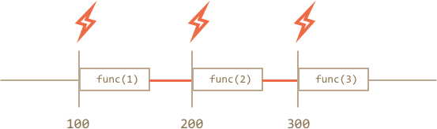

# 调度：setTimeout 和 setInterval

有时我们并不想立即执行一个函数，而是等待特定一段时间之后再执行，这种做法也叫“计划调用”。

目前有两种方式可以实现：

<<<<<<< HEAD
- `setTimeout` 将函数的执行推迟到一段时间之后再执行。
- `setInterval` 让函数间隔一定时间周期性执行。

这两个方法并不存在于 JavaScript 的规范中。但是大多数运行环境都有内置的调度器，而且也提供了这两个方法的实现。目前来讲，所有浏览器，包括 Node.js 都支持这两个方法。
=======
- `setTimeout` allows to run a function once after the interval of time.
- `setInterval` allows to run a function regularly with the interval between the runs.

These methods are not a part of JavaScript specification. But most environments have the internal scheduler and provide these methods. In particular, they are supported in all browsers and Node.js.
>>>>>>> 5e9eca374f644ea85c7d548bbe344fd30e5fb89d

## setTimeout

用法：

```js
let timerId = setTimeout(func|code, [delay], [arg1], [arg2], ...)
```

参数说明：

`func|code`
：想要执行的函数或代码字符串。
一般传入的都是函数，介于某些历史原因，代码字符串也支持，但是不建议使用这种方式。

`delay`
<<<<<<< HEAD
：执行前的延时，以毫秒为单位（1000 毫秒 = 1 秒）；
=======
: The delay before run, in milliseconds (1000 ms = 1 second), by default 0.
>>>>>>> 5e9eca374f644ea85c7d548bbe344fd30e5fb89d

`arg1`，`arg2`...
：要传入被执行函数（或代码字符串）的参数列表（IE9 以下不支持）

在下面这个示例中，`sayHi()` 方法会在 1 秒后执行：

```js run
function sayHi() {
  alert('Hello');
}

*!*
setTimeout(sayHi, 1000);
*/!*
```

带参数的情况：

```js run
function sayHi(phrase, who) {
  alert( phrase + ', ' + who );
}

*!*
setTimeout(sayHi, 1000, "Hello", "John"); // Hello, John
*/!*
```

如果第一个参数位传入的是字符串，JavaScript 会自动为其创建一个函数。

所以这么写也是可以的：

```js run no-beautify
setTimeout("alert('Hello')", 1000);
```

但是，毕竟这种方式并不推崇，所以建议还是用函数格式：

```js run no-beautify
setTimeout(() => alert('Hello'), 1000);
```

````smart header="要函数，但不要执行函数"
新手有时候会误将一对括号 `()` 加在函数后面：

```js
// 这样是不对的！
setTimeout(sayHi(), 1000);
```
<<<<<<< HEAD
为什么不行呢，因为 `setTimeout` 需要的是函数的引用。而这里的 `sayHi()` 很明显是在执行函数，所以实际上传入 `setTimeout` 的是**函数的执行结果**。在这个例子中，`sayHi()` 的执行结果是 `undefined`（也就是说函数没有返回任何结果），所以实际上什么也没有调度。
=======
That doesn't work, because `setTimeout` expects a reference to a function. And here `sayHi()` runs the function, and the *result of its execution* is passed to `setTimeout`. In our case the result of `sayHi()` is `undefined` (the function returns nothing), so nothing is scheduled.
>>>>>>> 5e9eca374f644ea85c7d548bbe344fd30e5fb89d
````

### 用 clearTimeout 来取消调度

`setTimeout` 在调用时会返回一个“定时器 id”—— 例子中为变量 `timerId` 持有，接下来用它取消调度。

取消调度的语法：

```js
let timerId = setTimeout(...);
clearTimeout(timerId);
```

在下面的代码中，我们对一个函数进行了调度，紧接着取消了这次调度（中途反悔了）。所以最后什么也没发生：

```js run no-beautify
let timerId = setTimeout(() => alert("never happens"), 1000);
alert(timerId); // 定时器 id

clearTimeout(timerId);
alert(timerId); // 还是那个 id 没变（并没有因为调度被取消了而变成 null）
```

<<<<<<< HEAD
从 `alert` 的输出来看，定时器 id 在浏览器中是一串数字，然而在其他运行环境下可能是别的东西。就比如 Node.js 返回的是一个定时器对象，这个对象包含一系列方法。
=======
As we can see from `alert` output, in a browser the timer identifier is a number. In other environments, this can be something else. For instance, Node.js returns a timer object with additional methods.
>>>>>>> 5e9eca374f644ea85c7d548bbe344fd30e5fb89d

我再重申一遍，这俩方法没有统一的规范定义，但也无伤大雅。

针对浏览器环境，定时器在 HTML5 的标准中有详细描述，详见 [timers section](https://www.w3.org/TR/html5/webappapis.html#timers)。

## setInterval

`setInterval` 方法和 `setTimeout` 的用法是相同的：

```js
let timerId = setInterval(func|code, [delay], [arg1], [arg2], ...)
```

所有参数的意义也是相同的，不过相对于 `setTimeout` 只执行一次，`setInterval` 是每间隔一定时间周期性执行。

想要阻止后续调用，我们需要调用 `clearInterval(timerId)`。

下面的例子中，每间隔 2 秒就会输出一条消息。5 秒之后，输出停止：

```js run
// 每 2 秒重复一次
let timerId = setInterval(() => alert('tick'), 2000);

// 5 秒之后停止
setTimeout(() => { clearInterval(timerId); alert('stop'); }, 5000);
```

<<<<<<< HEAD
```smart header="弹窗会让 Chrome/Opera/Safari 内的时钟停止"
在众多浏览器中，IE 和 Firefox 在显示 `alert/confirm/prompt` 时，内部的定时器仍旧会继续滴答，但是在 Chrome、Opera 和 Safari 中，内部的定时器会暂停/冻结。

所以，在执行以上代码时，如果在一定时间内没有关掉 `alert` 弹窗，那么在你关闭弹窗后，Firefox/IE 会立即显示下一个 `alert` 弹窗（前提是距离上一次执行超过了 2 秒），而 Chrome/Opera/Safari 这三个则需要再等待 2 秒以上的时间才会再显示（因为在 `alert` 弹窗期间，定时器并没有滴答）。
=======
```smart header="Time goes on while `alert` is shown"
In most browsers, including Chrome and Firefox the internal timer continues "ticking" while showing `alert/confirm/prompt`.

So if you run the code above and don't dismiss the `alert` window for some time, then in the next `alert` will be shown immediately as you do it. The actual interval between alerts will be shorter than 5 seconds.
>>>>>>> 5e9eca374f644ea85c7d548bbe344fd30e5fb89d
```

## 递归版 setTimeout

周期性调度有两种方式。

一种是使用 `setInterval`，另外一种就是递归版的 `setTimeout`，就像这样：

```js
/** 这是一种：
let timerId = setInterval(() => alert('tick'), 2000);
*/

let timerId = setTimeout(function tick() {
  alert('tick');
*!*
  timerId = setTimeout(tick, 2000); // (*)
*/!*
}, 2000);
```

`setTimeout` 在这一次函数执行完时，立即安排下一次调用 `(*)`。

递归版的 `setTimeout` 其实要比 `setInterval` 灵活的多，采用这种方式可以根据当前执行结果来安排下一次调用。

譬如，我们要实现一个服务，每间隔 5 秒向服务器请求数据，如果服务器过载了，那么就要降低请求频率，比如将间隔增加到 10, 20, 40 秒等。

以下是伪代码：
```js
let delay = 5000;

let timerId = setTimeout(function request() {
  ...send request...

  if (request failed due to server overload) {
    // 下一次执行的间隔是当前的 2 倍
    delay *= 2;
  }

  timerId = setTimeout(request, delay);

}, delay);
```


<<<<<<< HEAD
如果不时有一些占用 CPU 的任务，我们可以通过衡量执行时间来安排下次调用是应该提前还是推迟。
=======
And if we the functions that we're scheduling are CPU-hungry, then we can measure the time taken by the execution and plan the next call sooner or later.
>>>>>>> 5e9eca374f644ea85c7d548bbe344fd30e5fb89d

**递归版 `setTimeout` 能保证每次执行间的延时都是准确的，`setInterval` 却不能够。**

下面来比较两段代码，一个是用 `setInterval`：

```js
let i = 1;
setInterval(function() {
  func(i);
}, 100);
```

另一个用递归版 `setTimeout`：

```js
let i = 1;
setTimeout(function run() {
  func(i);
  setTimeout(run, 100);
}, 100);
```

对 `setInterval` 而言，内部的调度器会每间隔 100 毫秒执行一次 `func(i)`：



注意到了？

**使用 `setInterval` 时，`func` 函数的实际调用间隔要比代码给出的间隔时间要短**

这也是无可厚非，因为 `func` 的执行时间抵消掉了一部分间隔时间。

还有一种可能，如果 `func` 的执行时间超出了 100 毫秒呢？

这时候，JavaScript 引擎会等待 `func` 执行完，然后向调度器询问是否时间已到，如果是，那么**立马**再执行一次

极端情况下，如果函数每次执行时间都超过 `delay` 设置的时间，那么每次调用之间将毫无停顿。

再来看递归版 `setTimeout`：


**递归的 `setTimeout` 就能确保延时的固定（这里用的是 100 毫秒）。**

这是因为下一次调用是在前一次调用完成时再调度的。

````smart header="垃圾回收"
当一个函数传入 `setInterval/setTimeout` 时，内部会为其创建一个引用，保存在调度器中。这样，即使这个函数没有被引用，也能防止垃圾回收器（GC）将其回收。

```js
// 在调度器调用这个函数之前，这个函数将一直存在于内存中
setTimeout(function() {...}, 100);
```

对于 `setInterval`，传入的函数也是存在于内存中，直到 `clearInterval` 被调用。

这里还要提到一个副作用。如果函数引用了外部变量（译者注：闭包），那么只要这个函数还存活着，外部变量也会随之存活，这样就可能会占用多于方法自身所需要的内存。所以，如果某个函数不需要再被调度，即使是个很小的函数，最好也将其取消。
````

## Zero delay setTimeout

<<<<<<< HEAD
还有一种特殊的用法：`setTimeout(func, 0)`。
=======
There's a special use case: `setTimeout(func, 0)`, or just `setTimeout(func)`.
>>>>>>> 5e9eca374f644ea85c7d548bbe344fd30e5fb89d

这样调度可以让 `func` 尽快执行，但是只有在当前代码执行完后，调度器才会对其进行调用。

也就是说，函数是在刚好当前代码执行完后执行，换而言之，那就是**异步**。

下面例子中，代码会先输出 "Hello"，然后紧接着输出 "World"：

```js run
setTimeout(() => alert("World"));

alert("Hello");
```

第一行代码“将调用安排到日程 0 毫秒处”，但是调度器只有在当前代码执行完毕时才会去“检查日程”，所以 `"Hello"` 先输出，然后才输出 `"World"`。

<<<<<<< HEAD
### 分割 CPU 高占用的任务

下面讲一个用 `setTimeout` 分割 CPU 高占用任务的技巧。

譬如，一个语法高亮脚本（用来给示例代码着色）会占用非常大的 CPU 资源。为了给代码进行高亮显示，它首先要进行代码分析，然后创建一堆着色后的元素，再将其添加到页面文档中 —— 文本量很大时，耗费时间也会很长。有时候甚至会导致浏览器“挂起”，这种情况是显然不能接受的。

所以，我们不妨将长文本分割成几部分处理。首先处理前 100 行，然后用 `setTimeout(...,0)` 安排接下来 100 行的处理，以此类推。

为了方便理解，来考虑一个稍微简单点的例子。比如我们有个函数，从 `1` 数到 `1000000000`。

运行时，会观察到 CPU 挂起，服务器端 JS 表现的尤为明显。如果在浏览器下运行，试试点击页面的其他按钮，你会发现整个 JavaScript 的执行都暂停了，除非等这段代码运行完，否则什么也做不了。

```js run
let i = 0;

let start = Date.now();

function count() {

  // 执行一个耗时的任务
  for (let j = 0; j < 1e9; j++) {
    i++;
  }

  alert("Done in " + (Date.now() - start) + 'ms');
}

count();
```

机会好的话，浏览器还会显示“the script takes too long（页面脚本执行时间过长）”这样的警告（实际上不太可能，毕竟给的数字也不是特别大）。

下面用 `setTimeout` 分割任务：

```js run
let i = 0;

let start = Date.now();

function count() {

  // 先完成一部分任务(*)
  do {
    i++;
  } while (i % 1e6 != 0);

  if (i == 1e9) {
    alert("Done in " + (Date.now() - start) + 'ms');
  } else {
    setTimeout(count, 0); // 安排下一次任务 (**)
  }

}

count();
```

现在，浏览器的 UI 界面即使在“计数”正在进行的情况下也能正常工作了。

`(*)` 处代码是这么一步步完成任务的：

1. 第一次做：`i=1...1000000` 的计数。
2. 第二次做：`i=1000001..2000000` 的计数。
3. ...等等，其中 `while` 语句检查 `i` 是否刚好能被 `1000000` 整除。

如果任务还没完成，在代码 `(*)` 处安排下一次调用。

`count` 函数调用的间隙足以让 JavaScript 引擎“缓口气了”，（浏览器）趁这段时间可以对用户的操作作出回应。

用 `setTimeout` 进行分割和没用这两种做法在速度方面平分秋色，总的计数过程所花的时间几乎没什么差别。

为了进一步阐述，下面做一下改进。

将调度代码挪到 `count()` 函数开头位置：

```js run
let i = 0;

let start = Date.now();

function count() {

  // 现在将调度放在开头
  if (i < 1e9 - 1e6) {
    setTimeout(count, 0); // 安排下一次调用
  }

  do {
    i++;
  } while (i % 1e6 != 0);

  if (i == 1e9) {
    alert("Done in " + (Date.now() - start) + 'ms');
  }

}

count();
```

因为知道 `count()` 不会只执行一次，所以这一次在计数开始前就安排好下一次计数任务。

如果你自己跑一遍，会观察到这次的耗时要短上不少。

````smart header="浏览器内，嵌套定时器运行的最小延时"
在浏览器环境下，嵌套定时器的运行频率是受限制的。根据 [HTML5 标准](https://www.w3.org/TR/html5/webappapis.html#timers) 所言：“经过 5 重嵌套之后，定时器运行间隔强制要求至少达到 4 毫秒”。

下面用具体示例来阐述。其中 `setTimeout` 每次都在 `0ms` 后就再安排一次递归，每次调用都会在 `times` 数组中记录上一次调用的实际时间。所以，最终延时如何？下面来揭晓：
=======
There are also advanced browser-related use cases of zero-delay timeout, that we'll discuss in the chapter <info:event-loop>.

````smart header="Zero delay is in fact not zero (in a browser)"
In the browser, there's a limitation of how often nested timers can run. The [HTML5 standard](https://html.spec.whatwg.org/multipage/timers-and-user-prompts.html#timers) says: "after five nested timers, the interval is forced to be at least 4 milliseconds.".

Let's demonstrate what it means with the example below. The `setTimeout` call in it re-schedules itself with zero delay. Each call remembers the real time from the previous one in the `times` array. What do the real delays look like? Let's see:
>>>>>>> 5e9eca374f644ea85c7d548bbe344fd30e5fb89d

```js run
let start = Date.now();
let times = [];

setTimeout(function run() {
  times.push(Date.now() - start); // 保存上次调用的延时

<<<<<<< HEAD
  if (start + 100 < Date.now()) alert(times); // 100 毫秒之后，显示延时信息
  else setTimeout(run, 0); // 没超过 100 毫秒则再进行调度
}, 0);
=======
  if (start + 100 < Date.now()) alert(times); // show the delays after 100ms
  else setTimeout(run); // else re-schedule
});
>>>>>>> 5e9eca374f644ea85c7d548bbe344fd30e5fb89d

// 示例输出：
// 1,1,1,1,9,15,20,24,30,35,40,45,50,55,59,64,70,75,80,85,90,95,100
```

<<<<<<< HEAD
第一次，定时器是立即执行的（正如规范里所描述的那样），接下来延时就出现了，像 `9, 15, 20, 24...`。（译者注：这里作者没说清楚，timer 数组里存放的是每次定时器运行的时刻与 start 的差值，所以数字只会越来越大，实际上前后调用的延时是数组值的差值。示例中前几次都是 1，所以延时为 0）
=======
First timers run immediately (just as written in the spec), and then we see `9, 15, 20, 24...`. The 4+ ms obligatory delay between invocations comes into play.

The similar thing happens if we use `setInterval` instead of `setTimeout`: `setInterval(f)` runs `f` few times with zero-delay, and afterwards with 4+ ms delay.
>>>>>>> 5e9eca374f644ea85c7d548bbe344fd30e5fb89d

这个限制也是因为历史原因以及很多脚本都依赖于这个机制才得以存在至今。

<<<<<<< HEAD
服务端 JavaScript 就没这个限制了，而且除此之外还有其他办法来调度这种即时异步任务，例如 Node.JS 的 [process.nextTick](https://nodejs.org/api/process.html) 和 [setImmediate](https://nodejs.org/api/timers.html)。所以这个提醒也只是针对浏览器环境。
````

### 给浏览器渲染的机会

行间脚本还有个益处，可以用来向用户展示进度条等。因为浏览器在所有脚本执行完后，才会开始“重绘（repainting）”过程。

所以，如果运行一个非常耗时的函数，即便在这个函数中改变了文档内容，除非这个函数执行完，那么变化是不会立刻反映到页面上的。

以下是一个示例：
```html run
<div id="progress"></div>

<script>
  let i = 0;

  function count() {
    for (let j = 0; j < 1e6; j++) {
      i++;
      // 将当前 i 值放到 <div> 内
      // （innerHTML 在以后具体章节会讲到，这行代码看懂应该没问题）
      progress.innerHTML = i;
    }
  }

  count();
</script>
```

运行后会发现，`i` 值只在整个计数过程完成后才显示。

接下来用 `setTimeout` 对任务进行分割，这样就能在每一轮运行的间隙观察到变化了，效果要好得多：

```html run
<div id="progress"></div>

<script>
  let i = 0;

  function count() {

    // 每次只完成一部分 (*)
    do {
      i++;
      progress.innerHTML = i;
    } while (i % 1e3 != 0);

    if (i < 1e9) {
      setTimeout(count, 0);
    }

  }

  count();
</script>
```

现在就可以观察到 `<div>` 里 `i` 值的增长过程了。

## 总结

- `setInterval(func, delay, ...args)` 和 `setTimeout(func, delay, ...args)` 可以让 `func` 定期或经历一段延时后一次性执行。
- 要取消函数的执行需要调用 `clearInterval/clearTimeout`，只需将 `setInterval/setTimeout` 返回的值传入即可。
- 嵌套 `setTimeout` 比 `setInterval` 用起来更加灵活，同时也能保证每一轮执行的最小时间间隔。
- 0 延时调度 `setTimeout(...,0)` 用来安排在当前代码执行完时，需要尽快执行的函数。

`setTimeout(...,0)` 的一些用法示例：
- 将耗费 CPU 的任务分割成多块，这样脚本运行不会进入“挂起”状态。
- 进程繁忙时也能让浏览器抽身做其它事情（例如绘制进度条）。

有一点需要注意，所有的调度方法都不能**保证**延时的准确性，所以在调度代码中，万不可依赖它。
=======
For server-side JavaScript, that limitation does not exist, and there exist other ways to schedule an immediate asynchronous job, like [setImmediate](https://nodejs.org/api/timers.html) for Node.js. So this note is browser-specific.
````

## Summary

- Methods `setInterval(func, delay, ...args)` and `setTimeout(func, delay, ...args)` allow to run the `func` regularly/once after `delay` milliseconds.
- To cancel the execution, we should call `clearInterval/clearTimeout` with the value returned by `setInterval/setTimeout`.
- Nested `setTimeout` calls is a more flexible alternative to `setInterval`. Also they can guarantee the minimal time *between* the executions.
- Zero delay scheduling with `setTimeout(func, 0)` (the same as `setTimeout(func)`) is used to schedule the call "as soon as possible, but after the current code is complete".
- The browser limits the minimal delay for five or more nested call of `setTimeout` or for `setInterval` (after 5th call) to 4ms. That's for historical reasons.

Please note that all scheduling methods do not *guarantee* the exact delay. 
>>>>>>> 5e9eca374f644ea85c7d548bbe344fd30e5fb89d

浏览器内部的定时器会因各种原因而出现降速情况，譬如：
- CPU 过载。
- 浏览器页签切换到了后台模式。
- 笔记本电脑用的是电池供电（译者注：使用电池会以降低性能为代价提升续航）。

<<<<<<< HEAD
如果出现以上情况，定时器的最高精度（最高精确延时）可能会降到 300 毫秒，甚至是 1000 毫秒，具体以浏览器及其设置为准。
=======
All that may increase the minimal timer resolution (the minimal delay) to 300ms or even 1000ms depending on the browser and OS-level performance settings.
>>>>>>> 5e9eca374f644ea85c7d548bbe344fd30e5fb89d
