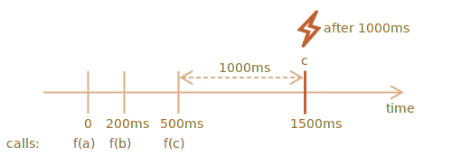

importance: 5

---

# 防抖装饰器

`debounce(f, ms)` 装饰器的结果是一个包装器，该包装器将暂停对 `f` 的调用，直到经过 `ms` 毫秒的非活动状态（没有函数调用，“冷却期”），然后使用最新的参数调用 `f` 一次。

换句话说，`debounce` 就像一个“接听电话”的秘书，并一直等到 `ms` 毫秒的安静时间之后，才将最新的呼叫信息传达给“老板”（调用实际的 `f`）。

举个例子，我们有一个函数 `f`，并将其替换为 `f = debounce(f, 1000)`。

然后，如果包装函数分别在 0ms、200ms 和 500ms 时被调用了，之后没有其他调用，那么实际的 `f` 只会在 1500ms 时被调用一次。也就是说：从最后一次调用开始经过 1000ms 的冷却期之后。



……并且，它将获得最后一个调用的所有参数，其他调用的参数将被忽略。

以下是其实现代码（使用了 [Lodash library](https://lodash.com/docs/4.17.15#debounce) 中的防抖装饰器 ):

```js
let f = _.debounce(alert, 1000);

f("a");
setTimeout( () => f("b"), 200);
setTimeout( () => f("c"), 500);
// 防抖函数从最后一次函数调用以后等待 1000ms，然后执行：alert("c")
```

现在我们举一个实际中的例子。假设用户输入了一些内容，我们想要在用户输入完成时向服务器发送一个请求。

我们没有必要为每一个字符的输入都发送请求。相反，我们想要等一段时间，然后处理整个结果。

在 Web 浏览器中，我们可以设置一个事件处理程序 —— 一个在每次输入内容发生改动时都会调用的函数。通常，监听所有按键输入的事件的处理程序会被调用的非常频繁。但如果我们为这个处理程序做一个 1000ms 的 `debounce` 处理，它仅会在最后一次输入后的 1000ms 后被调用一次。

```online

在这个实时演示的示例中，处理程序将结果显示在了下面的方框中，试试看：

[iframe border=1 src="debounce" height=200]

看到了吗？第二个输入框调用了防抖函数，所以它的内容是在最后一次输入的 1000ms 后被处理的。
```

因此，`debounce` 是一个处理一系列事件的好方法：无论是系列键盘输入，鼠标移动还是其他类似的事件。

它在最后一次调用之后等待给定的时间，然后运行其可以处理结果的函数。

任务是实现一个 `debounce` 装饰器。

提示：如果你好好想想，实现它只需要几行代码 :)
