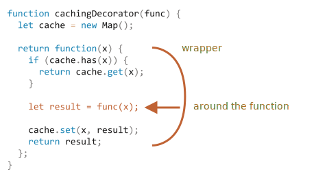

# 装饰者模式和转发，call/apply

JavaScript 在处理函数时提供了非凡的灵活性。它们可以被传递，用作对象，现在我们将看到如何在它们之间 **转发（forward）** 调用并 **装饰（decorate）** 它们。

## 透明缓存

假设我们有一个 CPU 重负载的函数 `slow(x)`，但它的结果是稳定的。换句话说，对于相同的 `x`，它总是返回相同的结果。

<<<<<<< HEAD
如果经常调用该函数，我们可能希望将结果缓存（记住）下来，以避免在重新计算上花费额外的时间。

但是我们不是将这个功能添加到 `slow()` 中，而是创建一个包装器（wrapper）函数，该函数增加了缓存功能。正如我们将要看到的，这样做有很多好处。
=======
If the function is called often, we may want to cache (remember) the results to avoid spending extra-time on recalculations.

But instead of adding that functionality into `slow()` we'll create a wrapper function, that adds caching. As we'll see, there are many benefits of doing so.
>>>>>>> e4e6a50b5762dd5dc4c0f0c58f870c64be39dcfa

下面是代码和解释：

```js run
function slow(x) {
  // 这里可能会有重负载的 CPU 密集型工作
  alert(`Called with ${x}`);
  return x;
}

function cachingDecorator(func) {
  let cache = new Map();

  return function(x) {
<<<<<<< HEAD
    if (cache.has(x)) {    // 如果缓存中有对应的结果
      return cache.get(x); // 从缓存中读取结果
    }

    let result = func(x);  // 否则就调用 func

    cache.set(x, result);  // 然后将结果缓存（记住）下来
=======
    if (cache.has(x)) {    // if there's such key in cache
      return cache.get(x); // read the result from it
    }

    let result = func(x);  // otherwise call func

    cache.set(x, result);  // and cache (remember) the result
>>>>>>> e4e6a50b5762dd5dc4c0f0c58f870c64be39dcfa
    return result;
  };
}

slow = cachingDecorator(slow);

alert( slow(1) ); // slow(1) 被缓存下来了
alert( "Again: " + slow(1) ); // 一样的

alert( slow(2) ); // slow(2) 被缓存下来了
alert( "Again: " + slow(2) ); // 和前面一行结果相同
```

在上面的代码中，`cachingDecorator` 是一个 **装饰者（decorator）**：一个特殊的函数，它接受另一个函数并改变它的行为。

其思想是，我们可以为任何函数调用 `cachingDecorator`，它将返回缓存包装器。这很棒啊，因为我们有很多函数可以使用这样的特性，而我们需要做的就是将 `cachingDecorator` 应用于它们。

通过将缓存与主函数代码分开，我们还可以使主函数代码变得更简单。

<<<<<<< HEAD
`cachingDecorator(func)` 的结果是一个“包装器”：`function(x)` 将 `func(x)` 的调用“包装”到缓存逻辑中：



从外部代码来看，包装的 `slow` 函数执行的仍然是与之前相同的操作。它只是在其行为上添加了缓存功能。

总而言之，使用分离的 `cachingDecorator` 而不是改变 `slow` 本身的代码有几个好处：
=======
The result of `cachingDecorator(func)` is a "wrapper": `function(x)` that "wraps" the call of `func(x)` into caching logic:


From an outside code, the wrapped `slow` function still does the same. It just got a caching aspect added to its behavior.
>>>>>>> e4e6a50b5762dd5dc4c0f0c58f870c64be39dcfa

- `cachingDecorator` 是可重用的。我们可以将它应用于另一个函数。
- 缓存逻辑是独立的，它没有增加 `slow` 本身的复杂性（如果有的话）。
- 如果需要，我们可以组合多个装饰者（其他装饰者将遵循同样的逻辑）。

<<<<<<< HEAD
## 使用 "func.call" 设定上下文

上面提到的缓存装饰者不适用于对象方法。

例如，在下面的代码中，`worker.slow()` 在装饰后停止工作：
=======
- The `cachingDecorator` is reusable. We can apply it to another function.
- The caching logic is separate, it did not increase the complexity of `slow` itself (if there was any).
- We can combine multiple decorators if needed (other decorators will follow).

## Using "func.call" for the context

The caching decorator mentioned above is not suited to work with object methods.

For instance, in the code below `worker.slow()` stops working after the decoration:
>>>>>>> e4e6a50b5762dd5dc4c0f0c58f870c64be39dcfa

```js run
// 我们将对 worker.slow 的结果进行缓存
let worker = {
  someMethod() {
    return 1;
  },

  slow(x) {
<<<<<<< HEAD
    // 可怕的 CPU 过载任务
=======
    // scary CPU-heavy task here  
>>>>>>> e4e6a50b5762dd5dc4c0f0c58f870c64be39dcfa
    alert("Called with " + x);
    return x * this.someMethod(); // (*)
  }
};

// 和之前例子中的代码相同
function cachingDecorator(func) {
  let cache = new Map();
  return function(x) {
    if (cache.has(x)) {
      return cache.get(x);
    }
*!*
    let result = func(x); // (**)
*/!*
    cache.set(x, result);
    return result;
  };
}

alert( worker.slow(1) ); // 原始方法有效

worker.slow = cachingDecorator(worker.slow); // 现在对其进行缓存

*!*
alert( worker.slow(2) ); // 蛤！Error: Cannot read property 'someMethod' of undefined
*/!*
```

错误发生在试图访问 `this.someMethod` 并失败了的 `(*)` 行中。你能看出来为什么吗？

原因是包装器将原始函数调用为 `(**)` 行中的 `func(x)`。并且，当这样调用时，函数将得到 `this = undefined`。

如果尝试运行下面这段代码，我们会观察到类似的问题：

```js
let func = worker.slow;
func(2);
```

因此，包装器将调用传递给原始方法，但没有上下文 `this`。因此，发生了错误。

让我们来解决这个问题。

有一个特殊的内置函数方法 [func.call(context, ...args)](mdn:js/Function/call)，它允许调用一个显式设置 `this` 的函数。

语法如下：

```js
func.call(context, arg1, arg2, ...)
```

它运行 `func`，提供的第一个参数作为 `this`，后面的作为参数（arguments）。

简单地说，这两个调用几乎相同：
```js
func(1, 2, 3);
func.call(obj, 1, 2, 3)
```

它们调用的都是 `func`，参数是 `1`、`2` 和 `3`。唯一的区别是 `func.call` 还会将 `this` 设置为 `obj`。

例如，在下面的代码中，我们在不同对象的上下文中调用 `sayHi`：`sayHi.call(user)` 运行 `sayHi` 并提供了 `this=user`，然后下一行设置 `this=admin`：

```js run
function sayHi() {
  alert(this.name);
}

let user = { name: "John" };
let admin = { name: "Admin" };

<<<<<<< HEAD
// 使用 call 将不同的对象传递为 "this"
=======
// use call to pass different objects as "this"
>>>>>>> e4e6a50b5762dd5dc4c0f0c58f870c64be39dcfa
sayHi.call( user ); // John
sayHi.call( admin ); // Admin
```

在这里我们用带有给定上下文和 phrase 的 `call` 调用 `say`：


```js run
function say(phrase) {
  alert(this.name + ': ' + phrase);
}

let user = { name: "John" };

// user 成为 this，"Hello" 成为第一个参数
say.call( user, "Hello" ); // John: Hello
```

<<<<<<< HEAD
在我们的例子中，我们可以在包装器中使用 `call` 将上下文传递给原始函数：
=======
In our case, we can use `call` in the wrapper to pass the context to the original function:
>>>>>>> e4e6a50b5762dd5dc4c0f0c58f870c64be39dcfa

```js run
let worker = {
  someMethod() {
    return 1;
  },

  slow(x) {
    alert("Called with " + x);
    return x * this.someMethod(); // (*)
  }
};

function cachingDecorator(func) {
  let cache = new Map();
  return function(x) {
    if (cache.has(x)) {
      return cache.get(x);
    }
*!*
    let result = func.call(this, x); // 现在 "this" 被正确地传递了
*/!*
    cache.set(x, result);
    return result;
  };
}

worker.slow = cachingDecorator(worker.slow); // 现在对其进行缓存

alert( worker.slow(2) ); // 工作正常
alert( worker.slow(2) ); // 工作正常，没有调用原始函数（使用的缓存）
```

现在一切都正常工作了。

为了让大家理解地更清晰一些，让我们更深入地看看 `this` 是如何被传递的：

1. 在经过装饰之后，`worker.slow` 现在是包装器 `function (x) { ... }`。
2. 因此，当 `worker.slow(2)` 执行时，包装器将 `2` 作为参数，并且 `this=worker`（它是点符号 `.` 之前的对象）。
3. 在包装器内部，假设结果尚未缓存，`func.call(this, x)` 将当前的 `this`（`=worker`）和当前的参数（`=2`）传递给原始方法。

<<<<<<< HEAD
## 使用 "func.apply" 来传递多参数
=======
## Going multi-argument
>>>>>>> e4e6a50b5762dd5dc4c0f0c58f870c64be39dcfa

现在让我们把 `cachingDecorator` 写得更加通用。到现在为止，它只能用于单参数函数。

现在如何缓存多参数 `worker.slow` 方法呢？

```js
let worker = {
  slow(min, max) {
    return min + max; // scary CPU-hogger is assumed
  }
};

// 应该记住相同参数的调用
worker.slow = cachingDecorator(worker.slow);
```

<<<<<<< HEAD
之前，对于单个参数 `x`，我们可以只使用 `cache.set(x, result)` 来保存结果，并使用 `cache.get(x)` 来检索并获取结果。但是现在，我们需要记住 **参数组合** `(min,max)` 的结果。原生的 `Map` 仅将单个值作为键（key）。

这儿有许多解决方案可以实现：

1. 实现一个新的（或使用第三方的）类似 map 的更通用并且允许多个键的数据结构。
2. 使用嵌套 map：`cache.set(min)` 将是一个存储（键值）对 `(max, result)` 的 `Map`。所以我们可以使用 `cache.get(min).get(max)` 来获取 `result`。
3. 将两个值合并为一个。为了灵活性，我们可以允许为装饰者提供一个“哈希函数”，该函数知道如何将多个值合并为一个值。

对于许多实际应用，第三种方式就足够了，所以我们就用这个吧。

当然，我们需要将 `func.call(this, x)` 替换成 `func.call(this, ...arguments)`，以将所有参数传递给包装的函数调用，而不仅仅是只传递第一个参数。

这是一个更强大的 `cachingDecorator`：
=======
Previously, for a single argument `x` we could just `cache.set(x, result)` to save the result and `cache.get(x)` to retrieve it. But now we need to remember the result for a *combination of arguments* `(min,max)`. The native `Map` takes single value only as the key.

There are many solutions possible:

1. Implement a new (or use a third-party) map-like data structure that is more versatile and allows multi-keys.
2. Use nested maps: `cache.set(min)` will be a `Map` that stores the pair `(max, result)`. So we can get `result` as `cache.get(min).get(max)`.
3. Join two values into one. In our particular case we can just use a string `"min,max"` as the `Map` key. For flexibility, we can allow to provide a *hashing function* for the decorator, that knows how to make one value from many.

For many practical applications, the 3rd variant is good enough, so we'll stick to it.

Also we need to pass not just `x`, but all arguments in `func.call`. Let's recall that in a `function()` we can get a pseudo-array of its arguments as `arguments`, so `func.call(this, x)` should be replaced with `func.call(this, ...arguments)`.

Here's a more powerful `cachingDecorator`:
>>>>>>> e4e6a50b5762dd5dc4c0f0c58f870c64be39dcfa

```js run
let worker = {
  slow(min, max) {
    alert(`Called with ${min},${max}`);
    return min + max;
  }
};

function cachingDecorator(func, hash) {
  let cache = new Map();
  return function() {
*!*
    let key = hash(arguments); // (*)
*/!*
    if (cache.has(key)) {
      return cache.get(key);
    }

*!*
    let result = func.call(this, ...arguments); // (**)
*/!*

    cache.set(key, result);
    return result;
  };
}

function hash(args) {
  return args[0] + ',' + args[1];
}

worker.slow = cachingDecorator(worker.slow, hash);

alert( worker.slow(3, 5) ); // works
alert( "Again " + worker.slow(3, 5) ); // same (cached)
```

<<<<<<< HEAD
现在这个包装器可以处理任意数量的参数了（尽管哈希函数还需要被进行调整以允许任意数量的参数。一种有趣的处理方法将在下面讲到）。
=======
Now it works with any number of arguments (though the hash function would also need to be adjusted to allow any number of arguments. An interesting way to handle this will be covered below).
>>>>>>> e4e6a50b5762dd5dc4c0f0c58f870c64be39dcfa

这里有两个变化：

<<<<<<< HEAD
- 在 `(*)` 行中它调用 `hash` 来从 `arguments` 创建一个单独的键。这里我们使用一个简单的“连接”函数，将参数 `(3, 5)` 转换为键 `"3,5"`。更复杂的情况可能需要其他哈希函数。
- 然后 `(**)` 行使用 `func.call(this, ...arguments)` 将包装器获得的上下文和所有参数（不仅仅是第一个参数）传递给原始函数。

我们可以使用 `func.apply(this, arguments)` 代替 `func.call(this, ...arguments)`。
=======
- In the line `(*)` it calls `hash` to create a single key from `arguments`. Here we use a simple "joining" function that turns arguments `(3, 5)` into the key `"3,5"`. More complex cases may require other hashing functions.
- Then `(**)` uses `func.call(this, ...arguments)` to pass both the context and all arguments the wrapper got (not just the first one) to the original function.

## func.apply

Instead of `func.call(this, ...arguments)` we could use `func.apply(this, arguments)`.

The syntax of built-in method [func.apply](mdn:js/Function/apply) is:

```js
func.apply(context, args)
```

It runs the `func` setting `this=context` and using an array-like object `args` as the list of arguments.

The only syntax difference between `call` and `apply` is that `call` expects a list of arguments, while `apply` takes an array-like object with them.

So these two calls are almost equivalent:

```js
func.call(context, ...args); // pass an array as list with spread syntax
func.apply(context, args);   // is same as using call
```

There's only a subtle difference:

- The spread syntax `...` allows to pass *iterable* `args` as the list to `call`.
- The `apply` accepts only *array-like* `args`.

So, where we expect an iterable, `call` works, and where we expect an array-like, `apply` works.

And for objects that are both iterable and array-like, like a real array, we can use any of them, but `apply` will probably be faster, because most JavaScript engines internally optimize it better.

Passing all arguments along with the context to another function is called *call forwarding*.

That's the simplest form of it:

```js
let wrapper = function() {
  return func.apply(this, arguments);
};
```

When an external code calls such `wrapper`, it is indistinguishable from the call of the original function `func`.
>>>>>>> e4e6a50b5762dd5dc4c0f0c58f870c64be39dcfa

内建方法 [func.apply](mdn:js/Function/apply) 的语法是：

```js
func.apply(context, args)
```

它运行 `func` 设置 `this=context`，并使用类数组对象 `args` 作为参数列表（arguments）。

`call` 和 `apply` 之间唯一的语法区别是，`call` 期望一个参数列表，而 `apply` 期望一个包含这些参数的类数组对象。

因此，这两个调用几乎是等效的：

```js
func.call(context, ...args); // 使用 spread 语法将数组作为列表传递
func.apply(context, args);   // 与使用 call 相同
```

这里只有很小的区别：

- Spread 语法 `...` 允许将 **可迭代对象** `args` 作为列表传递给 `call`。
- `apply` 仅接受 **类数组对象** `args`。

因此，这些调用可以相互补充。当我们期望可迭代对象时，使用 `call`，当我们期望类数组对象时，使用 `apply`。

对于即可迭代又是类数组的对象，例如一个真正的数组，从技术上讲我们使用 `call` 或 `apply` 都行，但是 `apply` 可能会更快，因为大多数 JavaScript 引擎在内部对其进行了优化。

将所有参数连同上下文一起传递给另一个函数被称为“呼叫转移（call forwarding）”。

这是它的最简形式：

```js
let wrapper = function() {
  return func.apply(this, arguments);
};
```

当外部代码调用这种包装器 `wrapper` 时，它与原始函数 `func` 的调用是无法区分的。

## 借用一种方法 [#method-borrowing]

现在，让我们对哈希函数再做一个较小的改进：

```js
function hash(args) {
  return args[0] + ',' + args[1];
}
```

截至目前，它仅适用于两个参数。如果它可以适用于任何数量的 `args` 就更好了。

自然的解决方案是使用 [arr.join](mdn:js/Array/join) 方法：

```js
function hash(args) {
  return args.join();
}
```

<<<<<<< HEAD
……不幸的是，这不行。因为我们正在调用 `hash(arguments)`，`arguments` 对象既是可迭代对象又是类数组对象，但它并不是真正的数组。
=======
...Unfortunately, that won't work. Because we are calling `hash(arguments)`, and `arguments` object is both iterable and array-like, but not a real array.
>>>>>>> e4e6a50b5762dd5dc4c0f0c58f870c64be39dcfa

所以在它上面调用 `join` 会失败，我们可以在下面看到：

```js run
function hash() {
*!*
  alert( arguments.join() ); // Error: arguments.join is not a function
*/!*
}

hash(1, 2);
```

不过，有一种简单的方法可以使用数组的 join 方法：

```js run
function hash() {
*!*
  alert( [].join.call(arguments) ); // 1,2
*/!*
}

hash(1, 2);
```

这个技巧被称为 **方法借用（method borrowing）**。

我们从常规数组 `[].join` 中获取（借用）join 方法，并使用 `[].join.call` 在 `arguments` 的上下文中运行它。

它为什么有效？

<<<<<<< HEAD
那是因为原生方法 `arr.join(glue)` 的内部算法非常简单。
=======
We take (borrow) a join method from a regular array (`[].join`) and use `[].join.call` to run it in the context of `arguments`.
>>>>>>> e4e6a50b5762dd5dc4c0f0c58f870c64be39dcfa

从规范中几乎“按原样”解释如下：

1. 让 `glue` 成为第一个参数，如果没有参数，则使用逗号 `","`。
2. 让 `result` 为空字符串。
3. 将 `this[0]` 附加到 `result`。
4. 附加 `glue` 和 `this[1]`。
5. 附加 `glue` 和 `this[2]`。
6. ……以此类推，直到 `this.length` 项目被粘在一起。
7. 返回 `result`。

因此，从技术上讲，它需要 `this` 并将 `this[0]`，`this[1]` ……等 join 在一起。它的编写方式是故意允许任何类数组的 `this` 的（不是巧合，很多方法都遵循这种做法）。这就是为什么它也可以和 `this=arguments` 一起使用。

## 装饰者和函数属性

通常，用装饰的函数替换一个函数或一个方法是安全的，除了一件小东西。如果原始函数有属性，例如 `func.calledCount` 或其他，则装饰后的函数将不再提供这些属性。因为这是装饰者。因此，如果有人使用它们，那么就需要小心。

<<<<<<< HEAD
例如，在上面的示例中，如果 `slow` 函数具有任何属性，而 `cachingDecorator(slow)` 则是一个没有这些属性的包装器。
=======
## Decorators and function properties

It is generally safe to replace a function or a method with a decorated one, except for one little thing. If the original function had properties on it, like `func.calledCount` or whatever, then the decorated one will not provide them. Because that is a wrapper. So one needs to be careful if one uses them.

E.g. in the example above if `slow` function had any properties on it, then `cachingDecorator(slow)` is a wrapper without them.

Some decorators may provide their own properties. E.g. a decorator may count how many times a function was invoked and how much time it took, and expose this information via wrapper properties.

There exists a way to create decorators that keep access to function properties, but this requires using a special `Proxy` object to wrap a function. We'll discuss it later in the article <info:proxy#proxy-apply>.

## Summary
>>>>>>> e4e6a50b5762dd5dc4c0f0c58f870c64be39dcfa

一些包装器可能会提供自己的属性。例如，装饰者会计算一个函数被调用了多少次以及花费了多少时间，并通过包装器属性公开（expose）这些信息。

<<<<<<< HEAD
存在一种创建装饰者的方法，该装饰者可保留对函数属性的访问权限，但这需要使用特殊的 `Proxy` 对象来包装函数。我们将在后面的 <info:proxy#proxy-apply> 中学习它。

## 总结
=======
Decorators can be seen as "features" or "aspects" that can be added to a function. We can add one or add many. And all this without changing its code!
>>>>>>> e4e6a50b5762dd5dc4c0f0c58f870c64be39dcfa

**装饰者** 是一个围绕改变函数行为的包装器。主要工作仍由该函数来完成。

装饰者可以被看作是可以添加到函数的 "features" 或 "aspects"。我们可以添加一个或添加多个。而这一切都无需更改其代码！

为了实现 `cachingDecorator`，我们研究了以下方法：

- [func.call(context, arg1, arg2...)](mdn:js/Function/call) —— 用给定的上下文和参数调用 `func`。
- [func.apply(context, args)](mdn:js/Function/apply) —— 调用 `func` 将 `context` 作为 `this` 和类数组的 `args` 传递给参数列表。

通用的 **呼叫转移（call forwarding）** 通常是使用 `apply` 完成的：

```js
let wrapper = function() {
  return original.apply(this, arguments);
};
```

<<<<<<< HEAD
我们也可以看到一个 **方法借用（method borrowing）** 的例子，就是我们从一个对象中获取一个方法，并在另一个对象的上下文中“调用”它。采用数组方法并将它们应用于参数 `arguments` 是很常见的。另一种方法是使用 Rest 参数对象，该对象是一个真正的数组。
=======
We also saw an example of *method borrowing* when we take a method from an object and `call` it in the context of another object. It is quite common to take array methods and apply them to `arguments`. The alternative is to use rest parameters object that is a real array.
>>>>>>> e4e6a50b5762dd5dc4c0f0c58f870c64be39dcfa

在 JavaScript 领域里有很多装饰者（decorators）。通过解决本章的任务，来检查你掌握它们的程度吧。
