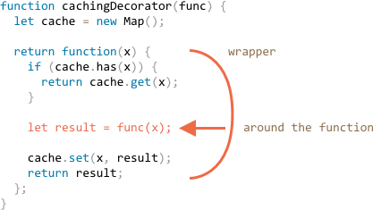

# 装饰和转发，call/apply

JavaScript在处理函数时提供了非凡的灵活性。它们可以被传递，用作对象，现在我们将看到如何在它们之间**转发**并**装饰**它们。

## 透明缓存

假设我们有一个函数 `slow(x)` ，它是 CPU 重负载的，但它的结果是稳定的。换句话说，对于相同的 `x`，它总是返回相同的结果。

如果经常调用该函数，我们可能希望缓存（记住）不同 `x` 的结果，以避免在重新计算上花费额外的时间。

但是我们不是将这个功能添加到 `slow()` 中，而是创建一个包装器。正如我们将要看到的，这样做有很多好处。

下面是代码和解释：

```js run
function slow(x) {
  // 这里可能会有重负载的CPU密集型工作
  alert(`Called with ${x}`);
  return x;
}

function cachingDecorator(func) {
  let cache = new Map();

  return function(x) {
    if (cache.has(x)) { // 如果结果在 map 里
      return cache.get(x); // 返回它
    }

    let result = func(x); // 否则就调用函数

    cache.set(x, result); // 然后把结果缓存起来
    return result;
  };
}

slow = cachingDecorator(slow);

alert( slow(1) ); // slow(1) 被缓存起来了
alert( "Again: " + slow(1) ); // 一样的

alert( slow(2) ); // slow(2) 被缓存起来了
alert( "Again: " + slow(2) ); // 也是一样
```

在上面的代码中，`cachingDecorator` 是一个**装饰器**：一个特殊的函数，它接受另一个函数并改变它的行为。

我们的想法是，我们可以为任何函数调用 `cachingDecorator`，它将返回缓存包装器。这很好，因为我们有很多函数可以使用这样的特性，而我们需要做的就是将 `cachingDecorator` 应用于它们。

通过将缓存与主函数代码分开，我们还可以使主函数代码变得更简单。

现在让我们详细了解它的工作原理吧。

`cachingDecorator(func)` 的结果是一个“包装器”：`function(x)` 将 `func(x)` 的调用 "包装" 到缓存逻辑中：



正如我们所看到的，包装器返回 `func(x)` "的结果"。从外部代码中，包装的 `slow` 函数仍然是一样的。它只是在其函数体中添加了一个缓存。

总而言之，使用单独的 `cachingDecorator` 而不是改变 `slow` 本身的代码有几个好处：

- `cachingDecorator` 是可重用的。我们可以将它应用于另一个函数。
- 缓存逻辑是独立的，它没有增加 `slow` 本身的复杂性（如果有的话）。
- 如果需要，我们可以组合多个装饰器（其他装饰器将遵循同样的逻辑）。


## 使用 “func.call” 作为上下文

上面提到的缓存装饰器不适合使用对象方法。

例如，在下面的代码中，`worker.slow()` 装饰后停止工作：

```js run
// 我们将让 work 缓存一个 slow 起来
let worker = {
  someMethod() {
    return 1;
  },

  slow(x) {
    // 显然, 这里会有一个 CPU 重负载的任务
    alert("Called with " + x);
    return x * this.someMethod(); // (*)
  }
};

// 和之前一样的代码
function cachingDecorator(func) {
  let cache = new Map();
  return function(x) {
    if (cache.has(x)) {
      return cache.get(x);
    }
*!*
    let result = func(x); // (**)
*/!*
    cache.set(x, result);
    return result;
  };
}

alert( worker.slow(1) ); // 之前的函数起作用了

worker.slow = cachingDecorator(worker.slow); // 现在让它缓存起来

*!*
alert( worker.slow(2) ); // Whoops! Error: Cannot read property 'someMethod' of undefined
*/!*
```

错误发生在试图访问 `this.someMethod` 并且失败的行 `(*)` 中。你能明白为什么吗？

原因是包装器将原始函数调用为 `(**)` 行中的 `func(x)`。并且，当这样调用时，函数得到 `this = undefined`。

如果我们试图运行下面的代码，会观察到类似的问题：

```js
let func = worker.slow;
func(2);
```

因此，包装器将调用传递给原始方法，但没有上下文 `this`。因此错误。

我们来解决这个问题。

有一个特殊的内置函数方法 [func.call(context, ...args)](mdn:js/Function/call)，允许调用一个显式设置 `this` 的函数。

语法如下：

```js
func.call(context, arg1, arg2, ...)
```

它运行 `func`，提供的第一个参数作为 `this`，后面的作为参数。

简单地说，这两个调用几乎相同：
```js
func(1, 2, 3);
func.call(obj, 1, 2, 3)
```

他们都调用的是 `func`，参数是 `1`，`2` 和 `3`。唯一的区别是 `func.call` 也将 `this` 设置为 `obj`。

例如，在下面的代码中，我们在不同对象的上下文中调用 `sayHi`:`sayHi.call(user)` 运行 `sayHi` 提供 `this=user`，下一行设置 `this=admin`：

```js run
function sayHi() {
  alert(this.name);
}

let user = { name: "John" };
let admin = { name: "Admin" };

// 使用 call 将不同的对象传递为 "this"
sayHi.call( user ); // this = John
sayHi.call( admin ); // this = Admin
```

在这里我们用 `call` 用给定的上下文和短语调用 `say`：


```js run
function say(phrase) {
  alert(this.name + ': ' + phrase);
}

let user = { name: "John" };

// user becomes this, and "Hello" becomes the first argument
say.call( user, "Hello" ); // John: Hello
```


在我们的例子中，我们可以在包装器中使用 `call` 将上下文传递给原始函数：


```js run
let worker = {
  someMethod() {
    return 1;
  },

  slow(x) {
    alert("Called with " + x);
    return x * this.someMethod(); // (*)
  }
};

function cachingDecorator(func) {
  let cache = new Map();
  return function(x) {
    if (cache.has(x)) {
      return cache.get(x);
    }
*!*
    let result = func.call(this, x); // "this" 现在被正确的传递了
*/!*
    cache.set(x, result);
    return result;
  };
}

worker.slow = cachingDecorator(worker.slow); // 现在让他缓存起来

alert( worker.slow(2) ); // 生效了
alert( worker.slow(2) ); // 生效了, 不会调用原始的函数了。被缓存起来了
```

现在一切都很好。

为了清楚地说明，让我们更深入地了解 `this` 是如何传递的：

1. 在经过装饰之后，`worker.slow` 现在是包装器 `function (x) { ... }`。
2. 因此，当执行 `worker.slow(2)` 时，包装器将 `2` 作为参数并且 `this=worker`（它是点之前的对象）。
3. 在包装器内部，假设结果尚未缓存，`func.call(this, x)` 将当前的 `this` (`=worker`) 和当前参数 (`=2`) 传递给原始方法。

## 使用 “func.apply” 来传递多参数

现在让我们让 `cachingDecorator` 变得更加通用。直到现在它只使用单参数函数。

现在如何缓存多参数 `worker.slow` 方法？

```js
let worker = {
  slow(min, max) {
    return min + max; // scary CPU-hogger is assumed
  }
};

// should remember same-argument calls
worker.slow = cachingDecorator(worker.slow);
```

我们这里有两个要解决的任务。

首先是如何在 `cache` map 中使用参数 `min` 和 `max` 作为键。以前，对于单个参数 `x`，我们可以只使用 `cache.set(x, result)` 来保存结果，并使用 `cache.get(x)` 来检索它。但是现在我们需要记住参数组合 * `(min,max)` 的结果。原生 `Map` 仅将单个值作为键。

有许多解决方案可以实现：

1. 实现一个新的（或使用第三方）类似 map 的数据结构，它更通用并允许多键。
2. 使用嵌套映射：`cache.set(min)` 将是一个存储对 `(max, result)` 的 `Map`。所以我们可以将 `result` 改为 `cache.get(min).get(max)`。
3. 将两个值合并为一个。在我们的特定情况下，我们可以使用字符串 “min，max” 作为 `Map` 键。为了灵活性，我们可以允许为装饰器提供**散列函数**，它知道如何从多个中创建一个值。


对于许多实际应用，第三种方式已经足够好，所以我们就用这个吧。

要解决的第二个任务是如何将许多参数传递给 `func`。目前，包装器 `function(x)` 假设一个参数，`func.call(this, x)` 传递它。

在这里我们可以使用另一种内置方法 [func.apply](mdn:js/Function/apply).

语法如下：

```js
func.apply(context, args)
```

它运行 `func` 设置 `this=context` 并使用类似数组的对象 `args` 作为参数列表。


例如，这两个调用几乎相同：

```js
func(1, 2, 3);
func.apply(context, [1, 2, 3])
```

两个都运行 `func` 给定的参数是 `1,2,3`。但是 `apply` 也设置了 `this = context`。

例如，这里 `say` 用 `this=user` 和 `messageData` 作为参数列表调用：

```js run
function say(time, phrase) {
  alert(`[${time}] ${this.name}: ${phrase}`);
}

let user = { name: "John" };

let messageData = ['10:00', 'Hello']; // 成为时间和短语

*!*
// user 成为 this，messageData 作为参数列表传递 (time, phrase)
say.apply(user, messageData); // [10:00] John: Hello (this=user)
*/!*
```

`call` 和 `apply` 之间唯一的语法区别是 `call` 接受一个参数列表，而 `apply` 则接受带有一个类似数组的对象。

我们已经知道了 <info:rest-parameters-spread-operator> 一章中的扩展运算符 `...`，它可以将数组（或任何可迭代的）作为参数列表传递。因此，如果我们将它与 `call` 一起使用，就可以实现与 `apply` 几乎相同的功能。

这两个调用结果几乎相同：

```js
let args = [1, 2, 3];

*!*
func.call(context, ...args); // 使用 spread 运算符将数组作为参数列表传递
func.apply(context, args);   // 与使用 apply 相同
*/!*
```

如果我们仔细观察，那么 `call` 和 `apply` 的使用会有一些细微的差别。

- 扩展运算符 `...` 允许将 **可迭代的** `参数列表` 作为列表传递给 `call`。
- `apply` 只接受 **类似数组一样的** `参数列表`。

所以，这些调用方式相互补充。我们期望有一个可迭代的 `call` 实现，我们也期望有一个类似数组，`apply` 的实现。

如果 `参数列表` 既可迭代又像数组一样，就像真正的数组一样，那么我们在技术上可以使用它们中的任何一个，但是 `apply` 可能会更快，因为它只是一个操作。大多数 JavaScript 引擎内部优化比一对 `call + spread` 更好。

`apply` 最重要的用途之一是将调用传递给另一个函数，如下所示：

```js
let wrapper = function() {
  return anotherFunction.apply(this, arguments);
};
```

这叫做 **呼叫转移**。`wrapper` 传递它获得的所有内容：上下文 `this` 和 `anotherFunction` 的参数并返回其结果。

当外部代码调用这样的 `wrapper` 时，它与原始函数的调用无法区分。

现在让我们把它全部加入到更强大的 `cachingDecorator` 中：

```js run
let worker = {
  slow(min, max) {
    alert(`Called with ${min},${max}`);
    return min + max;
  }
};

function cachingDecorator(func, hash) {
  let cache = new Map();
  return function() {
*!*
    let key = hash(arguments); // (*)
*/!*
    if (cache.has(key)) {
      return cache.get(key);
    }

*!*
    let result = func.apply(this, arguments); // (**)
*/!*

    cache.set(key, result);
    return result;
  };
}

function hash(args) {
  return args[0] + ',' + args[1];
}

worker.slow = cachingDecorator(worker.slow, hash);

alert( worker.slow(3, 5) ); // works
alert( "Again " + worker.slow(3, 5) ); // same (cached)
```

现在，包装器可以使用任意数量的参数进行操作。

这里有两个变化：

- 在 `(*)` 行中它调用 `hash` 来从 `arguments` 创建一个单独的键。这里我们使用一个简单的 “连接” 函数，将参数 `(3, 5)` 转换为键 “3,5”。更复杂的情况可能需要其他散列函数。
- 然后 `(**)` 使用 `func.apply` 传递上下文和包装器获得的所有参数（无论多少）到原始函数。


## 借用一种方法 [#method-borrowing]

现在让我们在散列函数中做一个小改进：

```js
function hash(args) {
  return args[0] + ',' + args[1];
}
```

截至目前，它仅适用于两个参数。如果它可以适配任何数量的 `args` 会更好。

自然的解决方案是使用 [arr.join](mdn:js/Array/join) 函数:

```js
function hash(args) {
  return args.join();
}
```

...不幸的是，那不行。虽然我们调用 `hash(arguments)` 和 `arguments` 对象，它既可迭代又像数组一样，但它并不是真正的数组。

所以在它上面调用 `join` 会失败，我们可以在下面看到：

```js run
function hash() {
*!*
  alert( arguments.join() ); // 报错：arguments.join 不是函数
*/!*
}

hash(1, 2);
```

不过，有一种简单的方法可以使用数组的 join 方法：

```js run
function hash() {
*!*
  alert( [].join.call(arguments) ); // 1,2
*/!*
}

hash(1, 2);
```

这个技巧被称为 **方法借用**。

我们从常规数组 `[].join` 中获取（借用）连接方法。并使用 `[].join.call` 在 `arguments` 的上下文中运行它。

它为什么有效？

那是因为本地方法 `arr.join(glue)` 的内部算法非常简单。

从规范中得出几乎“原样”：

1. 让 `glue` 成为第一个参数，如果没有参数，则使用逗号 `","`。
2. 让 `result` 为空字符串。
3. 将 `this[0]` 附加到 `result`。
4. 附加 `glue` 和 `this[1]`。
5. 附加 `glue` 和 `this[2]`。
6. ...直到 `this.length` 项目粘在一起。
7. 返回 `result`。

因此，从技术上讲，它需要 `this` 并将 `this[0]`，`this[1]` ...... 等加在一起。它的编写方式是允许任何类似数组的 `this`（不是巧合，许多方法遵循这种做法）。这就是为什么它也适用于 `this=arguments`。

## 总结

** 装饰器 **是一个改变函数行为的包装器。主要工作仍由该函数来完成。

除了一件小事，使用装饰器来替代函数或方法通常都是安全的。如果原始函数具有属性，例如 `func.calledCount` 或者其他什么，则装饰的函数将不提供它们。因为那是一个包装器。因此，如果使用它们，需要小心。一些装饰器提供它们自己的属性。

装饰器可以被视为可以添加到函数中的“特征”或“方面”。我们可以添加一个或添加许多。而这一切都没有改变它的代码！

为了实现 `cachingDecorator`，我们研究了方法：

- [func.call(context, arg1, arg2...)](mdn:js/Function/call) —— 用给定的上下文和参数调用 `func`。
- [func.apply(context, args)](mdn:js/Function/apply) —— 调用 `func` 将 `context` 作为 `this` 和类似数组的 `args` 传递给参数列表。

通用 **呼叫转移** 通常使用 `apply` 完成：

```js
let wrapper = function() {
  return original.apply(this, arguments);
}
```

当我们从一个对象中获取一个方法并在另一个对象的上下文中“调用”它时，我们也看到了一个 **方法借用** 的例子。采用数组方法并将它们应用于参数是很常见的。另一种方法是使用静态参数对象，它是一个真正的数组。


在 js 领域里有很多装饰器的使用方法 。快通过解决本章的任务来检查你掌握它们的程度吧。
