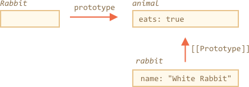
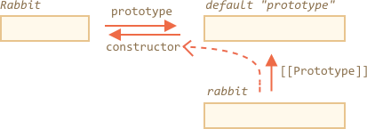

# 函数原型

<<<<<<< HEAD:1-js/07-object-oriented-programming/04-function-prototype/article.md
在现代 JavaScript 中，我们可以使用 `__proto__` 设置一个原型，如前一篇文章中所述。但事情并非如此。

JavaScript 从一开始就有了原型继承。这是该语言的核心特征之一。

但在过去，有另一种（也是唯一的）设置方法：使用构造函数的 `"prototype"` 属性。而且现在还有很多使用它的脚本。

## "prototype" 原型

正如我们已经知道的那样，`new F()` 创建一个新对象。

当用 `new F()` 创建一个新对象时，该对象的 `[[Prototype]]` 被设置为 `F.prototype`。

换句话说，如果 `F` 有一个 `prototype` 属性，该属性具有一个对象类型的值，那么 `new` 运算符就会使用它为新对象设置 `[[Prototype]]`。
=======
Remember, new objects can be created with a constructor function, like `new F()`.

If `F.prototype` is an object, then `new` operator uses it to set `[[Prototype]]` for the new object.

```smart
JavaScript had prototypal inheritance from the beginning. It was one of the core features of the language.

But in the old times, there was no direct access to it. The only thing that worked reliably was a `"prototype"` property of the constructor function, described in this chapter. So there are many scripts that still use it.
```
>>>>>>> 08734734021aa128c13da2382fe8fa062677bb9f:1-js/08-prototypes/02-function-prototype/article.md

请注意，`F.prototype` 意味着在 `F` 上有一个名为 `"prototype"` 的常规属性。这听起来与“原型”这个术语很相似，但在这里我们的意思是值有这个名字的常规属性。

这是一个例子：

```js run
let animal = {
  eats: true
};

function Rabbit(name) {
  this.name = name;
}

*!*
Rabbit.prototype = animal;
*/!*

let rabbit = new Rabbit("White Rabbit"); //  rabbit.__proto__ == animal

alert( rabbit.eats ); // true
```

设置 `Rabbit.prototype = animal` 的这段代码表达的意思是：“当 `new Rabbit` 创建时，把它的 `[[Prototype]]` 赋值为 `animal`” 。

这是结果图：



<<<<<<< HEAD:1-js/07-object-oriented-programming/04-function-prototype/article.md
在图片上，`"prototype"` 是一个水平箭头，它是一个常规属性，`[[Prototype]]` 是垂直的，意味着是继承自 `animal` 的 `rabbit`。
=======
On the picture, `"prototype"` is a horizontal arrow, meaning a regular property, and `[[Prototype]]` is vertical, meaning the inheritance of `rabbit` from `animal`.

```smart header="`F.prototype` only used at `new F` time"
`F.prototype` property is only used when `new F` is called, it assigns `[[Prototype]]` of the new object. After that, there's no connection between `F.prototype` and the new object. Think of it as a "one-time gift".
>>>>>>> 08734734021aa128c13da2382fe8fa062677bb9f:1-js/08-prototypes/02-function-prototype/article.md

If, after the creation, `F.prototype` property changes (`F.prototype = <another object>`), then new objects created by `new F` will have another object as `[[Prototype]]`, but already existing objects keep the old one.
```

##  默认的函数原型，构造函数属性

每个函数都有 `"prototype"` 属性，即使我们不设置它。

默认的 `"prototype"` 是一个只有属性 `constructor` 的对象，它指向函数本身。

像这样：

```js
function Rabbit() {}

/* default prototype
Rabbit.prototype = { constructor: Rabbit };
*/
```


我们可以检查一下：

```js run
function Rabbit() {}
// by default:
// Rabbit.prototype = { constructor: Rabbit }

alert( Rabbit.prototype.constructor == Rabbit ); // true
```

当然，如果我们什么都不做，`constructor` 属性可以通过 `[[Prototype]]` 给所有 rabbits 对象使用：

```js run
function Rabbit() {}
// by default:
// Rabbit.prototype = { constructor: Rabbit }

let rabbit = new Rabbit(); // inherits from {constructor: Rabbit}

alert(rabbit.constructor == Rabbit); // true (from prototype)
```



我们可以用 `constructor` 属性使用与现有构造函数相同的构造函数创建一个新对象。

像这样：
```js run
function Rabbit(name) {
  this.name = name;
  alert(name);
}

let rabbit = new Rabbit("White Rabbit");

*!*
let rabbit2 = new rabbit.constructor("Black Rabbit");
*/!*
```

当我们有一个对象，但不知道为它使用哪个构造函数（比如它来自第三方库），而且我们需要创建另一个相似的函数时，用这种方法就很方便。


但关于 `"constructor"` 最重要的是......

**...JavaScript 本身并不能确保正确的 `"constructor"` 函数值。**

是的，它存在于函数的默认 `"prototype"` 中，但仅此而已。之后会发生什么 —— 完全取决于我们自己。

特别是，如果我们将整个默认原型替换掉，那么其中就不会有构造函数。

例如：

```js run
function Rabbit() {}
Rabbit.prototype = {
  jumps: true
};

let rabbit = new Rabbit();
*!*
alert(rabbit.constructor === Rabbit); // false
*/!*
```

因此，为了确保正确的 `"constructor"`，我们可以选择添加/删除属性到默认 `"prototype"` 而不是将其整个覆盖：

```js
function Rabbit() {}

// Not overwrite Rabbit.prototype totally
// just add to it
Rabbit.prototype.jumps = true
// the default Rabbit.prototype.constructor is preserved
```

<<<<<<< HEAD:1-js/07-object-oriented-programming/04-function-prototype/article.md
或者，也可以手动重新创建 `constructor` 属性：
=======
Or, alternatively, recreate the `constructor` property manually:
>>>>>>> 08734734021aa128c13da2382fe8fa062677bb9f:1-js/08-prototypes/02-function-prototype/article.md

```js
Rabbit.prototype = {
  jumps: true,
*!*
  constructor: Rabbit
*/!*
};

// now constructor is also correct, because we added it
```


## 总结

在本章中，我们简要介绍了如何为通过构造函数创建的对象设置一个 `[[Prototype]]`。稍后我们将看到更多依赖于它的高级编程模式。

一切都很简单，只需要几条笔记就能说清楚：

- `F.prototype` 属性与 `[[Prototype]]` 不同。`F.prototype` 唯一的作用是：当 `new F()` 被调用时，它设置新对象的 `[[Prototype]]`。
- `F.prototype` 的值应该是一个对象或 null：其他值将不起作用。
- `"prototype"` 属性在设置为构造函数时仅具有这种特殊效果，并且用 `new` 调用。

在常规对象上，`prototype` 没什么特别的：
```js
let user = {
  name: "John",
  prototype: "Bla-bla" // no magic at all
};
```

默认情况下，所有函数都有 `F.prototype = {constructor：F}`，所以我们可以通过访问它的 `"constructor"` 属性来获得对象的构造函数。
