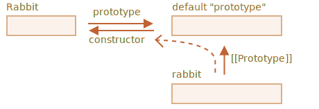

# F.prototype

我们还记得，可以使用诸如 `new F()` 这样的构造函数来创建一个新对象。

如果 `F.prototype` 是一个对象，那么 `new` 操作符会使用它为新对象设置 `[[Prototype]]`。

```smart
JavaScript 从一开始就有了原型继承。这是 JavaScript 编程语言的核心特性之一。

但是在过去，没有直接对其进行访问的方式。唯一可靠的方法是本章中会介绍的构造函数的 `"prototype"` 属性。目前仍有许多脚本仍在使用它。
```

请注意，这里的 `F.prototype` 指的是 `F` 的一个名为 `"prototype"` 的常规属性。这听起来与“原型”这个术语很类似，但这里我们实际上指的是具有该名字的常规属性。

下面是一个例子：

```js run
let animal = {
  eats: true
};

function Rabbit(name) {
  this.name = name;
}

*!*
Rabbit.prototype = animal;
*/!*

let rabbit = new Rabbit("White Rabbit"); //  rabbit.__proto__ == animal

alert( rabbit.eats ); // true
```

设置 `Rabbit.prototype = animal` 的字面意思是：“当创建了一个 `new Rabbit` 时，把它的 `[[Prototype]]` 赋值为 `animal`”。

这是结果示意图：


在上图中，`"prototype"` 是一个水平箭头，表示一个常规属性，`[[Prototype]]` 是垂直的，表示 `rabbit` 继承自 `animal`。

```smart header="`F.prototype` 仅用在 `new F` 时"
`F.prototype` 属性仅在 `new F` 被调用时使用，它为新对象的 `[[Prototype]]` 赋值。

如果在创建之后，`F.prototype` 属性有了变化（`F.prototype = <another object>`），那么通过 `new F` 创建的新对象也将随之拥有新的对象作为 `[[Prototype]]`，但已经存在的对象将保持旧有的值。
```

##  默认的 F.prototype，构造器属性

每个函数都有 `"prototype"` 属性，即使我们没有提供它。

默认的 `"prototype"` 是一个只有属性 `constructor` 的对象，属性 `constructor` 指向函数自身。

像这样：

```js
function Rabbit() {}

/* default prototype
Rabbit.prototype = { constructor: Rabbit };
*/
```


我们可以检查一下：

```js run
function Rabbit() {}
// by default:
// Rabbit.prototype = { constructor: Rabbit }

alert( Rabbit.prototype.constructor == Rabbit ); // true
```

通常，如果我们什么都不做，`constructor` 属性可以通过 `[[Prototype]]` 给所有 rabbits 使用：

```js run
function Rabbit() {}
// by default:
// Rabbit.prototype = { constructor: Rabbit }

let rabbit = new Rabbit(); // inherits from {constructor: Rabbit}

alert(rabbit.constructor == Rabbit); // true (from prototype)
```



我们可以使用 `constructor` 属性来创建一个新对象，该对象使用与现有对象相同的构造器。

像这样：

```js run
function Rabbit(name) {
  this.name = name;
  alert(name);
}

let rabbit = new Rabbit("White Rabbit");

*!*
let rabbit2 = new rabbit.constructor("Black Rabbit");
*/!*
```

当我们有一个对象，但不知道它使用了哪个构造器（例如它来自第三方库），并且我们需要创建另一个类似的对象时，用这种方法就很方便。

但是，关于 `"constructor"` 最重要的是……

**……JavaScript 自身并不能确保正确的 `"constructor"` 函数值。**

是的，它存在于函数的默认 `"prototype"` 中，但仅此而已。之后会发生什么 —— 完全取决于我们。

特别是，如果我们将整个默认 prototype 替换掉，那么其中就不会有 `"constructor"` 了。

例如：

```js run
function Rabbit() {}
Rabbit.prototype = {
  jumps: true
};

let rabbit = new Rabbit();
*!*
alert(rabbit.constructor === Rabbit); // false
*/!*
```

因此，为了确保正确的 `"constructor"`，我们可以选择添加/删除属性到默认 `"prototype"`，而不是将其整个覆盖：

```js
function Rabbit() {}

// 不要将 Rabbit.prototype 整个覆盖
// 可以向其中添加内容 
Rabbit.prototype.jumps = true
// 默认的 Rabbit.prototype.constructor 被保留了下来
```

或者，也可以手动重新创建 `constructor` 属性：

```js
Rabbit.prototype = {
  jumps: true,
*!*
  constructor: Rabbit
*/!*
};

// 这样的 constructor 也是正确的，因为我们手动添加了它
```


## 总结

在本章中，我们简要介绍了为通过构造函数创建的对象设置 `[[Prototype]]` 的方法。稍后我们将看到更多依赖于此的高级编程模式。

一切都很简单，只需要记住几条重点就可以清晰地掌握了：

- `F.prototype` 属性（不要把它与 `[[Prototype]]` 弄混了）在 `new F` 被调用时为新对象的 `[[Prototype]]` 赋值。
- `F.prototype` 的值要么是一个对象，要么就是 `null`：其他值都不起作用。
- `"prototype"` 属性仅在设置了一个构造函数（constructor function），并通过 `new` 调用时，才具有这种特殊的影响。

在常规对象上，`prototype` 没什么特别的：
```js
let user = {
  name: "John",
  prototype: "Bla-bla" // 这里只是普通的属性
};
```

默认情况下，所有函数都有 `F.prototype = {constructor：F}`，所以我们可以通过访问它的 `"constructor"` 属性来获取一个对象的构造器。
