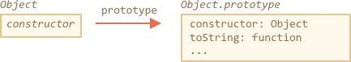
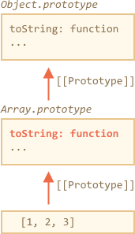

# 原生的原型

`"prototype"` 属性在 JavaScript 自身的核心模块中被广泛应用。所有的内置构造函数都用到了它。

我们将会首先看到原型对于简单对象是什么样的，然后对于更多的复杂对象又是什么样的。

## Object.prototype

假设我们输出一个空对象：

```js run
let obj = {};
alert( obj ); // "[object Object]" ?
```

生成字符串 `"[object Object]"` 的代码在哪里？那就是内置的一个 `toString` 方法，但是它在哪里呢？`obj` 是空的！

<<<<<<< HEAD:1-js/07-object-oriented-programming/05-native-prototypes/article.md
...然而简短的表达式 `obj = {}` 和 `obj = new Object()` 是一个意思，其中 `Object` 是一个内置的对象构造函数。并且这个方法有一个 `Object.prototype` 属性，这个属性引用了一个庞大的对象，这个庞大的对象有 `toString` 方法和其他的一些方法。

就像这样（所有的这些都是内置的）：



当 `new Object()` 被调用来创建一个对象（或者一个字面量对象 `{...}` 被创建），按照前面章节的讨论规则，这个对象的 `[[Prototype]]` 属性被设置为 `Object.prototype`：


之后当 `obj.toString()` 被调用时，这个方法是在 `Object.prototype` 中被取到的。
=======
...But the short notation `obj = {}` is the same as `obj = new Object()`, where `Object` is a built-in object constructor function, with its own `prototype` referencing a huge object with `toString` and other methods.

Here's what's going on:


When `new Object()` is called (or a literal object `{...}` is created), the `[[Prototype]]` of it is set to `Object.prototype` according to the rule that we discussed in the previous chapter:


So then when `obj.toString()` is called the method is taken from `Object.prototype`.
>>>>>>> a0266c574c0ab8a0834dd38ed65e7e4ee27f9cdb:1-js/08-prototypes/03-native-prototypes/article.md

我们可以这样验证它：

```js run
let obj = {};

alert(obj.__proto__ === Object.prototype); // true
// obj.toString === obj.__proto__.toString == Object.prototype.toString
```

请注意在 `Object.prototype` 上没有额外的 `[[Prototype]]` 属性：

```js run
alert(Object.prototype.__proto__); // null
```

## 其他内置原型

像 `Array`、`Date`、`Function` 和其他的内置对象都在原型对象上挂载方法。

例如，当我们创建一个数组 `[1, 2, 3]`，内部使用默认的 `new Array()` 构造函数。因此这个数组数据被写进了这个新的数组对象，并且 `Array.prototype` 成为这个数组对象的原型且为数组对象提供数组的操作方法。这样内存的存储效率是很高的。

<<<<<<< HEAD:1-js/07-object-oriented-programming/05-native-prototypes/article.md
按照规范，所有的内置原型顶端都是 `Object.prototype`。有些时候人们说“一切都从对象上继承而来”。
=======
By specification, all of the built-in prototypes have `Object.prototype` on the top. Sometimes people say that "everything inherits from objects".
>>>>>>> a0266c574c0ab8a0834dd38ed65e7e4ee27f9cdb:1-js/08-prototypes/03-native-prototypes/article.md

下面是完整的示意图（3 个内置对象）：


让我们手动验证原型：

```js run
let arr = [1, 2, 3];

// it inherits from Array.prototype?
alert( arr.__proto__ === Array.prototype ); // true

// then from Object.prototype?
alert( arr.__proto__.__proto__ === Object.prototype ); // true

// and null on the top.
alert( arr.__proto__.__proto__.__proto__ ); // null
```

一些方法可能在原型上发生重叠，例如，`Array.prototype` 有自己的 `toString` 方法来列举出来数组的所有元素并用逗号分隔每一个元素。

```js run
let arr = [1, 2, 3]
alert(arr); // 1,2,3 <-- the result of Array.prototype.toString
```

正如我们之前看到的那样，`Object.prototype` 也有 `toString` 方法，但是 `Array.prototype` 在原型链上是更近的，所以数组对象原型上的方法会被使用。





<<<<<<< HEAD:1-js/07-object-oriented-programming/05-native-prototypes/article.md
像 Chrome 开发者控制台这样的浏览器内置工具也显示继承关系的（可能需要对内置对象使用 `console.dir`）：


其他内置对象以同样的方式运行。即使是函数。它们是内置构造函数 `Function` 创建出来的对象，并且他们的方法：`call/apply` 和其他方法都来自 `Function.prototype`。函数也有自己的 `toString` 方法。
=======
In-browser tools like Chrome developer console also show inheritance (`console.dir` may need to be used for built-in objects):


Other built-in objects also work the same way. Even functions -- they are objects of a built-in `Function` constructor, and their methods (`call`/`apply` and others) are taken from `Function.prototype`. Functions have their own `toString` too.
>>>>>>> a0266c574c0ab8a0834dd38ed65e7e4ee27f9cdb:1-js/08-prototypes/03-native-prototypes/article.md

```js run
function f() {}

alert(f.__proto__ == Function.prototype); // true
alert(f.__proto__.__proto__ == Object.prototype); // true, inherit from objects
```

## 基本数据类型

最复杂的事情发生在字符串、数字和布尔值上。

正如我们记忆中的那样，它们并不是对象。但是如果我们试图访问它们的属性，那么临时的包装对象将会被内置的构造函数`String`、 `Number` 或 `Boolean`创建，它们提供给我们操作字符串、数字和布尔值的方法然后藏匿起来。（译者注：这里的“隐匿起来”应该是指我们在打印这些值的时候看不到对象的方法）

这些对象对我们来说是被无形的创造出来的且大多数引擎优化了它们，而规范精准的描述了这种方式。这些对象的方法也驻留在它们的原型 `String.prototype`、`Number.prototype` 和 `Boolean.prototype` 中。

warn header="值 `null` 和 `undefined` 没有对象包装"
特殊值 `null` 和 `undefined` 要被区分看待。它们没有对象包装，所以它们没有自己的方法和属性。并且它们没有相应的原型。
```

## 更改原生原型 [#原生-原型-更改]

原生的原型是可以被修改的。例如，我们在 `String.prototype` 中添加一个方法，这个方法对所有的字符串都是可用的：

```js run
String.prototype.show = function() {
  alert(this);
};

"BOOM!".show(); // BOOM!
```

<<<<<<< HEAD:1-js/07-object-oriented-programming/05-native-prototypes/article.md
在开发的过程中我们可能会想在内置对象上创建一个我们想要的方法。把他们添加到原生对象的原型中可能看起来不错，但那样通常来说是个坏主意。

原型是全局的，所以很容易造成冲突。如果有两个代码段都添加了 `String.prototype.show` 方法，那么其中一个将覆盖另外一个。

在现代编程中，只有一种情况下修改原生原型是被允许的。那就是在做 polyfills （译者注：兼容）的时候。换句话说，如果有一个 JavaScript 规范还没有被我们的 JavaScript 引擎支持（或者我们希望被支持的那些规范），那么需要手动实现这些规范并且把这些手动实现填充到内置对象的原型上。
=======
During the process of development, we may have ideas for new built-in methods we'd like to have, and we may be tempted to add them to native prototypes. But that is generally a bad idea.

```warn
Prototypes are global, so it's easy to get a conflict. If two libraries add a method `String.prototype.show`, then one of them will be overwriting the other.

So, generally, modifying a native prototype is considered a bad idea.
```

**In modern programming, there is only one case where modifying native prototypes is approved. That's polyfilling.**

Polyfilling is a term for making a substitute for a method that exists in JavaScript specification, but not yet supported by current JavaScript engine.

Then we may implement it manually and populate the built-in prototype with it.
>>>>>>> a0266c574c0ab8a0834dd38ed65e7e4ee27f9cdb:1-js/08-prototypes/03-native-prototypes/article.md

例如：

```js run
if (!String.prototype.repeat) { //假设没有这个方法
  //把它添加到原型上

  String.prototype.repeat = function(n) {
    //重复字符串 n 次

<<<<<<< HEAD:1-js/07-object-oriented-programming/05-native-prototypes/article.md
    //实际上代码是比这个更复杂的，
    //当 "n" 的值为负数的时候抛出异常
    //完整的算法在规范中
=======
    // actually, the code should be a little bit more complex than that
    // (the full algorithm is in the specification)
    // but even an imperfect polyfill is often considered good enough
>>>>>>> a0266c574c0ab8a0834dd38ed65e7e4ee27f9cdb:1-js/08-prototypes/03-native-prototypes/article.md
    return new Array(n + 1).join(this);
  };
}

alert( "La".repeat(3) ); // LaLaLa
```

<<<<<<< HEAD:1-js/07-object-oriented-programming/05-native-prototypes/article.md
## 从原型中借用

在 <info:call-apply-decorators#method-borrowing> 章节中我们讨论的方法借用：
=======

## Borrowing from prototypes

In the chapter <info:call-apply-decorators#method-borrowing> we talked about method borrowing.

That's when we take a method from one object and copy it into another.

Some methods of native prototypes are often borrowed.

For instance, if we're making an array-like object, we may want to copy some array methods to it.

E.g.
>>>>>>> a0266c574c0ab8a0834dd38ed65e7e4ee27f9cdb:1-js/08-prototypes/03-native-prototypes/article.md

```js run
let obj = {
  0: "Hello",
  1: "world!",
  length: 2,
};

*!*
<<<<<<< HEAD:1-js/07-object-oriented-programming/05-native-prototypes/article.md
  // 从数组借用 join 方法并在 arguments 的上下文中调用
  alert( [].join.call(arguments, " - ") );
=======
obj.join = Array.prototype.join;
>>>>>>> a0266c574c0ab8a0834dd38ed65e7e4ee27f9cdb:1-js/08-prototypes/03-native-prototypes/article.md
*/!*

alert( obj.join(',') ); // Hello,world!
```

<<<<<<< HEAD:1-js/07-object-oriented-programming/05-native-prototypes/article.md
因为 `join` 方法在 `Array.prototype` 对象上，我们可以直接调用它并且重写上面的代码：
=======
It works, because the internal algorithm of the built-in `join` method only cares about the correct indexes and the `length` property, it doesn't check that the object is indeed the array. And many built-in methods are like that.
>>>>>>> a0266c574c0ab8a0834dd38ed65e7e4ee27f9cdb:1-js/08-prototypes/03-native-prototypes/article.md

Another possibility is to inherit by setting `obj.__proto__` to `Array.prototype`, so all `Array` methods are automatically available in `obj`.

But that's impossible if `obj` already inherits from another object. Remember, we only can inherit from one object at a time.

<<<<<<< HEAD:1-js/07-object-oriented-programming/05-native-prototypes/article.md
这样是更有效率的，因为它避免了一个额外数组对象 `[]` 的创建。另一方面，这样做，需要更长的时间来编写。
=======
Borrowing methods is flexible, it allows to mix functionality from different objects if needed.
>>>>>>> a0266c574c0ab8a0834dd38ed65e7e4ee27f9cdb:1-js/08-prototypes/03-native-prototypes/article.md

## 总结

<<<<<<< HEAD:1-js/07-object-oriented-programming/05-native-prototypes/article.md
- 所有的内置对象都遵循一样的模式：
    - 方法都存储在原型对象上（`Array.prototype`、`Object.prototype`、`Date.prototype` 等）。
    - 对象本身只存储数据（数组元素、对象属性、日期）。
- 基本数据类型同样在包装对象的原型上存储方法：`Number.prototype`、`String.prototype` 和 `Boolean.prototype`。只有 `undefined` 和 `null` 没有包装对象。
- 内置对象的原型可以被修改或者被新的方法填充。但是这样做是不被推荐的。只有当添加一个还没有被 JavaScript 引擎支持的新方法的时候才可能允许这样做。
=======
- All built-in objects follow the same pattern:
    - The methods are stored in the prototype (`Array.prototype`, `Object.prototype`, `Date.prototype` etc).
    - The object itself stores only the data (array items, object properties, the date).
- Primitives also store methods in prototypes of wrapper objects: `Number.prototype`, `String.prototype`, `Boolean.prototype`. Only `undefined` and `null` do not have wrapper objects.
- Built-in prototypes can be modified or populated with new methods. But it's not recommended to change them. Probably the only allowable cause is when we add-in a new standard, but not yet supported by the engine JavaScript method.
>>>>>>> a0266c574c0ab8a0834dd38ed65e7e4ee27f9cdb:1-js/08-prototypes/03-native-prototypes/article.md
