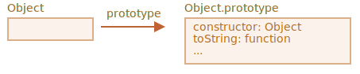

# 原生的原型

`"prototype"` 属性在 JavaScript 自身的核心部分中被广泛地应用。所有的内置构造函数都用到了它。

首先，我们将看看原生原型的详细信息，然后学习如何使用它为内建对象添加新功能。

## Object.prototype

假如我们输出一个空对象：

```js run
let obj = {};
alert( obj ); // "[object Object]" ?
```

生成字符串 `"[object Object]"` 的代码在哪里？那就是一个内建的 `toString` 方法，但是它在哪里呢？`obj` 是空的！

……然而简短的表达式 `obj = {}` 和 `obj = new Object()` 是一个意思，其中 `Object` 就是一个内建的对象构造函数，其自身的 `prototype` 指向一个带有 `toString` 和其他方法的一个巨大的对象。

就像这样：



当 `new Object()` 被调用（或一个字面量对象 `{...}` 被创建），按照前面章节中我们学习过的规则，这个对象的 `[[Prototype]]` 属性被设置为 `Object.prototype`：


所以，之后当 `obj.toString()` 被调用时，这个方法是从 `Object.prototype` 中获取的。

我们可以这样验证它：

```js run
let obj = {};

alert(obj.__proto__ === Object.prototype); // true
// obj.toString === obj.__proto__.toString == Object.prototype.toString
```

请注意在 `Object.prototype` 上方的链中没有更多的 `[[Prototype]]`：

```js run
alert(Object.prototype.__proto__); // null
```

## 其他内建原型

其他内建对象，像 `Array`、`Date`、`Function` 及其他，都在 prototype 上挂载了方法。

例如，当我们创建一个数组 `[1, 2, 3]`，在内部会默认使用 `new Array()` 构造函数。因此 `Array.prototype` 变成了这个数组的 prototype，并为这个数组提供数组的操作方法。这样内存的存储效率是很高的。

按照规范，所有的内建原型顶端都是 `Object.prototype`。这就是为什么有人说“一切都从对象继承而来”。

下面是完整的示意图（3 个内建对象）：


让我们手动验证原型：

```js run
let arr = [1, 2, 3];

// 它继承自 Array.prototype？
alert( arr.__proto__ === Array.prototype ); // true

// 接下来继承自 Object.prototype？
alert( arr.__proto__.__proto__ === Object.prototype ); // true

// 原型链的顶端为 null。
alert( arr.__proto__.__proto__.__proto__ ); // null
```

一些方法在原型上可能会发生重叠，例如，`Array.prototype` 有自己的 `toString` 方法来列举出来数组的所有元素并用逗号分隔每一个元素。

```js run
let arr = [1, 2, 3]
alert(arr); // 1,2,3 <-- Array.prototype.toString 的结果
```

正如我们之前看到的那样，`Object.prototype` 也有 `toString` 方法，但是 `Array.prototype` 在原型链上更近，所以数组对象原型上的方法会被使用。


浏览器内的工具，像 Chrome 开发者控制台也会显示继承性（可能需要对内置对象使用 `console.dir`）：


其他内建对象也以同样的方式运行。即使是函数 —— 它们是内建构造函数 `Function` 的对象，并且它们的方法（`call`/`apply` 及其他）都取自 `Function.prototype`。函数也有自己的 `toString` 方法。

```js run
function f() {}

alert(f.__proto__ == Function.prototype); // true
alert(f.__proto__.__proto__ == Object.prototype); // true, inherit from objects
```

## 基本数据类型

最复杂的事情发生在字符串、数字和布尔值上。

正如我们记忆中的那样，它们并不是对象。但是如果我们试图访问它们的属性，那么临时包装器对象将会通过内建的构造函数 `String`、`Number` 和 `Boolean` 被创建。它们提供给我们操作字符串、数字和布尔值的方法然后消失。

这些对象对我们来说是无形地创建出来的。大多数引擎都会对其进行优化，但是规范中描述的就是通过这种方式。这些对象的方法也驻留在它们的 prototype 中，可以通过 `String.prototype`、`Number.prototype` 和 `Boolean.prototype` 进行获取。

```warn header="值 `null` 和 `undefined` 没有对象包装器"
特殊值 `null` 和 `undefined` 比较特殊。它们没有对象包装器，所以它们没有方法和属性。并且它们也没有相应的原型。
```

## 更改原生原型 [#native-prototype-change]

原生的原型是可以被修改的。例如，我们在 `String.prototype` 中添加一个方法，这个方法对所有的字符串都是可用的：

```js run
String.prototype.show = function() {
  alert(this);
};

"BOOM!".show(); // BOOM!
```

在开发的过程中我们可能会想在内置对象上创建一个我们想要的方法。把他们添加到原生对象的原型中可能看起来不错，但那样通常来说是个坏主意。

原型是全局的，所以很容易造成冲突。如果有两个代码段都添加了 `String.prototype.show` 方法，那么其中一个将覆盖另外一个。

在现代编程中，只有一种情况下修改原生原型是被允许的。那就是在做 polyfills （译者注：兼容）的时候。换句话说，如果有一个 JavaScript 规范还没有被我们的 JavaScript 引擎支持（或者我们希望被支持的那些规范），那么需要手动实现这些规范并且把这些手动实现填充到内置对象的原型上。

例如：

```js run
if (!String.prototype.repeat) { //假设没有这个方法
  //把它添加到原型上

  String.prototype.repeat = function(n) {
    //重复字符串 n 次

    //实际上代码是比这个更复杂的，
    //当 "n" 的值为负数的时候抛出异常
    //完整的算法在规范中
    return new Array(n + 1).join(this);
  };
}

alert( "La".repeat(3) ); // LaLaLa
```

## 从原型中借用

在 <info:call-apply-decorators#method-borrowing> 章节中我们讨论的方法借用：

```js run
function showArgs() {
*!*
  // 从数组借用 join 方法并在 arguments 的上下文中调用
  alert( [].join.call(arguments, " - ") );
*/!*
}

showArgs("John", "Pete", "Alice"); // John - Pete - Alice
```

因为 `join` 方法在 `Array.prototype` 对象上，我们可以直接调用它并且重写上面的代码：

```js
function showArgs() {
*!*
  alert( Array.prototype.join.call(arguments, " - ") );
*/!*
}
```

这样是更有效率的，因为它避免了一个额外数组对象 `[]` 的创建。另一方面，这样做，需要更长的时间来编写。

## 总结

- 所有的内置对象都遵循一样的模式：
    - 方法都存储在原型对象上（`Array.prototype`、`Object.prototype`、`Date.prototype` 等）。
    - 对象本身只存储数据（数组元素、对象属性、日期）。
- 基本数据类型同样在包装对象的原型上存储方法：`Number.prototype`、`String.prototype` 和 `Boolean.prototype`。只有 `undefined` 和 `null` 没有包装对象。
- 内置对象的原型可以被修改或者被新的方法填充。但是这样做是不被推荐的。只有当添加一个还没有被 JavaScript 引擎支持的新方法的时候才可能允许这样做。
