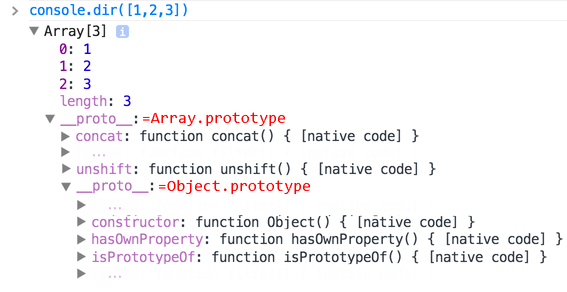

# 原生的原型

`"prototype"` 属性在 JavaScript 自身的核心部分中被广泛地应用。所有的内置构造函数都用到了它。

首先，我们将看看原生原型的详细信息，然后学习如何使用它为内建对象添加新功能。

## Object.prototype

假如我们输出一个空对象：

```js run
let obj = {};
alert( obj ); // "[object Object]" ?
```

生成字符串 `"[object Object]"` 的代码在哪里？那就是一个内建的 `toString` 方法，但是它在哪里呢？`obj` 是空的！

……然而简短的表达式 `obj = {}` 和 `obj = new Object()` 是一个意思，其中 `Object` 就是一个内建的对象构造函数，其自身的 `prototype` 指向一个带有 `toString` 和其他方法的一个巨大的对象。

就像这样：


当 `new Object()` 被调用（或一个字面量对象 `{...}` 被创建），按照前面章节中我们学习过的规则，这个对象的 `[[Prototype]]` 属性被设置为 `Object.prototype`：


所以，之后当 `obj.toString()` 被调用时，这个方法是从 `Object.prototype` 中获取的。

我们可以这样验证它：

```js run
let obj = {};

alert(obj.__proto__ === Object.prototype); // true

alert(obj.toString === obj.__proto__.toString); //true
alert(obj.toString === Object.prototype.toString); //true
```

请注意在 `Object.prototype` 上方的链中没有更多的 `[[Prototype]]`：

```js run
alert(Object.prototype.__proto__); // null
```

## 其他内建原型

其他内建对象，像 `Array`、`Date`、`Function` 及其他，都在 prototype 上挂载了方法。

例如，当我们创建一个数组 `[1, 2, 3]`，在内部会默认使用 `new Array()` 构造器。因此 `Array.prototype` 变成了这个数组的 prototype，并为这个数组提供数组的操作方法。这样内存的存储效率是很高的。

按照规范，所有的内建原型顶端都是 `Object.prototype`。这就是为什么有人说“一切都从对象继承而来”。

下面是完整的示意图（3 个内建对象）：


让我们手动验证原型：

```js run
let arr = [1, 2, 3];

// 它继承自 Array.prototype？
alert( arr.__proto__ === Array.prototype ); // true

// 接下来继承自 Object.prototype？
alert( arr.__proto__.__proto__ === Object.prototype ); // true

// 原型链的顶端为 null。
alert( arr.__proto__.__proto__.__proto__ ); // null
```

一些方法在原型上可能会发生重叠，例如，`Array.prototype` 有自己的 `toString` 方法来列举出来数组的所有元素并用逗号分隔每一个元素。

```js run
let arr = [1, 2, 3]
alert(arr); // 1,2,3 <-- Array.prototype.toString 的结果
```

正如我们之前看到的那样，`Object.prototype` 也有 `toString` 方法，但是 `Array.prototype` 在原型链上更近，所以数组对象原型上的方法会被使用。


浏览器内的工具，像 Chrome 开发者控制台也会显示继承性（可能需要对内置对象使用 `console.dir`）：



其他内建对象也以同样的方式运行。即使是函数 —— 它们是内建构造器 `Function` 的对象，并且它们的方法（`call`/`apply` 及其他）都取自 `Function.prototype`。函数也有自己的 `toString` 方法。

```js run
function f() {}

alert(f.__proto__ == Function.prototype); // true
alert(f.__proto__.__proto__ == Object.prototype); // true, inherit from objects
```

## 基本数据类型

最复杂的事情发生在字符串、数字和布尔值上。

正如我们记忆中的那样，它们并不是对象。但是如果我们试图访问它们的属性，那么临时包装器对象将会通过内建的构造器 `String`、`Number` 和 `Boolean` 被创建。它们提供给我们操作字符串、数字和布尔值的方法然后消失。

这些对象对我们来说是无形地创建出来的。大多数引擎都会对其进行优化，但是规范中描述的就是通过这种方式。这些对象的方法也驻留在它们的 prototype 中，可以通过 `String.prototype`、`Number.prototype` 和 `Boolean.prototype` 进行获取。

```warn header="值 `null` 和 `undefined` 没有对象包装器"
特殊值 `null` 和 `undefined` 比较特殊。它们没有对象包装器，所以它们没有方法和属性。并且它们也没有相应的原型。
```

## 更改原生原型 [#native-prototype-change]

原生的原型是可以被修改的。例如，我们向 `String.prototype` 中添加一个方法，这个方法将对所有的字符串都是可用的：

```js run
String.prototype.show = function() {
  alert(this);
};

"BOOM!".show(); // BOOM!
```

在开发的过程中，我们可能会想要一些新的内建方法，并且想把它们添加到原生原型中。但这通常是一个很不好的想法。

```warn
原型是全局的，所以很容易造成冲突。如果有两个库都添加了 `String.prototype.show` 方法，那么其中的一个方法将被另一个覆盖。

所以，通常来说，修改原生原型被认为是一个很不好的想法。
```

**在现代编程中，只有一种情况下允许修改原生原型。那就是 polyfilling。**

Polyfilling 是一个术语，表示某个方法在 JavaScript 规范中已存在，但是特定的 JavaScript 引擎尚不支持该方法，那么我们可以通过手动实现它，并用以填充内建原型。

例如：

```js run
if (!String.prototype.repeat) { // 如果这儿没有这个方法
  // 那就在 prototype 中添加它

  String.prototype.repeat = function(n) {
    // 重复传入的字符串 n 次

    // 实际上，实现代码比这个要复杂一些（完整的方法可以在规范中找到）
    // 但即使是不够完美的 polyfill 也常常被认为是足够好的
    return new Array(n + 1).join(this);
  };
}

alert( "La".repeat(3) ); // LaLaLa
```


## 从原型中借用

在 <info:call-apply-decorators#method-borrowing> 一章中，我们讨论了方法借用。

那是指我们从一个对象获取一个方法，并将其复制到另一个对象。

一些原生原型的方法通常会被借用。

例如，如果我们要创建类数组对象，则可能需要向其中复制一些 `Array` 方法。

例如：

```js run
let obj = {
  0: "Hello",
  1: "world!",
  length: 2,
};

*!*
obj.join = Array.prototype.join;
*/!*

alert( obj.join(',') ); // Hello,world!
```

上面这段代码有效，是因为内建的方法 `join` 的内部算法只关心正确的索引和 `length` 属性。它不会检查这个对象是否是真正的数组。许多内建方法就是这样。

另一种方式是通过将 `obj.__proto__` 设置为 `Array.prototype`，这样 `Array` 中的所有方法都自动地可以在 `obj` 中使用了。

但是如果 `obj` 已经从另一个对象进行了继承，那么这种方法就不可行了（译注：因为这样会覆盖掉已有的继承。此处 `obj` 其实已经从 `Object` 进行了继承，但是 `Array` 也继承自 `Object`，所以此处的方法借用不会影响 `obj` 对原有继承的继承，因为 `obj` 通过原型链依旧继承了 `Object`）。请记住，我们一次只能继承一个对象。

方法借用很灵活，它允许在需要时混合来自不同对象的方法。

## 总结

- 所有的内建对象都遵循相同的模式（pattern）：
    - 方法都存储在 prototype 中（`Array.prototype`、`Object.prototype`、`Date.prototype` 等）。
    - 对象本身只存储数据（数组元素、对象属性、日期）。
- 原始数据类型也将方法存储在包装器对象的 prototype 中：`Number.prototype`、`String.prototype` 和 `Boolean.prototype`。只有 `undefined` 和 `null` 没有包装器对象。
- 内建原型可以被修改或被用新的方法填充。但是不建议更改它们。唯一允许的情况可能是，当我们添加一个还没有被 JavaScript 引擎支持，但已经被加入 JavaScript 规范的新标准时，才可能允许这样做。
