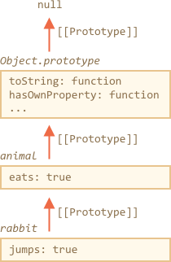

# Getting all properties

There are many ways to get keys/values from an object.

Most of them operate on the object itself, excluding the prototype, let's recall them:

- [Object.keys(obj)](mdn:js/Object/keys) / [Object.values(obj)](mdn:js/Object/values) / [Object.entries(obj)](mdn:js/Object/entries) -- returns an array of enumerable own string property names/values/key-value pairs. These methods only list *enumerable* properties, and those that have *strings as keys*.

If we want symbolic properties:

- [Object.getOwnPropertySymbols(obj)](mdn:js/Object/getOwnPropertySymbols) -- returns an array of all own symbolic property names.

If we want non-enumerable properties:

- [Object.getOwnPropertyNames(obj)](mdn:js/Object/getOwnPropertyNames) -- returns an array of all own string property names.

If we want *all* properties:

- [Reflect.ownKeys(obj)](mdn:js/Reflect/ownKeys) -- returns an array of all own property names.

These methods are a bit different about which properties they return, but all of them operate on the object itself. Properties from the prototype are not listed.

## for..in loop

The `for..in` loop is different: it loops over inherited properties too.

For instance:

```js run
let animal = {
  eats: true
};

let rabbit = {
  jumps: true,
  __proto__: animal
};

*!*
// only own keys
alert(Object.keys(rabbit)); // jumps
*/!*

*!*
// inherited keys too
for(let prop in rabbit) alert(prop); // jumps, then eats
*/!*
```

If that's not what we want, and we'd like to exclude inherited properties, there's a built-in method [obj.hasOwnProperty(key)](mdn:js/Object/hasOwnProperty): it returns `true` if `obj` has its own (not inherited) property named `key`.

So we can filter out inherited properties (or do something else with them):

```js run
let animal = {
  eats: true
};

let rabbit = {
  jumps: true,
  __proto__: animal
};

for(let prop in rabbit) {
  let isOwn = rabbit.hasOwnProperty(prop);
  alert(`${prop}: ${isOwn}`); // jumps: true, then eats: false
}
```

Here we have the following inheritance chain: `rabbit`, then `animal`, then `Object.prototype` (because `animal` is a literal object `{...}`, so it's by default), and then `null` above it:



Note, there's one funny thing. Where is the method `rabbit.hasOwnProperty` coming from? Looking at the chain we can see that the method is provided by `Object.prototype.hasOwnProperty`. In other words, it's inherited.

...But why `hasOwnProperty` does not appear in `for..in` loop, if it lists all inherited properties?  The answer is simple: it's not enumerable. Just like all other properties of `Object.prototype`. That's why they are not listed.

## Summary

Most methods ignore inherited properties, with a notable exception of `for..in`.

For the latter we can use [obj.hasOwnProperty(key)](mdn:js/Object/hasOwnProperty): it returns `true` if `obj` has its own (not inherited) property named `key`.
