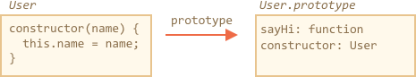

<<<<<<< HEAD
# Class 基本语法

```quote author="Wikipedia"
在面向对象的编程中，class 是用于创建对象的可扩展的程序代码模版，它为对象提供了状态（成员变量）的初始值和行为（成员函数和方法）的实现。
```

在日常开发中，我们经常要创建许多相同类型的对象，比如用户（users）、商品（goods）或者其他任何东西。

在 <info:constructor-new> 章节中我们已经知道，`new function` 可以做到这样。

但是在现代 JavaScript 中，有一个更为高级的类（class）构造方式，它引入了对于面向对象编程很有用的功能。

## “class” 语法

基本语法是：
```js
class MyClass {
  // class 方法
=======
# Class basic syntax

```quote author="Wikipedia"
In object-oriented programming, a *class* is an extensible program-code-template for creating objects, providing initial values for state (member variables) and implementations of behavior (member functions or methods).
```

In practice, we often need to create many objects of the same kind, like users, or goods or whatever.

As we already know from the chapter <info:constructor-new>, `new function` can help with that.

But in the modern JavaScript, there's a more advanced "class" construct, that introduces great new features which are useful for object-oriented programming.

## The "class" syntax

The basic syntax is:
```js
class MyClass {
  // class methods
>>>>>>> 9b5c1c95ec8a466150e519b0e94748717c747b09
  constructor() { ... }
  method1() { ... }
  method2() { ... }
  method3() { ... }
  ...
}
```

<<<<<<< HEAD
然后通过 `new MyClass()` 来创建具有上述列出的所有方法的新对象。

通过 `new` 关键词创建的对象会自动调用 `constructor()` 方法，因此我们可以在 `constructor()` 里初始化对象。

例如：
=======
Then `new MyClass()` creates a new object with all the listed methods.

The `constructor()` method is called automatically by `new`, so we can initialize the object there.

For example:
>>>>>>> 9b5c1c95ec8a466150e519b0e94748717c747b09

```js run
class User {

  constructor(name) {
    this.name = name;
  }

  sayHi() {
    alert(this.name);
  }

}

<<<<<<< HEAD
// 使用方法：
=======
// Usage:
>>>>>>> 9b5c1c95ec8a466150e519b0e94748717c747b09
let user = new User("John");
user.sayHi();
```

<<<<<<< HEAD
当 `new User("John")` 被调用：
1. 一个新对象被创建。
2. `constructor` 构造器使用给定的参数运行，并为其分配 `this.name`。

...然后我们就可以调用诸如 `user.sayHi` 这样的方法了。


```warn header="类方法之间没有逗号"
经验不足的开发者常犯的语法错误是在类方法之间加一个逗号。

这里的符号不要与对象字面量相混淆，在类中，不需要逗号。
```

## 什么是 class？

所以，`class` 到底是什么？正如人们可能认为的那样，这不是一个全新的语言级实体。

让我们揭开其神秘面纱，看看类究竟是什么。这将会有助于你理解许多复杂的方面。

在 JavaScript 中，类是一种函数。

看看下面这段代码：
=======
When `new User("John")` is called:
1. A new object is created.
2. The `constructor` runs with the given argument and assigns `this.name` to it.

...Then we can call methods, such as `user.sayHi`.


```warn header="No comma between class methods"
A common pitfall for novice developers is to put a comma between class methods, which would result in a syntax error.

The notation here is not to be confused with object literals. Within the class, no commas are required.
```

## What is a class?

So, what exactly is a `class`? That's not an entirely new language-level entity, as one might think.

Let's unveil any magic and see what a class really is. That'll help in understanding many complex aspects.

In JavaScript, a class is a kind of a function.

Here, take a look:
>>>>>>> 9b5c1c95ec8a466150e519b0e94748717c747b09

```js run
class User {
  constructor(name) { this.name = name; }
  sayHi() { alert(this.name); }
}

<<<<<<< HEAD
// 佐证：User 是一个函数
=======
// proof: User is a function
>>>>>>> 9b5c1c95ec8a466150e519b0e94748717c747b09
*!*
alert(typeof User); // function
*/!*
```

<<<<<<< HEAD
`class User {...}` 构造器内部为我们做了什么：
1. 创建一个以 `User` 为名称的函数，这是类声明的结果。
    - 函数代码来自于 `constructor` 中的方法（如果我们不写这样的方法，那么就假设它为空的）。
2. 储存所有方法，例如 `User.prototype` 中的 `sayHi`。

然后，对于新的对象，当我们调用方法时，它取自原型，就像我们在 <info:function-prototype> 章节中描述的那样。所以 `new User` 对象可以访问类中的方法。

我们可以将 `class User` 声明结果解释为：



下面这些代码很好的解释了它们：
=======
What `class User {...}` construct really does is:
1. Creates a function named `User`, that becomes the result of the class declaration.
    - The function code is taken from the `constructor` method (assumed empty if we don't write such method).
3. Stores all methods, such as `sayHi`, in `User.prototype`.

Afterwards, for new objects, when we call a method, it's taken from the prototype, just as  described in the chapter <info:function-prototype>. So `new User` object has access to class methods.

We can illustrate the result of `class User` declaration as:


Here's the code to introspect it:
>>>>>>> 9b5c1c95ec8a466150e519b0e94748717c747b09


```js run
class User {
  constructor(name) { this.name = name; }
  sayHi() { alert(this.name); }
}

<<<<<<< HEAD
// 类是函数
alert(typeof User); // function

// ...或者，更确切地说是构造方法
alert(User === User.prototype.constructor); // true

// User.prototype 中的方法，比如：
alert(User.prototype.sayHi); // alert(this.name);

// 实际上在原型中有两个方法
alert(Object.getOwnPropertyNames(User.prototype)); // constructor, sayHi
```

## 不仅仅是语法糖

人们常说 `class` 是 JavaScript 中的语法糖，主要是因为我们可以在没有 `class` 的情况下声明同样的内容：

```js run
// 以纯函数的重写 User 类

// 1. 创建构造器函数
function User(name) {
  this.name = name;
}
// 任何函数原型默认具有构造器属性，
// 所以，我们不需要创建它

// 2. 向原型中添加方法
=======
// class is a function
alert(typeof User); // function

// ...or, more precisely, the constructor method
alert(User === User.prototype.constructor); // true

// The methods are in User.prototype, e.g:
alert(User.prototype.sayHi); // alert(this.name);

// there are exactly two methods in the prototype
alert(Object.getOwnPropertyNames(User.prototype)); // constructor, sayHi
```

## Not just a syntax sugar

Sometimes people say that `class` is a "syntax sugar" in JavaScript, because we could actually declare the same without `class` keyword at all:

```js run
// rewriting class User in pure functions

// 1. Create constructor function
function User(name) {
  this.name = name;
}
// any function prototype has constructor property by default,
// so we don't need to create it

// 2. Add the method to prototype
>>>>>>> 9b5c1c95ec8a466150e519b0e94748717c747b09
User.prototype.sayHi = function() {
  alert(this.name);
};

<<<<<<< HEAD
// 使用方法：
=======
// Usage:
>>>>>>> 9b5c1c95ec8a466150e519b0e94748717c747b09
let user = new User("John");
user.sayHi();
```

<<<<<<< HEAD
这和定义的结果大致相同。因此，这确实是 `class` 被视为一种定义构造函数及其原型方法的语法糖的理由。

尽管它们存在重大差异：

1. 首先，通过 `class` 创建的函数是由特殊内部属性标记的 `[[FunctionKind]]:"classConstructor"`。所以，相较于手动创建它还是有点不同的。

    不像普通函数，调用类构造器时必须要用 `new` 关键词：
=======
The result of this definition is about the same. So, there are indeed reasons why `class` can be considered a syntax sugar to define a constructor together with its prototype methods.

Although, there are important differences.

1. First, a function created by `class` is labelled by a special internal property `[[FunctionKind]]:"classConstructor"`. So it's not entirely the same as creating it manually.

    Unlike a regular function, a class constructor can't be called without `new`:
>>>>>>> 9b5c1c95ec8a466150e519b0e94748717c747b09

    ```js run
    class User {
      constructor() {}
    }

    alert(typeof User); // function
<<<<<<< HEAD
    User(); // Error: 没有 ‘new’ 关键词，类构造器 User 无法调用 
    ```

    此外，大多数 JavaScript 引擎中的类构造函数的字符串表示形式都以 “class” 开头
=======
    User(); // Error: Class constructor User cannot be invoked without 'new'
    ```

    Also, a string representation of a class constructor in most JavaScript engines starts with the "class..."
>>>>>>> 9b5c1c95ec8a466150e519b0e94748717c747b09

    ```js run
    class User {
      constructor() {}
    }

    alert(User); // class User { ... }
    ```

<<<<<<< HEAD
2. 类方法不可枚举。
    对于 `"prototype"` 中的所有方法，类定义将 `enumerable` 标记设为 `false。

    这很好，因为如果我们对一个对象调用 `for..in` 方法，我们通常不希望 class 方法出现。

3. 类默认使用 `use strict`。
    在类构造函数中的所有方法自动使用严格模式。


此外，除了它的基础操作外，`class` 语法也带来许多其他功能，我们稍后将会探索它们。

## 类表达式（Class Expression）

正如函数一样，类可以在另外一个表达式中定义，传递（passed around），返回（returned），调用（assigned）等

这里是类表达式的例子：
=======
2. Class methods are non-enumerable.
    A class definition sets `enumerable` flag to `false` for all methods in the `"prototype"`.

    That's good, because if we `for..in` over an object, we usually don't want its class methods.

3. Classes always `use strict`.
    All code inside the class construct is automatically in strict mode.


Also, in addition to its basic operation, the `class` syntax brings many other features with it which we'll explore later.

## Class Expression

Just like functions, classes can be defined inside another expression, passed around, returned, assigned etc.

Here's an example of a class expression:
>>>>>>> 9b5c1c95ec8a466150e519b0e94748717c747b09

```js
let User = class {
  sayHi() {
    alert("Hello");
  }
};
```

<<<<<<< HEAD
类似于命名函数表达式（Named Function Expressions），类表达式可能也可能没有名称。

如果类表达式有名称，它仅在类内部可见：

```js run
// “命名类表达式”
// （规范中没有这样的术语，但是它和命名函数表达式类似）
let User = class *!*MyClass*/!* {
  sayHi() {
    alert(MyClass); // MyClass 仅在其内部可见
  }
};

new User().sayHi(); // 正常运行，显示 MyClass 中定义的内容

alert(MyClass); // 错误，MyClass 在外部不可见
```


我们甚至可以“按需”动态创建类，就像这样：

```js run
function makeClass(phrase) {
  // 声明并返回类
=======
Similar to Named Function Expressions, class expressions may or may not have a name.

If a class expression has a name, it's visible inside the class only:

```js run
// "Named Class Expression"
// (no such term in the spec, but that's similar to Named Function Expression)
let User = class *!*MyClass*/!* {
  sayHi() {
    alert(MyClass); // MyClass is visible only inside the class
  }
};

new User().sayHi(); // works, shows MyClass definition

alert(MyClass); // error, MyClass not visible outside of the class
```


We can even make classes dynamically "on-demand", like this:

```js run
function makeClass(phrase) {
  // declare a class and return it
>>>>>>> 9b5c1c95ec8a466150e519b0e94748717c747b09
  return class {
    sayHi() {
      alert(phrase);
    };
  };
}

<<<<<<< HEAD
// 创建新类
=======
// Create a new class
>>>>>>> 9b5c1c95ec8a466150e519b0e94748717c747b09
let User = makeClass("Hello");

new User().sayHi(); // Hello
```


<<<<<<< HEAD
## Getters/setters 及其他 shorthands

就像对象字面量，类可能包括 getters/setters，generators，计算属性（computed properties）等。

这是使用 `get/set` 实现 `user.name` 的示例：
=======
## Getters/setters, other shorthands

Just like literal objects, classes may include getters/setters, generators, computed properties etc.

Here's an example for `user.name` implemented using `get/set`:
>>>>>>> 9b5c1c95ec8a466150e519b0e94748717c747b09

```js run
class User {

  constructor(name) {
<<<<<<< HEAD
    // 调用 setter
=======
    // invokes the setter
>>>>>>> 9b5c1c95ec8a466150e519b0e94748717c747b09
    this.name = name;
  }

*!*
  get name() {
*/!*
    return this._name;
  }

*!*
  set name(value) {
*/!*
    if (value.length < 4) {
      alert("Name is too short.");
      return;
    }
    this._name = value;
  }

}

let user = new User("John");
alert(user.name); // John

user = new User(""); // Name too short.
```

<<<<<<< HEAD
类声明在 `User.prototype` 中创建 getters 和 setters，就像这样：
=======
The class declaration creates getters and setters in `User.prototype`, like this:
>>>>>>> 9b5c1c95ec8a466150e519b0e94748717c747b09

```js
Object.defineProperties(User.prototype, {
  name: {
    get() {
      return this._name
    },
    set(name) {
      // ...
    }
  }
});
```

<<<<<<< HEAD
这是计算属性的例子：
=======
Here's an example with computed properties:
>>>>>>> 9b5c1c95ec8a466150e519b0e94748717c747b09

```js run
function f() { return "sayHi"; }

class User {
  [f()]() {
    alert("Hello");
  }

}

new User().sayHi();
```

<<<<<<< HEAD
对于 generator 方法，类似的，在它前面添加 `*`。

## Class 属性

```warn header="旧的浏览器可能需要 polyfill"
类级别的属性是最近才添加到语言中的。
```

上面的例子中，`User` 只有方法。现在我们为其添加属性：
=======
For a generator method, similarly, prepend it with `*`.

## Class properties

```warn header="Old browsers may need a polyfill"
Class-level properties are a recent addition to the language.
```

In the example above, `User` only had methods. Let's add a property:
>>>>>>> 9b5c1c95ec8a466150e519b0e94748717c747b09

```js run
class User {
  name = "Anonymous";

  sayHi() {
    alert(`Hello, ${this.name}!`);
  }
}

new User().sayHi();
```

<<<<<<< HEAD
属性不在 `User.prototype` 内。相反它是通过 `new` 分别为每个对象创建的。所以，该属性永远不会在同一个类的不同对象之间共享。


## 总结

基本的类语法看起来是这样的：
=======
The property is not placed into `User.prototype`. Instead, it is created by `new`, separately for every object. So, the property will never be shared between different objects of the same class.


## Summary

The basic class syntax looks like this:
>>>>>>> 9b5c1c95ec8a466150e519b0e94748717c747b09

```js
class MyClass {
  prop = value; // field

<<<<<<< HEAD
  constructor(...) { // 构造器
    // ...
  }

  method(...) {} // 方法

  get something(...) {} // getter 方法
  set something(...) {} // setter 方法

  [Symbol.iterator]() {} // 计算 name/symbol 名方法
=======
  constructor(...) { // constructor
    // ...
  }

  method(...) {} // method

  get something(...) {} // getter method
  set something(...) {} // setter method

  [Symbol.iterator]() {} // method with computed name/symbol name
>>>>>>> 9b5c1c95ec8a466150e519b0e94748717c747b09
  // ...
}
```

<<<<<<< HEAD
技术上来说，`MyClass` 是一个函数（我们提供作为 `constructor` 的那个），而 methods，getters 和 settors 都被写入 `MyClass.prototype`。

在下一章，我们将会进一步研究类，包括继承在内的其他功能。
=======
`MyClass` is technically a function (the one that we provide as `constructor`), while methods, getters and settors are written to `MyClass.prototype`.

In the next chapters we'll learn more about classes, including inheritance and other features.
>>>>>>> 9b5c1c95ec8a466150e519b0e94748717c747b09
