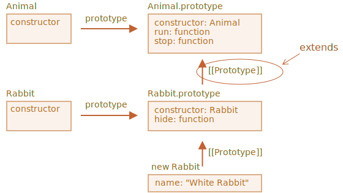

<<<<<<< HEAD
# 类继承

类继承是一个类扩展另一个类的一种方式。

因此，我们可以在现有功能之上创建新功能。

## "extends" 关键字

假设我们有 class `Animal`：
=======
# Class inheritance

Class inheritance is a way for one class to extend another class.

So we can create new functionality on top of the existing.

## The "extends" keyword

Let's say we have class `Animal`:
>>>>>>> ae1171069c2e50b932d030264545e126138d5bdc

```js
class Animal {
  constructor(name) {
    this.speed = 0;
    this.name = name;
  }
  run(speed) {
    this.speed = speed;
    alert(`${this.name} runs with speed ${this.speed}.`);
  }
  stop() {
    this.speed = 0;
    alert(`${this.name} stands still.`);
  }
}

let animal = new Animal("My animal");
```

<<<<<<< HEAD
这是我们对对象 `animal` 和 class `Animal` 的图形化表示：


……然后我们想创建另一个 `class Rabbit`：

因为 rabbits 是 animals，所以 class `Rabbit` 应该是基于 class `Animal` 的，可以访问 animal 的方法，以便 rabbits 可以做“一般”动物可以做的事儿。

扩展另一个类的语法是：`class Child extends Parent`。

让我们创建一个继承自 `Animal` 的 `class Rabbit`：
=======
Here's how we can represent `animal` object and `Animal` class graphically:


...And we would like to create another `class Rabbit`.

As rabbits are animals, `Rabbit` class should be based on `Animal`, have access to animal methods, so that rabbits can do what "generic" animals can do.

The syntax to extend another class is: `class Child extends Parent`.

Let's create `class Rabbit` that inherits from `Animal`:
>>>>>>> ae1171069c2e50b932d030264545e126138d5bdc

```js
*!*
class Rabbit extends Animal {
*/!*
  hide() {
    alert(`${this.name} hides!`);
  }
}

let rabbit = new Rabbit("White Rabbit");

rabbit.run(5); // White Rabbit runs with speed 5.
rabbit.hide(); // White Rabbit hides!
```

<<<<<<< HEAD
Class `Rabbit` 的对象可以访问例如 `rabbit.hide()` 等 `Rabbit` 的方法，还可以访问例如 `rabbit.run()` 等 `Animal` 的方法。

在内部，关键字 `extends` 使用了很好的旧的原型机制进行工作。它将 `Rabbit.prototype.[[Prototype]]` 设置为 `Animal.prototype`。所以，如果在 `Rabbit.prototype` 中找不到一个方法，JavaScript 就会从 `Animal.prototype` 中获取该方法。



例如，要查找 `rabbit.run` 方法，JavaScript 引擎会进行如下检查（如图所示从下到上）：
1. 查找对象 `rabbit`（没有 `run`）。
2. 查找它的原型，即 `Rabbit.prototype`（有 `hide`，但没有 `run`）。
3. 查找它的原型，即（由于 `extends`）`Animal.prototype`，在这儿找到了 `run` 方法。

我们可以回忆一下 <info:native-prototypes> 这一章的内容，JavaScript 内建对象同样也使用原型继承。例如，`Date.prototype.[[Prototype]]` 是 `Object.prototype`。这就是为什么日期可以访问通用对象的方法。

````smart header="在 `extends` 后允许任意表达式"
类语法不仅允许指定一个类，在 `extends` 后可以指定任意表达式。

例如，一个生成父类的函数调用：
=======
Object of `Rabbit` class have access to both `Rabbit` methods, such as `rabbit.hide()`, and also to `Animal` methods, such as `rabbit.run()`.

Internally, `extends` keyword works using the good old prototype mechanics. It sets `Rabbit.prototype.[[Prototype]]` to `Animal.prototype`. So, if a method is not found in `Rabbit.prototype`, JavaScript takes it from `Animal.prototype`.


For instance, to find `rabbit.run` method, the engine checks (bottom-up on the picture):
1. The `rabbit` object (has no `run`).
2. Its prototype, that is `Rabbit.prototype` (has `hide`, but not `run`).
3. Its prototype, that is (due to `extends`) `Animal.prototype`, that finally has the `run` method.

As we can recall from the chapter <info:native-prototypes>, JavaScript itself uses prototypal inheritance for built-in objects. E.g. `Date.prototype.[[Prototype]]` is `Object.prototype`. That's why dates have access to generic object methods.

````smart header="Any expression is allowed after `extends`"
Class syntax allows to specify not just a class, but any expression after `extends`.

For instance, a function call that generates the parent class:
>>>>>>> ae1171069c2e50b932d030264545e126138d5bdc

```js run
function f(phrase) {
  return class {
    sayHi() { alert(phrase) }
  }
}

*!*
class User extends f("Hello") {}
*/!*

new User().sayHi(); // Hello
```
<<<<<<< HEAD
这里 `class User` 继承自 `f("Hello")` 的结果。

这对于高级编程模式，例如当我们根据许多条件使用函数生成类，并继承它们时来说可能很有用。
````

## 重写方法

现在，让我们继续前行并尝试重写一个方法。默认情况下，所有未在 `class Rabbit` 中指定的方法均从 `class Animal` 中直接获取。

但是如果我们在 `Rabbit` 中指定了我们自己的方法，例如 `stop()`，那么将会使用它：
=======
Here `class User` inherits from the result of `f("Hello")`.

That may be useful for advanced programming patterns when we use functions to generate classes depending on many conditions and can inherit from them.
````

## Overriding a method

Now let's move forward and override a method. By default, all methods that are not specified in `class Rabbit` are taken directly "as is" from `class Animal`.

But if we specify our own method in `Rabbit`, such as `stop()` then it will be used instead:
>>>>>>> ae1171069c2e50b932d030264545e126138d5bdc

```js
class Rabbit extends Animal {
  stop() {
<<<<<<< HEAD
    // ……现在这个将会被用作 rabbit.stop()
    // 而不是来自于 class Animal 的 stop()
=======
    // ...now this will be used for rabbit.stop()
    // instead of stop() from class Animal
>>>>>>> ae1171069c2e50b932d030264545e126138d5bdc
  }
}
```

<<<<<<< HEAD
但是通常来说，我们不希望完全替换父类的方法，而是希望在父类方法的基础上进行调整或扩展其功能。我们在我们的方法中做一些事儿，但是在它之前或之后或在过程中会调用父类方法。

Class 为此提供了 `"super"` 关键字。

- 执行 `super.method(...)` 来调用一个父类方法。
- 执行 `super(...)` 来调用一个父类 constructor（只能在我们的 constructor 中）。

例如，让我们的 rabbit 在停下来的时候自动 hide：
=======
Usually we don't want to totally replace a parent method, but rather to build on top of it to tweak or extend its functionality. We do something in our method, but call the parent method before/after it or in the process.

Classes provide `"super"` keyword for that.

- `super.method(...)` to call a parent method.
- `super(...)` to call a parent constructor (inside our constructor only).

For instance, let our rabbit autohide when stopped:
>>>>>>> ae1171069c2e50b932d030264545e126138d5bdc

```js run
class Animal {

  constructor(name) {
    this.speed = 0;
    this.name = name;
  }

  run(speed) {
    this.speed = speed;
    alert(`${this.name} runs with speed ${this.speed}.`);
  }

  stop() {
    this.speed = 0;
    alert(`${this.name} stands still.`);
  }

}

class Rabbit extends Animal {
  hide() {
    alert(`${this.name} hides!`);
  }

*!*
  stop() {
<<<<<<< HEAD
    super.stop(); // 调用父类的 stop
    this.hide(); // 然后 hide
=======
    super.stop(); // call parent stop
    this.hide(); // and then hide
>>>>>>> ae1171069c2e50b932d030264545e126138d5bdc
  }
*/!*
}

let rabbit = new Rabbit("White Rabbit");

<<<<<<< HEAD
rabbit.run(5); // White Rabbit 以速度 5 奔跑
rabbit.stop(); // White Rabbit 停止了。White rabbit hide 了！
```

现在，`Rabbit` 在执行过程中调用父类的 `super.stop()` 方法，所以 `Rabbit` 也具有了 `stop` 方法。

````smart header="箭头函数没有 `super`"
正如我们在 <info:arrow-functions> 一章中所提到的，箭头函数没有 `super`。

如果被访问，它会从外部函数获取。例如：
```js
class Rabbit extends Animal {
  stop() {
    setTimeout(() => super.stop(), 1000); // 1 秒后调用父类的 stop
=======
rabbit.run(5); // White Rabbit runs with speed 5.
rabbit.stop(); // White Rabbit stands still. White rabbit hides!
```

Now `Rabbit` has the `stop` method that calls the parent `super.stop()` in the process.

````smart header="Arrow functions have no `super`"
As was mentioned in the chapter <info:arrow-functions>, arrow functions do not have `super`.

If accessed, it's taken from the outer function. For instance:
```js
class Rabbit extends Animal {
  stop() {
    setTimeout(() => super.stop(), 1000); // call parent stop after 1sec
>>>>>>> ae1171069c2e50b932d030264545e126138d5bdc
  }
}
```

<<<<<<< HEAD
箭头函数中的 `super` 与 `stop()` 中的是一样的，所以它能按预期工作。如果我们在这里指定一个“普通”函数，那么将会抛出错误：

```js
// 意料之外的 super
=======
The `super` in the arrow function is the same as in `stop()`, so it works as intended. If we specified a "regular" function here, there would be an error:

```js
// Unexpected super
>>>>>>> ae1171069c2e50b932d030264545e126138d5bdc
setTimeout(function() { super.stop() }, 1000);
```
````


<<<<<<< HEAD
## 重写 constructor

对于重写 constructor 来说，则有点棘手。

到目前为止，`Rabbit` 还没有自己的 `constructor`。

根据 [规范](https://tc39.github.io/ecma262/#sec-runtime-semantics-classdefinitionevaluation)，如果一个类扩展了另一个类并且没有 `constructor`，那么将生成下面这样的“空” `constructor`：

```js
class Rabbit extends Animal {
  // 为没有自己的 constructor 的扩展类生成的
=======
## Overriding constructor

With constructors it gets a little bit tricky.

Until now, `Rabbit` did not have its own `constructor`.

According to the [specification](https://tc39.github.io/ecma262/#sec-runtime-semantics-classdefinitionevaluation), if a class extends another class and has no `constructor`, then the following "empty" `constructor` is generated:

```js
class Rabbit extends Animal {
  // generated for extending classes without own constructors
>>>>>>> ae1171069c2e50b932d030264545e126138d5bdc
*!*
  constructor(...args) {
    super(...args);
  }
*/!*
}
```

<<<<<<< HEAD
正如我们所看到的，它调用了父类的 `constructor`，并传递了所有的参数。如果我们没有写自己的 constructor，就会出现这种情况。

现在，我们给 `Rabbit` 添加一个自定义的 constructor。除了 `name` 之外，它还会指定 `earLength`。
=======
As we can see, it basically calls the parent `constructor` passing it all the arguments. That happens if we don't write a constructor of our own.

Now let's add a custom constructor to `Rabbit`. It will specify the `earLength` in addition to `name`:
>>>>>>> ae1171069c2e50b932d030264545e126138d5bdc

```js run
class Animal {
  constructor(name) {
    this.speed = 0;
    this.name = name;
  }
  // ...
}

class Rabbit extends Animal {

*!*
  constructor(name, earLength) {
    this.speed = 0;
    this.name = name;
    this.earLength = earLength;
  }
*/!*

  // ...
}

*!*
<<<<<<< HEAD
// 不工作！
=======
// Doesn't work!
>>>>>>> ae1171069c2e50b932d030264545e126138d5bdc
let rabbit = new Rabbit("White Rabbit", 10); // Error: this is not defined.
*/!*
```

<<<<<<< HEAD
哎呦！我们得到了一个报错。现在我们没法新建 rabbit。是什么地方出错了？

简短的解释是：

**继承类的 constructor 必须调用 `super(...)`，并且 (!) 一定要在使用 `this` 之前调用。**

……但这是为什么呢？这里发生了什么？确实，这个要求看起来很奇怪。

当然，本文会给出一个解释。让我们深入细节，这样你就可以真正地理解发生了什么。

在 JavaScript 中，继承类（所谓的“派生构造器”，英文为 "derived constructor"）的构造函数与其他函数之间是有区别的。派生构造器具有特殊的内部属性 `[[ConstructorKind]]:"derived"`。这是一个特殊的内部标签。

该标签会影响它的 `new` 行为：

- 当通过 `new` 执行一个常规函数时，它将创建一个空对象，并将这个空对象赋值给 `this`。
- 但是当继承的 constructor 执行时，它不会执行此操作。它期望父类的 constructor 来完成这项工作。

因此，派生的 constructor 必须调用 `super` 才能执行其父类（base）的 constructor，否则 `this` 指向的那个对象将不会被创建。并且我们会收到一个报错。

为了让 `Rabbit` 的 constructor 可以工作，它需要在使用 `this` 之前调用 `super()`，就像下面这样：
=======
Whoops! We've got an error. Now we can't create rabbits. What went wrong?

The short answer is:

- **Constructors in inheriting classes must call `super(...)`, and (!) do it before using `this`.**

...But why? What's going on here? Indeed, the requirement seems strange.

Of course, there's an explanation. Let's get into details, so you'll really understand what's going on.

In JavaScript, there's a distinction between a constructor function of an inheriting class (so-called "derived constructor") and other functions. A derived constructor has a special internal property `[[ConstructorKind]]:"derived"`. That's a special internal label.

That label affects its behavior with `new`.

- When a regular function is executed with `new`, it creates an empty object and assigns it to `this`.
- But when a derived constructor runs, it doesn't do this. It expects the parent constructor to do this job.

So a derived constructor must call `super` in order to execute its parent (base) constructor, otherwise the object for `this` won't be created. And we'll get an error.

For the `Rabbit` constructor to work, it needs to call `super()` before using `this`, like here:
>>>>>>> ae1171069c2e50b932d030264545e126138d5bdc

```js run
class Animal {

  constructor(name) {
    this.speed = 0;
    this.name = name;
  }

  // ...
}

class Rabbit extends Animal {

  constructor(name, earLength) {
*!*
    super(name);
*/!*
    this.earLength = earLength;
  }

  // ...
}

*!*
<<<<<<< HEAD
// 现在可以了
=======
// now fine
>>>>>>> ae1171069c2e50b932d030264545e126138d5bdc
let rabbit = new Rabbit("White Rabbit", 10);
alert(rabbit.name); // White Rabbit
alert(rabbit.earLength); // 10
*/!*
```


### Overriding class fields: a tricky note

```warn header="Advanced note"
This note assumes you have a certain experience with classes, maybe in other programming languages.

It provides better insight into the language and also explains the behavior that might be a source of bugs (but not very often).

If you find it difficult to understand, just go on, continue reading, then return to it some time later.
```

We can override not only methods, but also class fields.

Although, there's a tricky behavior when we access an overridden field in parent constructor, quite different from most other programming languages.

Consider this example:

```js run
class Animal {
  name = 'animal'

  constructor() {
    alert(this.name); // (*)
  }
}

class Rabbit extends Animal {
  name = 'rabbit';
}

new Animal(); // animal
*!*
new Rabbit(); // animal
*/!*
```

Here, class `Rabbit` extends `Animal` and overrides `name` field with its own value.

There's no own constructor in `Rabbit`, so `Animal` constructor is called.

What's interesting is that in both cases: `new Animal()` and `new Rabbit()`, the `alert` in the line `(*)` shows `animal`.

**In other words, parent constructor always uses its own field value, not the overridden one.**

What's odd about it?

If it's not clear yet, please compare with methods.

Here's the same code, but instead of `this.name` field we call `this.showName()` method:

```js run
class Animal {
  showName() {  // instead of this.name = 'animal'
    alert('animal');
  }

  constructor() {
    this.showName(); // instead of alert(this.name);
  }
}

class Rabbit extends Animal {
  showName() {
    alert('rabbit');
  }
}

new Animal(); // animal
*!*
new Rabbit(); // rabbit
*/!*
```

Please note: now the output is different.

And that's what we naturally expect. When the parent constructor is called in the derived class, it uses the overridden method.

...But for class fields it's not so. As said, the parent constructor always uses the parent field.

Why is there the difference?

Well, the reason is in the field initialization order. The class field is initialized:
- Before constructor for the base class (that doesn't extend anything),
- Imediately after `super()` for the derived class.

In our case, `Rabbit` is the derived class. There's no `constructor()` in it. As said previously, that's the same as if there was an empty constructor with only `super(...args)`.

So, `new Rabbit()` calls `super()`, thus executing the parent constructor, and (per the rule for derived classes) only after that its class fields are initialized. At the time of the parent constructor execution, there are no `Rabbit` class fields yet, that's why `Animal` fields are used.

This subtle difference between fields and methods is specific to JavaScript

Luckily, this behavior only reveals itself if an overridden field is used in the parent constructor. Then it may be difficult to understand what's going on, so we're explaining it here.

If it becomes a problem, one can fix it by using methods or getters/setters instead of fields.


<<<<<<< HEAD
## 深入：内部探究和 [[HomeObject]]

```warn header="进阶内容"
如果你是第一次阅读本教程，那么则可以跳过本节。

这是关于继承和 `super` 背后的内部机制。
```

让我们更深入地研究 `super`。我们将在这个过程中发现一些有趣的事儿。

首先要说的是，从我们迄今为止学到的知识来看，`super` 是不可能运行的。

的确是这样，让我们问问自己，以技术的角度它是如何工作的？当一个对象方法执行时，它会将当前对象作为 `this`。随后如果我们调用 `super.method()`，那么引擎需要从当前对象的原型中获取 `method`。但这是怎么做到的？

这个任务看起来是挺容易的，但其实并不简单。引擎知道当前对象的 `this`，所以它可以获取父 `method` 作为 `this.__proto__.method`。不幸的是，这个“天真”的解决方法是行不通的。

让我们演示一下这个问题。简单起见，我们使用普通对象而不使用类。

如果你不想知道更多的细节知识，你可以跳过此部分，并转到下面的 `[[HomeObject]]` 小节。这没关系的。但如果你感兴趣，想学习更深入的知识，那就继续阅读吧。

在下面的例子中，`rabbit.__proto__ = animal`。现在让我们尝试一下：在 `rabbit.eat()` 我们将会使用 `this.__proto__` 调用 `animal.eat()`：
=======
## Super: internals, [[HomeObject]]

```warn header="Advanced information"
If you're reading the tutorial for the first time - this section may be skipped.

It's about the internal mechanisms behind inheritance and `super`.
```

Let's get a little deeper under the hood of `super`. We'll see some interesting things along the way.

First to say, from all that we've learned till now, it's impossible for `super` to work at all!

Yeah, indeed, let's ask ourselves, how it should technically work? When an object method runs, it gets the current object as `this`. If we call `super.method()` then, the engine needs to get the `method` from the prototype of the current object. But how?

The task may seem simple, but it isn't. The engine knows the current object `this`, so it could get the parent `method` as `this.__proto__.method`. Unfortunately, such a "naive" solution won't work.

Let's demonstrate the problem. Without classes, using plain objects for the sake of simplicity.

You may skip this part and go below to the `[[HomeObject]]` subsection if you don't want to know the details. That won't harm. Or read on if you're interested in understanding things in-depth.

In the example below, `rabbit.__proto__ = animal`. Now let's try: in `rabbit.eat()` we'll call `animal.eat()`, using `this.__proto__`:
>>>>>>> ae1171069c2e50b932d030264545e126138d5bdc

```js run
let animal = {
  name: "Animal",
  eat() {
    alert(`${this.name} eats.`);
  }
};

let rabbit = {
  __proto__: animal,
  name: "Rabbit",
  eat() {
*!*
<<<<<<< HEAD
    // 这就是 super.eat() 可以大概工作的方式
=======
    // that's how super.eat() could presumably work
>>>>>>> ae1171069c2e50b932d030264545e126138d5bdc
    this.__proto__.eat.call(this); // (*)
*/!*
  }
};

rabbit.eat(); // Rabbit eats.
```

<<<<<<< HEAD
在 `(*)` 这一行，我们从原型（`animal`）中获取 `eat`，并在当前对象的上下文中调用它。请注意，`.call(this)` 在这里非常重要，因为简单的调用 `this.__proto__.eat()` 将在原型的上下文中执行 `eat`，而非当前对象。

在上面的代码中，它确实按照了期望运行：我们获得了正确的 `alert`。

现在，让我们在原型链上再添加一个对象。我们将看到这件事是如何被打破的：
=======
At the line `(*)` we take `eat` from the prototype (`animal`) and call it in the context of the current object. Please note that `.call(this)` is important here, because a simple `this.__proto__.eat()` would execute parent `eat` in the context of the prototype, not the current object.

And in the code above it actually works as intended: we have the correct `alert`.

Now let's add one more object to the chain. We'll see how things break:
>>>>>>> ae1171069c2e50b932d030264545e126138d5bdc

```js run
let animal = {
  name: "Animal",
  eat() {
    alert(`${this.name} eats.`);
  }
};

let rabbit = {
  __proto__: animal,
  eat() {
    // ...bounce around rabbit-style and call parent (animal) method
    this.__proto__.eat.call(this); // (*)
  }
};

let longEar = {
  __proto__: rabbit,
  eat() {
    // ...do something with long ears and call parent (rabbit) method
    this.__proto__.eat.call(this); // (**)
  }
};

*!*
longEar.eat(); // Error: Maximum call stack size exceeded
*/!*
```

<<<<<<< HEAD
代码无法再运行了！我们可以看到，在试图调用 `longEar.eat()` 时抛出了错误。

原因可能不那么明显，但是如果我们跟踪 `longEar.eat()` 调用，就可以发现原因。在 `(*)` 和 `(**)` 这两行中，`this` 的值都是当前对象（`longEar`）。这是至关重要的一点：所有的对象方法都将当前对象作为 `this`，而非原型或其他什么东西。

因此，在 `(*)` 和 `(**)` 这两行中，`this.__proto__` 的值是完全相同的：都是 `rabbit`。它们俩都调用的是 `rabbit.eat`，它们在不停地循环调用自己，而不是在原型链上向上寻找方法。

这张图介绍了发生的情况：


1. 在 `longEar.eat()` 中，`(**)` 这一行调用 `rabbit.eat` 并为其提供 `this=longEar`。
    ```js
    // 在 longEar.eat() 中我们有 this = longEar
    this.__proto__.eat.call(this) // (**)
    // 变成了
    longEar.__proto__.eat.call(this)
    // 也就是
    rabbit.eat.call(this);
    ```
2. 之后在 `rabbit.eat` 的 `(*)` 行中，我们希望将函数调用在原型链上向更高层传递，但是 `this=longEar`，所以 `this.__proto__.eat` 又是 `rabbit.eat`！

    ```js
    // 在 rabbit.eat() 中我们依然有 this = longEar
    this.__proto__.eat.call(this) // (*)
    // 变成了
    longEar.__proto__.eat.call(this)
    // 或（再一次）
    rabbit.eat.call(this);
    ```

3. ……所以 `rabbit.eat` 在不停地循环调用自己，因此它无法进一步地提升。

这个问题没法仅仅通过使用 `this` 来解决。

### `[[HomeObject]]`

为了提供解决方法，JavaScript 为函数添加了一个特殊的内部属性：`[[HomeObject]]`。

当一个函数被定义为类或者对象方法时，它的 `[[HomeObject]]` 属性就成为了该对象。

然后 `super` 使用它来解析（resolve）父原型及其方法。

让我们看看它是怎么工作的，首先，对于普通对象：
=======
The code doesn't work anymore! We can see the error trying to call `longEar.eat()`.

It may be not that obvious, but if we trace `longEar.eat()` call, then we can see why. In both lines `(*)` and `(**)` the value of `this` is the current object (`longEar`). That's essential: all object methods get the current object as `this`, not a prototype or something.

So, in both lines `(*)` and `(**)` the value of `this.__proto__` is exactly the same: `rabbit`. They both call `rabbit.eat` without going up the chain in the endless loop.

Here's the picture of what happens:


1. Inside `longEar.eat()`, the line `(**)` calls `rabbit.eat` providing it with `this=longEar`.
    ```js
    // inside longEar.eat() we have this = longEar
    this.__proto__.eat.call(this) // (**)
    // becomes
    longEar.__proto__.eat.call(this)
    // that is
    rabbit.eat.call(this);
    ```
2. Then in the line `(*)` of `rabbit.eat`, we'd like to pass the call even higher in the chain, but `this=longEar`, so `this.__proto__.eat` is again `rabbit.eat`!

    ```js
    // inside rabbit.eat() we also have this = longEar
    this.__proto__.eat.call(this) // (*)
    // becomes
    longEar.__proto__.eat.call(this)
    // or (again)
    rabbit.eat.call(this);
    ```

3. ...So `rabbit.eat` calls itself in the endless loop, because it can't ascend any further.

The problem can't be solved by using `this` alone.

### `[[HomeObject]]`

To provide the solution, JavaScript adds one more special internal property for functions: `[[HomeObject]]`.

When a function is specified as a class or object method, its `[[HomeObject]]` property becomes that object.

Then `super` uses it to resolve the parent prototype and its methods.

Let's see how it works, first with plain objects:
>>>>>>> ae1171069c2e50b932d030264545e126138d5bdc

```js run
let animal = {
  name: "Animal",
  eat() {         // animal.eat.[[HomeObject]] == animal
    alert(`${this.name} eats.`);
  }
};

let rabbit = {
  __proto__: animal,
  name: "Rabbit",
  eat() {         // rabbit.eat.[[HomeObject]] == rabbit
    super.eat();
  }
};

let longEar = {
  __proto__: rabbit,
  name: "Long Ear",
  eat() {         // longEar.eat.[[HomeObject]] == longEar
    super.eat();
  }
};

*!*
<<<<<<< HEAD
// 正确执行
=======
// works correctly
>>>>>>> ae1171069c2e50b932d030264545e126138d5bdc
longEar.eat();  // Long Ear eats.
*/!*
```

<<<<<<< HEAD
它基于 `[[HomeObject]]` 运行机制按照预期执行。一个方法，例如 `longEar.eat`，知道其 `[[HomeObject]]` 并且从其原型中获取父方法。并没有使用 `this`。

### 方法并不是“自由”的

正如我们之前所知道的，函数通常都是“自由”的，并没有绑定到 JavaScript 中的对象。正因如此，它们可以在对象之间复制，并用另外一个 `this` 调用它。

`[[HomeObject]]` 的存在违反了这个原则，因为方法记住了它们的对象。`[[HomeObject]]` 不能被更改，所以这个绑定是永久的。

在 JavaScript 语言中 `[[HomeObject]]` 仅被用于 `super`。所以，如果一个方法不使用 `super`，那么我们仍然可以视它为自由的并且可在对象之间复制。但是用了 `super` 再这样做可能就会出错。

下面是复制后错误的 `super` 结果的示例：
=======
It works as intended, due to `[[HomeObject]]` mechanics. A method, such as `longEar.eat`, knows its `[[HomeObject]]` and takes the parent method from its prototype. Without any use of `this`.

### Methods are not "free"

As we've known before, generally functions are "free", not bound to objects in JavaScript. So they can be copied between objects and called with another `this`.

The very existence of `[[HomeObject]]` violates that principle, because methods remember their objects. `[[HomeObject]]` can't be changed, so this bond is forever.

The only place in the language where `[[HomeObject]]` is used -- is `super`. So, if a method does not use `super`, then we can still consider it free and copy between objects. But with `super` things may go wrong.

Here's the demo of a wrong `super` result after copying:
>>>>>>> ae1171069c2e50b932d030264545e126138d5bdc

```js run
let animal = {
  sayHi() {
    console.log(`I'm an animal`);
  }
};

<<<<<<< HEAD
// rabbit 继承自 animal
=======
// rabbit inherits from animal
>>>>>>> ae1171069c2e50b932d030264545e126138d5bdc
let rabbit = {
  __proto__: animal,
  sayHi() {
    super.sayHi();
  }
};

let plant = {
  sayHi() {
    console.log("I'm a plant");
  }
};

<<<<<<< HEAD
// tree 继承自 plant
=======
// tree inherits from plant
>>>>>>> ae1171069c2e50b932d030264545e126138d5bdc
let tree = {
  __proto__: plant,
*!*
  sayHi: rabbit.sayHi // (*)
*/!*
};

*!*
tree.sayHi();  // I'm an animal (?!?)
*/!*
```

<<<<<<< HEAD
调用 `tree.sayHi()` 显示 "I'm an animal"。这绝对是错误的。

原因很简单：
- 在 `(*)` 行，`tree.sayHi` 方法是从 `rabbit` 复制而来。也许我们只是想避免重复代码？
- 它的 `[[HomeObject]]` 是 `rabbit`，因为它是在 `rabbit` 中创建的。没有办法修改 `[[HomeObject]]`。
- `tree.sayHi()` 内具有 `super.sayHi()`。它从 `rabbit` 中上溯，然后从 `animal` 中获取方法。

这是发生的情况示意图：


### 方法，不是函数属性

`[[HomeObject]]` 是为类和普通对象中的方法定义的。但是对于对象而言，方法必须确切指定为 `method()`，而不是 `"method: function()"`。

这个差别对我们来说可能不重要，但是对 JavaScript 来说却非常重要。

在下面的例子中，使用非方法（non-method）语法进行了比较。未设置 `[[HomeObject]]` 属性，并且继承无效：

```js run
let animal = {
  eat: function() { // 这里是故意这样写的，而不是 eat() {...
=======
A call to `tree.sayHi()` shows "I'm an animal". Definitely wrong.

The reason is simple:
- In the line `(*)`, the method `tree.sayHi` was copied from `rabbit`. Maybe we just wanted to avoid code duplication?
- Its `[[HomeObject]]` is `rabbit`, as it was created in `rabbit`. There's no way to change `[[HomeObject]]`.
- The code of `tree.sayHi()` has `super.sayHi()` inside. It goes up from `rabbit` and takes the method from `animal`.

Here's the diagram of what happens:


### Methods, not function properties

`[[HomeObject]]` is defined for methods both in classes and in plain objects. But for objects, methods must be specified exactly as `method()`, not as `"method: function()"`.

The difference may be non-essential for us, but it's important for JavaScript.

In the example below a non-method syntax is used for comparison. `[[HomeObject]]` property is not set and the inheritance doesn't work:

```js run
let animal = {
  eat: function() { // intentionally writing like this instead of eat() {...
>>>>>>> ae1171069c2e50b932d030264545e126138d5bdc
    // ...
  }
};

let rabbit = {
  __proto__: animal,
  eat: function() {
    super.eat();
  }
};

*!*
<<<<<<< HEAD
rabbit.eat();  // 错误调用 super（因为这里没有 [[HomeObject]]）
*/!*
```

## 总结

1. 想要扩展一个类：`class Child extends Parent`：
    - 这意味着 `Child.prototype.__proto__` 将是 `Parent.prototype`，所以方法会被继承。
2. 重写一个 constructor：
    - 在使用 `this` 之前，我们必须在 `Child` 的 constructor 中将父 constructor 调用为 `super()`。
3. 重写一个方法：
    - 我们可以在一个 `Child` 方法中使用 `super.method()` 来调用 `Parent` 方法。
4. 内部：
    - 方法在内部的 `[[HomeObject]]` 属性中记住了它们的类/对象。这就是 `super` 如何解析父方法的。
    - 因此，将一个带有 `super` 的方法从一个对象复制到另一个对象是不安全的。

补充：
- 箭头函数没有自己的 `this` 或 `super`，所以它们能融入到就近的上下文中，像透明似的。
=======
rabbit.eat();  // Error calling super (because there's no [[HomeObject]])
*/!*
```

## Summary

1. To extend a class: `class Child extends Parent`:
    - That means `Child.prototype.__proto__` will be `Parent.prototype`, so methods are inherited.
2. When overriding a constructor:
    - We must call parent constructor as `super()` in `Child` constructor before using `this`.
3. When overriding another method:
    - We can use `super.method()` in a `Child` method to call `Parent` method.
4. Internals:
    - Methods remember their class/object in the internal `[[HomeObject]]` property. That's how `super` resolves parent methods.
    - So it's not safe to copy a method with `super` from one object to another.

Also:
- Arrow functions don't have their own `this` or `super`, so they transparently fit into the surrounding context.
>>>>>>> ae1171069c2e50b932d030264545e126138d5bdc
