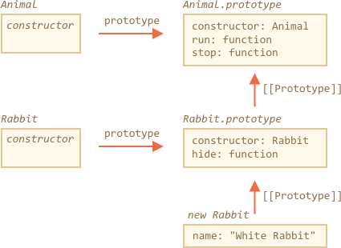

# 类继承

假设我们有两个类：

`Animal`:

```js
class Animal {
  constructor(name) {
    this.speed = 0;
    this.name = name;
  }
  run(speed) {
    this.speed += speed;
    alert(`${this.name} runs with speed ${this.speed}.`);
  }
  stop() {
    this.speed = 0;
    alert(`${this.name} stopped.`);
  }
}

let animal = new Animal("My animal");
```


...和 `Rabbit`:

```js
class Rabbit {
  constructor(name) {
    this.name = name;
  }
  hide() {
    alert(`${this.name} hides!`);
  }
}

let rabbit = new Rabbit("My rabbit");
```


现在，它们是完全独立的。

但是，我们想要 `Rabbit` 继承自 `Animal`。换句话说，rabbits 应该基于 animals，具有访问 `Animal` 的权限，并使用自己的方法扩展它们。

要继承自另一个类，我们需要在 `{..}` 前指定 `“extends”` 和父类。

在这里，`Rabbit` 继承自 `Animal`：

```js run
class Animal {
  constructor(name) {
    this.speed = 0;
    this.name = name;
  }
  run(speed) {
    this.speed += speed;
    alert(`${this.name} runs with speed ${this.speed}.`);
  }
  stop() {
    this.speed = 0;
    alert(`${this.name} stopped.`);
  }
}

// 通过指定“extends Animal”让 Rabbit 继承自 Animal
*!*
class Rabbit extends Animal {
*/!*
  hide() {
    alert(`${this.name} hides!`);
  }
}

let rabbit = new Rabbit("White Rabbit");

rabbit.run(5); // White Rabbit runs with speed 5.
rabbit.hide(); // White Rabbit hides!
```

现在 `Rabbit` 代码变简洁了一点，因为它默认以 `Animal` 作为其构造函数，同时它仍然能良好“运行”，就像 animals 一样。

在其内部，`extends` 关键字将 `[[Prototype]]` 引用从 `Rabbit.prototype` 添加到 `Animal.prototype`：



因此，如果在 `Rabbit.prototype` 中没有找到某个方法，JavaScript 将会从 `Animal.prototype` 中获取它。

我们可以回忆一下这一章 <info:native-prototypes>，JavaScript 对内置对象使用相同的类型继承。例如，`Date.prototype.[[Prototype]]` 是 `Object.prototype`，所以 dates 有通用的对象方法。

````smart header="`extends` 后允许任何表达式"
类语法不仅可以指定一个类，还可以指定 `extends` 之后的任何表达式。

例如，一个生成父类的函数调用：

```js run
function f(phrase) {
  return class {
    sayHi() { alert(phrase) }
  }
}

*!*
class User extends f("Hello") {}
*/!*

new User().sayHi(); // Hello
```
这里 `class User` 继承自 `f("Hello")` 的结果

当我们使用函数根据许多条件生成类并且可以从它们继承时，这对于高级编程模式来说可能很有用。
````

## 重写方法

现在，让我们继续前行并尝试重写一个方法。到目前为止，`Rabbit` 继承了 `Animal` 中的 `stop` 方法，该方法设置了 `this.speed = 0`。

如果我们在 `Rabbit` 中定义了我们自己的 `stop` 方法，那么它将被用来代替 `Animal` 中的 `stop`：

```js
class Rabbit extends Animal {
  stop() {
    // ...这将用于 rabbit.stop()
  }
}
```


...但是通常来说，我们不希望完全替换父类的方法，而是希望基于它做一些调整或者功能性的扩展。我们在我们的方法中做一些事情，但是在它之前/之后或在执行过程中调用父类方法。

为此，类提供了 `"super"` 关键字。

- 执行 `super.method(...)` 调用父类方法。
- 执行 `super(...)` 调用父类构造函数（只能在子类的构造函数中运行）。

例如，让我们的兔子在停下来的时候自动隐藏：

```js run
class Animal {

  constructor(name) {
    this.speed = 0;
    this.name = name;
  }

  run(speed) {
    this.speed += speed;
    alert(`${this.name} runs with speed ${this.speed}.`);
  }

  stop() {
    this.speed = 0;
    alert(`${this.name} stopped.`);
  }

}

class Rabbit extends Animal {
  hide() {
    alert(`${this.name} hides!`);
  }

*!*
  stop() {
    super.stop(); // 调用父类的 stop 函数
    this.hide(); // 然后隐藏
  }
*/!*
}

let rabbit = new Rabbit("White Rabbit");

rabbit.run(5); // White Rabbit runs with speed 5.
rabbit.stop(); // White Rabbit stopped. White rabbit hides!
```

现在 `Rabbit` 拥有自己的 `stop` 方法，并且在执行中会调用父类的 `super.stop()`。

````smart header="箭头函数没有 `super`"
正如我们在 <info:arrow-functions> 章节中所提到的，箭头函数没有 `super`。

如果被访问，它会从外部函数获取。例如：
```js
class Rabbit extends Animal {
  stop() {
    setTimeout(() => super.stop(), 1000); // 1 秒后调用父类 stop 方法
  }
}
```

箭头函数中的 `super` 与 `stop()` 是相同的，所以它能按预期工作。如果我们在这里指定一个“普通”函数，那么将会抛出错误：

```js
// Unexpected super
setTimeout(function() { super.stop() }, 1000);
```
````


## 重写构造函数

对于构造函数来说，重写则有点棘手。

到目前为止，`Rabbit` 还没有自己的 `constructor`。

根据 [规范](https://tc39.github.io/ecma262/#sec-runtime-semantics-classdefinitionevaluation)，如果一个类继承了另一个类并且没有 `constructor`，那么将生成以下 “空” `constructor`：

```js
class Rabbit extends Animal {
  // 为没有构造函数的继承类生成以下的构造函数
*!*
  constructor(...args) {
    super(...args);
  }
*/!*
}
```

我们可以看到，它调用了父类的 `constructor`，并传递了所有的参数。如果我们不写自己的构造函数，就会出现这种情况。

现在，我们给 `Rabbit` 添加一个自定义的构造函数。除了 `name` 它还会定义 `earLength`。

```js run
class Animal {
  constructor(name) {
    this.speed = 0;
    this.name = name;
  }
  // ...
}

class Rabbit extends Animal {

*!*
  constructor(name, earLength) {
    this.speed = 0;
    this.name = name;
    this.earLength = earLength;
  }
*/!*

  // ...
}

*!*
// 不生效！
let rabbit = new Rabbit("White Rabbit", 10); // Error: Error: this is not defined.
*/!*
```

哎呦！我们得到一个报错。现在我们没法新建兔子了。是什么地方出错了？

简短的解释下原因：继承类的构造函数必须调用 `super(...)`，并且 (!) 一定要在使用 this 之前调用。

...但这是为什么呢？这里发生了什么？这个要求确实看起来很奇怪。

当然，本文会给出一个解释。让我们深入细节，这样你就可以真正的理解发生了什么。

在 JavaScript 中，“继承类的构造函数”与所有其他的构造函数之间存在区别。在继承类中，相应的构造函数会被标记为特殊的内部属性 `[[ConstructorKind]]:"derived"`。

不同点就在于：

- 当一个普通构造函数执行时，它会创建一个空对象作为 `this` 并继续执行。
- 但是当继承的构造函数执行时，它并不会做这件事。它期望父类的构造函数来完成这项工作。

因此，如果我们构建了我们自己的构造函数，我们必须调用 `super`，因为如果不这样的话 `this` 指向的对象不会被创建。并且我们会收到一个报错。

为了让 `Rabbit` 可以运行，我们需要在使用 `this` 之前调用 `super()`，就像下面这样：

```js run
class Animal {

  constructor(name) {
    this.speed = 0;
    this.name = name;
  }

  // ...
}

class Rabbit extends Animal {

  constructor(name, earLength) {
*!*
    super(name);
*/!*
    this.earLength = earLength;
  }

  // ...
}

*!*
// 现在可以了
let rabbit = new Rabbit("White Rabbit", 10);
alert(rabbit.name); // White Rabbit
alert(rabbit.earLength); // 10
*/!*
```


## Super：内部基于 [[HomeObject]] 实现

让我们再深入的去研究下 `super`。顺便说一句，我们会发现一些有趣的事情。

首先要说的是，从我们迄今为止学到的知识来看，`super` 是不可能运行的。

的确是这样，让我们问问自己，在技术上它是如何实现的？当一个对象方法运行时，它会将当前对象作为 `this`。如果之后我们调用 `super.method()`，它需要从当前对象的原型中调用 `method`。

任务看起来是挺容易的，但其实并不简单。引擎知道当前对象的 `this`，因此它可以获取父 `method` 作为 `this.__proto__.method`。不幸的是，这个“天真”的解决方法是行不通的。

让我们来说明一下这个问题。没有类，为简单起见，使用普通对象。

在下面的例子中是 `rabbit.__proto__ = animal`。现在让我们尝试一下：在 `rabbit.eat()` 我们将会通过 `this.__proto__` 调用 `animal.eat()`：

```js run
let animal = {
  name: "Animal",
  eat() {
    alert(`${this.name} eats.`);
  }
};

let rabbit = {
  __proto__: animal,
  name: "Rabbit",
  eat() {
*!*
    // 这就是 super.eat() 可能运行的原因
    this.__proto__.eat.call(this); // (*)
*/!*
  }
};

rabbit.eat(); // Rabbit eats.
```

在 (\*) 这一行，我们从原型（`animal`）上获取 `eat`，并在当前对象的上下文中调用它。请注意，`.call(this)` 在这里非常重要，因为简单的调用 `this.__proto__.eat()` 将在原型的上下文中执行 `eat`，而非当前对象。

在上述的代码中，它按照期望运行：我们获得了正确的 `alert`。

现在让我们在原型链上再添加一个额外的对象。我们将看到这件事是如何被打破的：

```js run
let animal = {
  name: "Animal",
  eat() {
    alert(`${this.name} eats.`);
  }
};

let rabbit = {
  __proto__: animal,
  eat() {
    // ...围绕 rabbit-style 和 调用父类（animal）方法
    this.__proto__.eat.call(this); // (*)
  }
};

let longEar = {
  __proto__: rabbit,
  eat() {
    // ...用长耳朵做一些事情，并调用父类（rabbit）的方法
    this.__proto__.eat.call(this); // (**)
  }
};

*!*
longEar.eat(); // Error: Maximum call stack size exceeded
*/!*
```

代码无法再运行了！我们可以看到，在试图调用 `longEar.eat()` 时抛出了错误。

原因可能不那么明显，但是如果我们跟踪 `longEar.eat()` 的调用，就可以发现原因。在 (\*) 和 (\*\*) 这两行中，`this` 的值都是当前对象（`longEar`）。这是至关重要的一点：所有的对象方法都将当前对象作为 `this`，而非原型或其他什么东西。

因此，在 (\*) 和 (\*\*) 这两行中，`this.__proto__` 的值是完全相同的：都是 `rabbit`。在这个无限循环中，他们都调用了 `rabbit.eat`，而不是在原型链上向上寻找方法。

这张图介绍了发生的情况：


1. 在 `longEar.eat()` 中，(\*\*) 这一行调用 `rabbit.eat` 并且此时 `this=longEar`。
    ```js
    // 在 longEar.eat() 中 this 指向 longEar
    this.__proto__.eat.call(this) // (**)
    // 变成了
    longEar.__proto__.eat.call(this)
    // 即等同于
    rabbit.eat.call(this);
    ```
2. 之后在 `rabbit.eat` 的 (\*) 行中，我们希望将函数调用在原型链上向更高层传递，但是因为 `this=longEar`，因此 `this.__proto__.eat` 又是 `rabbit.eat`！

    ```js
    // 在 rabbit.eat() 中 this 依旧等于 longEar
    this.__proto__.eat.call(this) // (*)
    // 变成了
    longEar.__proto__.eat.call(this)
    // 再次等同于
    rabbit.eat.call(this);
    ```

3. ...所以 `rabbit.eat` 不停地循环调用自己，因此它无法进一步地往原型链的更高层调用。

这个问题没法单独使用 `this` 来解决。

### `[[HomeObject]]`

为了提供解决方法，JavaScript 为函数额外添加了一个特殊的内部属性：`[[HomeObject]]`。

当一个函数被定义为类或者对象方法时，它的 `[[HomeObject]]` 属性就成为那个对象。

然后 `super` 使用它来解析父类原型和它自己的方法。

让我们看看它是怎么工作的，首先，对于普通对象：

```js run
let animal = {
  name: "Animal",
  eat() {         // animal.eat.[[HomeObject]] == animal
    alert(`${this.name} eats.`);
  }
};

let rabbit = {
  __proto__: animal,
  name: "Rabbit",
  eat() {         // rabbit.eat.[[HomeObject]] == rabbit
    super.eat();
  }
};

let longEar = {
  __proto__: rabbit,
  name: "Long Ear",
  eat() {         // longEar.eat.[[HomeObject]] == longEar
    super.eat();
  }
};

*!*
// 正常运行
longEar.eat();  // Long Ear eats.
*/!*
```

它按照预期运行，基于 `[[HomeObject]]` 技巧。像 `longEar.eat` 这样的方法，知道 `[[HomeObject]]`，并且从它的原型中获取父类方法。并没有使用 `this`。

### 方法并不是 “自由” 的

在前面我们已经知道，通常函数都是 “自由” 的，并没有绑定到 JavaScript。正因如此，它们可以在对象之间复制，并且用另外一个 `this` 调用它。

`[[HomeObject]]` 的存在违反了这个原则，因为方法记住了它们的对象。`[[HomeObject]]` 不能被修改，所以这个绑定是永久的。

在 JavaScript 语言中 `[[HomeObject]]` 仅被用于 `super`。所以，如果一个方法不使用 `super`，那么我们仍然可以视它为自由的并且可在对象之间复制。但是在 `super` 中可能出错。

下面是错误的 `super` 调用示例：

```js run
let animal = {
  sayHi() {
    console.log(`I'm an animal`);
  }
};

let rabbit = {
  __proto__: animal,
  sayHi() {
    super.sayHi();
  }
};

let plant = {
  sayHi() {
    console.log("I'm a plant");
  }
};

let tree = {
  __proto__: plant,
*!*
  sayHi: rabbit.sayHi // (*)
*/!*
};

*!*
tree.sayHi();  // I'm an animal (?!?)
*/!*
```

调用 `tree.sayHi()` 显示 "I'm an animal"。绝对是错误的。

原因很简单：
- 在 (\*) 行，`tree.sayHi` 方法从 `rabbit` 复制而来。也许我们只是想避免重复代码？
- 所以它的 `[[HomeObject]]` 是 `rabbit`，因为他是在 `rabbit` 中创建的。没有办法修改 `[[HomeObject]]`。
- `tree.sayHi()` 内具有 `super.sayHi()`。它从 `rabbit` 中上溯，然后从 `animal` 中获取方法。


### 方法，不是函数属性

`[[HomeObject]]` 是为类和普通对象中的方法定义的。但是对于对象来说，方法必须确切指定为 `method()`，而不是 `"method: function()"`。

这个差别对我们来说可能不重要，但是对 JavaScript 来说却是非常重要的。

下面的例子中，使用非方法（non-method）语句进行比较。`[[HomeObject]]` 属性未设置，并且继承不起作用：

```js run
let animal = {
  eat: function() { // 可以用短语法来书写：eat() {...}
    // ...
  }
};

let rabbit = {
  __proto__: animal,
  eat: function() {
    super.eat();
  }
};

*!*
rabbit.eat();  // 错误调用 super（因为这里并没有 [[HomeObject]]）
*/!*
```

## 总结

1. 扩展类：`class Child extends Parent`：
    - 这就意味着 `Child.prototype.__proto__` 将是 `Parent.prototype`，所以方法被继承。
2. 重写构造函数：
    - 在使用 `this` 之前，我们必须在 `Child` 构造函数中将父构造函数调用为 `super()`。
3. 重写方法：
    - 我们可以在 `Child` 方法中使用 `super.method()` 来调用 `Parent` 方法。
4. 内部工作：
    - 方法在内部 `[[HomeObject]]` 属性中记住它们的类/对象。这就是 `super` 如何解析父类方法的。
    - 因此，将一个带有 `super` 的方法从一个对象复制到另一个对象是不安全的。

补充：
- 箭头函数没有自己的 `this` 或 `super`，所以它们能很好的适应周围的环境。
