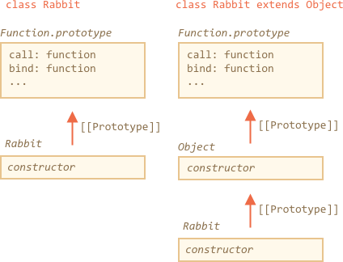

首先，让我们看看为什么之前的代码无法运行。

如果我们尝试运行它，就会发现明显的原因。派生类的构造函数必须调用 `super()`。否则不会定义 `"this"`。

这里就是解决问题的代码：

```js run
class Rabbit extends Object {
  constructor(name) {
*!*
    super(); // 需要在继承时调用父类的构造函数
*/!*
    this.name = name;
  }
}

let rabbit = new Rabbit("Rab");

alert( rabbit.hasOwnProperty('name') ); // true
```


但这还不是全部原因。

即便是修复了问题，`"class Rabbit extends Object"` 和 `class Rabbit` 仍然存在着重要差异。

我们知道，"extends" 语法会设置两个原型：

1. 在构造函数的 `"prototype"` 之间设置原型（为了获取实例方法）
2. 在构造函数之间会设置原型（为了获取静态方法）

在我们的例子里，对于 `class Rabbit extends Object`，它意味着：

```js run
class Rabbit extends Object {}

alert( Rabbit.prototype.__proto__ === Object.prototype ); // (1) true
alert( Rabbit.__proto__ === Object ); // (2) true
```

所以现在 `Rabbit` 对象可以通过 `Rabbit` 访问 `Object` 的静态方法，如下所示：

```js run
class Rabbit extends Object {}

*!*
// 通常我们调用 Object.getOwnPropertyNames
alert ( Rabbit.getOwnPropertyNames({a: 1, b: 2})); // a,b
*/!*
```

但是如果我们没有声明 `extends Object`，那么 `Rabbit.__proto__` 将不会被设置为 `Object`。

这里有个示例：

```js run
class Rabbit {}

alert( Rabbit.prototype.__proto__ === Object.prototype ); // (1) true
alert( Rabbit.__proto__ === Object ); // (2) false (!)
alert( Rabbit.__proto__ === Function.prototype ); // 所有函数都是默认如此

*!*
// 报错，Rabbit 上没有对应的函数
alert ( Rabbit.getOwnPropertyNames({a: 1, b: 2})); // Error
*/!*
```

所以在这种情况下，`Rabbit` 无法访问 `Object` 的静态方法。

顺便说一下，`Function.prototype` 也有一些函数的通用方法，比如 `call`、`bind` 等等。在上述的两种情况下他们都是可用的，因为对于内置的 `Object` 构造函数来说，`Object.__proto__ === Function.prototype`。

这里有一张图来解释：




所以，简而言之，这里有两点区别：

| class Rabbit | class Rabbit extends Object  |
|--------------|------------------------------|
| --             | needs to call `super()` in constructor |
| `Rabbit.__proto__ === Function.prototype` | `Rabbit.__proto__ === Object` |


