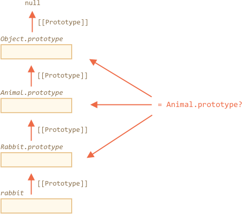

# 类型检测："instanceof"

`instanceof` 操作符用于检测对象是否属于某个 class，同时，检测过程中也会将继承关系考虑在内。

这种检测在多数情况下还是比较有用的，下面，我们就用它来构建一个具备 **多态** 性的函数，这个函数能识别出参数类型，从而作出不同的处理。

## instanceof [#ref-instanceof]

用法：
```js
obj instanceof Class
```

如果 `obj` 隶属于 `Class` 类（或者是 `Class` 类的衍生类），表达式将返回 `true`。

举例说明：

```js run
class Rabbit {}
let rabbit = new Rabbit();

// rabbit 是 Rabbit 类的实例对象吗?
*!*
alert( rabbit instanceof Rabbit ); // true
*/!*
```

使用构造函数结果也是一样的：

```js run
*!*
// 构造函数而非 class
function Rabbit() {}
*/!*

alert( new Rabbit() instanceof Rabbit ); // true
```

...再来看看内置类型 `Array`：

```js run
let arr = [1, 2, 3];
alert( arr instanceof Array ); // true
alert( arr instanceof Object ); // true
```

有一点需要留意，`arr` 同时还隶属于 `Object` 类。因为从原型上来讲，`Array` 是继承自 `Object` 类的。

<<<<<<< HEAD:1-js/07-object-oriented-programming/11-instanceof/article.md
`instanceof` 在检测中会将原型链考虑在内，此外，还能借助静态方法 `Symbol.hasInstance` 来改善检测效果。
=======
The `instanceof` operator examines the prototype chain for the check, but we can set a custom logic the static method `Symbol.hasInstance`.
>>>>>>> 9cb33f4039e5751bfd0e2bca565a37aa463fb477:1-js/09-classes/06-instanceof/article.md

`obj instanceof Class` 语句的大致执行过程如下：

<<<<<<< HEAD:1-js/07-object-oriented-programming/11-instanceof/article.md
1. 如果提供了静态方法 `Symbol.hasInstance`，那就直接用这个方法进行检测：

    ```js run
    // 假设具有 canEat 属性的对象为动物类
=======
1. If there's a static method `Symbol.hasInstance`, then just call it: `Class[Symbol.hasInstance](obj)`. It should return either `true` or `false`. We're done.
    For example: 

    ```js run
    // setup instanceOf check that assumes that anything that canEat is an animal
>>>>>>> 9cb33f4039e5751bfd0e2bca565a37aa463fb477:1-js/09-classes/06-instanceof/article.md
    class Animal {
      static [Symbol.hasInstance](obj) {
        if (obj.canEat) return true;
      }
    }

    let obj = { canEat: true };
<<<<<<< HEAD:1-js/07-object-oriented-programming/11-instanceof/article.md
    alert(obj instanceof Animal); // 返回 true：调用 Animal[Symbol.hasInstance](obj)
    ```

2. 大部分的类是没有 `Symbol.hasInstance` 方法的，这时会检查 `Class.prototype` 是否与 `obj` 的原型链中的任何一个原型相等。
=======

    alert(obj instanceof Animal); // true: Animal[Symbol.hasInstance](obj) is called
    ```

2. Most classes do not have `Symbol.hasInstance`. In that case, the standard logic is used: `obj instanceOf Classs` checks whether `Class.prototype` equals to one of prototypes in the `obj` prototype chain.
>>>>>>> 9cb33f4039e5751bfd0e2bca565a37aa463fb477:1-js/09-classes/06-instanceof/article.md

    简而言之，是这么比较的：
    ```js
    obj.__proto__ === Class.prototype
    obj.__proto__.__proto__ === Class.prototype
    obj.__proto__.__proto__.__proto__ === Class.prototype
    ...
    ```

    在上一个例子中有 `Rabbit.prototype === rabbit.__proto__` 成立，所以结果是显然的。

    再比如下面一个继承的例子，`rabbit` 对象同时也是父类的一个实例：

    ```js run
    class Animal {}
    class Rabbit extends Animal {}

    let rabbit = new Rabbit();
    *!*
    alert(rabbit instanceof Animal); // true
    */!*
    // rabbit.__proto__ === Rabbit.prototype
    // rabbit.__proto__.__proto__ === Animal.prototype (match!)
    ```

下图展示了 `rabbit instanceof Animal` 的执行过程中，`Animal.prototype` 是如何参与比较的：



这里还要提到一个方法 [objA.isPrototypeOf(objB)](mdn:js/object/isPrototypeOf)，如果 `objA` 处在 `objB` 的原型链中，调用结果为 `true`。所以，`obj instanceof Class` 也可以被视作为是调用 `Class.prototype.isPrototypeOf(obj)`。

虽然有点奇葩，其实 `Class` 的构造器自身是不参与检测的！检测过程只和原型链以及 `Class.prototype` 有关。

所以，当 `prototype` 改变时，会产生意想不到的结果。

就像这样：

```js run
function Rabbit() {}
let rabbit = new Rabbit();

// 修改其 prototype
Rabbit.prototype = {};

// ...再也不是只兔子了！
*!*
alert( rabbit instanceof Rabbit ); // false
*/!*
```

所以，为了谨慎起见，最好避免修改 `prototype`。

<<<<<<< HEAD:1-js/07-object-oriented-programming/11-instanceof/article.md
## 福利：使用 Object 的 toString 方法来揭示类型
=======
## Bonus: Object.prototype.toString for the type
>>>>>>> 9cb33f4039e5751bfd0e2bca565a37aa463fb477:1-js/09-classes/06-instanceof/article.md

大家都知道，一个普通对象被转化为字符串时为 `[object Object]`：

```js run
let obj = {};

alert(obj); // [object Object]
alert(obj.toString()); // 同上
```

这也是它们的 `toString` 方法的实现如此。但是，`toString` 自有其潜质，可以让它变得更实用一点。甚至可以用来替代 `instanceof`，也可以视作为 `typeof` 的增强版。

听起来挺不可思议？那是自然，精彩马上揭晓。

按照 [规范](https://tc39.github.io/ecma262/#sec-object.prototype.tostring) 上所讲，内置的 `toString` 方法可以从对象中提取出来，以其他值作为上下文（context）对象进行调用，调用结果取决于传入的上下文对象。

- 如果传入的是 number 类型，返回 `[object Number]`
- 如果传入的是 boolean 类型，返回 `[object Boolean]`
- 如果传入 `null`，返回 `[object Null]`
- 传入 `undefined`，返回 `[object Undefined]`
- 传入数组，返回 `[object Array]`
- ...等等（例如一些自定义类型）

下面进行阐述：

```js run
// 保存 toString 方法的引用，方便后面使用
let objectToString = Object.prototype.toString;

// 猜猜是什么类型？
let arr = [];

alert( objectToString.call(arr) ); // [object Array]
```

这里用到了章节 [](info:call-apply-decorators) 里提到的 [call](mdn:js/function/call) 方法来调用 `this=arr` 上下文的方法 `objectToString`。

`toString` 的内部算法会检查 `this` 对象，返回对应的结果。再来几个例子：

```js run
let s = Object.prototype.toString;

alert( s.call(123) ); // [object Number]
alert( s.call(null) ); // [object Null]
alert( s.call(alert) ); // [object Function]
```

### Symbol.toStringTag

对象的 `toString` 方法可以使用 `Symbol.toStringTag` 这个特殊的对象属性进行自定义输出。

举例说明：

```js run
let user = {
  [Symbol.toStringTag]: "User"
};

alert( {}.toString.call(user) ); // [object User]
```

大部分和环境相关的对象也有这个属性。以下输出可能因浏览器不同而异：

```js run
<<<<<<< HEAD:1-js/07-object-oriented-programming/11-instanceof/article.md
// 环境相关对象和类的 toStringTag：
=======
// toStringTag for the environment-specific object and class:
>>>>>>> 9cb33f4039e5751bfd0e2bca565a37aa463fb477:1-js/09-classes/06-instanceof/article.md
alert( window[Symbol.toStringTag]); // window
alert( XMLHttpRequest.prototype[Symbol.toStringTag] ); // XMLHttpRequest

alert( {}.toString.call(window) ); // [object Window]
alert( {}.toString.call(new XMLHttpRequest()) ); // [object XMLHttpRequest]
```

输出结果和 `Symbol.toStringTag`（前提是这个属性存在）一样，只不过被包裹进了 `[object ...]` 里。

这样一来，我们手头上就有了个“磕了药似的 typeof”，不仅能检测基本数据类型，就是内置对象类型也不在话下，更可贵的是还支持自定义。

所以，如果希望以字符串的形式获取内置对象类型信息，而不仅仅只是检测类型的话，可以用这个方法来替代 `instanceof`。

## 总结

下面，来总结下大家学到的类型检测方式：

|               | 用于 |  返回      |
|---------------|-------------|---------------|
| `typeof`      | 基本数据类型 |  string       |
| `{}.toString` | 基本数据类型、内置对象以及包含 `Symbol.toStringTag` 属性的对象 |       string |
| `instanceof`  | 任意对象     |  true/false   |

看样子，`{}.toString` 基本就是一增强版  `typeof`。

`instanceof` 在涉及多层类结构的场合中比较实用，这种情况下需要将类的继承关系考虑在内。
