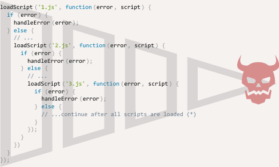

# 简介：回调

JavaScipt 中的许多动作都是**异步**的。

比如，这个 `loadScript(src)` 函数：

```js
function loadScript(src) {
  let script = document.createElement('script');
  script.src = src;
  document.head.append(script);
}
```

这个函数的作用是加载一个新的脚本。当使用 `<script src="…">` 将其添加到文档中时，浏览器就会对它进行加载和执行。

我们可以像这样使用：

```js
// 加载并执行脚本
loadScript('/my/script.js');
```

<<<<<<< HEAD:6-async/01-callbacks/article.md
函数是**异步**调用的，因为动作不是此刻（加载脚本）完成的，而是之后。
=======
The function is called "asynchronously," because the action (script loading) finishes not now, but later.
>>>>>>> 19223ae762f03cdff4e83f6f963f4f427af93847:1-js/11-async/01-callbacks/article.md

调用初始化脚本加载，然后继续执行。当脚本正在被加载时，下面的代码可能已经完成了执行，如果加载需要时间，那么同一时间，其他脚本可能也会被运行。

```js
loadScript('/my/script.js');
// 下面的代码在加载脚本时，不会等待脚本被加载完成
// ...
```

现在，我们假设想在新脚本被加载完成时，被立即使用。它可能声明了新函数，因此我们想要运行它们。

但如果我们在 `loadScript(…)` 调用后，立即那么做，就会导致操作失败。

```js
loadScript('/my/script.js'); // 脚本含有 "function newFunction() {…}"

*!*
newFunction(); // 没有这个函数！
*/!*
```

<<<<<<< HEAD:6-async/01-callbacks/article.md
很明显，浏览器没有时间去加载脚本。因此，对新函数的立即调用失败了。`loadScript` 函数并没有提供追踪加载完成时方法。脚本加载然后最终的运行，仅此而已。但我们希望了解脚本何时加载完成，以使用其中的新函数和新变量。
=======
Naturally, the browser probably didn't have time to load the script. So the immediate call to the new function fails. As of now, the `loadScript` function doesn't provide a way to track the load completion. The script loads and eventually runs, that's all. But we'd like to know when it happens, to use new functions and variables from that script.
>>>>>>> 19223ae762f03cdff4e83f6f963f4f427af93847:1-js/11-async/01-callbacks/article.md

我们将 `callback` 函数作为第二个参数添加至 `loadScript` 中，函数在脚本加载时被执行：

```js
function loadScript(src, *!*callback*/!*) {
  let script = document.createElement('script');
  script.src = src;

*!*
  script.onload = () => callback(script);
*/!*

  document.head.append(script);
}
```

如果现在你想从脚本中调用新函数，我们应该在回调函数中那么写：

```js
loadScript('/my/script.js', function() {
  // 在脚本被加载后，回调才会被运行
  newFunction(); // 现在起作用了
  ...
});
```

这是我们的想法：第二个参数是一个函数（通常是匿名的）会在动作完成后被执行。

这是一个可运行的真实脚本示例：

```js run
function loadScript(src, callback) {
  let script = document.createElement('script');
  script.src = src;
  script.onload = () => callback(script);
  document.head.append(script);
}

*!*
loadScript('https://cdnjs.cloudflare.com/ajax/libs/lodash.js/3.2.0/lodash.js', script => {
  alert(`Cool, the ${script.src} is loaded`);
  alert( _ ); // 在加载的脚本中声明的函数
});
*/!*
```

这被称为“基于回调”的异步编程风格。异步执行某些动作的函数，应该提供一个在函数完成时可以运行的 `callback` 参数。

<<<<<<< HEAD:6-async/01-callbacks/article.md
我们 `loadScript` 中就是那么做的，但很明显这是一般性的方法。
=======
Here we did it in `loadScript`, but of course, it's a general approach.
>>>>>>> 19223ae762f03cdff4e83f6f963f4f427af93847:1-js/11-async/01-callbacks/article.md

## 在回调中回调

<<<<<<< HEAD:6-async/01-callbacks/article.md
如何顺序加载两个脚本：先是第一个，然后是第二个？
=======
How can we load two scripts sequentially: the first one, and then the second one after it?
>>>>>>> 19223ae762f03cdff4e83f6f963f4f427af93847:1-js/11-async/01-callbacks/article.md

最明显的方法是将第二个 `loadScript` 调用放在回调中，就像这样：

```js
loadScript('/my/script.js', function(script) {

  alert(`Cool, the ${script.src} is loaded, let's load one more`);

*!*
  loadScript('/my/script2.js', function(script) {
    alert(`Cool, the second script is loaded`);
  });
*/!*

});
```

在外部 `loadScript` 完成时，内部回调就会被回调。

如果我们还想要一个脚本呢？

```js
loadScript('/my/script.js', function(script) {

  loadScript('/my/script2.js', function(script) {

*!*
    loadScript('/my/script3.js', function(script) {
      // ...在所有脚本被加载后继续操作
    });
*/!*

  })

});
```

因此，每一个动作都在回调内部。这对于新动作来说，非常好，但是其他动作却并不友好，因此我们接下来会看到一些此方法的变体。 

## 处理错误

<<<<<<< HEAD:6-async/01-callbacks/article.md
上述示例中，我们并没有考虑错误因素。假如加载失败会如何？我们的回调应该可以立即对其做出响应。
=======
In the above examples we didn't consider errors. What if the script loading fails? Our callback should be able to react on that.
>>>>>>> 19223ae762f03cdff4e83f6f963f4f427af93847:1-js/11-async/01-callbacks/article.md

这是可以跟踪错误的 `loadScript` 改进版：

```js run
function loadScript(src, callback) {
  let script = document.createElement('script');
  script.src = src;

*!*
  script.onload = () => callback(null, script);
  script.onerror = () => callback(new Error(`Script load error for ${src}`));
*/!*

  document.head.append(script);
}
```

成功时，调用 `callback(null, script)`，否则调用 `callback(error)`。

用法：
```js
loadScript('/my/script.js', function(error, script) {
  if (error) {
    // handle error
  } else {
    // 成功加载脚本
  }
});
```

再一次强调，我们使用的 `loadScript` 方法是非常常规的。它被称为 "error-first callback" 风格。

<<<<<<< HEAD:6-async/01-callbacks/article.md
惯例是：
1. `callback` 的第一个参数是为了错误发生而保留的。一旦发生错误，`callback(err)` 就会被调用。
2. 第二个参数（如果有需要）用于成功的结果。此时 `callback(null, result1, result2…)` 将被调用。
=======
The convention is:
1. The first argument of the `callback` is reserved for an error if it occurs. Then `callback(err)` is called.
2. The second argument (and the next ones if needed) are for the successful result. Then `callback(null, result1, result2…)` is called.
>>>>>>> 19223ae762f03cdff4e83f6f963f4f427af93847:1-js/11-async/01-callbacks/article.md

因此单个 `callback` 函数可以同时具有报告错误以及传递返回结果的作用。

<<<<<<< HEAD:6-async/01-callbacks/article.md
## 回调金字塔

从第一步可以看出，这是异步编码的一种可行性方案。的确如此，对于一个或两个的简单嵌套，这样的调用看起来非常好。
=======
## Pyramid of Doom

From the first look, it's a viable way of asynchronous coding. And indeed it is. For one or maybe two nested calls it looks fine.
>>>>>>> 19223ae762f03cdff4e83f6f963f4f427af93847:1-js/11-async/01-callbacks/article.md

但对于一个接一个的多个异步动作，代码就会变成这样：

```js
loadScript('1.js', function(error, script) {

  if (error) {
    handleError(error);
  } else {
    // ...
    loadScript('2.js', function(error, script) {
      if (error) {
        handleError(error);
      } else {
        // ...
        loadScript('3.js', function(error, script) {
          if (error) {
            handleError(error);
          } else {
  *!*
            // ...加载所有脚本后继续 (*)
  */!*
          }
        });

      }
    })
  }
});
```

上述代码中：
1. 我们加载 `1.js`，如果没有发生错误。
2. 我们加载 `2.js`，如果没有发生错误。
3. 我们加载 `3.js`，如果没有发生错误 —— 做其他操作 `(*)`。

如果嵌套变多，代码层次就会变深，维护难度也随之增加，尤其是如果我们有一个不是 `...` 的真实代码，就会包含更多的循环，条件语句等。

<<<<<<< HEAD:6-async/01-callbacks/article.md
这有时称为“回调地狱”或者“回调金字塔”。
=======
That's sometimes called "callback hell" or "pyramid of doom."
>>>>>>> 19223ae762f03cdff4e83f6f963f4f427af93847:1-js/11-async/01-callbacks/article.md



嵌套调用的“金字塔”在每一个异步动作中都会向右增长。很快就会失去控制。

因此这种编码方式并不可取。

我们可以通过为每个动作编写一个独立函数来解决这一问题，就像这样：

```js
loadScript('1.js', step1);

function step1(error, script) {
  if (error) {
    handleError(error);
  } else {
    // ...
    loadScript('2.js', step2);
  }
}

function step2(error, script) {
  if (error) {
    handleError(error);
  } else {
    // ...
    loadScript('3.js', step3);
  }
}

function step3(error, script) {
  if (error) {
    handleError(error);
  } else {
    // ...在所有脚本被加载后继续 (*)
  }
};
```

<<<<<<< HEAD:6-async/01-callbacks/article.md
看到了么？效果一样，但是没有深层的嵌套了，因为我们使每个动作都有一个独立的顶层函数。

这很有效，但代码看起来就像是一个被分裂的表格。你可能注意到了，它的可读性非常差。在阅读时，需要在块之间切换。这非常不方便，尤其是不熟悉代码的读者，他们甚至不知道该跳转到何处。

名为 `step*` 的函数都是单一使用的，他们被创建的唯一作用就是避免“回调金字塔”。没有人会在动作链之外重复使用它们。因此这里的命名空间非常杂乱。

或许还有更好的方法。

幸运地是，有其他方法可以避免回调金字塔。其中一个最好的方法是使用 "promises"，我们将在下一章中详细描述。
=======
See? It does the same, and there's no deep nesting now because we made every action a separate top-level function.

It works, but the code looks like a torn apart spreadsheet. It's difficult to read, and you probably noticed that one needs to eye-jump between pieces while reading it. That's inconvenient, especially if the reader is not familiar with the code and doesn't know where to eye-jump.

Also, the functions named `step*` are all of single use, they are created only to avoid the "pyramid of doom." No one is going to reuse them outside of the action chain. So there's a bit of a namespace cluttering here.

We'd like to have something better.

Luckily, there are other ways to avoid such pyramids. One of the best ways is to use "promises," described in the next chapter.
>>>>>>> 19223ae762f03cdff4e83f6f963f4f427af93847:1-js/11-async/01-callbacks/article.md
