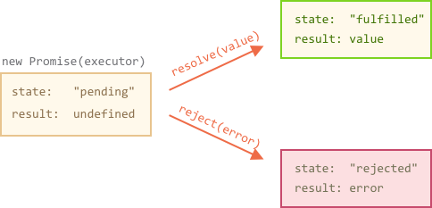

# Promise

<<<<<<< HEAD
想象一下，你自己是一位顶尖歌手，粉丝没日没夜地询问你下个单曲何时到来。

为了从中解放，你承诺会在单曲发布的第一时间通知他们。你让粉丝们填写了他们的个人信息，因此他们会在歌曲发布的第一时间获取到。即使遇到了不测，歌曲可能永远不会被发行，他们也会被通知到。

每个人都很开心：你不会被任何人催促；粉丝也不会错过单曲发行的第一时间。

在编程中，我们经常用现实世界中的事物进行类比：

1. "生产者代码" 会做一些事情，也需要事件。比如，它加载一个远程脚本。此时它就像“歌手”。
2. "消费者代码" 想要在它准备好时知道结果。许多函数都需要结果。此时它们就像是“粉丝”。
3. **promise** 是将两者连接的一个特殊的 JavaScript 对象。就像是“列表”。生产者代码创建它，然后将它交给每个订阅的对象，因此它们都可以订阅到结果。

这种类比并不精确，因为 JavaScipt promises 比简单的列表更加复杂：它们拥有额外的特性和限制。但是它们仍然有相似之处。

Promise 对象的构造语法是：

```js
let promise = new Promise(function(resolve, reject) {
  // executor (生产者代码，"singer")
});
```

传递给 `new Promise`的函数称之为 **executor**。当 promise 被创建时，它会被自动调用。它包含生产者代码，这最终会产生一个结果。与上文类比，executor 就是“歌手”。

`promise` 对象有内部属性：

- `state` —— 最初是 "pending"，然后被改为 "fulfilled" 或 "rejected"，
- `result` —— 一个任意值，最初是 `undefined`。

当 executor 完成任务时，应调用下列之一：

- `resolve(value)` —— 说明任务已经完成：
    - 将 `state` 设置为 `"fulfilled"`，
    - sets `result` to `value`。
- `reject(error)` —— 表明有错误发生：
    - 将 `state` 设置为 `"rejected"`，
    - 将 `result` 设置为 `error`。



这是一个简单的 executor，可以把这一切都聚集在一起：

```js run
let promise = new Promise(function(resolve, reject) {
  // 当 promise 被构造时，函数会自动执行

  alert(resolve); // function () { [native code] }
  alert(reject);  // function () { [native code] }

  // 在 1 秒后，结果为“完成！”，表明任务被完成
  setTimeout(() => *!*resolve("done!")*/!*, 1000);
});
```

我们运行上述代码后发现两件事：

1. 会自动并立即调用 executor（通过 `new Promise`）。
2. executor 接受两个参数 `resolve` 和 `reject` —— 这些函数来自于 JavaScipt 引擎。我们不需要创建它们，相反，executor 会在它们准备好时进行调用。

经过一秒钟的思考后，executor 调用 `resolve("done")` 来产生结果：


这是“任务成功完成”的示例。

现在的是示例则是 promise 的 reject 出现于错误的发生：
=======
Imagine that you're a top singer, and fans ask day and night for your upcoming single.

To get some relief, you promise to send it to them when it's published. You give your fans a list to which they can subscribe for updates. They can fill in their email addresses, so that when the song becomes available, all subscribed parties instantly receive it. And even if something goes very wrong, say, if plans to publish the song are cancelled, they will still be notified.

Everyone is happy, because the people don't crowd you any more, and fans, because they won't miss the single.

This is a real-life analogy for things we often have in programming:

1. A "producing code" that does something and takes time. For instance, the code loads data over a network. That's a "singer".
2. A "consuming code" that wants the result of the "producing code" once it's ready. Many functions  may need that result. These are the "fans".
3. A *promise* is a special JavaScript object that links the "producing code" and the "consuming code" together. In terms of our analogy: this is the "subscription list". The "producing code" takes whatever time it needs to produce the promised result, and the "promise" makes that result available to all of the subscribed code when it's ready.

The analogy isn't terribly accurate, because JavaScript promises are more complex than a simple subscription list: they have additional features and limitations. But it's fine to begin with.

The constructor syntax for a promise object is:

```js
let promise = new Promise(function(resolve, reject) {
  // executor (the producing code, "singer")
});
```

The function passed to `new Promise` is called the *executor*. When the promise is created, this executor function runs automatically. It contains the producing code, that should eventually produce a result. In terms of the analogy above: the executor is the "singer".

The resulting `promise` object has internal properties:

- `state` — initially "pending", then changes to either "fulfilled" or "rejected",
- `result` — an arbitrary value, initially `undefined`.

When the executor finishes the job, it should call one of the functions that it gets as arguments:

- `resolve(value)` — to indicate that the job finished successfully:
    - sets `state` to `"fulfilled"`,
    - sets `result` to `value`.
- `reject(error)` — to indicate that an error occurred:
    - sets `state` to `"rejected"`,
    - sets `result` to `error`.


Later we'll see how these changes become known to "fans".

Here's an example of a Promise constructor and a simple executor function with its "producing code" (the `setTimeout`):

```js run
let promise = new Promise(function(resolve, reject) {
  // the function is executed automatically when the promise is constructed

  // after 1 second signal that the job is done with the result "done"
  setTimeout(() => *!*resolve("done")*/!*, 1000);
});
```

We can see two things by running the code above:

1. The executor is called automatically and immediately (by the `new Promise`).
2. The executor receives two arguments: `resolve` and `reject` — these functions are pre-defined by the JavaScript engine. So we don't need to create them. We only should call one of them when ready.

After one second of "processing" the executor calls `resolve("done")` to produce the result:


That was an example of a successful job completion, a "fulfilled promise".

And now an example of the executor rejecting the promise with an error:
>>>>>>> 027933531e121650120f7e8385f691de99af12d2

```js
let promise = new Promise(function(resolve, reject) {
  // after 1 second signal that the job is finished with an error
  setTimeout(() => *!*reject(new Error("Whoops!"))*/!*, 1000);
});
```


<<<<<<< HEAD
总之，executor 应该完成任务（通常会需要时间），然后调用 `resolve` 或 `reject` 来改变 promise 对象的对应状态。

Promise 结果应该是 resolved 或 rejected 的状态被称为 "settled"，而不是 "pending" 状态的 promise。

````smart header="There can be only one result or an error"
executor 只会调用 `resolve` 或 `reject`。Promise 的最后状态一定会变化。

对 `resolve` 和 `reject` 的深层调用都会被忽略：
=======
To summarize, the executor should do a job (something that takes time usually) and then call `resolve` or `reject` to change the state of the corresponding Promise object.

The Promise that is either resolved or rejected is called "settled", as opposed to a initially "pending" Promise.

````smart header="There can be only a single result or an error"
The executor should call only one `resolve` or one `reject`. The promise's state change is final.

All further calls of `resolve` and `reject` are ignored:
>>>>>>> 027933531e121650120f7e8385f691de99af12d2

```js
let promise = new Promise(function(resolve, reject) {
  resolve("done");

<<<<<<< HEAD
  reject(new Error("…")); // 被忽略
  setTimeout(() => resolve("…")); // 被忽略
});
```

executor 所做的任务可能只有一个结果或者一个错误。在编程中，还有其他允许 "flowing" 结果的数据结构。例如流和队列。相对于 promise，它们有着自己的优势和劣势。它们不被 JavaScipt 核心支持，而且缺少 promise 所提供的某些语言特性，我们在这里不对 promise 进行过多的讨论。

同时，如果我们使用另一个参数调用 `resolve/reject` —— 只有第一个参数会被使用，下一个会被忽略。
````

```smart header="Reject with `Error` objects"
从技术上来说，我们可以使用任何类型的参数来调用 `reject`（就像 `resolve`）。但建议在 `reject`（或从它们中继承）中使用 `Error` 对象。 错误原因就会显示出来。
```

````smart header="Resolve/reject can be immediate"
实际上，executor 通常会异步执行一些动作，然后在一段时间后调用 `resolve/reject`，但它不必那么做。我们可以立即调用 `resolve` 或 `reject`，就像这样：

```js
let promise = new Promise(function(resolve, reject) {
=======
  reject(new Error("…")); // ignored
  setTimeout(() => resolve("…")); // ignored
});
```

The idea is that a job done by the executor may have only one result or an error.

Also, `resolve`/`reject` expect only one argument (or none) and will ignore additional arguments.
````

```smart header="Reject with `Error` objects"
In case something goes wrong, we can call `reject` with any type of argument (just like `resolve`). But it is recommended to use `Error` objects (or objects that inherit from `Error`). The reasoning for that will soon become apparent.
```

````smart header="Immediately calling `resolve`/`reject`"
In practice, an executor usually does something asynchronously and calls `resolve`/`reject` after some time, but it doesn't have to. We also can call `resolve` or `reject` immediately, like this:

```js
let promise = new Promise(function(resolve, reject) {
  // not taking our time to do the job
>>>>>>> 027933531e121650120f7e8385f691de99af12d2
  resolve(123); // immediately give the result: 123
});
```

<<<<<<< HEAD
比如，当我们开始做一个任务时，它就会发生，然后发现一切都已经被做完了。从技术上来说，这非常好：我们现在有了一个 resolved promise。
````

```smart header="The `state` and `result` are internal"
Promise 的 `state` 和 `result` 属性是内部的。我们不能从代码中直接访问它们，但是我们可以使用 `.then/catch` 来访问，下面是对此的描述。
```

## 消费者：".then" 和 ".catch"

Promise 对象充当生产者（executor）和消费函数之间的连接 —— 那些希望接收结果/错误的函数。假设函数可以使用方法 `promise.then` 和 `promise.catch` 进行注册。


`.then` 的语法：

```js
promise.then(
  function(result) { /* handle a successful result */ },
  function(error) { /* handle an error */ }
);
```

第一个函数参数在 promise 为 resolved 时被解析，然后得到结果并运行。第二个参数 ——  在状态为 rejected 并得到错误时使用。

例如：
=======
For instance, this might happen when we start to do a job but then see that everything has already been completed and  cached.

That's fine. We immediately have a resolved promise.
````

```smart header="The `state` and `result` are internal"
The properties `state` and `result` of the Promise object are internal. We can't directly access them from our "consuming code". We can use the methods `.then`/`.catch`/`.finally` for that. They are described below.
```

## Consumers: then, catch, finally

A Promise object serves as a link between the executor (the "producing code" or "singer") and the consuming functions (the "fans"), which will receive the result or error. Consuming functions can be registered (subscribed) using methods `.then`, `.catch` and `.finally`.

### then

The most important, fundamental one is `.then`.

The syntax is:

```js
promise.then(
  function(result) { *!*/* handle a successful result */*/!* },
  function(error) { *!*/* handle an error */*/!* }
);
```

The first argument of `.then` is a function that:

1. runs when the promise is resolved, and
2. receives the result.

The second argument of `.then` is a function that:

1. runs when the promise is rejected, and
2. receives the error.

For instance, here's a reaction to a successfully resolved promise:
>>>>>>> 027933531e121650120f7e8385f691de99af12d2

```js run
let promise = new Promise(function(resolve, reject) {
  setTimeout(() => resolve("done!"), 1000);
});

<<<<<<< HEAD
// resolve 在 .then 中运行第一个函数
promise.then(
*!*
  result => alert(result), // 在 1 秒后显示“已经完成！”
*/!*
  error => alert(error) // 不会运行
);
```

在 rejection 的情况下：
=======
// resolve runs the first function in .then
promise.then(
*!*
  result => alert(result), // shows "done!" after 1 second
*/!*
  error => alert(error) // doesn't run
);
```

The first function was executed.

And in the case of a rejection -- the second one:
>>>>>>> 027933531e121650120f7e8385f691de99af12d2

```js run
let promise = new Promise(function(resolve, reject) {
  setTimeout(() => reject(new Error("Whoops!")), 1000);
});

<<<<<<< HEAD
// reject 在 .then 中运行第二个函数
promise.then(
  result => alert(result), // 无法运行
*!*
  error => alert(error) // 在 1 秒后显示 "Error: Whoops!"
=======
// reject runs the second function in .then
promise.then(
  result => alert(result), // doesn't run
*!*
  error => alert(error) // shows "Error: Whoops!" after 1 second
>>>>>>> 027933531e121650120f7e8385f691de99af12d2
*/!*
);
```

<<<<<<< HEAD
如果我们只对成功完成的情况感兴趣，那么我们只为 `.then` 提供一个参数：
=======
If we're interested only in successful completions, then we can provide only one function argument to `.then`:
>>>>>>> 027933531e121650120f7e8385f691de99af12d2

```js run
let promise = new Promise(resolve => {
  setTimeout(() => resolve("done!"), 1000);
});

*!*
<<<<<<< HEAD
promise.then(alert); // 在 1 秒后显示 "done!"
*/!*
```

如果我们只对错误感兴趣，那么我们可以对它使用 `.then(null, function)` 或 "alias"：`.catch(function)`
=======
promise.then(alert); // shows "done!" after 1 second
*/!*
```

### catch

If we're interested only in errors, then we can use `null` as the first argument: `.then(null, errorHandlingFunction)`. Or we can use `.catch(errorHandlingFunction)`, which is exactly the same:
>>>>>>> 027933531e121650120f7e8385f691de99af12d2


```js run
let promise = new Promise((resolve, reject) => {
  setTimeout(() => reject(new Error("Whoops!")), 1000);
});

*!*
<<<<<<< HEAD
// .catch(f) 等同于 promise.then(null, f)
promise.catch(alert); // 在 1 秒后显示 "Error: Whoops!"
*/!*
```

调用 `.catch(f)` 是 `.then(null, f)` 的模拟，这只是一个简写。

````smart header="On settled promises `then` runs immediately"
如果 promise 为 pending 状态，`.then/catch` 处理器必须要等待结果。相反，如果 promise 已经被处理，它们就会立即执行：

```js run
// 一个立即变成 resolve 的 promise
let promise = new Promise(resolve => resolve("done!"));

promise.then(alert); // 完成！（现在显示）
```

这对于有时需要时间而且有时要立即完成的任务来说非常方便。去报处理器在两种情况下都能够运行。
````

````smart header="`.then/catch` 的处理器总是异步的"
更确切地说，当 `.then/catch` 处理器应该执行时，它会首先进入内部队列。JavaScript 引擎从队列中提取处理器，并在当前代码完成时执行 `setTimeout(..., 0)`。

换句话说，`.then(handler)` 会被触发，会执行类似于 `setTimeout(handler, 0)` 的动作。

在下述示例中，promise 被立即 resolved，因此 `.then(alert)` 被立即触发：`alert` 会进入队列，在代码完成之后立即执行。
=======
// .catch(f) is the same as promise.then(null, f)
promise.catch(alert); // shows "Error: Whoops!" after 1 second
*/!*
```

The call `.catch(f)` is a complete analog of `.then(null, f)`, it's just a shorthand.

### finally

Just like there's a `finally` clause in a regular `try {...} catch {...}`, there's `finally` in promises.

The call `.finally(f)` is similar to `.then(f, f)` in the sense that it always runs when the promise is settled: be it resolve or reject.

`finally` is a good handler for performing cleanup, e.g. stopping our loading indicators, as they are not needed any more, no matter what the outcome is.

Like this:

```js
new Promise((resolve, reject) => {
  /* do something that takes time, and then call resolve/reject */
})
*!*
  // runs when the promise is settled, doesn't matter successfully or not
  .finally(() => stop loading indicator)
*/!*
  .then(result => show result, err => show error)
```

It's not exactly an alias of `then(f,f)` though. There are several important differences:

1. A `finally` handler has no arguments. In `finally` we don't know whether the promise is successful or not. That's all right, as our task is usually to perform "general" finalizing procedures.
2. A `finally` handler passes through results and errors to the next handler.

    For instance, here the result is passed through `finally` to `then`:
    ```js run
    new Promise((resolve, reject) => {
      setTimeout(() => resolve("result"), 2000)
    })
      .finally(() => alert("Promise ready"))
      .then(result => alert(result)); // <-- .then handles the result
    ```

    And here there's an error in the promise, passed through `finally` to `catch`:

    ```js run
    new Promise((resolve, reject) => {
      throw new Error("error");
    })
      .finally(() => alert("Promise ready"))
      .catch(err => alert(err));  // <-- .catch handles the error object
    ```  

    That's very convenient, because `finally` is not meant to process a promise result. So it passes it through.

    We'll talk more about promise chaining and result-passing between handlers in the next chapter.

3. Last, but not least, `.finally(f)` is a more convenient syntax than `.then(f, f)`: no need to duplicate the function `f`.

````smart header="On settled promises handlers runs immediately"
If a promise is pending, `.then/catch/finally` handlers wait for the result. Otherwise, if a promise has already settled, they execute immediately:
>>>>>>> 027933531e121650120f7e8385f691de99af12d2

```js run
// an immediately resolved promise
let promise = new Promise(resolve => resolve("done!"));

<<<<<<< HEAD
promise.then(alert); // 完成！（在当前代码完成之后）

alert("code finished"); // 这个 alert 会最先显示
```

因此在 `.then` 之后的代码总是在处理器之前被执行（即使实在预先解决 promise 的情况下）。通常这并不重要，只会在特定情况下才会重要。
````

我们现在研究一下 promises 如何帮助我们编写异步代码的示例。

## 示例：loadScript

我们已经从之前的章节中加载了 `loadScript` 函数。

这是基于回调函数的变体，记住它：
=======
promise.then(alert); // done! (shows up right now)
```

The good thing is: a `.then` handler is guaranteed to run whether the promise takes time or settles it immediately.
````

Next, let's see more practical examples of how promises can help us to write asynchronous code.

## Example: loadScript [#loadscript]

We've got the `loadScript` function for loading a script from the previous chapter.

Here's the callback-based variant, just to remind us of it:
>>>>>>> 027933531e121650120f7e8385f691de99af12d2

```js
function loadScript(src, callback) {
  let script = document.createElement('script');
  script.src = src;

  script.onload = () => callback(null, script);
<<<<<<< HEAD
  script.onerror = () => callback(new Error(`Script load error ` + src));
=======
  script.onerror = () => callback(new Error(`Script load error for ${src}`));
>>>>>>> 027933531e121650120f7e8385f691de99af12d2

  document.head.append(script);
}
```

<<<<<<< HEAD
我们用 promises 进行重写。

`loadScript` 新函数不需要请求回调函数，取而代之的是它会创建并返回一个在加载完成时的 promise 对象。外部代码可以使用 `.then` 向其添加处理器：
=======
Let's rewrite it using Promises.

The new function `loadScript` will not require a callback. Instead, it will create and return a Promise object that resolves when the loading is complete. The outer code can add handlers (subscribing functions) to it using `.then`:
>>>>>>> 027933531e121650120f7e8385f691de99af12d2

```js run
function loadScript(src) {  
  return new Promise(function(resolve, reject) {
    let script = document.createElement('script');
    script.src = src;

    script.onload = () => resolve(script);
<<<<<<< HEAD
    script.onerror = () => reject(new Error("Script load error: " + src));
=======
    script.onerror = () => reject(new Error(`Script load error for ${src}`));
>>>>>>> 027933531e121650120f7e8385f691de99af12d2

    document.head.append(script);
  });
}
```

<<<<<<< HEAD
用法：

```js run
let promise = loadScript("https://cdnjs.cloudflare.com/ajax/libs/lodash.js/3.2.0/lodash.js");
=======
Usage:

```js run
let promise = loadScript("https://cdnjs.cloudflare.com/ajax/libs/lodash.js/4.17.11/lodash.js");
>>>>>>> 027933531e121650120f7e8385f691de99af12d2

promise.then(
  script => alert(`${script.src} is loaded!`),
  error => alert(`Error: ${error.message}`)
);

promise.then(script => alert('One more handler to do something else!'));
```

<<<<<<< HEAD
我们立刻看到基于回调语法的好处：

```compare minus="Callbacks" plus="Promises"
- 在调用 `loadScript` 时，我们必须已经有了一个 `callback` 函数。换句话说，在调用 `loadScript` **之前**我们必须知道如何处理结果。
- 只能有一个回调。
+ Promises 允许我们按照自然顺序进行编码。首先，我们运行 `loadScript` 和  `.then` 来编写如何处理结果。
+ 无论何时，只要我们有需要，就可以在 promise 中调用 `.then`。
```

因此，promise 已经为我们的编码带来了更好的编码方式和灵活性。我们会在之后章节看到更多相关内容。
=======
We can immediately see a few benefits over the callback-based pattern:


| Promises | Callbacks |
|----------|-----------|
| Promises allow us to do things in the natural order. First, we run `loadScript(script)`, and `.then` we write what to do with the result. | We must have a `callback` function at our disposal when calling `loadScript(script, callback)`. In other words, we must know what to do with the result *before* `loadScript` is called. |
| We can call `.then` on a Promise as many times as we want. Each time, we're adding a new "fan", a new subscribing function, to the "subscription list". More about this in the next chapter: [](info:promise-chaining). | There can be only one callback. |

So Promises give us better code flow and flexibility. But there's more. We'll see that in the next chapters.
>>>>>>> 027933531e121650120f7e8385f691de99af12d2
