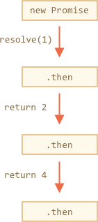
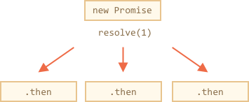
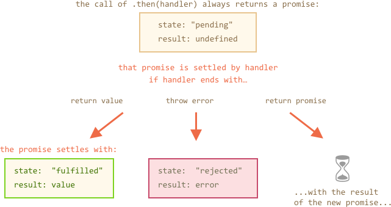
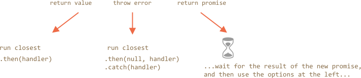

<<<<<<< HEAD
# Promises 链

我们回顾一下 <info:callbacks> 章节提及的问题。

- 假如我们有一系列异步任务会被依次完成。例如：加载脚本。
- 如何编写合适的代码？

Promises 提供了几种方案来解决这个问题。

本章节中我们来讲解 promise 链。

它看起来就像这样：
=======
# Promises chaining

Let's return to the problem mentioned in the chapter <info:callbacks>: we have a sequence of asynchronous tasks to be done one after another. For instance, loading scripts. How can we code it well?

Promises provide a couple of recipes to do that.

In this chapter we cover promise chaining.

It looks like this:
>>>>>>> 5e9eca374f644ea85c7d548bbe344fd30e5fb89d

```js run
new Promise(function(resolve, reject) {

  setTimeout(() => resolve(1), 1000); // (*)

}).then(function(result) { // (**)

  alert(result); // 1
  return result * 2;

}).then(function(result) { // (***)

  alert(result); // 2
  return result * 2;

}).then(function(result) {

  alert(result); // 4
  return result * 2;

});
```

<<<<<<< HEAD
它的理念是把 result 传入 `.then` 的处理程序链。

运行流程如下：
1. 初始 promise 1 秒后 resolve `(*)`，
2. 然后 `.then` 方法被调用 `(**)`。
2. 它返回的值被传入下一个 `.then` 的处理程序 `(***)`
4. ……依此类推。

随着 result 在处理程序链中传递，我们会看到 `alert` 依次显示：`1` -> `2` -> `4`。



之所以这么运行，是因为 `promise.then` 返回了一个 promise，所以我们可以用它调用下一个 `.then`。

当控制函数返回一个值时，它会变成当前 promise 的 result，所以会用它调用下一个 `.then`。

为了把这些话讲更清楚，我们看一下链的开头：
=======
The idea is that the result is passed through the chain of `.then` handlers.

Here the flow is:
1. The initial promise resolves in 1 second `(*)`,
2. Then the `.then` handler is called `(**)`.
3. The value that it returns is passed to the next `.then` handler `(***)`
4. ...and so on.

As the result is passed along the chain of handlers, we can see a sequence of `alert` calls: `1` -> `2` -> `4`.


The whole thing works, because a call to `promise.then` returns a promise, so that we can call the next `.then` on it.

When a handler returns a value, it becomes the result of that promise, so the next `.then` is called with it.

To make these words more clear, here's the start of the chain:
>>>>>>> 5e9eca374f644ea85c7d548bbe344fd30e5fb89d

```js run
new Promise(function(resolve, reject) {

  setTimeout(() => resolve(1), 1000);

}).then(function(result) {

  alert(result);
  return result * 2; // <-- (1)

}) // <-- (2)
// .then…
```

<<<<<<< HEAD
`.then` 返回的值是一个 promise，这是为什么我们可以在 `(2)` 处添加另一个 `.then`。在 `(1)` 处返回值时，当前 promise 变成 resolved，然后下一个处理程序使用这个返回值运行。

与链式调用不同，理论上我们也能添加许多 `.then` 到一个 promise 上，就像这样：

=======
The value returned by `.then` is a promise, that's why we are able to add another `.then` at `(2)`. When the value is returned in `(1)`, that promise becomes resolved, so the next handler runs with the value.

**A classic newbie error: technically we can also add many `.then` to a single promise. This is not chaining.**

For example:
>>>>>>> 5e9eca374f644ea85c7d548bbe344fd30e5fb89d
```js run
let promise = new Promise(function(resolve, reject) {
  setTimeout(() => resolve(1), 1000);
});

promise.then(function(result) {
  alert(result); // 1
  return result * 2;
});

promise.then(function(result) {
  alert(result); // 1
  return result * 2;
});

promise.then(function(result) {
  alert(result); // 1
  return result * 2;
});
```

<<<<<<< HEAD
……但这是一个完全不同的东西，看这张图（对比上面的链式调用）：



在同一个 promise 上的所有 `.then` 会得到相同的结果 —— 该 promise 的 result。所以，以上代码中所有 `alert` 会显示相同的内容：`1`。它们之间没有 result 的传递。

实际上我们极少遇到一个 promise 需要多处理程序，而是更经常地使用链式调用。

## 返回 promises

正常来说，`.then` 处理程序返回的值会立即传入下一个处理程序。但是有一个例外。

如果返回的值是一个 promise，那么直到它结束之前，下一步执行会一直被暂停。在结束之后，该 promise 的结果会传递给下一个 `.then` 处理程序。

例如：
=======
What we did here is just several handlers to one promise. They don't pass the result to each other, instead they process it independently.

Here's the picture (compare it with the chaining above):


All `.then` on the same promise get the same result -- the result of that promise. So in the code above all `alert` show the same: `1`.

In practice we rarely need multiple handlers for one promise. Chaining is used much more often.

## Returning promises

Normally, a value returned by a `.then` handler is immediately passed to the next handler. But there's an exception.

If the returned value is a promise, then the further execution is suspended until it settles. After that, the result of that promise is given to the next `.then` handler.

For instance:
>>>>>>> 5e9eca374f644ea85c7d548bbe344fd30e5fb89d

```js run
new Promise(function(resolve, reject) {

  setTimeout(() => resolve(1), 1000);

}).then(function(result) {

  alert(result); // 1

*!*
  return new Promise((resolve, reject) => { // (*)
    setTimeout(() => resolve(result * 2), 1000);
  });
*/!*

}).then(function(result) { // (**)

  alert(result); // 2

  return new Promise((resolve, reject) => {
    setTimeout(() => resolve(result * 2), 1000);
  });

}).then(function(result) {

  alert(result); // 4

});
```

<<<<<<< HEAD
这里第一个 `.then` 显示 `1` 并在 `(*)` 行返回 `new Promise(…)`，一秒之后它会 resolve 掉，然后 result（`resolve` 的参数，在这里它是 `result*2`）被传递给位于 `(**)` 行的第二个 `.then`。它会显示 `2`，而且执行相同的动作。

所以输出还是 1 -> 2 -> 4，但是现在每次 `alert` 调用之间会有 1 秒钟的延迟。

返回 promises 允许我们建立异步动作链。

## 示例：loadScript

让我们使用这个功能用 `loadScript` 依次按顺序加载脚本：
=======
Here the first `.then` shows `1` returns `new Promise(…)` in the line `(*)`. After one second it resolves, and the result (the argument of `resolve`, here it's `result*2`) is passed on to handler of the second `.then` in the line `(**)`. It shows `2` and does the same thing.

So the output is again 1 -> 2 -> 4, but now with 1 second delay between `alert` calls.

Returning promises allows us to build chains of asynchronous actions.

## Example: loadScript

Let's use this feature with the promisified `loadScript`, defined in the [previous chapter](/promise-basics#loadscript), to load scripts one by one, in sequence:
>>>>>>> 5e9eca374f644ea85c7d548bbe344fd30e5fb89d

```js run
loadScript("/article/promise-chaining/one.js")
  .then(function(script) {
    return loadScript("/article/promise-chaining/two.js");
  })
  .then(function(script) {
    return loadScript("/article/promise-chaining/three.js");
  })
  .then(function(script) {
<<<<<<< HEAD
    // 使用脚本里声明的函数来表明它们的确被加载了
=======
    // use functions declared in scripts
    // to show that they indeed loaded
    one();
    two();
    three();
  });
```

This code can be made bit shorter with arrow functions:

```js run
loadScript("/article/promise-chaining/one.js")
  .then(script => loadScript("/article/promise-chaining/two.js"))
  .then(script => loadScript("/article/promise-chaining/three.js"))
  .then(script => {
    // scripts are loaded, we can use functions declared there
>>>>>>> 5e9eca374f644ea85c7d548bbe344fd30e5fb89d
    one();
    two();
    three();
  });
```

<<<<<<< HEAD
这里每个 `loadScript` 调用返回一个 promise，并且在它 resolve 时运行下一个 `.then`。 然后它开始加载下一个脚本。所以脚本是依次被加载的。

我们可以在链中添加更多的异步动作。请注意代码仍然“扁平”，它向下增长，而不是向右。没有“死亡金字塔”的迹象。

请注意理论上也可以在每一个 promise 后直接写 `.then`，而不是返回它们，就像这样：

```js run
loadScript("/article/promise-chaining/one.js").then(function(script1) {
  loadScript("/article/promise-chaining/two.js").then(function(script2) {
    loadScript("/article/promise-chaining/three.js").then(function(script3) {
      // 这个函数可以访问 script1、script2 和 script3 变量
=======

Here each `loadScript` call returns a promise, and the next `.then` runs when it resolves. Then it initiates the loading of the next script. So scripts are loaded one after another.

We can add more asynchronous actions to the chain. Please note that code is still "flat", it grows down, not to the right. There are no signs of "pyramid of doom".

Please note that technically we can add `.then` directly to each `loadScript`, like this:

```js run
loadScript("/article/promise-chaining/one.js").then(script1 => {
  loadScript("/article/promise-chaining/two.js").then(script2 => {
    loadScript("/article/promise-chaining/three.js").then(script3 => {
      // this function has access to variables script1, script2 and script3
>>>>>>> 5e9eca374f644ea85c7d548bbe344fd30e5fb89d
      one();
      two();
      three();
    });
  });
});
```

<<<<<<< HEAD
这段代码做了一样的事情：顺序加载 3 个脚本。但是它“向右增长”。所以和使用回调函数一样，我们会碰到相同的问题。要使用链式风格（`.then` 中返回 promise）来避免这个问题。

有时直接写 `.then` 是没问题的，因为嵌套函数可以访问外部作用域（这里大多数嵌套回调函数有权利访问所有的变量 `scriptX`），但这是一个例外而不算是规则。


````smart header="Thenables"
确切地说，`.then` 可以返回任意的 “thenable” 对象，并且会被当做一个 promise 来对待。

“thenable” 对象指拥有 `.then` 方法的任意对象。

第三方库能实现它们自己的 “可兼容 promise” 对象就是这种理念。他们可以扩展方法集，不过会保证与原生 promise 兼容，因为他们实现了 `.then` 方法。

这里是一个 thenable 对象的示例：
=======
This code does the same: loads 3 scripts in sequence. But it "grows to the right". So we have the same problem as with callbacks.

People who start to use promises sometimes don't know about chaining, so they write it this way. Generally, chaining is preferred.

Sometimes it's ok to write `.then` directly, because the nested function has access to the outer scope. In the example above the most nested callback has access to all variables `script1`, `script2`, `script3`. But that's an exception rather than a rule.


````smart header="Thenables"
To be precise, `.then` may return an arbitrary "thenable" object, and it will be treated the same way as a promise.

A "thenable" object is any object with a method `.then`.

The idea is that 3rd-party libraries may implement "promise-compatible" objects of their own. They can have extended set of methods, but also be compatible with native promises, because they implement `.then`.

Here's an example of a thenable object:
>>>>>>> 5e9eca374f644ea85c7d548bbe344fd30e5fb89d

```js run
class Thenable {
  constructor(num) {
    this.num = num;
  }
  then(resolve, reject) {
    alert(resolve); // function() { native code }
<<<<<<< HEAD
    // 1 秒后用 this.num*2 来 resolve
=======
    // resolve with this.num*2 after the 1 second
>>>>>>> 5e9eca374f644ea85c7d548bbe344fd30e5fb89d
    setTimeout(() => resolve(this.num * 2), 1000); // (**)
  }
}

new Promise(resolve => resolve(1))
  .then(result => {
    return new Thenable(result); // (*)
  })
<<<<<<< HEAD
  .then(alert); // 1000 ms 后显示 2
```

JavaScript 在 `(*)` 行检查 `.then` 处理程序返回的对象：如果它有一个名为 `then` 的可调用方法，那么它会调用该方法并提供原生函数 `resolve`，`reject 作为参数（类似于 executor）并在它被调用前一直等待。上面的例子中 `resolve(2)` 1 秒后被调用 `(**)`。然后 result 会延链向下传递。

这个功能允许整合定制对象和 promise 链，不用从 `Promise` 继承。
````


## 更复杂的示例：fetch

在前端编程中，promise 经常被用来网络请求，就让我们再看一个关于这点展开的示例。

我们将使用 [fetch](mdn:api/WindowOrWorkerGlobalScope/fetch) 方法从远程服务器加载用户信息。该方法十分复杂，它有很多可选参数，但是基本用法十分简单：
=======
  .then(alert); // shows 2 after 1000ms
```

JavaScript checks the object returned by `.then` handler in the line `(*)`: if it has a callable method named `then`, then it calls that method providing native functions `resolve`, `reject` as arguments (similar to executor) and waits until one of them is called. In the example above `resolve(2)` is called after 1 second `(**)`. Then the result is passed further down the chain.

This feature allows to integrate custom objects with promise chains without having to inherit from `Promise`.
````


## Bigger example: fetch

In frontend programming promises are often used for network requests. So let's see an extended example of that.

We'll use the [fetch](mdn:api/WindowOrWorkerGlobalScope/fetch) method to load the information about the user from the remote server. The method is quite complex, it has many optional parameters, but the basic usage is quite simple:
>>>>>>> 5e9eca374f644ea85c7d548bbe344fd30e5fb89d

```js
let promise = fetch(url);
```

<<<<<<< HEAD
它发送网络请求到 `url` 并返回一个 promise。当远程服务器返回响应头（注意不是**全部响应加载完成**）时，该 promise 用一个 `response` 来 resolve 掉。

为了读取全部的响应，我们应该调用方法 `response.text()`：当全部文字内容从远程服务器上下载后，它会返回一个 resolved 状态的 promise，同时该文字会作为 result。

下面代码向 `user.json` 发送请求并从服务器加载文字。

```js run
fetch('/article/promise-chaining/user.json')
  // 当远程服务器开始响应时，下面的 .then 执行
  .then(function(response) {
    // 当结束下载时，response.text() 会返回一个新的 resolved promise，该 promise 拥有全部响应文字
    return response.text();
  })
  .then(function(text) {
    // ...这是远程文件内容
=======
This makes a network request to the `url` and returns a promise. The promise resolves with a `response` object when the remote server responds with headers, but *before the full response is downloaded*.

To read the full response, we should call a method `response.text()`: it returns a promise that resolves  when the full text downloaded from the remote server, with that text as a result.

The code below makes a request to `user.json` and loads its text from the server:

```js run
fetch('/article/promise-chaining/user.json')
  // .then below runs when the remote server responds
  .then(function(response) {
    // response.text() returns a new promise that resolves with the full response text
    // when we finish downloading it
    return response.text();
  })
  .then(function(text) {
    // ...and here's the content of the remote file
>>>>>>> 5e9eca374f644ea85c7d548bbe344fd30e5fb89d
    alert(text); // {"name": "iliakan", isAdmin: true}
  });
```

<<<<<<< HEAD
其实还有一个方法，`response.json()` 会读取远程数据并把它解析成 JSON。我们的示例中用这个方法要更方便，所以让我们替换成此方法。

为了简洁，我们也使用箭头函数：

```js run
// 同上，但是使用 response.json() 把远程内容解析为 JSON
=======
There is also a method `response.json()` that reads the remote data and parses it as JSON. In our case that's even more convenient, so let's switch to it.

We'll also use arrow functions for brevity:

```js run
// same as above, but response.json() parses the remote content as JSON
>>>>>>> 5e9eca374f644ea85c7d548bbe344fd30e5fb89d
fetch('/article/promise-chaining/user.json')
  .then(response => response.json())
  .then(user => alert(user.name)); // iliakan
```

<<<<<<< HEAD
现在我们用加载好的用户信息搞点事情。

例如，我们可以多发一个请求到 github，加载用户信息并显示头像：

```js run
// 发一个 user.json 请求
fetch('/article/promise-chaining/user.json')
  // 作为 json 加载
  .then(response => response.json())
  // 发一个请求到 github
  .then(user => fetch(`https://api.github.com/users/${user.name}`))
  // 响应作为 json 加载
  .then(response => response.json())
  // 显示头像图片（githubUser.avatar_url）3 秒（也可以加上动画效果）
=======
Now let's do something with the loaded user.

For instance, we can make one more request to GitHub, load the user profile and show the avatar:

```js run
// Make a request for user.json
fetch('/article/promise-chaining/user.json')
  // Load it as json
  .then(response => response.json())
  // Make a request to GitHub
  .then(user => fetch(`https://api.github.com/users/${user.name}`))
  // Load the response as json
  .then(response => response.json())
  // Show the avatar image (githubUser.avatar_url) for 3 seconds (maybe animate it)
>>>>>>> 5e9eca374f644ea85c7d548bbe344fd30e5fb89d
  .then(githubUser => {
    let img = document.createElement('img');
    img.src = githubUser.avatar_url;
    img.className = "promise-avatar-example";
    document.body.append(img);

    setTimeout(() => img.remove(), 3000); // (*)
  });
```

<<<<<<< HEAD
这段代码可以工作，具体细节请看注释，它有良好的自我描述。但是，有一个潜在的问题，一个新手使用 promise 的典型问题。

请看 `(*)` 行：我们如何能在头像结束显示并在移除**之后**做点什么？例如，我们想显示一个可以编辑用户，或者别的表单。就目前而言是做不到的。

为了使链可扩展，我们需要在头像结束显示时返回一个 resolved 状态的 promise。

就像这样：
=======
The code works, see comments about the details. Although, there's a potential problem in it, a typical error of those who begin to use promises.

Look at the line `(*)`: how can we do something *after* the avatar has finished showing and gets removed? For instance, we'd like to show a form for editing that user or something else. As of now, there's no way.

To make the chain extendable, we need to return a promise that resolves when the avatar finishes showing.

Like this:
>>>>>>> 5e9eca374f644ea85c7d548bbe344fd30e5fb89d

```js run
fetch('/article/promise-chaining/user.json')
  .then(response => response.json())
  .then(user => fetch(`https://api.github.com/users/${user.name}`))
  .then(response => response.json())
*!*
  .then(githubUser => new Promise(function(resolve, reject) {
*/!*
    let img = document.createElement('img');
    img.src = githubUser.avatar_url;
    img.className = "promise-avatar-example";
    document.body.append(img);

    setTimeout(() => {
      img.remove();
*!*
      resolve(githubUser);
*/!*
    }, 3000);
  }))
  // triggers after 3 seconds
  .then(githubUser => alert(`Finished showing ${githubUser.name}`));
```

<<<<<<< HEAD
现在，在 `setTimeout` 后运行 `img.remove()`，然后调用 `resolve(githubUser)`，这样链中的控制流程走到下一个 `.then` 并传入用户数据。

作为一个规律，一个异步动作应该永远返回一个 promise。

这让规划下一步动作成为可能。虽然现在我们没打算扩展链，我们可能在日后需要它。

最终，我们可以把代码分割成几个可复用的函数：
=======
Now right after `setTimeout` runs `img.remove()`, it calls `resolve(githubUser)`, thus passing the control to the next `.then` in the chain and passing forward the user data.

As a rule, an asynchronous action should always return a promise.

That makes it possible to plan actions after it. Even if we don't plan to extend the chain now, we may need it later.

Finally, we can split the code into reusable functions:
>>>>>>> 5e9eca374f644ea85c7d548bbe344fd30e5fb89d

```js run
function loadJson(url) {
  return fetch(url)
    .then(response => response.json());
}

function loadGithubUser(name) {
  return fetch(`https://api.github.com/users/${name}`)
    .then(response => response.json());
}

function showAvatar(githubUser) {
  return new Promise(function(resolve, reject) {
    let img = document.createElement('img');
    img.src = githubUser.avatar_url;
    img.className = "promise-avatar-example";
    document.body.append(img);

    setTimeout(() => {
      img.remove();
      resolve(githubUser);
    }, 3000);
  });
}

<<<<<<< HEAD
// 使用它们
=======
// Use them:
>>>>>>> 5e9eca374f644ea85c7d548bbe344fd30e5fb89d
loadJson('/article/promise-chaining/user.json')
  .then(user => loadGithubUser(user.name))
  .then(showAvatar)
  .then(githubUser => alert(`Finished showing ${githubUser.name}`));
  // ...
```

<<<<<<< HEAD
## 错误处理

异步动作可能会失败：如果出现错误，相应的 promise 会变成 rejected。例如，如果远程服务器不可用 `fetch` 会失败。我们可以使用 `.catch` 来处理错误（rejections）。

promise 链在这方面做的很棒。当一个 promise reject 时，代码控制流程跳到链中最近的 rejection 处理程序。这在实践中非常方便。

例如，下面代码中的 URL 是错的（没有这个服务器）并且使用 `.catch` 处理错误：

```js run
*!*
fetch('https://no-such-server.blabla') // rejects
*/!*
  .then(response => response.json())
  .catch(err => alert(err)) // TypeError: failed to fetch (the text may vary)
```

或者，服务器的一切都很好，但响应不是有效的 JSON：

```js run
fetch('/') // fetch 现在运行良好，服务器成功响应
*!*
  .then(response => response.json()) // rejects：页面是 HTML，而不是有效的 json
*/!*
  .catch(err => alert(err)) // SyntaxError: Unexpected token < in JSON at position 0
```


在下面的示例中，我们将附加 `.catch` 来处理在头像 —— 加载 —— 显示链中所有的错误：

```js run
fetch('/article/promise-chaining/user.json')
  .then(response => response.json())
  .then(user => fetch(`https://api.github.com/users/${user.name}`))
  .then(response => response.json())
  .then(githubUser => new Promise(function(resolve, reject) {
    let img = document.createElement('img');
    img.src = githubUser.avatar_url;
    img.className = "promise-avatar-example";
    document.body.append(img);

    setTimeout(() => {
      img.remove();
      resolve(githubUser);
    }, 3000);
  }))
  .catch(error => alert(error.message));
```

这里 `.catch` 根本没有触发，因为没有错误。但如果上面的任何 promise reject，那么它就会执行。

## 隐式 try..catch

executor 和 promise 处理程序代码周围有一个 “隐藏的 `try..catch`”。如果错误发生，它会捕捉异常并当做一个 rejection 来对待。

例如这段代码：

```js run
new Promise(function(resolve, reject) {
*!*
  throw new Error("Whoops!");
*/!*
}).catch(alert); // Error: Whoops!
```

...和这里工作方式相同：

```js run
new Promise(function(resolve, reject) {
*!*
  reject(new Error("Whoops!"));
*/!*  
}).catch(alert); // Error: Whoops!
```

执行代码周围“隐藏的 `try..catch`”自动捕获错误并把它作为一个 rejection 对待。

这不止是在 executor 中，处理程序也有。如果我们在 `.then` 处理程序中 `throw`，就意味着返回了一个 rejected promise，所以代码控制流程会跳到最近的错误处理程序。

这有一个例子：

```js run
new Promise(function(resolve, reject) {
  resolve("ok");
}).then(function(result) {
*!*
  throw new Error("Whoops!"); // rejects the promise
*/!*
}).catch(alert); // Error: Whoops!
```

这不仅适用于 `throw`，而且适用于任何错误，包括编程错误：

```js run
new Promise(function(resolve, reject) {
  resolve("ok");
}).then(function(result) {
*!*
  blabla(); // 没有此方法
*/!*
}).catch(alert); // ReferenceError: blabla is not defined
```

作为一个副作用，最终 `.catch` 不仅会捕获明确的 rejections，也会捕获在上面的处理程序中偶尔出现的错误。

## 重新抛出

正如我们已经注意到的那样，`.catch` 表现得像 `try..catch`。我们可以随心所欲拥有任意多个 `.then`，然后使用一个 `.catch` 在最后来处理它们中的所有错误。

在常规 `try..catch` 中我们可以分析错误，如果无法处理，可能会重新抛出错误。promise 也是一样的。如果我们在 `.catch` 里面 `throw`，那么控制流程将转到下一个最接近的错误处理程序。如果我们处理错误并正常结束，那么它将继续执行最接近的 `.then` 成功处理程序。

在下面的示例中，`.catch` 成功处理了错误：
```js run
// 执行流程：catch -> then
new Promise(function(resolve, reject) {

  throw new Error("Whoops!");

}).catch(function(error) {

  alert("The error is handled, continue normally");

}).then(() => alert("Next successful handler runs"));
```

在这里，`.catch` 块正常结束。然后调用下一个成功处理程序。或者它可以返回一些东西，这和之前的流程相同。

……在这里，`.catch` 块分析错误并再次抛出：

```js run
// 执行顺序：catch -> catch -> then
new Promise(function(resolve, reject) {

  throw new Error("Whoops!");

}).catch(function(error) { // (*)

  if (error instanceof URIError) {
    // 处理它
  } else {
    alert("Can't handle such error");

*!*
    throw error; // 抛出这个或别的错误，代码跳转到下一个 catch
*/!*
  }

}).then(function() {
  /* 这里永远不会执行 */
}).catch(error => { // (**)

  alert(`The unknown error has occurred: ${error}`);
  // 什么都不返回 => 执行正常流程

});
```

处理程序 `(*)` 捕获错误但无法处理它，因为它不是 `URIError`，因此它会再次抛出错误。然后执行流程跳转到后面链中 `(**)` 处的下一个 `.catch` 。

在下面的部分中，我们将看到一个重新抛出的实际例子。

## Fetch 错误处理示例

让我们改进用户加载示例的错误处理。

在 [fetch](mdn:api/WindowOrWorkerGlobalScope/fetch) 不可能发出请求时会返回 rejected 状态的 promise。例如，远程服务器不可用或者 URL 格式不对。但是如果远程服务器响应 404 错误或 500 错误，那么它会被认为是一个有效的响应。

如果服务器在 `(*)` 行返回带有错误 500 的非 JSON 页面怎么办？如果没有这样的用户并且在 `(**)`行 github 返回错误 404 的页面怎么办？

```js run
fetch('no-such-user.json') // (*)
  .then(response => response.json())
  .then(user => fetch(`https://api.github.com/users/${user.name}`)) // (**)
  .then(response => response.json())
  .catch(alert); // SyntaxError: Unexpected token < in JSON at position 0
  // ...
```


到目前为止，代码试图加载响应为 json，无论如何都会因语法错误而终止。您可以通过运行上面的示例来看，这是因为该文件 `no-such-user.json` 并不存在。

这样并不好，因为错误只是说出现在链上，没有细节：失败的原因和位置。

所以让我们再添加一步：我们应该检查 `response.status` 具有 HTTP 状态的属性，如果它不是 200，则抛出错误。

```js run
class HttpError extends Error { // (1)
  constructor(response) {
    super(`${response.status} for ${response.url}`);
    this.name = 'HttpError';
    this.response = response;
  }
}

function loadJson(url) { // (2)
  return fetch(url)
    .then(response => {
      if (response.status == 200) {
        return response.json();
      } else {
        throw new HttpError(response);
      }
    })
}

loadJson('no-such-user.json') // (3)
  .catch(alert); // HttpError: 404 for .../no-such-user.json
```

1. 我们为 HTTP 错误创建了一个自定义类，以将它们与其他类型的错误区分开来。此外，这个新类有一个构造函数，它接受该 `response` 对象并将其保存在错误对象中。因此错误处理代码将能够访问它。
2. 然后我们把请求和错误处理代码放到一个方法，该方法会 fetch `url`，**并且**把任何非 200 状态的响应当成一种错误。这很方便，因为我们经常需要这样的逻辑。
3. 现在 `alert` 会显示棒的消息。

拥有我们自己的错误类的好处是我们可以在错误处理代码中轻松检查它。

例如，我们可以发出请求，然后如果我们得到 404 —— 要求用户修改信息。

下面的代码从 github 加载具有给定名称的用户。如果没有这样的用户，那么它会要求正确的名字：

```js run
function demoGithubUser() {
  let name = prompt("Enter a name?", "iliakan");

  return loadJson(`https://api.github.com/users/${name}`)
    .then(user => {
      alert(`Full name: ${user.name}.`); // (1)
      return user;
    })
    .catch(err => {
*!*
      if (err instanceof HttpError && err.response.status == 404) { // (2)
*/!*
        alert("No such user, please reenter.");
        return demoGithubUser();
      } else {
        throw err;
      }
    });
}

demoGithubUser();
```

这里：

1. 如果 `loadJson` 返回一个有效的用户对象，则在 `(1)` 行显示名字，并返回用户，以便我们可以向链中添加更多与用户相关的操作。在这种情况下 `.catch` 下面的代码会被忽略，一切都非常简单和美好。
2. 否则，如果出现错误，我们会在 `(2)` 行中进行检查。只有当它确实是 HTTP 错误，并且状态为 404（Not found）时，我们才会要求用户重新输入。对于其他错误 —— 我们不知道如何处理，所以我们只是重新抛出它们。

## 未处理的 rejections

不处理错误会发生什么？例如，在上面的例子中重新抛出之后。或者，如果我们忘记将错误处理程序附加到链的末尾，就像这里：

```js untrusted run refresh
new Promise(function() {
  noSuchFunction(); // Error 出现 (没有此方法)
}); // 没有加 .catch
```

Or here:

```js untrusted run refresh
// 一个没有 .catch 的 promise 链
new Promise(function() {
  throw new Error("Whoops!");
}).then(function() {
  // ...something...
}).then(function() {
  // ...something else...
}).then(function() {
  // ...后面没有 catch！
});
```

如果出现错误，则 promise 状态变为 “rejected”，执行应跳转到最近的 rejection 处理程序。但是上面的例子中没有这样的处理程序。所以错误会“卡住”。

实际上，这通常是因为不好的代码导致的。确实，为什么没有错误处理呢？

在这种情况下，大多数 JavaScript 引擎会跟踪此类情况并生成全局错误。我们可以在控制台中看到它。

在浏览器中，我们可以使用 `unhandledrejection` 事件捕获它：

```js run
*!*
window.addEventListener('unhandledrejection', function(event) {
  // the event object has two special properties:
  alert(event.promise); // [object Promise] - the promise that generated the error
  alert(event.reason); // Error: Whoops! - the unhandled error object
});
*/!*

new Promise(function() {
  throw new Error("Whoops!");
}); // no catch to handle the error
```

该事件是 [HTML 标准](https://html.spec.whatwg.org/multipage/webappapis.html#unhandled-promise-rejections)的一部分。现在，如果发生错误，并且没有 `.catch`，则 `unhandledrejection` 处理程序触发：`event` 对象具有有关错误的信息，因此我们可以对其执行某些操作。

通常这样的错误是不可恢复的，因此我们最好的方法是告知用户有关问题，并且可能的话向服务器报告此事件。

在 Node.js 等非浏览器环境中，还有其他类似的方法可以跟踪未处理的错误。

## 总结

总而言之，`.then/catch(handler)` 返回一个新的 promise，它根据处理程序的作用而改变：

1. 如果它返回一个值或在没有 `return`（同 `return undefined`）的情况下结束，则新的 promise 将变为 resolved，并且用该值作参数调用最近的 resolve 处理程序（`.then` 的第一个参数）。
2. 如果它抛出错误，则新的 promise 将 rejected，并且用该错误作参数调用最接近的 rejection 处理程序（`.then` 或 `.catch` 的第二个参数）。
3. 如果它返回一个 promise，那么 JavaScript 会在它结束前等待，然后以相同的方式对其结果起作用。

图中展示 `.then/catch` 变化导致返回 promise 变化：



小图中显示如何调用处理程序：



在上面的错误处理示例中，`.catch` 始终是链中的最后一个。但在实践中，并非每个 promise 链都有 `.catch`。就像常规代码并不总是包在 `try..catch` 中一样。

我们应该准确地放置 `.catch` 在我们想要处理错误的地方，并知道如何处理它们。使用自定义错误类可以帮助分析错误并重新抛出那些我们无法处理的错误。

对于超出我们的范围的错误，我们应该用 `unhandledrejection` 事件处理程序（对于浏览器，其它环境同理）。这些未知错误通常是不可恢复的，因此我们所要做的就是通知用户，可能的话向我们的服务器报告此事件。
=======
## Summary

If a `.then` (or `catch/finally`, doesn't matter) handler returns a promise, the rest of the chain waits until it settles. When it does, its result (or error) is passed further.

Here's a full picture:


>>>>>>> 5e9eca374f644ea85c7d548bbe344fd30e5fb89d
