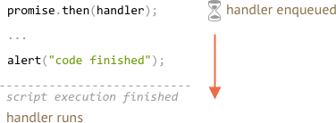
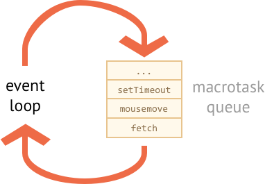

<<<<<<< HEAD
# Microtasks 和事件循环

Promise 的处理程序（handlers）`.then`、`.catch` 和 `.finally` 都是异步的。

即便一个 promise 立即被 resolve，`.then`、`.catch` 和 `.finally` **下面**的代码也会在这些处理程序之前被执行。

示例代码如下：
=======
# Microtasks

Promise handlers `.then`/`.catch`/`.finally` are always asynchronous.

Even when a Promise is immediately resolved, the code on the lines *below* `.then`/`.catch`/`.finally` will still execute before these handlers .

Here's the demo:
>>>>>>> 5e9eca374f644ea85c7d548bbe344fd30e5fb89d

```js run
let promise = Promise.resolve();

promise.then(() => alert("promise done"));

<<<<<<< HEAD
alert("code finished"); // 该警告框会首先弹出
```

如果你运行它，你会首先看到 `code finished`，然后才是 `promise done`。

这很奇怪，因为这个 promise 绝对在开头就被执行了。

为什么 `.then` 会在之后被触发？这是怎么回事？

## Microtasks（微任务）

异步任务需要适当的管理。为此，JavaScript 标准指定了一个内部队列 `PromiseJobs`，通常被称为 “microtask 队列”（v8 术语）。

如[规范](https://tc39.github.io/ecma262/#sec-jobs-and-job-queues)中所述：

- 队列是先进先出的：首先进入队列的任务会首先运行。
- 只有在引擎中没有其它任务运行时，才会启动任务队列的执行。

或者，简单地说，当一个 promise 准备就绪时，它的 `.then/catch/finally` 处理程序就被放入队列中。但是不会立即被执行。当 JavaScript 引擎执行完当前的代码，它会从队列中获取任务并执行它。

这就是示例中的 “code finished” 会首先出现的原因。



Promise 处理程序总是被放入这个内部队列中。

如果有一个 promise 链带有多个 `.then/catch/finally`，那么它们中每一个都是异步执行的。也就是说，它会首先排入一个队列，只有当前代码执行完毕而且先前的排好队的处理程序都完成时才会被执行。

**如果返回值的顺序对我们很重要该怎么办？我们怎么才能让 `code finished` 在 `promise done` 之后出现呢？**

很简单，只需要像下面这样把返回 `code finished` 的 `.then` 处理程序放入队列中：
=======
alert("code finished"); // this alert shows first
```

If you run it, you see `code finished` first, and then `promise done`.

That's strange, because the promise is definitely done from the beginning.

Why did the `.then` trigger afterwards? What's going on?

## Microtasks queue

Asynchronous tasks need proper management. For that, the standard specifies an internal queue `PromiseJobs`, more often referred to as "microtask queue" (v8 term).

As said in the [specification](https://tc39.github.io/ecma262/#sec-jobs-and-job-queues):

- The queue is first-in-first-out: tasks enqueued first are run first.
- Execution of a task is initiated only when nothing else is running.

Or, to say that simply, when a promise is ready, its `.then/catch/finally` handlers are put into the queue. They are not executed yet. JavaScript engine takes a task from the queue and executes it, when it becomes free from the current code.

That's why "code finished" in the example above shows first.


Promise handlers always go through that internal queue.

If there's a chain with multiple `.then/catch/finally`, then every one of them is executed asynchronously. That is, it first gets queued, and executed when the current code is complete and previously queued handlers are finished.

**What if the order matters for us? How can we make `code finished` work after `promise done`?**

Easy, just put it into the queue with `.then`:
>>>>>>> 5e9eca374f644ea85c7d548bbe344fd30e5fb89d

```js run
Promise.resolve()
  .then(() => alert("promise done!"))
  .then(() => alert("code finished"));
```

<<<<<<< HEAD
现在代码就是按照预期执行的。

## 事件循环

浏览器内的 JavaScript 以及 Node.js 的执行流程都是基于**事件循环**的。

“事件循环”是引擎休眠并等待事件的过程。只有当事件发生时才会处理它们，然后重新进入休眠状态。

事件可能来自外部，例如用户操作，或者也可能来自于内部任务的结束信号。

例如下面的事件：
- `mousemove`，用户移动了他们的鼠标。
- `setTimeout` 处理程序将被调用。
- 一个外部的 `<script src="...">` 被加载完成，准备执行。
- 网络操作，例如 `fetch` 被完成。
- 等等。

事情发生了 —— 引擎处理它们 —— 并等待更多的事情发生（在休眠时消耗接近零 CPU）。



如你所见，这里也有一个队列。所谓的 “macrotask（宏任务）队列”（v8 术语）。

当一个事件发生时，如果引擎正忙，它的处理程序就会进入这个队列排队等待执行。

例如，当引擎忙于处理网络 `fetch` 请求时，用户可能会移动他们的鼠标，这会触发 `mousemove`，或者相应的 `setTimeout` 等等，正如上图所示。

来自 macrotask 队列的事件基于“先进 —— 先处理”的原则被处理。当浏览器引擎完成 `fetch` 时，它会接着处理 `mousemove` 事件，然后是 `setTimeout` 处理程序，等等。

到目前为止，很简单，对吧？引擎正忙，所以其他任务需要排队。

现在重要的东西来了。

**Microtask 队列的优先级高于 macrotask 队列。**

换句话说，引擎会首先执行所有的 microtask，然后执行 macrotask。

例如，下面的代码：

```js run
setTimeout(() => alert("timeout"));

Promise.resolve()
  .then(() => alert("promise"));

alert("code");
```

顺序是什么？

1. `code` 第一个出现，因为它是一个常规的同步调用。
2. `promise` 第二个出现，因为 `.then` 通过 microtask 队列被执行，并在当前代码之后运行。
3. `timeout` 最后出现，因为它来自于 macrotask 队列。

可能会发生这样的情况，在处理 macrotask 时，新的 promise 被创建。

或者，反过来说，一个 microtask 调度了一个 macrotask（例如 `setTimeout`）。

例如，这里的 `.then` 调度了一个 `setTimeout`：

```js run
Promise.resolve()
  .then(() => {
    setTimeout(() => alert("timeout"), 0);
  })
  .then(() => {
    alert("promise");
  });
```

当然，`promise` 会首先出现，因为 `setTimeout` 宏任务在一个低优先级的 macrotask 队列中进行等待。

作为一个合乎逻辑的结果，只有当 promise 给引擎一个“空闲时间”时才处理 macrotask。因此，如果我们有一系列不等待任何事情的 promise 处理程序，它们会被一个接一个地执行，`setTimeout`（或者用户操作处理程序）永远不能在它们之间运行。

## 未处理的 rejection

还记得 <info:promise-error-handling> 一章中“未处理的 rejection”事件吗？

现在我们可以解释 JavaScript 是如何发现 rejection 是未被处理的。

**“未处理的 rejection”是指在 microtask 队列结束时未处理的 promise 错误。**

例如，考虑以下的代码：

```js run
let promise = Promise.reject(new Error("Promise Failed!"));

window.addEventListener('unhandledrejection', event => {
  alert(event.reason); // Promise Failed!
});
```

我们创建一个 rejected 的 `promise` 并且没有处理错误。所以我们有了一个 “未处理的 rejection”（也会在控制台打印出来）。

如果我们添加了 `.catch`，我们就不会见到这个“未处理的 rejection”，如下所示：

```js run
let promise = Promise.reject(new Error("Promise Failed!"));
*!*
promise.catch(err => alert('caught'));
*/!*

// 没有错误
window.addEventListener('unhandledrejection', event => alert(event.reason));
```

如下所示，现在我们假设会在 `setTimeout` 之后抓住这个错误：
=======
Now the order is as intended.

## Unhandled rejection

Remember "unhandled rejection" event from the chapter <info:promise-error-handling>?

Now we can see exactly how JavaScript finds out that there was an unhandled rejection

**"Unhandled rejection" occurs when a promise error is not handled at the end of the microtask queue.**

Normally, if we expect an error, we add `.catch` to the promise chain to handle it:

```js run
let promise = Promise.reject(new Error("Promise Failed!"));
*!*
promise.catch(err => alert('caught'));
*/!*

// doesn't run: error handled
window.addEventListener('unhandledrejection', event => alert(event.reason));
```

...But if we forget to add `.catch`, then, after the microtask queue is empty, the engine triggers the event:

```js run
let promise = Promise.reject(new Error("Promise Failed!"));

// Promise Failed!
window.addEventListener('unhandledrejection', event => alert(event.reason));
```

What if we handle the error later? Like this:
>>>>>>> 5e9eca374f644ea85c7d548bbe344fd30e5fb89d

```js run
let promise = Promise.reject(new Error("Promise Failed!"));
*!*
<<<<<<< HEAD
setTimeout(() => promise.catch(err => alert('caught')));
*/!*

// 错误：Promise Failed!
window.addEventListener('unhandledrejection', event => alert(event.reason));
```

现在再次出现“未处理的 rejection”。为什么？因为 `unhandledrejection` 在 microtask 队列完成时才会被生成。而引擎会检查 promise，如果其中的任何一个出现 “rejected” 状态，`unhandledrejection` 事件就会被触发。

在这个例子中，`.catch` 当然被 `setTimeout` 触发器添加了，只是会在 `unhandledrejection` 出现之后被执行。

## 总结

- Promise 处理始终是异步的，因为所有 promise 操作都被放入内部的 “promise jobs” 队列执行，也被称为 “microtask 队列”（v8 术语）。

    **因此，`.then/catch/finally` 处理程序总是在当前代码完成后才被调用。**

    如果我们需要确保一段代码在 `.then/catch/finally` 之后被执行，最好将它添加到 `.then` 的链式调用中。

- 还有一个 “macrotask 队列”，用于保存各种事件，网络操作结果，`setTimeout` —— 调度的方法，等等。这些也被称为 “macrotasks（宏任务）”（v8 术语）。

    引擎使用 macrotask 队列按出现顺序处理它们。

    **Macrotasks 在当前代码执行完成并且 microtask 队列为空时执行。**

    换句话说，它们的优先级较低。

所以顺序是：常规代码，然后是 promise 处理程序，然后是其他的一切，比如事件等等。
=======
setTimeout(() => promise.catch(err => alert('caught')), 1000);
*/!*

// Error: Promise Failed!
window.addEventListener('unhandledrejection', event => alert(event.reason));
```

Now, if you run it, we'll see `Promise Failed!` message first, and then `caught`. 

If we didn't know about microtasks queue, we could wonder: "Why did `unhandledrejection` handler run? We did catch the error!".

But now we understand that `unhandledrejection` is generated when the microtask queue is complete: the engine examines promises and, if any of them is in "rejected" state, then the event triggers.

In the example above, `.catch` added by `setTimeout` also triggers, but later, after `unhandledrejection` has already occurred, so that doesn't change anything.

## Summary

Promise handling is always asynchronous, as all promise actions pass through the internal "promise jobs" queue, also called "microtask queue" (v8 term).

So, `.then/catch/finally` handlers are always called after the current code is finished.

If we need to guarantee that a piece of code is executed after `.then/catch/finally`, we can add it into a chained `.then` call.

In most Javascript engines, including browsers and Node.js, the concept of microtasks is closely tied with "event loop" and "macrotasks". As these have no direct relation to promises, they are covered in another part of the tutorial, in the chapter <info:event-loop>.
>>>>>>> 5e9eca374f644ea85c7d548bbe344fd30e5fb89d
