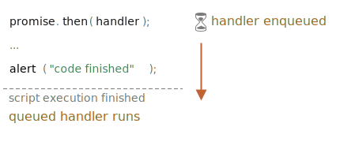

<<<<<<< HEAD
# 微任务（Microtasks）

Promise 的处理程序（handlers）`.then`、`.catch` 和 `.finally` 都是异步的。

即便一个 promise 立即被 resolve，`.then`、`.catch` 和 `.finally` *下面*的代码也会在这些处理程序之前被执行。

示例代码如下：
=======
# Microtasks

Promise handlers `.then`/`.catch`/`.finally` are always asynchronous.

Even when a Promise is immediately resolved, the code on the lines *below* `.then`/`.catch`/`.finally` will still execute before these handlers .

Here's the demo:
>>>>>>> 8c30654f694fe8682f5631809980be931ee4ed72

```js run
let promise = Promise.resolve();

<<<<<<< HEAD
promise.then(() => alert("promise done"));

alert("code finished"); // 该警告框会首先弹出
```

如果你运行它，你会首先看到 `code finished`，然后才是 `promise done`。

这很奇怪，因为这个 promise 绝对在开头就被执行了。

为什么 `.then` 会在之后被触发？这是怎么回事？

## 微任务队列（Microtasks queue）

异步任务需要适当的管理。为此，JavaScript 标准规定了一个内部队列 `PromiseJobs`，通常被称为 “微任务队列”（v8 术语）。

如[规范](https://tc39.github.io/ecma262/#sec-jobs-and-job-queues)中所述：

- 队列是先进先出的：首先进入队列的任务会首先运行。
- 只有在引擎中没有其它任务运行时，才会启动任务队列的执行。

或者，简单地说，当一个 promise 准备就绪时，它的 `.then/catch/finally` 处理程序就被放入队列中。但是不会立即被执行。当 JavaScript 引擎执行完当前的代码，它会从队列中获取任务并执行它。

这就是示例中的“code finished”会首先出现的原因。



Promise 处理程序总是被放入这个内部队列中。

如果有一个 promise 链带有多个 `.then/catch/finally`，那么它们中每一个都是异步执行的。也就是说，它会首先排入一个队列，只有当前代码执行完毕而且先前的排好队的处理程序都完成时才会被执行。

**如果返回值的顺序对我们很重要该怎么办？我们怎么才能让 `code finished` 在 `promise done` 之后出现呢？**

很简单，只需要像下面这样把返回 `code finished` 的 `.then` 处理程序放入队列中：
=======
promise.then(() => alert("promise done!"));

alert("code finished"); // this alert shows first
```

If you run it, you see `code finished` first, and then `promise done!`.

That's strange, because the promise is definitely done from the beginning.

Why did the `.then` trigger afterwards? What's going on?

## Microtasks queue

Asynchronous tasks need proper management. For that, the standard specifies an internal queue `PromiseJobs`, more often referred to as "microtask queue" (v8 term).

As said in the [specification](https://tc39.github.io/ecma262/#sec-jobs-and-job-queues):

- The queue is first-in-first-out: tasks enqueued first are run first.
- Execution of a task is initiated only when nothing else is running.

Or, to say that simply, when a promise is ready, its `.then/catch/finally` handlers are put into the queue. They are not executed yet. JavaScript engine takes a task from the queue and executes it, when it becomes free from the current code.

That's why "code finished" in the example above shows first.


Promise handlers always go through that internal queue.

If there's a chain with multiple `.then/catch/finally`, then every one of them is executed asynchronously. That is, it first gets queued, and executed when the current code is complete and previously queued handlers are finished.

**What if the order matters for us? How can we make `code finished` work after `promise done`?**

Easy, just put it into the queue with `.then`:
>>>>>>> 8c30654f694fe8682f5631809980be931ee4ed72

```js run
Promise.resolve()
  .then(() => alert("promise done!"))
  .then(() => alert("code finished"));
```

<<<<<<< HEAD
现在代码就是按照预期执行的。

## 未处理的 rejection

还记得 <info:promise-error-handling> 一章中“未处理的 rejection”事件吗？

现在我们可以解释 JavaScript 是如何发现 rejection 是未被处理的。

**“未处理的 rejection”是指在 microtask 队列结束时未处理的 promise 错误。**

正常来说，如果我们预期可能会发生错误，我们会添加 `.catch` 到 promise 链上去处理它：
=======
Now the order is as intended.

## Unhandled rejection

Remember `unhandledrejection` event from the chapter <info:promise-error-handling>?

Now we can see exactly how JavaScript finds out that there was an unhandled rejection

**"Unhandled rejection" occurs when a promise error is not handled at the end of the microtask queue.**

Normally, if we expect an error, we add `.catch` to the promise chain to handle it:
>>>>>>> 8c30654f694fe8682f5631809980be931ee4ed72

```js run
let promise = Promise.reject(new Error("Promise Failed!"));
*!*
promise.catch(err => alert('caught'));
*/!*

<<<<<<< HEAD
// 不会运行：错误已被处理
window.addEventListener('unhandledrejection', event => alert(event.reason));
```

……但是如果我们忘记添加 `.catch`，那么微任务队列清空后，JavaScript 引擎会触发以下事件：
=======
// doesn't run: error handled
window.addEventListener('unhandledrejection', event => alert(event.reason));
```

...But if we forget to add `.catch`, then, after the microtask queue is empty, the engine triggers the event:
>>>>>>> 8c30654f694fe8682f5631809980be931ee4ed72

```js run
let promise = Promise.reject(new Error("Promise Failed!"));

// Promise Failed!
window.addEventListener('unhandledrejection', event => alert(event.reason));
```

<<<<<<< HEAD
如果我们迟点再处理这个错误会怎样？比如：
=======
What if we handle the error later? Like this:
>>>>>>> 8c30654f694fe8682f5631809980be931ee4ed72

```js run
let promise = Promise.reject(new Error("Promise Failed!"));
*!*
<<<<<<< HEAD
setTimeout(() => promise.catch(err => alert('caught')));
=======
setTimeout(() => promise.catch(err => alert('caught')), 1000);
>>>>>>> 8c30654f694fe8682f5631809980be931ee4ed72
*/!*

// Error: Promise Failed!
window.addEventListener('unhandledrejection', event => alert(event.reason));
```

<<<<<<< HEAD
现在，如果你运行以上的代码，我们先会看到 `Promise Failed!` 的消息，然后才是 `caught`。

如果我们并不了解微任务队列，我们可能想知道：“为什么 `unhandledrejection` 的处理程序会运行？我们已经去捕捉（catch）这个错误了！”

但是现在我们知道 `unhandledrejection` 在 microtask 队列完成时才会被生成：引擎会检查 promise，如果其中的任何一个出现“rejected”状态，`unhandledrejection` 事件就会被触发。

在这个例子中，被添加到 `setTimeout` 的 `.catch` 也会执行，只是会在 `unhandledrejection` 事件出现之后才执行，所以并没有改变什么（没有发挥作用）。

## 总结

Promise 处理始终是异步的，因为所有 promise 操作都被放入内部的“promise jobs”队列执行，也被称为“微任务队列”（v8 术语）。

**因此，`.then/catch/finally` 处理程序总是在当前代码完成后才被调用。**

如果我们需要确保一段代码在 `.then/catch/finally` 之后被执行，最好将它添加到 `.then` 的链式调用中。

在大部分 JavaScript 引擎中（包括浏览器和 Node.js），微任务的概念与“事件循环”和“宏任务”紧密联系。由于这些概念跟 promises 没有直接关系，它们被涵盖在本教程另外的章节 <info:event-loop> 中。
=======
Now, if you run it, we'll see `Promise Failed!` message first, and then `caught`. 

If we didn't know about microtasks queue, we could wonder: "Why did `unhandledrejection` handler run? We did catch the error!".

But now we understand that `unhandledrejection` is generated when the microtask queue is complete: the engine examines promises and, if any of them is in "rejected" state, then the event triggers.

In the example above, `.catch` added by `setTimeout` also triggers, but later, after `unhandledrejection` has already occurred, so that doesn't change anything.

## Summary

Promise handling is always asynchronous, as all promise actions pass through the internal "promise jobs" queue, also called "microtask queue" (v8 term).

So, `.then/catch/finally` handlers are always called after the current code is finished.

If we need to guarantee that a piece of code is executed after `.then/catch/finally`, we can add it into a chained `.then` call.

In most Javascript engines, including browsers and Node.js, the concept of microtasks is closely tied with "event loop" and "macrotasks". As these have no direct relation to promises, they are covered in another part of the tutorial, in the chapter <info:event-loop>.
>>>>>>> 8c30654f694fe8682f5631809980be931ee4ed72
