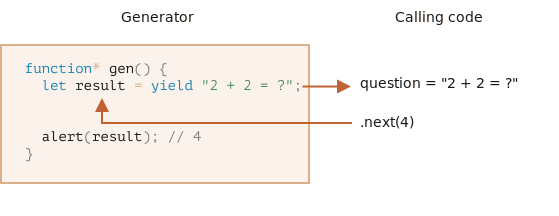

# generator

常规函数只会返回一个单一值（或者不返回任何值）。

而 generator 可以按需一个接一个地返回（"yield"）多个值。它们可与 [iterable](info:iterable) 完美配合使用，从而可以轻松地创建数据流。

## generator 函数

要创建一个 generator，我们需要一个特殊的语法结构：`function*`，即所谓的 "generator function"。

它看起来像这样：

```js
function* generateSequence() {
  yield 1;
  yield 2;
  return 3;
}
```

generator 函数与常规函数的行为不同。在此类函数被调用时，它不会运行其代码。而是返回一个被称为 "generator object" 的特殊对象，来管理执行流程。

我们来看一个例子：

```js run
function* generateSequence() {
  yield 1;
  yield 2;
  return 3;
}

// "generator function" 创建了一个 "generator object"
let generator = generateSequence();
*!*
alert(generator); // [object Generator]
*/!*
```

到目前为止，上面这段代码中的 **函数体** 代码还没有开始执行：


一个 generator 的主要方法就是 `next()`。当被调用时（译注：指 `next()` 方法），它会恢复上图所示的运行，执行直到最近的 `yield <value>` 语句（`value` 可以被省略，默认为 `undefined`）。然后函数执行暂停，并将产出的（yielded）值返回到外部代码。

`next()` 的结果始终是一个具有两个属性的对象：
- `value`: 产出的（yielded）的值。
- `done`: 如果 generator 函数已执行完成则为 `true`，否则为 `false`。

例如，我们可以创建一个 generator 并获取其第一个产出的（yielded）值：

```js run
function* generateSequence() {
  yield 1;
  yield 2;
  return 3;
}

let generator = generateSequence();

*!*
let one = generator.next();
*/!*

alert(JSON.stringify(one)); // {value: 1, done: false}
```

截至目前，我们只获得了第一个值，现在函数执行处在第二行：


让我们再次调用 `generator.next()`。代码恢复执行并返回下一个 `yield` 的值：

```js
let two = generator.next();

alert(JSON.stringify(two)); // {value: 2, done: false}
```


如果我们第三次调用 `generator.next()`，代码将会执行到 `return` 语句，此时就完成这个函数的执行：

```js
let three = generator.next();

alert(JSON.stringify(three)); // {value: 3, *!*done: true*/!*}
```


现在 generator 执行完成。我们通过 `done:true` 可以看出来这一点，并且将 `value:3` 处理为最终结果。

再对 `generator.next()` 进行新的调用不再有任何意义。如果我们这样做，它将返回相同的对象：`{done: true}`。

```smart header="`function* f(…)` 或 `function *f(…)`？"
这两种语法都是对的。

但是通常更倾向于第一种语法，因为星号 `*` 表示它是一个 generator 函数，它描述的是函数种类而不是名称，因此 `*` 应该和 `function` 关键字紧贴一起。
```

## generator 是可迭代的

当你看到 `next()` 方法，或许你已经猜到了 generator 是 [可迭代（iterable）](info:iterable)的。

我们可以使用 `for..of` 循环遍历它所有的值：

```js run
function* generateSequence() {
  yield 1;
  yield 2;
  return 3;
}

let generator = generateSequence();

for(let value of generator) {
  alert(value); // 1，然后是 2
}
```

`for..of` 写法是不是看起来比 `.next().value` 优雅多了？

……但是请注意：上面这个例子会先显示 `1`，然后是 `2`，然后就没了。它不会显示 `3`！

这是因为当 `done: true` 时，`for..of` 循环会忽略最后一个 `value`。因此，如果我们想要通过 `for..of` 循环显示所有的结果，我们必须使用 `yield` 返回它们：

```js run
function* generateSequence() {
  yield 1;
  yield 2;
*!*
  yield 3;
*/!*
}

let generator = generateSequence();

for(let value of generator) {
  alert(value); // 1，然后是 2，然后是 3
}
```

因为 generator 是可迭代的，我们可以使用 iterator 的所有相关功能，例如：spread 语法 `...`：

```js run
function* generateSequence() {
  yield 1;
  yield 2;
  yield 3;
}

let sequence = [0, ...generateSequence()];

alert(sequence); // 0, 1, 2, 3
```

在上面这段代码中，`...generateSequence()` 将可迭代的 generator 对象转换为了一个数组（关于 spread 语法的更多细节请见 [](info:rest-parameters-spread#spread-syntax)）。

## 使用 generator 进行迭代

在前面的 [](info:iterable) 一章中，我们创建了一个可迭代的 `range` 对象，它返回 `from..to` 的值。

现在，我们回忆一下代码：

```js run
let range = {
  from: 1,
  to: 5,

  // for..of range 在一开始就调用一次这个方法
  [Symbol.iterator]() {
    // ...它返回 iterator object：
    // 后续的操作中，for..of 将只针对这个对象，并使用 next() 向它请求下一个值
    return {
      current: this.from,
      last: this.to,

      // for..of 循环在每次迭代时都会调用 next()
      next() {
        // 它应该以对象 {done:.., value :...} 的形式返回值
        if (this.current <= this.last) {
          return { done: false, value: this.current++ };
        } else {
          return { done: true };
        }
      }
    };
  }
};

// 迭代整个 range 对象，返回从 `range.from` 到 `range.to` 范围的所有数字
alert([...range]); // 1,2,3,4,5
```

我们可以通过提供一个 generator 函数作为 `Symbol.iterator`，来使用 generator 进行迭代：

下面是一个相同的 `range`，但紧凑得多：

```js run
let range = {
  from: 1,
  to: 5,

  *[Symbol.iterator]() { // [Symbol.iterator]: function*() 的简写形式
    for(let value = this.from; value <= this.to; value++) {
      yield value;
    }
  }
};

alert( [...range] ); // 1,2,3,4,5
```

之所以代码正常工作，是因为 `range[Symbol.iterator]()` 现在返回一个 generator，而 generator 方法正是 `for..of` 所期望的：
- 它具有 `.next()` 方法
- 它以 `{value: ..., done: true/false}` 的形式返回值

当然，这不是巧合。generator 被添加到 JavaScript 语言中是有对 iterator 的考量的，以便更容易地实现 iterator。

带有 generator 的变体比原来的 `range` 迭代代码简洁得多，并且保持了相同的功能。

```smart header="generator 可以永远产出（yield）值"
在上面的示例中，我们生成了有限序列，但是我们也可以创建一个生成无限序列的 generator，它可以一直产出（yield）值。例如，无序的伪随机数序列。

这种情况下肯定需要在 generator 的 `for..of` 循环中添加一个 `break`（或者 `return`）。否则循环将永远重复下去并挂起。
```

## generator 组合

generator 组合（composition）是 generator 的一个特殊功能，它允许透明地（transparently）将 generator 彼此“嵌入（embed）”到一起。

例如，我们有一个生成数字序列的函数：

```js
function* generateSequence(start, end) {
  for (let i = start; i <= end; i++) yield i;
}
```

现在，我们想重用它来生成一个更复杂的序列：
- 首先是数字 `0..9`（字符代码为 48..57），
- 接下来是大写字母 `A..Z`（字符代码为 65..90）
- 接下来是小写字母 `a...z`（字符代码为 97..122）

我们可以对这个序列进行应用，例如，我们可以从这个序列中选择字符来创建密码（也可以添加语法字符），但让我们先生成它。

在常规函数中，要合并其他多个函数的结果，我们需要调用它们，存储它们的结果，最后再将它们合并到一起。

对于 generator 而言，我们可以使用 `yield*` 这个特殊的语法来将一个 generator “嵌入”（组合）到另一个 generator 中：

组合的 generator 的例子：

```js run
function* generateSequence(start, end) {
  for (let i = start; i <= end; i++) yield i;
}

function* generatePasswordCodes() {

*!*
  // 0..9
  yield* generateSequence(48, 57);

  // A..Z
  yield* generateSequence(65, 90);

  // a..z
  yield* generateSequence(97, 122);
*/!*

}

let str = '';

for(let code of generatePasswordCodes()) {
  str += String.fromCharCode(code);
}

alert(str); // 0..9A..Za..z
```

`yield*` 指令将执行 **委托** 给另一个 generator。这个术语意味着 `yield* gen` 在 generator `gen` 上进行迭代，并将其产出（yield）的值透明地（transparently）转发到外部。就好像这些值就是由外部的 generator yield 的一样。

执行结果与我们内联嵌套 generator 中的代码获得的结果相同：

```js run
function* generateSequence(start, end) {
  for (let i = start; i <= end; i++) yield i;
}

function* generateAlphaNum() {

*!*
  // yield* generateSequence(48, 57);
  for (let i = 48; i <= 57; i++) yield i;

  // yield* generateSequence(65, 90);
  for (let i = 65; i <= 90; i++) yield i;

  // yield* generateSequence(97, 122);
  for (let i = 97; i <= 122; i++) yield i;
*/!*

}

let str = '';

for(let code of generateAlphaNum()) {
  str += String.fromCharCode(code);
}

alert(str); // 0..9A..Za..z
```

generator 组合（composition）是将一个 generator 流插入到另一个 generator 流的自然的方式。它不需要使用额外的内存来存储中间结果。

## "yield" 是一条双向路

目前看来，generator 和可迭代对象类似，都具有用来生成值的特殊语法。但实际上，generator 更加强大且灵活。

这是因为 `yield` 是一条双向路（two-way street）：它不仅可以向外返回结果，而且还可以将外部的值传递到 generator 内。

调用 `generator.next(arg)`，我们就能将参数 `arg` 传递到 generator 内部。这个 `arg` 参数会变成 `yield` 的结果。

我们来看一个例子：

```js run
function* gen() {
*!*
  // 向外部代码传递一个问题并等待答案
  let result = yield "2 + 2 = ?"; // (*)
*/!*

  alert(result);
}

let generator = gen();

let question = generator.next().value; // <-- yield 返回的 value

generator.next(4); // --> 将结果传递到 generator 中  
```



1. 第一次调用 `generator.next()` 应该是不带参数的（如果带参数，那么该参数会被忽略）。它开始执行并返回第一个 `yield "2 + 2 = ?"` 的结果。此时，generator 执行暂停，而停留在 `(*)` 行上。
2. 然后，正如上面图片中显示的那样，`yield` 的结果进入调用代码中的 `question` 变量。
3. 在 `generator.next(4)`，generator 恢复执行，并获得了 `4` 作为结果：`let result = 4`。

请注意，外部代码不必立即调用 `next(4)`。外部代码可能需要一些时间。这没问题：generator 将等待它。

例如：

```js
// 一段时间后恢复 generator
setTimeout(() => generator.next(4), 1000);
```

我们可以看到，与常规函数不同，generator 和调用 generator 的代码可以通过在 `next/yield` 中传递值来交换结果。

为了讲得更浅显易懂，我们来看另一个例子，其中包含了许多调用：

```js run
function* gen() {
  let ask1 = yield "2 + 2 = ?";

  alert(ask1); // 4

  let ask2 = yield "3 * 3 = ?"

  alert(ask2); // 9
}

let generator = gen();

alert( generator.next().value ); // "2 + 2 = ?"

alert( generator.next(4).value ); // "3 * 3 = ?"

alert( generator.next(9).done ); // true
```

执行图：


1. 第一个 `.next()` 启动了 generator 的执行……执行到达第一个 `yield`。
2. 结果被返回到外部代码中。
3. 第二个 `.next(4)` 将 `4` 作为第一个 `yield` 的结果传递回 generator 并恢复 generator 的执行。
4. ……执行到达第二个 `yield`，它变成了 generator 调用的结果。
5. 第三个 `next(9)` 将 `9` 作为第二个 `yield` 的结果传入 generator 并恢复 generator 的执行，执行现在到达了函数的最底部，所以返回 `done: true`。

这个过程就像“乒乓球”游戏。每个 `next(value)`（除了第一个）传递一个值到 generator 中，该值变成了当前 `yield` 的结果，然后获取下一个 `yield` 的结果。

## generator.throw

正如我们在上面的例子中观察到的那样，外部代码可能会将一个值传递到 generator，作为 `yield` 的结果。

……但是它也可以在那里发起（抛出）一个 error。这很自然，因为 error 本身也是一种结果。

要向 `yield` 传递一个 error，我们应该调用 `generator.throw(err)`。在这种情况下，`err` 将被抛到对应的 `yield` 所在的那一行。

例如，`"2 + 2?"` 的 yield 导致了一个 error：

```js run
function* gen() {
  try {
    let result = yield "2 + 2 = ?"; // (1)

    alert("The execution does not reach here, because the exception is thrown above");
  } catch(e) {
    alert(e); // 显示这个 error
  }
}

let generator = gen();

let question = generator.next().value;

*!*
generator.throw(new Error("The answer is not found in my database")); // (2)
*/!*
```

在 `(2)` 行引入到 generator 的 error 导致了在 `(1)` 行中的 `yield` 出现了一个异常。在上面这个例子中，`try..catch` 捕获并显示了这个 error。

如果我们没有捕获它，那么就会像其他的异常一样，它将从 generator “掉出”到调用代码中。

调用代码的当前行是 `generator.throw` 所在的那一行，标记为 `(2)`。所以我们可以在这里捕获它，就像这样：

```js run
function* generate() {
  let result = yield "2 + 2 = ?"; // 这行出现 error
}

let generator = generate();

let question = generator.next().value;

*!*
try {
  generator.throw(new Error("The answer is not found in my database"));
} catch(e) {
  alert(e); // 显示这个 error
}
*/!*
```

如果我们没有在那里捕获这个 error，那么，通常，它会掉入外部调用代码（如果有），如果在外部也没有被捕获，则会杀死脚本。

## generator.return

`generator.return(value)` 完成 generator 的执行并返回给定的 `value`。

```js
function* gen() {
  yield 1;
  yield 2;
  yield 3;
}

const g = gen();

g.next();        // { value: 1, done: false }
g.return('foo'); // { value: "foo", done: true }
g.next();        // { value: undefined, done: true }
```

如果我们在已完成的 generator 上再次使用 `generator.return()`，它将再次返回该值（[MDN](https://developer.mozilla.org/en-US/docs/Web/JavaScript/Reference/Global_Objects/Generator/return)）。

通常我们不使用它，因为大多数时候我们想要获取所有的返回值，但是当我们想要在特定条件下停止 generator 时它会很有用。

## 总结

- generator 是通过 generator 函数 `function* f(…) {…}` 创建的。
- 在 generator（仅在）内部，存在 `yield` 操作。
- 外部代码和 generator 可能会通过 `next/yield` 调用交换结果。

在现代 JavaScript 中，generator 很少被使用。但有时它们会派上用场，因为函数在执行过程中与调用代码交换数据的能力是非常独特的。而且，当然，它们非常适合创建可迭代对象。

并且，在下一章我们将会学习 async generator，它们被用于在 `for await ... of` 循环中读取异步生成的数据流（例如，通过网络分页提取 (paginated fetches over a network)）。

在 Web 编程中，我们经常使用数据流，因此这是另一个非常重要的使用场景。
