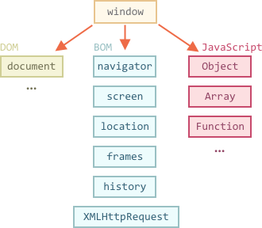

# 浏览器环境，规格

JavaScript 语言最初是为 Web 浏览器创建的。此后，它发展成为一种有多种用途和平台的语言。

平台可以是一个浏览器，一台网络服务器，一台洗衣机或其他**主机**。它们每个都提供特定于平台的功能。JavaScript 规范调用了**主机环境**。

<<<<<<< HEAD
主机环境提供语言核心以外的平台特定对象和功能。Web 浏览器提供了一种控制网页的手段。Node.JS 提供了服务器端功能，等等。
=======
A host environment provides platform-specific objects and functions additional to the language core. Web browsers give a means to control web pages. Node.js provides server-side features, and so on.
>>>>>>> b300836f00536a5eb9a716ad2cbb6b8fe97c25af

以下是浏览器在 JavaScript 中运行时的一个鸟瞰图：



有一个叫做 `window` 的“根”对象。它有两个角色：

1. 首先，它是 JavaScript 代码的全局对象，如 <info:global-object> 一章所述。
2. 其次，它代表“浏览器窗口”并提供控制它的方法。

例如，在这里我们将其用作全局对象：

```js run
function sayHi() {
  alert("Hello");
}

// global functions are accessible as properties of window
window.sayHi();
```

在这里，我们将它用作浏览器窗口，以查看窗口高度：

```js run
alert(window.innerHeight); // inner window height
```

还有更多窗口特定的方法和属性，我们稍后会介绍它们。

<<<<<<< HEAD
## 文档对象模型（DOM）
=======
## DOM (Document Object Model)
>>>>>>> b300836f00536a5eb9a716ad2cbb6b8fe97c25af

`document` 对象可以访问页面内容。我们可以使用它在页面上更改或创建任何内容。

例如：

```js run
// change the background color to red
document.body.style.background = "red";

// change it back after 1 second
setTimeout(() => document.body.style.background = "", 1000);
```

<<<<<<< HEAD
这里我们使用了 `document.body.style`，但还有很多很多其他的东西。规范中描述了属性和方法。正好有两个工作组在研发：

1. [W3C](https://en.wikipedia.org/wiki/World_Wide_Web_Consortium) — 其文档位于 <https://www.w3.org/TR/dom>。
2. [WhatWG](https://en.wikipedia.org/wiki/WHATWG)，发布在 <https://dom.spec.whatwg.org>。

巧的是，这两个工作组并不总是统一意见，所以我们有两套标准。但它们非常相似，并最终融合在一起。您在给定资源上找到的文档非常相似，约有 99％ 的相似度。你可能并不会注意到其中很小的差异。

我个人认为 <https://dom.spec.whatwg.org> 更适合使用。

在过去，根本没有任何标准 —— 每个浏览器都去实现它需要的东西。不同的浏览器对同一事物有不同的配置、方法和属性，开发人员必须为每个浏览器编写不同的代码。那是昏暗、混乱的时代。

即使现在我们有时可以遇到使用浏览器特定属性的旧代码，并且需要解决不兼容的问题。但是，在本教程中，我们将使用现代化的东西：除非迫不得已，否则不需要学习旧的东西。

后来出现了 DOM 标准，试图让每个浏览器都达成协议。第一个版本是“DOM Level 1”，然后它被 DOM Level 2 扩展，后来扩展到 DOM Level 3，现在它已经达到了 DOM Level 4. WhatWG 组的人厌倦了版本号，并将其称为“DOM”，没有号码。所以我们也会这样做。
=======
Here we used `document.body.style`, but there's much, much more. Properties and methods are described in the specification:

- **DOM Living Standard** at <https://dom.spec.whatwg.org>
>>>>>>> b300836f00536a5eb9a716ad2cbb6b8fe97c25af

```smart header="DOM is not only for browsers"
DOM 规范解释了文档的结构并提供了对其进行操作的对象。有的非浏览器设备也在使用它。

例如，下载并处理 HTML 页面的服务器端工具使用 DOM。尽管如此，他们可能只支持部分规范。
```

```smart header="CSSOM for styling"
CSS 规则和样式表的结构不像 HTML。有一个单独的规范 [CSSOM](https://www.w3.org/TR/cssom-1/) 解释了如何将 CSS 表示为对象，以及如何读写它们。

当我们修改文档的样式规则时，CSSOM 与 DOM 一起使用。但实际上，很少需要 CSSOM，因为通常 CSS 规则是静态的。我们很少需要从 JavaScript 中添加/删除 CSS 规则，所以我们现在不会介绍它。
```

<<<<<<< HEAD
## BOM（HTML 规范的一部分）
=======
## BOM (Browser object model)
>>>>>>> b300836f00536a5eb9a716ad2cbb6b8fe97c25af

浏览器对象模型（BOM）是浏览器（主机环境）提供的附加对象，用于处理除文档之外的所有内容。

例如：

- [navigator](mdn:api/Window/navigator) 对象提供有关浏览器和操作系统的背景信息。navigator 有许多属性，但是最广为人知的两个属性是：`navigator.userAgent` —— 关于当前浏览器和`navigator.platform` —— 关于平台（可以帮助区分 Windows / Linux / Mac等）。
- [location](mdn:api/Window/navigator) 对象允许我们读取当前URL并将浏览器重定向到新的URL。

以下是我们如何使用 `location` 对象：

```js run
alert(location.href); // shows current URL
if (confirm("Go to wikipedia?")) {
  location.href = "https://wikipedia.org"; // redirect the browser to another URL
}
```

函数 `alert/confirm/prompt` 也是 BOM 的一部分：它们与文档并不直接相关，但它表示了与用户通信的纯浏览器方法。

<<<<<<< HEAD

```smart header="HTML specification"
BOM 是通用 [HTML 规范](https://html.spec.whatwg.org)的一部分。

<https://html.spec.whatwg.org> 中的 HTML 规范不仅是关于“HTML 语言”（标签，属性），还涵盖了一堆对象、方法和浏览器特定的DOM扩展。这就是“广义的HTML”。
```
=======
BOM is the part of the general [HTML specification](https://html.spec.whatwg.org).

Yes, you heard that right. The HTML spec at <https://html.spec.whatwg.org> is not only about the "HTML language" (tags, attributes), but also covers a bunch of objects, methods and browser-specific DOM extensions. That's "HTML in broad terms". Also, some parts have additional specs listed at <https://spec.whatwg.org>.
>>>>>>> b300836f00536a5eb9a716ad2cbb6b8fe97c25af

## 总结

说到标准，我们有：

DOM 标准
: 描述文档的结构、操作和事件，参见 <https://dom.spec.whatwg.org>。

CSSOM 标准
: 介绍样式表和样式规则，对它们的操作及其对文档的绑定，参见 <https://www.w3.org/TR/cssom-1/>.

HTML 标准
: 介绍 HTML 语言（例如标签）以及 BOM（浏览器对象模型）—— 各种浏览器函数：`setTimeout`、`alert`、`location`等等，请参阅https://html.spec.whatwg.org。它采用了 DOM 规范并为其扩展了许多属性和方法。

<<<<<<< HEAD
现在我们开始学习 DOM，因为文档在 UI 中扮演着重要角色。

请注意上面的链接，因为有太多东西需要学习，所以在这里不可能掌握和记住所有内容。

当您想要了解某个属性或方法时，Mozilla 手册 <https://developer.mozilla.org/en-US/search> 是一个很好的资源，但阅读相应的规范可能会更好：它需要更复杂和更长的时间来阅读，但会使你的基本知识变得健全和完整。
=======
Additionally, some classes are described separately at <https://spec.whatwg.org/>.

Please note these links, as there's so much stuff to learn it's impossible to cover and remember everything.

When you'd like to read about a property or a method, the Mozilla manual at <https://developer.mozilla.org/en-US/search> is also a nice resource, but the corresponding spec may be better: it's more complex and longer to read, but will make your fundamental knowledge sound and complete.

To find something, it's often convenient to use an internet search "WHATWG [term]" or "MDN [term]", e.g <https://google.com?q=whatwg+localstorage>, <https://google.com?q=mdn+localstorage>.

Now we'll get down to learning DOM, because the document plays the central role in the UI.
>>>>>>> b300836f00536a5eb9a716ad2cbb6b8fe97c25af
