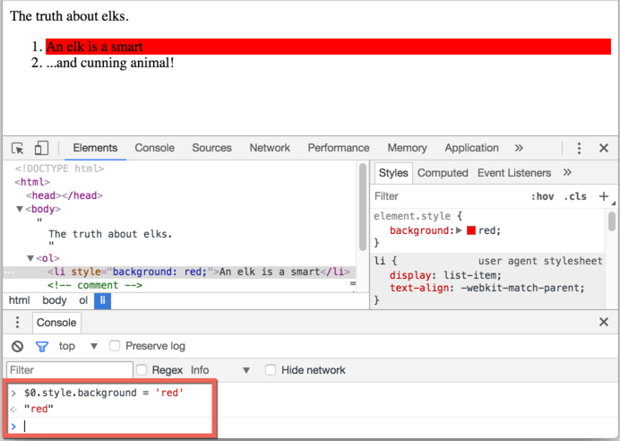

libs:
  - d3
  - domtree

---

# DOM 树

HTML 文档的骨干是标签。

根据文档对象模型（DOM），每个 HTML 标签都是一个对象。嵌套标签被称为闭合标签的“子标签”。

标签内的文本也是一个对象。

所有这些对象都可以用 JavaScript 来操作。

## DOM 的例子

例如，我们来研究这个文档的 DOM：

```html run no-beautify
<!DOCTYPE HTML>
<html>
<head>
  <title>About elks</title>
</head>
<body>
  The truth about elks.
</body>
</html>
```

DOM 将 HTML 表示为标签的树形结构。它是这个样子的：

<div class="domtree"></div>

<script>
let node1 = {"name":"HTML","nodeType":1,"children":[{"name":"HEAD","nodeType":1,"children":[{"name":"#text","nodeType":3,"content":"\n    "},{"name":"TITLE","nodeType":1,"children":[{"name":"#text","nodeType":3,"content":"About elks"}]},{"name":"#text","nodeType":3,"content":"\n  "}]},{"name":"#text","nodeType":3,"content":"\n  "},{"name":"BODY","nodeType":1,"children":[{"name":"#text","nodeType":3,"content":"\n  The truth about elks."}]}]}

drawHtmlTree(node1, 'div.domtree', 690, 320);
</script>

```online
在上面的图片中，你可以点击元素节点，他们的子节点会打开/折叠。
```

标签被称为**元素节点**（或者仅仅是元素）。嵌套标签称为闭合标签的子标签。因此我们有这样一个元素树：`<html>` 在根目录下，然后 `<head>` 和 `<body>` 是它的子项，等等。

元素内的文本形成**文本节点**，标记为 `＃text`。文本节点只包含一个字符串。它没有子项，永远是树的一片叶子。

例如，`<title>` 标签里面有文本 `"About elks"`。

请注意文本节点中的特殊字符：

- 换行符：`↵`（在 JavaScript 中称为`\n`）
- 一个空格：`␣`

空格和换行符是完全有效的字符，它们形成文本节点并成为 DOM 的一部分。因此，在上面的例子中，`<head>` 标签在 `<title>` 之前包含了一些空格，并且该文本变成了一个 `#text` 节点（它只包含换行符和一些空格）。

只有两个顶级排除项目：
1. 由于历史原因，`<head>` 之前的空格和换行符被忽略，
2. 如果我们在 `</body>` 之后放置了一些东西，那么它会自动移动到 `body` 内部，因为 HTML 规范要求所有内容必须位于 `<body>` 内。所以 `</body>` 后面可能没有空格。

在其他情况下，一切都很简单 —— 如果文档中有空格（就像任何字符一样），那么它们将成为 DOM 中的文本节点，如果我们删除它们，则不会有任何内容。

这里是没有空格的文本节点：

```html no-beautify
<!DOCTYPE HTML>
<html><head><title>About elks</title></head><body>The truth about elks.</body></html>
```

<div class="domtree"></div>

<script>
let node2 = {"name":"HTML","nodeType":1,"children":[{"name":"HEAD","nodeType":1,"children":[{"name":"TITLE","nodeType":1,"children":[{"name":"#text","nodeType":3,"content":"About elks"}]}]},{"name":"BODY","nodeType":1,"children":[{"name":"#text","nodeType":3,"content":"The truth about elks."}]}]}

drawHtmlTree(node2, 'div.domtree', 690, 210);
</script>

```smart header="Edge spaces and in-between empty text are usually hidden in tools"
与 DOM 协同工作的浏览器工具（不久将会覆盖）通常不会在文本的开始/结尾处显示空格，并且在标记之间不会显示空文本节点（换行符）。

这是因为它们主要用于装饰 HTML，并且不会影响其显示方式（在大多数情况下）。

在进一步的 DOM 图片上，我们有时候会忽略它们，因为它们是无关紧要的，所以要保持简短。
```


## 自动修正

如果浏览器遇到格式不正确的 HTML，它会在形成 DOM 时自动修正它。

例如，顶部标签总是 `<html>`。即使它不在于文档中 —— 它将在 DOM 中出现，因为浏览器会创建它。`<body>` 也是一样。

例如，如果 HTML 文件是单个单词“Hello”，浏览器将把它包装到 `<html>` 和 `<body>` 中，添加所需的 `<head>`，DOM 将会变成：


<div class="domtree"></div>

<script>
let node3 = {"name":"HTML","nodeType":1,"children":[{"name":"HEAD","nodeType":1,"children":[]},{"name":"BODY","nodeType":1,"children":[{"name":"#text","nodeType":3,"content":"Hello"}]}]}

drawHtmlTree(node3, 'div.domtree', 690, 150);
</script>

在生成 DOM 时，浏览器会自动处理文档中的错误，关闭标签等等。

这样的“无效”文档：

```html no-beautify
<p>Hello
<li>Mom
<li>and
<li>Dad
```

...将成为一个正常的 DOM，因为浏览器会读取标签并恢复丢失的部分：

<div class="domtree"></div>

<script>
let node4 = {"name":"HTML","nodeType":1,"children":[{"name":"HEAD","nodeType":1,"children":[]},{"name":"BODY","nodeType":1,"children":[{"name":"P","nodeType":1,"children":[{"name":"#text","nodeType":3,"content":"Hello"}]},{"name":"LI","nodeType":1,"children":[{"name":"#text","nodeType":3,"content":"Mom"}]},{"name":"LI","nodeType":1,"children":[{"name":"#text","nodeType":3,"content":"and"}]},{"name":"LI","nodeType":1,"children":[{"name":"#text","nodeType":3,"content":"Dad"}]}]}]}

drawHtmlTree(node4, 'div.domtree', 690, 360);
</script>

````warn header="Tables always have `<tbody>`"
表格是一个有趣的“特例”。按照 DOM 规范，它们必须具有 `<tbody>`，但 HTML 文本可能（官方的）忽略它。然后浏览器自动在 DOM 中创建 `<tbody>`。

对于 HTML：

```html no-beautify
<table id="table"><tr><td>1</td></tr></table>
```

DOM 结构会变成：
<div class="domtree"></div>

<script>
let node5 = {"name":"TABLE","nodeType":1,"children":[{"name":"TBODY","nodeType":1,"children":[{"name":"TR","nodeType":1,"children":[{"name":"TD","nodeType":1,"children":[{"name":"#text","nodeType":3,"content":"1"}]}]}]}]};

drawHtmlTree(node5,  'div.domtree', 600, 200);
</script>

看到了吗？`<tbody>` 出现了。在使用表格时，应该牢记这一点以避免意外。


## 其他节点类型

让我们在页面中添加更多标签和注释：

```html
<!DOCTYPE HTML>
<html>
<body>
  The truth about elks.
  <ol>
    <li>An elk is a smart</li>
*!*
    <!-- comment -->
*/!*
    <li>...and cunning animal!</li>
  </ol>
</body>
</html>
```

<div class="domtree"></div>

<script>
let node6 = {"name":"HTML","nodeType":1,"children":[{"name":"HEAD","nodeType":1,"children":[]},{"name":"BODY","nodeType":1,"children":[{"name":"#text","nodeType":3,"content":"\n  The truth about elks.\n    "},{"name":"OL","nodeType":1,"children":[{"name":"#text","nodeType":3,"content":"\n      "},{"name":"LI","nodeType":1,"children":[{"name":"#text","nodeType":3,"content":"An elk is a smart"}]},{"name":"#text","nodeType":3,"content":"\n      "},{"name":"#comment","nodeType":8,"content":"comment"},{"name":"#text","nodeType":3,"content":"\n      "},{"name":"LI","nodeType":1,"children":[{"name":"#text","nodeType":3,"content":"...and cunning animal!"}]},{"name":"#text","nodeType":3,"content":"\n    "}]},{"name":"#text","nodeType":3,"content":"\n  \n"}]}]};

drawHtmlTree(node6, 'div.domtree', 690, 500);
</script>

在这里我们看到一个新的树节点类型 —— *comment node*，标记为 `#comment`。

我们可能会想 —— 为什么要将注释添加到 DOM 中？它不会以任何方式影响视觉表示。但是有一条规则 —— 如果 HTML 中有东西，那么它也必须在 DOM 树中。

**HTML 中的所有内容甚至注释都成为 DOM 的一部分。**

甚至 HTML 开头的 `<!DOCTYPE...>` 指令也是一个 DOM 节点。它在 `<html>` 之前的 DOM 树中。我们不会触及那个节点，我们甚至不会因为那个原因在图表上绘制它，但它就在那里。

表示整个文档的 `document` 对象在形式上也是一个 DOM 节点。

有 [12 中节点类型](https://dom.spec.whatwg.org/#node)。实际上，我们通常用到的是其中的 4 个：

1. `document`—— DOM 中的“入口点”。
2. 元素节点 —— HTML 标签，树构建块。
3. 文本节点 —— 包含文本。
4. 注释 —— 有时我们可以将内容放入其中，它不会显示，但 JS 可以从 DOM 中读取它。

## 自行查看

要实时查看 DOM 结构，请尝试 [Live DOM Viewer](http://software.hixie.ch/utilities/js/live-dom-viewer/)。只需输入文档，它就会立即显示 DOM。

## 在浏览器中检查

研究 DOM 的另一种方式是使用浏览器开发工具。事实上，这正是我们开发时所使用的工具。

请打开网页 [elks.html](elks.html)，打开浏览器开发工具并切换到元素选项卡。

它是这样的：


你可以看到 DOM，点击元素，查看其中的细节等等。

请注意，开发者工具中的 DOM 结构已经过简化。文本节点仅以文本形式显。根本没有“空白”（只有空格）的文本节点。这其实很好，因为大部分时间我们都对元素节点感兴趣。

点击左上角的 <span class="devtools" style="background-position:-328px -124px"></span> 按钮可以使用鼠标（或其他指针设备）从网页中选择一个节点并“检查”它（在“元素”选项卡中滚动到该节点）。当我们有一个巨大的 HTML 页面（和相应的巨大 DOM），并希望看到其中的一个特定元素的位置时，这很有用。

另一种方法是在网页上右键单击并在上下文菜单中选择“检查”。


在工具的右侧部分有以下子表单：
- **Styles** —— 我们可以看到应用于当前元素的 CSS 中的一条条规则，包括内置规则（灰色）。几乎所有东西都可以在原地进行编辑，包括下面框中的尺寸/边距/填充。
- **Computed** —— 按属性查看应用于元素的 CSS：对于每个属性，我们可以看到一条规则（包括 CSS 继承等）。
- **Event Listeners** —— 查看附加到 DOM 元素的事件侦听器（我们将在本教程的下一部分介绍它们）。
- ...等等。

研究它们的最佳方式就是多多点击。大多数值都是可以原地编辑的。

## 与控制台交互

在我们研究 DOM 时，我们也可能想要使用 JavaScript。就比如：获取一个节点并运行一些代码来修改它，看看它长什么样。这里有一些在元素选项卡和控制台之间传输数据的提示。

- 在元素标签中选择第一个 `<li>`。
- 按下 `key:Esc` —— 它将在元素标签下方打开控制台。

现在最后选中的元素可以用 `$0` 来进行操作，以前选择的是 `$1`，如此等等。

我们可以在它们之上运行命令。例如，`$0.style.background = 'red'` 使选定的列表项变成红色，如下所示：



另一方面，如果我们处在控制台中，并且有一个引用 DOM 节点的变量，那么我们可以使用命令 `inspect（node）` 在元素窗格中查看它。

或者我们可以在控制台中输出它并“就地”测试它，如下面的 `document.body`：


这当然是用于调试的目的。从下一章我们将使用 JavaScript 访问和修改 DOM。

浏览器开发者工具对开发有很大的帮助：我们可以研究 DOM，做一些测试并查看出了什么问题。

## 总结

HTML/XML 文档在浏览器内表示为 DOM 树。

- 标签成为元素节点并形成文档结构。
- 文本成为文本节点。
- ...如此等等，HTML 中的所有东西在 DOM 中都有它的位置，甚至是注释。

我们可以使用开发者工具来检查 DOM 并手动修改它。

在这里，我们介绍了基本知识，入门最常用和最重要的操作。在 <https://developers.google.cn/web/tools/chrome-devtools> 上有大量有关 Chrome 开发者工具的文档。学习这些工具的最佳方式是四处点击，阅读菜单：大多数选项都很明显。而后，当你差不多了解它们时，阅读文档并学习其余的部分。

DOM 节点具有在它们之间传递数据，修改、移动页面等功能的属性和方法。我们将在接下来的章节中讨论他们。
