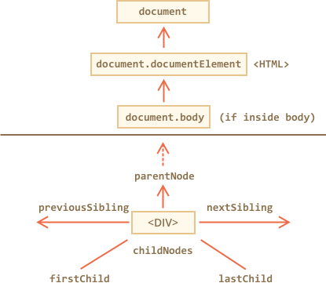

libs:
  - d3
  - domtree

---


# 遍历 DOM

<<<<<<< HEAD
DOM 让我们可以对元素和它们其中的内容做任何事，但是首先我们需要获取到对应的 DOM 对象，把这个对象赋予一个变量，然后我们才能修改这个对象。

对 DOM 的所有操作都是从 `document` 对象开始的。从这个对象我们可以到达任何节点。

这里是一张描述对象间链接的图片，通过这些链接我们可以在 DOM 节点之间遍历。
=======
The DOM allows us to do anything with elements and their contents, but first we need to reach the corresponding DOM object.

All operations on the DOM start with the `document` object. From it we can access any node.

Here's a picture of links that allow for travel between DOM nodes:
>>>>>>> 5e9eca374f644ea85c7d548bbe344fd30e5fb89d



让我们更详细地讨论这些。

## 在最顶上的：documentElement 和 body

最上面的树节点可以直接通过 `document` 属性来使用：

`<html>` = `document.documentElement`
: 最上面的 document 节点是  `document.documentElement`。这是对应 `<html>` 标签的 DOM 节点。

`<body>` = `document.body`
: 另一个被广泛使用的 DOM 节点是 `<body>` 元素 — `document.body`。

`<head>` = `document.head`
: `<head>` 标签可以通过 `document.head` 访问。

````warn header="这里有个问题：`document.body` 的值可能是 `null`"
脚本无法访问在运行时不存在的元素。

特别要注意的是，如果一个脚本是在 `<head>` 标签中，那么脚本中是访问不到 `document.body` 元素的，因为浏览器还没有读到其中的内容。

所以在下面的例子中第一个 `alert` 函数显示的是 `null`：

```html run
<html>

<head>
  <script>
*!*
    alert( "From HEAD: " + document.body ); // null, there's no <body> yet
*/!*
  </script>
</head>

<body>

  <script>
    alert( "From BODY: " + document.body ); // HTMLBodyElement, now it exists
  </script>

</body>
</html>
```
````

```smart header="在 DOM 世界中 `null` 就意味着“不存在”"
在 DOM 中，`null` 值就意味着“不存在”或者“没有这样的节点”。 
```

## 子元素：childNodes, firstChild, lastChild

从现在开始，我们将使用下面这两个术语：

- **子节点（或者叫做子）** —— 对应的是直系的子元素。换句话说它们会完全嵌套在指定的一个元素中。举个例子，`<head>` 和 `<body>` 就是 `<html>` 元素的子元素。
- **子系元素** —— 对应的是所有嵌套在一个指定元素中的元素，包括这些元素的子元素，以此类推得到的所有元素。

比如说，在这里 `<body>` 有子元素 `<div>` 和 `<ul>`（以及一些空白的文本节点）：

```html run
<html>
<body>
  <div>Begin</div>

  <ul>
    <li>
      <b>Information</b>
    </li>
  </ul>
</body>
</html>
```

<<<<<<< HEAD
...如果我们要找的是 `<body>` 的子系元素，那我们可以先得到它直系子元素 `<div>`，`<ul>` 以及像 `<li>`（`<ul>` 的子元素）和 `<b>`（`<li>` 的子元素）这样嵌套更深的元素 — 这就是 `<body>` 元素包含的整个子树。
=======
...And all descendants of `<body>` are not only direct children `<div>`, `<ul>` but also more deeply nested elements, such as `<li>` (a child of `<ul>`) and `<b>` (a child of `<li>`) -- the entire subtree.
>>>>>>> 5e9eca374f644ea85c7d548bbe344fd30e5fb89d

**`childNodes` 集合提供了对所有子节点包括其中文本节点的访问。**

下面的例子显示了 `document.body` 的子元素：

```html run
<html>
<body>
  <div>Begin</div>

  <ul>
    <li>Information</li>
  </ul>

  <div>End</div>

  <script>
*!*
    for (let i = 0; i < document.body.childNodes.length; i++) {
      alert( document.body.childNodes[i] ); // Text, DIV, Text, UL, ..., SCRIPT
    }
*/!*
  </script>
  ...more stuff...
</body>
</html>
```

请注意在这边有一个有趣的细节。如果我们运行上面的例子，所展示代码中最后的元素是 `<script>`。实际上，文档下面还有很多东西，但是在这个脚本执行的时候，浏览器还没有读到下面的内容，所以这个脚本并不能看到它们。

**`firstChild` 和 `lastChild` 属性是访问第一个和最后一个子元素的快捷方式**

它们只是简写。如果元素存在子节点，那么下面的脚本运行结果一直都是 true：
```js
elem.childNodes[0] === elem.firstChild
elem.childNodes[elem.childNodes.length - 1] === elem.lastChild
```

这里还有一个特别的函数 `elem.hasChildNodes()` 用于检测节点是否有子节点。

### DOM 集合

正如我们看到的那样，`childNodes` 看起来就像一个数组。但是它实际上并不是一个数组，而是一个**集合** —— 一个类似数组的可迭代对象。

这个性质会导致两个重要的结果：

1. 我们可以使用 `for..of` 语法来迭代它：
  ```js
  for (let node of document.body.childNodes) {
    alert(node); // shows all nodes from the collection
  }
  ```
  这是因为集合是可迭代的（提供了所需要的 `Symbol.iterator` 属性）。

2. 并不能使用数组的方法，因为它并不是一个数组：
  ```js run
  alert(document.body.childNodes.filter); // undefined (there's no filter method!)
  ```

因为集合性质所得到的第一个结果很不错。第二个结果也还可以忍受，因为如果我们想调用数组的方法的话可以通过 `Array.from` 方法来从集合中创建一个“真”的数组：

  ```js run
  alert( Array.from(document.body.childNodes).filter ); // now it's there
  ```

```warn header="DOM 集合是只读的"
DOM 集合甚至可以说本章中列出的**所有**导航属性都是只读的。

<<<<<<< HEAD
我们不能通过类似 `childNodes[i] = ...` 的操作来替换一个子节点。

修改子节点需要使用其它的方法，我们将会在下一章中看到它们。
=======
We can't replace a child by something else by assigning `childNodes[i] = ...`.

Changing DOM needs other methods. We will see them in the next chapter.
>>>>>>> 5e9eca374f644ea85c7d548bbe344fd30e5fb89d
```

```warn header="DOM 集合是实时的"
除小部分例外之外几乎所有的 DOM 集合都是**实时**的。换句话说，它们都反映的是 DOM 的实时状态。

如果我们保留一个对 `elem.childNodes` 的引用，然后在 DOM 中添加/移除节点，那么这些新加的节点就会自动出现在这个集合中。
```

````warn header="不要使用 `for..in` 来循环遍历集合"
在使用 `for..of` 的情况下集合是可迭代的。但是有时候人们会尝试使用 `for..in` 来迭代集合。

请不要这么做。`for..in` 循环遍历的是所有列举的属性。集合会有一些“额外”很少用到的属性，这些属性我们通常不会获取到：

```html run
<body>
<script>
  // 显示 0、1、length、item、values 以及其它值。
  for (let prop in document.body.childNodes) alert(prop);
</script>
</body>
````

## 兄弟节点和父节点

**兄弟节点**是指有同一个父节点的节点。比如说 `<head>` 和 `<body>` 就是兄弟节点：

- `<body>` 可以说是 `<head>` 的“下一个”或者“右边”兄弟节点。
- `<head>` 可以说是 `<body>` 的“前一个”或者“左边”兄弟节点。

父节点可以通过 `parentNode` 访问。

在同一个父节点中一个节点的下一个节点（下一个兄弟节点）可以通过 `nextSibling` 访问，上一个节点可以通过 `previousSibling` 访问。

比如说：

```html run
<html><head></head><body><script>
  //  HTML 代码是“密集”的用来避免额外的“空白”文本节点。
  HTML is "dense" to evade extra "blank" text nodes.

  // <body> 的父节点是 <html>
  alert( document.body.parentNode === document.documentElement ); // true

  // <head> 的下一个兄弟节点是  <body>
  alert( document.head.nextSibling ); // HTMLBodyElement

  // <body> 的上一个兄弟节点是  <head>
  alert( document.body.previousSibling ); // HTMLHeadElement
</script></body></html>
```

## 只在元素中导航

上面列出的导航属性涉及到**所有**节点。比如说，在 `childNodes` 中我们可以看到文本节点，元素节点，甚至如果存在注释节点的话，也能访问到。 

但是对于很多任务来说，我们并不想要文本或者注释节点。我们希望可以操纵代表标签的元素节点以及构建整个页面的结构。

所以让我们看看当只考虑**元素节点**时更多的导航链接：


这些链接和之前上面的相似，只是在词中间加了 `Element`：

- `children` —— 只获取类型为元素节点的子节点。
- `firstElementChild`，`lastElementChild` —— 第一个和最后一个子元素。
- `previousElementSibling`，`nextElementSibling` —— 兄弟元素。
- `parentElement` —— 父元素。

````smart header="为什么是 `parentElement`? 父节点可以不是一个元素吗？"
`parentElement` 属性返回的是“元素”父节点，而 `parentNode` 返回的是“任何类型”的父节点。这些属性通常来说是一样的：它们都获取父节点。

除了有一个例外就是 `document.documentElement`：

```js run
alert( document.documentElement.parentNode ); // document
alert( document.documentElement.parentElement ); // null
```

换句话说，`documentElement`（对应 `<html>` 标签）是根节点。形式上来讲，它有 `document` 作为它的父节点。但是 `document` 并不是一个元素节点，所以 `parentNode` 返回了 `document` 而 `parentElement` 却没有。

<<<<<<< HEAD
有时候，当我们要遍历父节点并且在每个遍历的节点调用方法时这很重要，但是 `document` 并没有父元素节点，所以我们要将它排除在外。
=======
This loop travels up from an arbitrary element `elem` to `<html>`, but not to the `document`:
```js
while(elem = elem.parentElement) {
  alert( elem ); // parent chain till <html>
}
```
>>>>>>> 5e9eca374f644ea85c7d548bbe344fd30e5fb89d
````

让我们修改上面的其中一个例子：用 `children` 来替换 `childNodes`。现在它就只显示元素：

```html run
<html>
<body>
  <div>Begin</div>

  <ul>
    <li>Information</li>
  </ul>

  <div>End</div>

  <script>
*!*
    for (let elem of document.body.children) {
      alert(elem); // DIV, UL, DIV, SCRIPT
    }
*/!*
  </script>
  ...
</body>
</html>
```

## 更多链接：表 [#dom-navigation-tables]

到现在为止我们描述了基本的导航属性。

为了方便起见，某些类型的 DOM 元素会提供特定于其类型的额外属性。

Tables 是其中一个很好也是很重要的例子。

<<<<<<< HEAD
**`<table>`** 元素支持 (除了上面给出的之外) 以下这些属性:
- `table.rows` — 用于表示表中 `<tr>` 元素的集合。
- `table.caption/tHead/tFoot` — 用于访问元素 `<caption>`、`<thead>`、`<tfoot>`。
- `table.tBodies` — `<tbody>` 元素的集合（根据标准该元素数量可以很多）。
=======
**The `<table>`** element supports (in addition to the given above) these properties:
- `table.rows` -- the collection of `<tr>` elements of the table.
- `table.caption/tHead/tFoot` -- references to elements `<caption>`, `<thead>`, `<tfoot>`.
- `table.tBodies` -- the collection of `<tbody>` elements (can be many according to the standard).
>>>>>>> 5e9eca374f644ea85c7d548bbe344fd30e5fb89d

**`<thead>`、`<tfoot>`、`<tbody>`** 元素提供了 `rows` 属性：
- `tbody.rows` — 表内部 `<tr>` 元素的集合。

<<<<<<< HEAD
**`<tr>`：**
- `tr.cells` — 在给定 `<tr>` 元素下 `<td>` 和 `<th>` 单元格的集合。
- `tr.sectionRowIndex` — 在封闭的 `<thead>/<tbody>` 中 `<tr>` 的编号。
- `tr.rowIndex` — 在表中 `<tr>` 元素的编号。
=======
**`<tr>`:**
- `tr.cells` -- the collection of `<td>` and `<th>` cells inside the given `<tr>`.
- `tr.sectionRowIndex` -- the position (index) of the given `<tr>` inside the enclosing `<thead>/<tbody>/<tfoot>`.
- `tr.rowIndex` -- the number of the `<tr>` in the table as a whole (including all table rows).
>>>>>>> 5e9eca374f644ea85c7d548bbe344fd30e5fb89d

**`<td>` 和 `<th>`：**
- `td.cellIndex` — 在封闭的 `<tr>` 中单元格的编号。

下面是使用这些属性的例子：

```html run height=100
<table id="table">
  <tr>
    <td>one</td><td>two</td>
  </tr>
  <tr>
    <td>three</td><td>four</td>
  </tr>
</table>

<script>
  // 获取第一行中第二个单元格的内容
  alert( table.*!*rows[0].cells[1]*/!*.innerHTML ) // "two"
</script>
```

规范：[tabular data](https://html.spec.whatwg.org/multipage/tables.html)。

<<<<<<< HEAD
HTML 表单还有其它额外的导航属性。我们稍后会在开始使用表单时看到它们。
=======
There are also additional navigation properties for HTML forms. We'll look at them later when we start working with forms.
>>>>>>> 5e9eca374f644ea85c7d548bbe344fd30e5fb89d

# 总结

给一个 DOM 节点，我们可以使用导航属性来立即访问和它直接相邻的节点。

这些属性主要分两组：

- 对于所有的节点：`parentNode`、`childNodes`、`firstChild`、`lastChild`、`previousSibling` 和 `nextSibling`。
- 仅用于元素节点：`parentElement`、`children`、`firstElementChild`、`lastElementChild`、`previousElementSibling` 和 `nextElementSibling`。

某些类型的 DOM 元素，比如说像 tables，提供了额外的属性和集合用于访问其内容。
