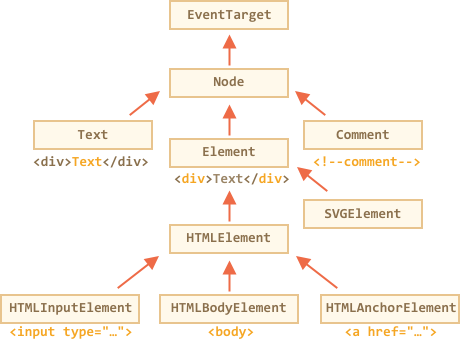

# 节点属性：type、tag 和 contents

让我们深入了解一下 DOM 节点。

在本章中，我们将更多地了解它们是什么以及它们最常用的属性。

## DOM 节点类

DOM 节点因为它们的类而具有不同的属性。例如，标记 `<a>` 相对应的元素节点具有链接相关的属性，标记 `<input>` 对应元素节点具有的输入相关的属性等。文本节点不同于元素节点，但是它们之间也存在共有的属性和方法，因为所有的 DOM 节点都形成一个单一层次的结构。

每个 DOM 节点都有与之对应的内置类。

层次的根节点是 [EventTarget](https://dom.spec.whatwg.org/#eventtarget)，它继承自 [Node](http://dom.spec.whatwg.org/#interface-node)，而且其他 DOM 节点也继承自它。

下图做了进一步解释：



类如下所示：

- [EventTarget](https://dom.spec.whatwg.org/#eventtarget) —— 是根的“抽象”类。该类的对象从未被创建。它作为一个基础，为了让所有 DOM 节点都支持所谓的“事件”，我们会在之后对它进行学习。
- [Node](http://dom.spec.whatwg.org/#interface-node) —— 也是一个“抽象”类，充当 DOM 节点的基础。它提供了树的核心功能：`parentNode`、`nextSibling`、`childNodes` 等（它们都是 getter）。`Node` 类的对象从未被创建。但是一些具体的节点类却继承自它，例如：`Text` 表示文本节点，`Element` 用于元素节点，以及更多外来的类（如注释节点 `Comment`）。
- [Element](http://dom.spec.whatwg.org/#interface-element) —— 是 DOM 元素的基类。它提供了元素级的导航，比如 `nextElementSibling`、`children` 以及像 `getElementsByTagName`、`querySelector` 这样的搜索方法。浏览器中不仅有 HTML，还会有 XML 和SVG 文档。`Element` 类充当以下更具体类的基类：`SVGElement`、`XMLElement` 和 `HTMLElement`。
- [HTMLElement](https://html.spec.whatwg.org/multipage/dom.html#htmlelement) —— 最终会成为所有 HTML 元素的基类。由各种 HTML 元素继承：
    - [HTMLInputElement](https://html.spec.whatwg.org/multipage/forms.html#htmlinputelement) ——  `<input>` 元素的类，
    - [HTMLBodyElement](https://html.spec.whatwg.org/multipage/semantics.html#htmlbodyelement) —— `<body>` 元素的类，
    - [HTMLAnchorElement](https://html.spec.whatwg.org/multipage/semantics.html#htmlanchorelement) ——  `<a>` 元素的类，
    - 等等，每个标记都有可以为自己提供特定属性和方法的类。

因此，给定节点的全部属性和方法都是继承的结果。

例如，我们考虑一下 `<input>` 元素的 DOM 对象。它属于 [HTMLInputElement](https://html.spec.whatwg.org/multipage/forms.html#htmlinputelement) 类。它将属性和方法作为以下内容的叠加：

- `HTMLInputElement` —— 该类提供特定于输入的属性，而且可以继承...
- `HTMLElement` —— 它提供了通用 HTML 元素方法（getter 和setter），而且可以继承自其它属性。
- `Element` —— 提供泛型元素方法，而且可以继承自其它属性。
- `Node` —— 提供通用 DOM 节点属性，而且可以继承自其它属性。
- `EventTarget` —— 为事件（包括事件本身）提供支持，
- 最后，它继承了 `Object`，因为像 `hasOwnProperty` 的“纯对象”方法也是可用的。

要查看 DOM 节点类名，我们可以进行回调，因为对象通常都拥有 `constructor` 属性。它引用类的构造函数，`constructor.name` 就是它的名称：

```js run
alert( document.body.constructor.name ); // HTMLBodyElement
```

...或者我们可以使用 `toString` 方法：

```js run
alert( document.body ); // [object HTMLBodyElement]
```

我们还可以使用 `instanceof` 来检查继承：

```js run
alert( document.body instanceof HTMLBodyElement ); // true
alert( document.body instanceof HTMLElement ); // true
alert( document.body instanceof Element ); // true
alert( document.body instanceof Node ); // true
alert( document.body instanceof EventTarget ); // true
```

正如我们所看到的，DOM 节点是规则的 JavaScript 对象。它们使用基于原型的类来继承。

在浏览器中用 `console.dir(elem)` 输出元素来查看也是非常容易的。在控制台中，你可以看到 `HTMLElement.prototype` 和 `Element.prototype` 等。

```smart header="`console.dir(elem)` versus `console.log(elem)`"
大多数浏览器在其开发者工具中都支持这两个命令：`console.log` 和 `console.dir`。它们向控制台输出参数。对于 JavaScript 对象，这些命令也是如此。

但对于 DOM 元素却并非如此：

- `console.log(elem)` 显示 DOM 元素树。
- `console.dir(elem)` 将元素视为 DOM 对象，以便更好地探究它的属性。

尝试 `document.body`。
```

````smart header="IDL in the spec"
在规范中，类不是用 JavaScript 描述的，而是一个特殊的[接口描述语言（IDL）](https://en.wikipedia.org/wiki/Interface_description_language)，它很容易理解。

在 IDL 中，所有的属性都有它们的类型。比如，`DOMString` 和 `boolean` 等待。

以下是附有评论的摘录：

```js
// 定义 HTMLInputElement
*!*
// 冒号 ":"意思是 HTMLInputElement 继承自 HTMLElement
*/!*
interface HTMLInputElement: HTMLElement {
  // 下面是 <input> 元素的属性和方法

*!*
<<<<<<< HEAD
  // "DOMString" 意思是这些属性都是字符串
=======
  // "DOMString" means that the value of these properties are strings
>>>>>>> 19223ae762f03cdff4e83f6f963f4f427af93847
*/!*
  attribute DOMString accept;
  attribute DOMString alt;
  attribute DOMString autocomplete;
  attribute DOMString value;

*!*
<<<<<<< HEAD
  // 布尔属性（true/false）
=======
  // boolean value property (true/false)
>>>>>>> 19223ae762f03cdff4e83f6f963f4f427af93847
  attribute boolean autofocus;
*/!*
  ...
*!*
<<<<<<< HEAD
  //方法 "void" 意思是无返回值
=======
  // now the method: "void" means that the method returns no value
>>>>>>> 19223ae762f03cdff4e83f6f963f4f427af93847
*/!*
  void select();
  ...
}
```

其他类也大抵如此。
````

## "nodeType" 属性

`nodeType` 属性提供了一个获取 DOM 节点类型的旧方法。

它有一个数值：
- `elem.nodeType == 1` 是元素节点，
- `elem.nodeType == 3` 是文本节点，
- `elem.nodeType == 9` 是 document 对象，
- 在[规范](https://dom.spec.whatwg.org/#node)中几乎没有其他值。

例如：

```html run
<body>
  <script>  
  let elem = document.body;

  // 让我们检查一下它是什么？
  alert(elem.nodeType); // 1 => element

  // 第一个子节点是
  alert(elem.firstChild.nodeType); // 3 => text

  // 对于文档对象，类型是 9
  alert( document.nodeType ); // 9
  </script>
</body>
```

在现代脚本中，我们可以使用 `instanceof` 和其他基于类的测试来查看节点类型，但有时 `nodeType` 可能会更简单。我们只能读取 `nodeType` 而不能修改它。

## 标签：nodeName 和 tagName

给定一个 DOM 节点，我们可以从 `nodeName` 或者 `tagName` 属性中读取它的标记名：

例如：

```js run
alert( document.body.nodeName ); // BODY
alert( document.body.tagName ); // BODY
```

tagName 和 nodeName 之间有何不同？

当然，差异反映在它们的名字上，但是确实有些微妙。

- `tagName` 属性仅用于 `Element` 节点。
- `nodeName` 是为任意 `Node` 定义的：
    - 对于元素，它的意义与 `tagName` 相同。
    - 对其他节点类型（text、comment 等），则是拥有一个字符串的节点类型。

换句话说，`tagName` 只被元素节点支持（因为它起源于 `Element` 类），而 `nodeName` 则可以说明其他节点类型。

例如，我们比较一下 `document` 的 `tagName` 和 `nodeName`，以及一个注释节点：


```html run
<body><!-- comment -->

  <script>
    // for comment
    alert( document.body.firstChild.tagName ); // undefined (no element)
    alert( document.body.firstChild.nodeName ); // #comment

    // for document
    alert( document.tagName ); // undefined (not element)
    alert( document.nodeName ); // #document
  </script>
</body>
```

如果我们只处理元素，那么 `tagName` 是我们唯一应该使用的。


```smart header="The tag name is always uppercase except XHTML"
浏览器有两种处理 document 的模式：HTML 和 XML。通常，HTML 模式用于网页，只有浏览器接受带有 `Content-Type: application/xml+xhtml` 报头的 XML-document 时，我们才会使用 XML 模式。

在 HTML 模式中，`tagName/nodeName` 总是大写的：它是 `BODY`，而不是 `<body>` 或 `<BoDy>`。

在 XML 模式中，大小写保持为原样。目前，XML 模式很少被使用。
```


## innerHTML: the contents

[innerHTML](https://w3c.github.io/DOM-Parsing/#widl-Element-innerHTML) 属性允许将元素中的 HTML 作为字符串来获取。

我们也可以修改它。因此，这是改变页面最有效的方法之一。

该示例显示了 `document.body` 的内容，然后完全替换它：

```html run
<body>
  <p>A paragraph</p>
  <div>A div</div>

  <script>
    alert( document.body.innerHTML ); // read the current contents
    document.body.innerHTML = 'The new BODY!'; // replace it
  </script>

</body>
```

我们可以尝试插入无效的 HTML，因为浏览器会为我们修复错误：

```html run
<body>

  <script>
    document.body.innerHTML = '<b>test'; // forgot to close the tag
    alert( document.body.innerHTML ); // <b>test</b> (fixed)
  </script>

</body>
```

```smart header="Scripts don't execute"
如果 `innerHTML` 将 `<script>` 标签插入到 document 中 —— 它不会被执行。

它会被变成 HTML 的一部分，就像已经运行的脚本一样。
```

### 小心："innerHTML+=" 会完全重写

我们可以通过使用 `elem.innerHTML+="something"` 来添加“更多的 HTML”。

就像这样：

```js
chatDiv.innerHTML += "<div>Hello !</div>";
chatDiv.innerHTML += "How goes?";
```

但我们必须非常谨慎地使用，因为我们所做的**不是**附加内容，而且完整的重写。

从技术上来说，这两行的作用相同：

```js
elem.innerHTML += "...";
// is a shorter way to write:
*!*
elem.innerHTML = elem.innerHTML + "..."
*/!*
```

换句话说，`innerHTML+=` 做了以下内容：

1. 移除旧的内容。
2. 新的 `innerHTML` 被书写（旧的和新的相连接）。

**因为内容“零输出”而且被从头重写，所有的图片和其他资源都会被重写加载。**

在上面的 `chatDiv` 示例中，`chatDiv.innerHTML+="How goes?"` 重建了 HTML 内容并重新加载了 `smile.gif`（希望它是缓存的）。如果 `chatDiv` 有许多其他文本和图片，那么重新加载就变得清晰可见。

也会有其他副作用。例如，如果用鼠标选定现有文本，那么大多数浏览器都会在重写 `innerHTML` 时删除选定内容。如果浏览着输入的文本有一个 `<input>`，那么文本将被移除。诸如此类。

幸运的是，除了 `innerHTML`，还有其他的可以添加 HTML 的方法，我们很快就会了解到。

## outerHTML：元素的完整 HTML

`outerHTML` 属性包含元素的完整 HTML。就像是 `innerHTML` 加上元素本身。

下面是一个示例：

```html run
<div id="elem">Hello <b>World</b></div>

<script>
  alert(elem.outerHTML); // <div id="elem">Hello <b>World</b></div>
</script>
```

**注意：与 `innerHTML`不同，写入到 `outerHTML` 后，不会改变元素。相反，它在外部环境中作为一个整体取代了它。**

是的，虽然听起来很奇怪，更奇怪的是为什么我们在这里做一个单独的注释。看一下。

考虑这个实例：

```html run
<div>Hello, world!</div>

<script>
  let div = document.querySelector('div');

*!*
  // replace div.outerHTML with <p>...</p>
*/!*
  div.outerHTML = '<p>A new element!</p>'; // (*)

*!*
  // Wow! The div is still the same!
*/!*
  alert(div.outerHTML); // <div>Hello, world!</div>
</script>
```

在 `(*)` 行，我们取出 `<div>...</div>` 的完整 HTML，用 `<p>...</p>` 将其替换。在外部文档中，我们可以看到新的内容而不是 `<div>`。但是旧的 `div` 变量仍然是相同的。

`outerHTML` 赋值时不会修改 DOM 元素。而是从外部上下文中提取它，并插入一个新的 HTML 片段来替代它。

新手有时会在这里犯错：他们修改 `div.outerHTML` 然后继续使用 `div`，就好像其中包含了新内容一样。

在 `innerHTML` 中是可能的，但在 `outerHTML` 中却不行。

我们可以写入 `outerHTML`，但请记住它不会改变我们所写的元素。它会在其位置上创建新内容。我们可以通过查询 DOM 来获取对新元素的引用。

## nodeValue/data：文本节点内容

`innerHTML` 属性仅对元素节点有效。

其他节点类型具有它们的对应项：`nodeValue` 和 `data` 属性。这两个在实际开发中作用几乎相同，只有细微的差异。所以我们使用 `data`，因为它更短。

我们可以像这样读它：

```html run height="50"
<body>
  Hello
  <!-- Comment -->
  <script>
    let text = document.body.firstChild;
*!*
    alert(text.data); // Hello
*/!*

    let comment = text.nextSibling;
*!*
    alert(comment.data); // Comment
*/!*
  </script>
</body>
```

对于文本节点，我们可以想象一个读取或修改它们的理由，但是为什么是注释呢？通常它们一点都不有趣，但有时开发者会将信息嵌入到 HTML 中，如下所示：

```html
<!-- if isAdmin -->
  <div>Welcome, Admin!</div>
<!-- /if -->
```

...然后 JavaScript 可以读取它并出入嵌入式指令。

## textContent：纯文本

`textContent` 提供对元素中的 *text* 的访问权限：只提供文本，去掉所有的 `<tags>`。

例如：

```html run
<div id="news">
  <h1>Headline!</h1>
  <p>Martians attack people!</p>
</div>

<script>
  // Headline! Martians attack people!
  alert(news.textContent);
</script>
```

正如我们所看到，只返回文本，就像是所有的 `<tags>` 都被删除了一样，但实际上它们的文本仍然存在。

实际上，这样的文本读取场景很少。

**写入 `textContent` 显然要有用得多，因为它允许以“安全方式”编辑文本。**

比如我们有一个用户输入的字符串，我们希望将内容显示出了。

- 使用 `innerHTML`，我们将其“作为 HTML” 插入，包含所有 HTML标记。
- 在 `textContent`中，我们将其“作为文本”插入，所有字符都当做字面量处理。

比较两者：

```html run
<div id="elem1"></div>
<div id="elem2"></div>

<script>
  let name = prompt("What's your name?", "<b>Winnie-the-pooh!</b>");

  elem1.innerHTML = name;
  elem2.textContent = name;
</script>
```

1. 第一个 `<div>` 获取名字“作为 HTML”：所有的标记都被标记，因为我们可以看到粗体名字。
2. 第二个 `<div>` 获取名字“作为文本”，因此我们可以从字面上看到 `<b>Winnie-the-pooh!</b>`。

在大多数情况下，我们期望用户提供文本，并希望将其视为文本。我们不想在我们的网站中出现预想不到的 HTML 属性。`textContent` 的赋值恰恰可以做到我们所期望的。

## "hidden" 属性

"hidden" 属性和 DOM 属性指定元素是否可见。

我们可以在 HTML 使用它，或者使用 JavaScript 进行分配，就像这些：

```html run height="80"
<div>Both divs below are hidden</div>

<div hidden>With the attribute "hidden"</div>

<div id="elem">JavaScript assigned the property "hidden"</div>

<script>
  elem.hidden = true;
</script>
```

从技术上来说，`hidden` 与 `style="display:none"` 的运行方式相似。但写法更简洁。

这里有一个 blinking 元素：


```html run height=50
<div id="elem">A blinking element</div>

<script>
  setInterval(() => elem.hidden = !elem.hidden, 1000);
</script>
```

## 更多属性

DOM 元素还具有其他属性，其中许多属性由类提供：

- `value` -- the value for `<input>`, `<select>` and `<textarea>` (`HTMLInputElement`, `HTMLSelectElement`...).
- `href` -- the "href" for `<a href="...">` (`HTMLAnchorElement`).
- `id` -- the value of "id" attribute, for all elements (`HTMLElement`).
- ...and much more...

例如：

```html run height="80"
<input type="text" id="elem" value="value">

<script>
  alert(elem.type); // "text"
  alert(elem.id); // "elem"
  alert(elem.value); // value
</script>
```

大部分标准 HTML 属性都具有与之对应的 DOM 属性，我们可以这样访问它。

如果我们想知道给定类的支持属性的完整列表，我们可以在规范中找到它们。例如，<https://html.spec.whatwg.org/#htmlinputelement> 记录了 HTMLInputElement。

或者，如果我们想要快速获取它们，或者对具体的浏览器规范感兴趣 —— 我们总是可以使用 `console.dir(elem)` 输出元素并读取这些属性。或者在浏览器的开发者工具的功能选择中打开 "DOM properties"。

## 总结

每个 DOM 节点都属于某个类。这些类形成层次结构。完整的属性和方法集是继承的结果。

DOM 节点的属性主要有：

`nodeType`
: 我们可以从 DOM 对象类中获取 `nodeType`，但我们通常只需要查看它是文本节点还是元素节点。`nodeType` 属性就可以我们的需求。它有数值，最重要的是：`1` —— 是元素，`3` —— 是文本。只读。

`nodeName/tagName`
: 对于元素来说，标记名（除了 XML 模式外都要大写）。对于非元素节点，`nodeName` 则描述了它是什么。只读。

`innerHTML`
: HTML 的元素内容。可以被修改。

`outerHTML`
: 元素的完整 HTML。写入 `elem.outerHTML` 的操作不会涉及 `elem` 自身。相反，它会在外部上下文中被替换成新的 HTML。

`nodeValue/data`
: 非元素节点（文本、注释）内容。两者几乎一样，我们通常使用 `data`。允许被修改。

`textContent`
: 元素中的文本，基本上是 HTML 减去所有 `<tags>`。将文本写入元素中，并把所有特殊字符和标记完全视为文本。可以安全地插入用户生成的文本，防止不必要的 HTML 插入。

`hidden`
: 当设置为 `true` 时，执行与 CSS `display:none` 相同的操作。

DOM 节点还具有其他属性，具体内容则取决于它们的类。例如，`<input>`元素（`HTMLInputElement`）支持 `value`、`type`，而 `<a>` 元素（`HTMLAnchorElement`）则支持 `href` 等。大多数标准 HTML 属性都具有相应的 DOM 属性。

但是 HTML 属性和 DOM 属性并不总是一致的，我们会在下一章中看到这点。
