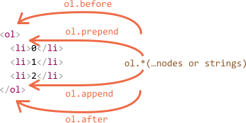
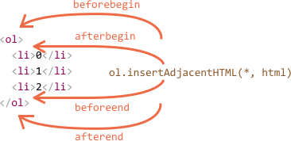

# 修改文档内容

DOM（document object model 文档对象模型，此文中全部以缩写 DOM 表示）的可修改性是网页能“实时”刷新的关键。

以下的例子向我们展示如何创建一个“弹幕”新元素并且修改它在页面中展示的内容。

这里我们先展示出一个简单的例子，随后会逐一向你说明。

## 例子：展示一条信息

首先，我们可以看到一条信息，它看起来像是一个美化版的 `alert`。

这里是它的样式：

```html autorun height="80"
<style>
.alert {
  padding: 15px;
  border: 1px solid #d6e9c6;
  border-radius: 4px;
  color: #3c763d;
  background-color: #dff0d8;
}
</style>

*!*
<div class="alert">
  <strong>Hi there!</strong> You've read an important message.
</div>
*/!*
```

在上面这个 HTML 例子中，使用 JavaScript 创建一个像 `div` 一样的元素（假定 CSS 样式是 HTML 中的内联样式或者是从外部引用 CSS 文件）。

## 生成一个元素


这两种方法都可以创建 DOM 节点：

`document.createElement(tag)`
: 用给定的标签创建一个新元素：

    ```js
    let div = document.createElement('div');
    ```

`document.createTextNode(text)`
: 用给定的文本创建一个**文本节点**

    ```js
    let textNode = document.createTextNode('Here I am');
    ```

### 生成一条信息

在这个例子中，我们想要为 `div` 设定我们需要的类名和文字信息：

```js
let div = document.createElement('div');
div.className = "alert alert-success";
div.innerHTML = "<strong>Hi there!</strong> You've read an important message.";
```

之后，我们就有拥有一个 DOM 元素。现在这个元素已经有一个保存类名的变量和一个保存文字信息的变量，但是在页面上依然看不到我们想要的内容，因为它还没有被插入到页面中。

## 插值方法

为了让 `div` 显示我们想要的内容，我们需要在 `document` 中找个合适的位置插值，这里我们选择 `document.body`。

这里有一个特定的插值方法：`document.body.appendChild(div)`。

这里是完整代码：

```html run height="80"
<style>
.alert {
  padding: 15px;
  border: 1px solid #d6e9c6;
  border-radius: 4px;
  color: #3c763d;
  background-color: #dff0d8;
}
</style>

<script>
  let div = document.createElement('div');
  div.className = "alert alert-success";
  div.innerHTML = "<strong>Hi there!</strong> You've read an important message.";

*!*
  document.body.appendChild(div);
*/!*
</script>
```

这里有一个简短的列表，我们把一个节点插入到父元素中（用 `parentElem` 指代父元素）：

`parentElem.appendChild(node)`
: 将 `node` 作为 `parentElem` 最后一个子元素。

    可以看到增加了一个 `<li>` 在 `<ol>` 的最末尾：

    ```html run height=100
    <ol id="list">
      <li>0</li>
      <li>1</li>
      <li>2</li>
    </ol>

    <script>
      let newLi = document.createElement('li');
      newLi.innerHTML = 'Hello, world!';

      list.appendChild(newLi);
    </script>
    ```

`parentElem.insertBefore(node, nextSibling)`
: 在 `parentElem` 的 `nextSibling` 插入 `node`。

    下面这段代码在第二个 `<li>` 标签前面插入一个新列表项：

    ```html run height=100
    <ol id="list">
      <li>0</li>
      <li>1</li>
      <li>2</li>
    </ol>
    <script>
      let newLi = document.createElement('li');
      newLi.innerHTML = 'Hello, world!';

    *!*
      list.insertBefore(newLi, list.children[1]);
    */!*
    </script>
    ```
    如果需要把 `newLi` 插入成为第一个子元素，我们可以这样做：
    
    ```js
    list.insertBefore(newLi, list.firstChild);
    ```

`parentElem.replaceChild(node, oldChild)`
: 将 `parentElem` 的 `oldChild` 替换为 `node`。

所有这些插入节点的操作都会返回节点。换句话说，`parentElem.appendChild(node)` 返回 `node`。但是通常返回的节点都没有用，只是插入方法的默认返回值。

以上方法都是“旧三板斧”：它们从很早就存在，我们在老的脚本里能看到它们的影子。很不幸，它们已经没法很好的处理现在的需求了。

例如，我们怎样在 **html** 插入字符串呢？又或者，给定你一个节点，你怎样插入到**节点**之前？虽然也能完成需求开发，总归不是那么优雅的解决方式。

所以诞生了两种优雅插入方法来代替这些繁琐的插入操作。

### 在开头插入/在末尾插入/在前面插入/在后面插入

This set of methods provides more flexible insertions:

- `node.append(...nodes or strings)` —— 在 `node` 末尾插入节点或者字符串，
- `node.prepend(...nodes or strings)` —— 在 `node` 开头插入节点或者字符串，
- `node.before(...nodes or strings)` —— 在 `node` 前面插入节点或者字符串，
- `node.after(...nodes or strings)` —— 在 `node` 后面插入节点或者字符串，
- `node.replaceWith(...nodes or strings)` —— 将 `node` 替换为节点或者字符串。

下面例子是使用以上提到的方法在列表项前面或后面插入文本：

```html autorun
<ol id="ol">
  <li>0</li>
  <li>1</li>
  <li>2</li>
</ol>

<script>
  ol.before('before');
  ol.after('after');

  let prepend = document.createElement('li');
  prepend.innerHTML = 'prepend';
  ol.prepend(prepend);  

  let append = document.createElement('li');
  append.innerHTML = 'append';
  ol.append(append);
</script>
```

这张图片展示插入方法的工作方式：



列表最后表现为：

```html
before
<ol id="ol">
  <li>prepend</li>
  <li>0</li>
  <li>1</li>
  <li>2</li>
  <li>append</li>
</ol>
after
```

这些方法通过简单的调用就能插入多个节点或者字符串。

例如，这里将字符串和一个元素插入到 `div` 前面：

```html run
<div id="div"></div>
<script>
  div.before('<p>Hello</p>', document.createElement('hr'));
</script>
```

所有字符串都会作为“文本”插入。

所以最后的 HTML 表现为：

```html run
*!*
&lt;p&gt;Hello&lt;/p&gt;
*/!*
<hr>
<div id="div"></div>
```

换句话说，字符串以安全的方式插入到页面中，就像调用 `elem.textContent` 方法一样。

所以这些方法只能用来插入 DOM 节点或者文本块。

如果我们想在 HTML 页面中插入一个标签，有没有这样的方法，就像调用 `elem.innerHTML` 方法一样？

### 在相邻的 HTML 标签中插入/文本/元素

接下来登场的这个方法就可以做到：`elem.insertAdjacentHTML(where, html)`。

该方法第一个参数是字符串，指定插值的位置，必须是以下四个值之一：

- `"beforebegin"` —— 在 `html` 开头位置前插入 `elem`，
- `"afterbegin"` —— 在 `html` 开头位置后插入 `elem`，
- `"beforeend"` —— 在 `html` 结束位置前插入 `elem`，
- `"afterend"` —— 在 `html` 结束位置后插入 `elem`。

第二个参数是 HTML 字符串，会作为标签插入到页面中。

例如：

```html run
<div id="div"></div>
<script>
  div.insertAdjacentHTML('beforebegin', '<p>Hello</p>');
  div.insertAdjacentHTML('afterend', '<p>Bye</p>');
</script>
```

...将会表现为：

```html run
<p>Hello</p>
<div id="div"></div>
<p>Bye</p>
```

通过这个方法我们可以随意在 HTML任何位置插入值。

这里有一张图片描述插入方式：



通过跟前面的图片做比较可以看出，两个方法的插入方式是一样的，只不过后者是插入 HTML 标签。

这个方法还有两个变种：

- `elem.insertAdjacentText(where, text)` —— 一样的语法，只不过把 `text` 作为“文本”直接插入到 HTML 中，
- `elem.insertAdjacentElement(where, elem)` —— 一样的语法，只不过插入的是一个元素。

他们存在的意义更多是为了使语法“整齐划一”，在实践中，通常只使用 `insertAdjacentHTML`，因为插入文本和元素的方法可以使用 `append/prepend/before/after` —— 同样的效果这样写起来更简洁。

这里有一个展示一条信息的变种写法：

```html run
<style>
.alert {
  padding: 15px;
  border: 1px solid #d6e9c6;
  border-radius: 4px;
  color: #3c763d;
  background-color: #dff0d8;
}
</style>

<script>
  document.body.insertAdjacentHTML("afterbegin", `<div class="alert alert-success">
    <strong>Hi there!</strong> You've read an important message.
  </div>`);
</script>
```

## 克隆节点：cloneNode

怎么插入多条相同的信息？

我们可以声明一个函数来实现这个方法。但是怎样通过**克隆**的方式来替换掉那些原本存在的 `div` 并且更改里面的文本（如果有这样一个需求）。

如果我们有一个很大的元素，克隆的方式要远比创建后插入来的更简单，性能也更好。

- `elem.cloneNode(true)` 方法用来对一个元素进行“深”克隆 —— 包括所有特性和子元素。`elem.cloneNode(false)` 方法只克隆该元素本身，不对子元素进行克隆。

一个复制信息的例子：

```html run height="120"
<style>
.alert {
  padding: 15px;
  border: 1px solid #d6e9c6;
  border-radius: 4px;
  color: #3c763d;
  background-color: #dff0d8;
}
</style>

<div class="alert" id="div">
  <strong>Hi there!</strong> You've read an important message.
</div>

<script>
*!*
  let div2 = div.cloneNode(true); // 克隆信息
  div2.querySelector('strong').innerHTML = 'Bye there!'; // 改变克隆信息

  div.after(div2); // 显示克隆信息在已经存在的 div 后
*/!*
</script>
```

## 移除

想要移除节点，可以通过以下方法：


`parentElem.removeChild(node)`
: 从 `parentElem` 中移除 `elem`（假设它是元素中的子元素）。

`node.remove()`
: 从当前位置移除 `node`。

能看出第二个方法更加简洁，第一个方法的存在是有其历史原因的。

````smart
如果我们想要**移动**一个元素到另一个地方 —— 不需要移除旧的元素。

**所有插入操作都会从节点原来的位置把节点移除掉。**

例如，这里有一些嵌套的元素：

```html run height=50
<div id="first">First</div>
<div id="second">Second</div>
<script>
  // 没有用到移除方法
  second.after(first); //在 id 为 #second 的元素后插入id为 #first 的元素
</script>
```
````

使信息一秒后消失：

```html run untrusted
<style>
.alert {
  padding: 15px;
  border: 1px solid #d6e9c6;
  border-radius: 4px;
  color: #3c763d;
  background-color: #dff0d8;
}
</style>

<script>
  let div = document.createElement('div');
  div.className = "alert alert-success";
  div.innerHTML = "<strong>Hi there!</strong> You've read an important message.";

  document.body.append(div);
*!*
  setTimeout(() => div.remove(), 1000);
  // or setTimeout(() => document.body.removeChild(div), 1000);
*/!*
</script>
```

## 聊一聊 "document.write"

`document.write` 是一个很老的方法，用来为 web 页面添加内容。

语法如下：

```html run
<p>Somewhere in the page...</p>
*!*
<script>
  document.write('<b>Hello from JS</b>');
</script>
*/!*
<p>The end</p>
```

调动 `document.write(html)` 时意味着将 `html` “就地并马上”放入到页面中。`html` 字符串会动态的创建，所以它以自动伸缩的方式放入到页面中。我们可以通过 JavaScript 创建一个完整的 HTML 页面并写入浏览器窗口中。

这个方法的起源于没有 DOM，没有 Web 标准的上古时期……，但是这个方法依旧保留了下来，因为很多的脚本使用它来实现一些功能。

现代的脚本已经很少再看到这个方法，因为使用它有一个很重要的局限性：

**只能在页面加载的时候调用 `document.write`。**

如果在加载完成以后，渲染好的页面会被擦除。

例如：

```html run
<p>After one second the contents of this page will be replaced...</p>
*!*
<script>
  // 在一秒后调用 document.write
  // 页面已经加载完毕，所以会被擦除
  setTimeout(() => document.write('<b>...By this.</b>'), 1000);
</script>
*/!*
```

所以，不像其他 DOM 操作一样，一旦页面“加载完毕”最好就不使用 document.write 方法。

这是它的缺陷。

从技术上讲，当调用 `document.write`，如果浏览器仍然在解析 HTML，该方法会添加一些内容，浏览器会把添加进来的内容替换掉原来接收到内容，解析后展示在窗口中。

反过来说这也是一个优势 —— 它性能出奇的快，因为它不用**修改 DOM 结构**。它直接在 DOM 结构构建之前，对整个页面直接进行重写，再交给浏览器去构建 DOM 结构。

所以如果我们需要在 HTML 加载阶段动态的添加很多文本，它会很高效。不过能用到的机会不多就是了。在一些很老的脚本里倒是能经常看到。

## 总结

创建节点的方法：

- `document.createElement(tag)` —— 用给定标签创建一个节点，
- `document.createTextNode(value)` —— 创建一个文本节点（很少使用），
- `elem.cloneNode(deep)` —— 如果参数 `deep==true` 将元素及后代子元素进行克隆。  

插入和移除节点的方法：

- 从 parent
  - `parent.appendChild(node)`
  - `parent.insertBefore(node, nextSibling)`
  - `parent.removeChild(node)`
  - `parent.replaceChild(newElem, node)`

  这些方法都返回 `node`。

- 添加一些节点和字符串：
  - `node.append(...nodes or strings)` —— 在 `node` 末尾位置增加，
  - `node.prepend(...nodes or strings)` —— 在 `node`开头位置增加 ，
  - `node.before(...nodes or strings)` —— 在 `node` 之前位置增加，
  - `node.after(...nodes or strings)` —— 在 `node` 之后位置增加，
  - `node.replaceWith(...nodes or strings)` —— 替换 `node`。
  - `node.remove()` —— 移除 `node`。

  把字符串当成“文本”插入。

- 在 HTML 中添加内容 `elem.insertAdjacentHTML(where, html)`，在 where 位置进行操作：
  - `"beforebegin"` —— 将 `html` 插入 `elem` 到开头的前面位置，
  - `"afterbegin"` —— 将 `html` 插入 `elem` 到开头的后面位置，
  - `"beforeend"` —— 将 `html` 插入 `elem` 到结尾的前面位置，
  - `"afterend"` —— 将 `html` 插入 `elem` 到结尾的后面位置。

  `elem.insertAdjacentText` 和 `elem.insertAdjacentElement` 跟 `elem.insertAdjacentHTML` 很相似，只不过他们一个用来插入字符串，一个用来插入元素，但是很少使用这两个方法。

- 在页面加载完成之前添加 HTML 到页面中：
  - `document.write(html)`

  如果是在页面加载完成以后调用会擦除加载完毕的内容。通常在很老的脚本才会使用这个方法了。
