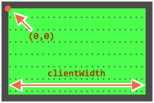

为小球设置 `position:absolute`。这意味着它的 `left/top` 坐标根据相对它最近的并且设置了定位的元素来测量，这个元素的有效范围就是 `#field`（因为它有 `position:relative`）。

坐标从设置了相对定位的最近的元素的左上角开始：



该元素内容区域的宽/高是 `clientWidth/clientHeight`，所以该元素有效范围的中心的坐标为 `(clientWidth/2, clientHeight/2)`。

...不过如果我们将 `ball.style.left/top` 设置为上面计算出的值，那么最终的效果与有效范围的中心重合的不是小球的中心，而是小球左上角的坐标：

```js
ball.style.left = Math.round(field.clientWidth / 2) + 'px';
ball.style.top = Math.round(field.clientHeight / 2) + 'px';
```

这是它将显示出的效果：

[iframe height=180 src="ball-half"]

为了把球中心和有效范围中心对准，我们应该把球移到左边宽度的一半，把 top 设置为有效范围高度的一半：

```js
ball.style.left = Math.round(field.clientWidth / 2 - ball.offsetWidth / 2) + 'px';
ball.style.top = Math.round(field.clientHeight / 2 - ball.offsetHeight / 2) + 'px';
```

**注意：陷阱！**

如果 `` 没有宽/高，代码将无法正常工作：

```html

```

当浏览器还不知道图片的宽/高（图片的尺寸可能来自标签属性或 CSS）的时候它会假设它们的尺寸为 `0`直到图片加载完成。

<<<<<<< HEAD
实际使用过程中，浏览器会在图片第一次加载完成后缓存该图片，方便下次再次访问时立即显示图片。

但是在第一次加载时 `ball.offsetWidth` 的值为 `0`，这会导致错误的坐标出现。
=======
After the first load browser usually caches the image, and on next loads it will have the size immediately. But on the first load the value of `ball.offsetWidth` is `0`. That leads to wrong coordinates.
>>>>>>> 6bbe0b4313a7845303be835d632ef8e5bc7715cd

此时我们应该为 `` 添加 `width/height` 属性：

```html

```

...或者在 CSS 中提供尺寸：

```css
#ball {
  width: 40px;
  height: 40px;
}
```
