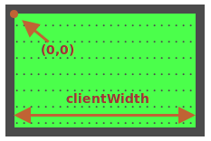

球具有 `position:absolute`。这意味着它的 `left/top` 坐标是从最近的具有定位属性的元素开始测量的，这个元素即 `#field`（因为它有 `position:relative`）。

坐标从场（field）的左上角内侧开始：



内部的场（field）的 width/height 是 `clientWidth/clientHeight`。所以场（field）的中心坐标为 `(clientWidth/2, clientHeight/2)`。

……但是，如果我们将 `ball.style.left/top` 设置为这种值，那么在中心的会是球的左上边缘，而不是整个球：

```js
ball.style.left = Math.round(field.clientWidth / 2) + 'px';
ball.style.top = Math.round(field.clientHeight / 2) + 'px';
```

这是它将显示出来的效果：

[iframe height=180 src="ball-half"]

为了使球的中心与场（field）的中心重合，我们应该把球向左移动球宽度的一半，并向上移动球高度的一半：

```js
ball.style.left = Math.round(field.clientWidth / 2 - ball.offsetWidth / 2) + 'px';
ball.style.top = Math.round(field.clientHeight / 2 - ball.offsetHeight / 2) + 'px';
```

现在，球终于居中了。

````warn header="注意：陷阱！"

当 `` 没有 width/height 时，代码将无法可靠地工作：

```html

```
````

当浏览器不知道图片的 width/height（通过标签 attribute 或 CSS）时，它会假定它们等于 `0`，直到图片加载完成。

因此，在图片加载完成之前，`ball.offsetWidth` 的值为 `0`。这会导致上面的代码中会有错误的坐标。

在第一次加载完成后，浏览器通常会缓存该图片，并在下一次加载时，浏览器会立即拥有该图片的大小。但是在第一次加载时，`ball.offsetWidth` 的值为 `0`。

我们应该通过在 `` 中添加 `width/height` 来解决这个问题：

```html

```

……或者在 CSS 中提供大小：

```css
#ball {
  width: 40px;
  height: 40px;
}
```
