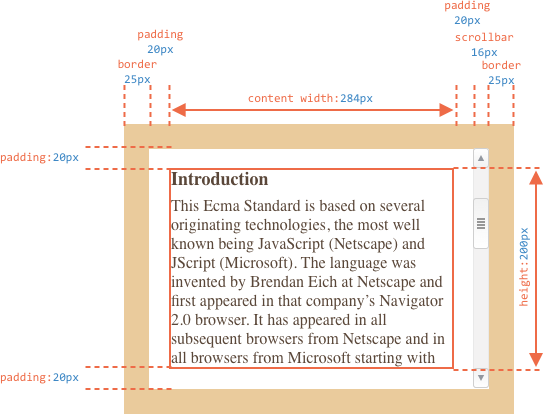
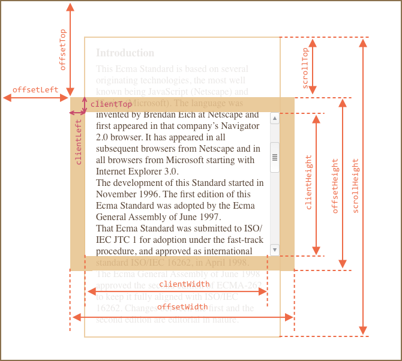
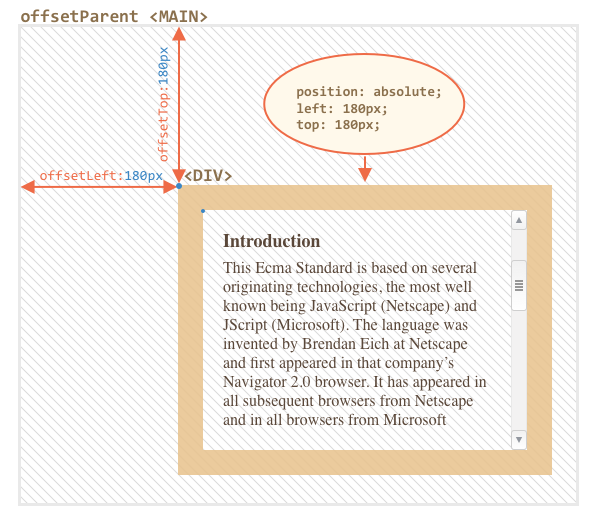
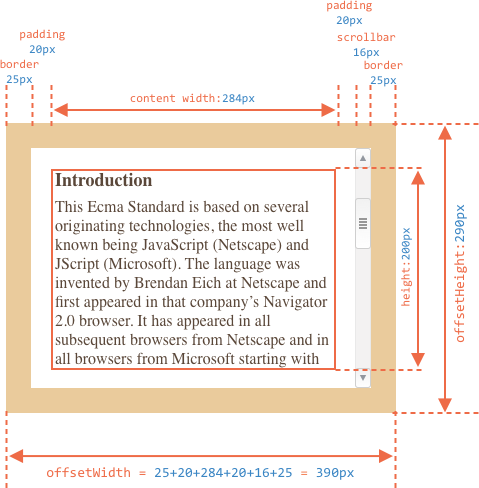
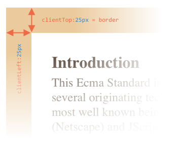
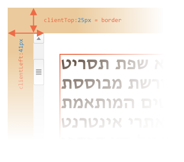
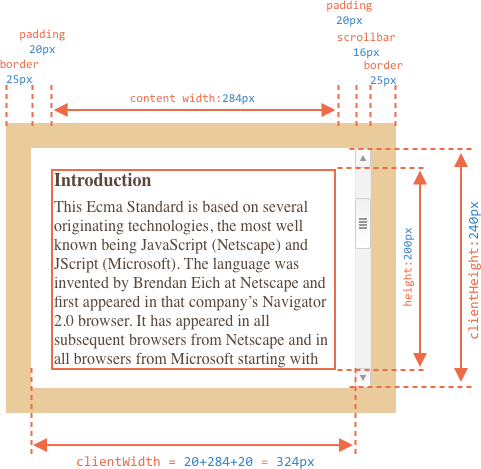
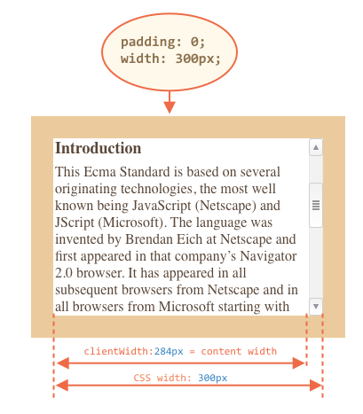
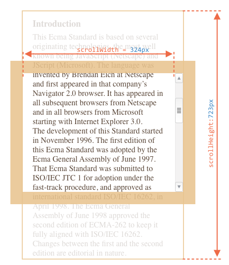
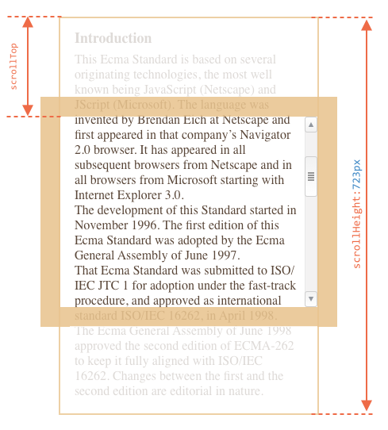

# 元素的尺寸与滚动

JavaScript 中存在许多属性让我们能够读取元素的宽度、高度或其他具有几何特征的信息。

在移动或定位 JavaScript 元素时，我们经常需要它们来计算元素的坐标。


## 示例元素

作为演示属性的示例元素，我们将使用下面给出的一个元素：

```html no-beautify
<div id="example">
  ...Text...
</div>
<style>
  #example {
    width: 300px;
    height: 200px;
    border: 25px solid #E8C48F;
    padding: 20px;              
    overflow: auto;             
  }
</style>
```

它有边框、内填充和滚动条等全部特征属性，但是这不包括外边距，因为它不是元素本身的一部分，并且它们没什么特殊的属性。

元素就像这样：



你可以 [在sandbox中打开文档](sandbox:metric).

```smart header="注意滚动条"
上例图片演示了当元素有滚动条时最复杂的情况，一些浏览器（不是全部）通过牺牲内容空间来保留滚动条。

因此，没有滚动条时，内容宽度将是 `300 px`，但是如果滚动条宽度是 `16px`（不同的设备和浏览器，宽度可能会不一样），那么还剩下 `300 - 16＝284px`，这是我们必须考虑到的事。这就是为什么本章的例子总是假设有滚动条的原因。如果没有滚动条，那么事情就会更简单一些。
```

<<<<<<< HEAD
```smart header="文本可能会溢出到 `padding-bottom` 中"
内填充通常在插图中显示的是空的，但是如果元素中有很多文本，并且溢出，那么浏览器在 `padding-bottom` 中显示“溢出”文本，这可以在示例中看到。但是填充物仍然存在，除非另有说明。
=======
```smart header="The `padding-bottom` area may be filled with text"
Usually paddings are shown empty on illustrations, but if there's a lot of text in the element and it overflows, then browsers show the "overflowing" text at `padding-bottom`.

That's a note to avoid confusion, as `padding-bottom` is set in further examples, unless explicitly specified otherwise.
>>>>>>> 5e9eca374f644ea85c7d548bbe344fd30e5fb89d
```

## 几何学

<<<<<<< HEAD
提供宽度、高度和其他几何形状的元素属性通过数值来计算。它们被假定为像素。

以下是显示总体情况的图片：



它们有很多属性，很难将它们全部放在单个图片中，但是它们的值很简单，容易理解。
=======
Here's the overall picture:


Values of these properties are technically numbers, but these numbers are "of pixels", so these are pixel measurements.

They are many properties, it's difficult to fit them all in the single picture, but their values are simple and easy to understand.
>>>>>>> 5e9eca374f644ea85c7d548bbe344fd30e5fb89d

让我们从元素的外部开始探索它们。

## offsetParent, offsetLeft/Top

这些属性很少出现，但它们仍然是“最外层”的几何属性，所以我们将从它们开始。

<<<<<<< HEAD
 `offsetParent` 是最近的祖先元素:

1. CSS 定位（`position` 为 `absolute`、`relative` 或 `fixed`），
2. 或者 `<td>`、`<th>`、`<table>`，
3. 或者 `<body>`。

在大多数实际情况下，我们可以使用 `offsetParent` 来获得最近的 CSS 定位祖先。`offsetLeft/offsetTop` 提供相对于元素左上角的 x/y 坐标。

在下面的例子中，内部 `<div>` 有 `<main>` 作为 `offsetParent`，并且 `offsetLeft/offsetTop` 让它从左上角位移（`180`）：
=======
The `offsetParent` is the nearest ancestor, that browser uses for calculating coordinates during rendering.

That's the nearest ancestor, that satisfies following conditions:

1. CSS-positioned (`position` is `absolute`, `relative`, `fixed` or `sticky`),
2. or `<td>`, `<th>`, `<table>`,
2. or `<body>`.

Properties `offsetLeft/offsetTop` provide x/y coordinates relative to its upper-left corner.

In the example below the inner `<div>` has `<main>` as `offsetParent` and `offsetLeft/offsetTop` shifts from its upper-left corner (`180`):
>>>>>>> 5e9eca374f644ea85c7d548bbe344fd30e5fb89d

```html run height=10
<main style="position: relative" id="main">
  <article>
    <div id="example" style="position: absolute; left: 180px; top: 180px">...</div>
  </article>
</main>
<script>
  alert(example.offsetParent.id); // main
  alert(example.offsetLeft); // 180 (note: a number, not a string "180px")
  alert(example.offsetTop); // 180
</script>
```




有以下几种情况 `offsetParent` 的值为 `null`：

1. 未显示的元素（`display:none` 或者不在文档中）。
2. `<body>` 与 `<html>`。
3. `position:fixed` 的元素。

## offsetWidth/Height

现在让我们关注元素本身。

这两个属性是最简单的。它们提供元素的“外部”宽度/高度。换句话说，它的完整大小包括边框。



在我们的示例元素中：

- `offsetWidth = 390` — 外部宽度，计算方法是内部 css 宽度（`300px`）加上内填充（`2 * 20px`）和边框宽度（`2 * 25px`）。
- `offsetHeight = 290` — 外部高度。

<<<<<<< HEAD
````smart header="未显示的几何元素的属性值为 0/null"
几何属性仅为显示出来的元素计算。

如果元素（或其任何祖先）在文档中显示为 `display:none` 或本身不在文档中，则所有几何属性都是 0 或者值为 `null`，这取决于它是什么。

例如，`offsetParent` 为 `null`，并且 `offsetWidth`，`offsetHeight` 为 `0`。
=======
````smart header="Geometry properties are zero/null for elements that are not displayed"
Geometry properties are calculated only for displayed elements.

If an element (or any of its ancestors) has `display:none` or is not in the document, then all geometry properties are zero (or `null` if that's `offsetParent`).

For example, `offsetParent` is `null`, and `offsetWidth`, `offsetHeight` are `0` when we created an element, but haven't inserted it into the document yet, or it (or it's ancestor) has `display:none`.
>>>>>>> 5e9eca374f644ea85c7d548bbe344fd30e5fb89d

我们可以用它来检查一个元素是否被隐藏，像这样：

```js
function isHidden(elem) {
  return !elem.offsetWidth && !elem.offsetHeight;
}
```

请注意，`isHidden` 返回 `true` 表示元素不在页面中显示，但不代表尺寸为 0（like an empty `<div>`）。
````

## clientTop/Left

在元素内部，我们有边框。

要测量它们，可使用 `clientTop` 和 `clientLeft`。

在例子中：

- `clientLeft = 25` — 左边框宽度
- `clientTop = 25` — 上边框宽度



<<<<<<< HEAD
...但确切地说，它们不是边框，而是内侧与外侧的相对坐标。
=======
...But to be precise -- these properties are not border width/height, but rather relative coordinates of the inner side from the outer side.
>>>>>>> 5e9eca374f644ea85c7d548bbe344fd30e5fb89d

有什么区别？

当文档是从右向左渲染时就会显现出来（操作系统是阿拉伯语或希伯来语）。此时滚动条不在右边，而是在左边，而 `clientLeft` 则包含了滚动条的宽度。

在这种情况下，`clientLeft` 的值将不是 `25`，而是加上滚动条的宽度 `25 + 16 = 41`：



## clientWidth/Height

这些属性提供元素边框内区域的大小。

他们包含内容宽度和内填充宽度，但不包括滚动条宽度：



在上面的图片中，我们首先考虑 `clientHeight`：这很容易计算。没有水平滚动条，所以它正好是边界内的总和：CSS 高度 `200px` 加上顶部和底部的内填充宽度（`2 * 20px`），总计 `240px`。

这种情况下的 `clientWidth` — 这里的内容宽度不是 `300px`，而是`284px`，因为 `16px` 是滚动条的宽度。所以加起来就是 `284px` 加上左右内间距，总和 `324px`。

**如果没有内间距，那么 `clientWidth/Height` 就是代表内容的宽度, 这里的内容指的是内间距和滚动条以内 (如果还有其他的)。**



因此，当没有内填充时，我们可以使用 `clientWidth/clientHeight` 来获取内容区域大小。

## scrollWidth/Height

- 属性 `clientWidth/clientHeight` 只考虑元素的可见部分。
- 属性 `scrollWidth/scrollHeight` 还包括滚动（隐藏）部分：



上图：

- `scrollHeight = 723` — 是内容区域的完整内部高度，包括滚动部分。
- `scrollWidth = 324` — 是完整的内部宽度，这里没有水平滚动条，所以它等于 `clientWidth`。

我们可以使用这些属性将元素扩展到其完全宽度/高度。

就像这样：

```js
// 扩展元素高度到完全高度
element.style.height = `${element.scrollHeight}px`;
```

```online
单击按钮展开元素：

<div id="element" style="width:300px;height:200px; padding: 0;overflow: auto; border:1px solid black;">text text text text text text text text text text text text text text text text text text text text text text text text text text text text text text text text text text text text text text text text text text text text text text text text text text text text text text text text text text text text text text text text text text text text text text text text text text text text text text text text text text text text text text text text text text text text text text text text text text text text text text text text text text text text text text text text text text text text text text text text text text text text text text text text text text text text text text text text text text text text</div>

<button style="padding:0" onclick="element.style.height = `${element.scrollHeight}px`">element.style.height = `${element.scrollHeight}px`</button>
```

## scrollLeft/scrollTop

属性 `scrollLeft/scrollTop` 是元素隐藏、滚动部分的宽度/高度。

下面的图片我们可以看到 `scrollHeight` 和 `scrollTop` 是一个垂直滚动块的属性。



换种说法，`scrollTop` 就是 “滚动了多少” 的意思。

<<<<<<< HEAD
````smart header="`scrollLeft/scrollTop` 可修改 "
大多数几何属性是只读的，但是 `scrollLeft/scrollTop` 可以改变，浏览器将会直接滚动元素。
=======
````smart header="`scrollLeft/scrollTop` can be modified"
Most of the geometry properties here are read-only, but `scrollLeft/scrollTop` can be changed, and the browser will scroll the element.
>>>>>>> 5e9eca374f644ea85c7d548bbe344fd30e5fb89d

```online
如果单击下面的元素，代码 `elem.scrollTop += 10` 将会执行，这使得元素向下滚动 `10px`。

<div onclick="this.scrollTop+=10" style="cursor:pointer;border:1px solid black;width:100px;height:80px;overflow:auto">Click<br>Me<br>1<br>2<br>3<br>4<br>5<br>6<br>7<br>8<br>9</div>
```

将 `scrollTop` 设置为 `0` 或 `Infinity` 将使元素分别滚动到顶部/底部。
````

## 不要从 CSS 中获取宽高

<<<<<<< HEAD
我们刚刚介绍了 DOM 元素的几何属性。它们通常用于获得宽度、高度和计算距离。
=======
We've just covered geometry properties of DOM elements, that can be used to get widths, heights and calculate distances.
>>>>>>> 5e9eca374f644ea85c7d548bbe344fd30e5fb89d

但是，正如我们从《信息：样式和类》一章所知道的，我们可以使用 `getComputedStyle` 来读取CSS的高度和宽度。

<<<<<<< HEAD
那么为什么不像这样读取一个元素的高度呢？
=======
So why not to read the width of an element with `getComputedStyle`, like this?
>>>>>>> 5e9eca374f644ea85c7d548bbe344fd30e5fb89d

```js run
let elem = document.body;

alert( getComputedStyle(elem).width ); // show CSS width for elem
```

为什么我们应该使用几何属性呢？有两个原因：

1. 首先，CSS 宽度/高度取决于另一个属性：`box-sizing`，它定义了 “什么是” CSS 宽度和高度。用作 CSS 样式的 `box-sizing` 的更改可能会破坏这样的 JavaScript 定义。
2. 其次，CSS 的 `width/height` 可能是 `auto`，例如内联元素：

    ```html run
    <span id="elem">Hello!</span>

    <script>
    *!*
      alert( getComputedStyle(elem).width ); // auto
    */!*
    </script>
    ```

    从 CSS 的观点来看，`width:auto` 是完全正常的，但是在 JavaScript 中，我们需要一个精确的 `px` 大小，以便我们在计算过程中使用它，所以 CSS 宽度根本没用。

还有一个原因：滚动条。有时，没有滚动条的代码工作得很好，因为它在一些浏览器中占据了内容的一部分空间。因此，内容的实际宽度比 CSS 宽度要小。而 `clientWidth/clientHeight` 考虑到这一点。

但是，`getComputedStyle(elem).width` 的情况是不同的。一些浏览器（例如 Chrome）返回真正的内部宽度，这种情况不考虑滚动条，以及其中一些（例如Firefox）— CSS 宽度（忽略滚动条）。这样的跨浏览器差异是不使用 `getComputedStyle` 样式的原因，而是依赖于几何属性。

```online
如果浏览器保留滚动条的空间（大多数 Windows 中的浏览器），那么你可以在下面测试它。

[iframe src="cssWidthScroll" link border=1]

包含文本的元素有这样的样式 `width:300px`。

在桌面 Windows 操作系统上，Firefox、Chrome、Edgy 都为滚动条保留空间，但 Firefox 显示 `300px`，而 Chrome 和 Edgy 显示较少。这是因为 Firefox 返回 CSS 宽度，其他浏览器返回“真实”宽度。
```

请注意，所描述的差异只是关于从 JavaScript 读取的 `getComputedStyle(...).width`，而视觉上一切都是正确的。

## 总结

元素具有以下几何属性：

<<<<<<< HEAD
- `offsetParent` — 是最近的有定位属性的祖先元素，或者是 `td`、`th`、`table`、`body`。
- `offsetLeft/offsetTop` — 是相对于 `offsetParent` 的左上角边缘坐标。
- `offsetWidth/offsetHeight` — 元素的“外部”宽/高 ，边框尺寸计算在内。
- `clientLeft/clientTop` — 从元素左上角外部到内部的距离，对于从左到右渲染元素的操作系统，它始终是左/顶部边界的宽度，而对于从右到左的操作系统，垂直滚动条在左边，所以 `clientLeft` 也包括滚动条的宽度。
- `clientWidth/clientHeight` — 内容的宽度/高度，包括内间距，但没有滚动条。
- `scrollWidth/scrollHeight` — 内容的宽度/高度，包括可滚动的可视区域外的尺寸，也包括内间距，但不包括滚动条。
- `scrollLeft/scrollTop` — 从左上角开始的元素的滚动部分的宽度/高度。
=======
- `offsetParent` -- is the nearest positioned ancestor or `td`, `th`, `table`, `body`.
- `offsetLeft/offsetTop` -- coordinates relative to the upper-left edge of `offsetParent`.
- `offsetWidth/offsetHeight` -- "outer" width/height of an element including borders.
- `clientLeft/clientTop` -- the distance from the upper-left outer corner to its upper-left inner corner. For left-to-right OS they are always the widths of left/top borders. For right-to-left OS the vertical scrollbar is on the left so `clientLeft` includes its width too.
- `clientWidth/clientHeight` -- the width/height of the content including paddings, but without the scrollbar.
- `scrollWidth/scrollHeight` -- the width/height of the content, just like `clientWidth/clientHeight`, but also include scrolled-out, invisible part of the element.
- `scrollLeft/scrollTop` -- width/height of the scrolled out upper part of the element, starting from its upper-left corner.
>>>>>>> 5e9eca374f644ea85c7d548bbe344fd30e5fb89d

除了 `scrollLeft/scrollTop` 之外，所有属性都是只读的。如果更改，浏览器会使元素滚动。
