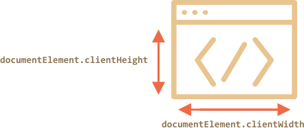

# Window 的尺寸和滚动

<<<<<<< HEAD
怎么找到浏览器窗口的宽度呢？如何获得包括滚动窗口外部分的文档总高度呢？如何通过 JavaScript 滚动页面呢？
=======
How to find out the width and height of the browser window? How to get the full width and height of the document, including the scrolled out part? How to scroll the page using JavaScript?
>>>>>>> 9b5c1c95ec8a466150e519b0e94748717c747b09

在 DOM 里，文档的根元素是 `document.documentElement`。与之相对应的标签是 `<html>`，同时它具备了[前一章](info:size-and-scroll)的几何属性。只有在某些情景下，我们可以使用到它，但还有其他方法和特性需要我们去特别考虑的。

## 窗口的宽度/高度

`document.documentElement` 的 `clientWidth/clientHeight` 属性正是我们这里想要的：



```online
例如，这个按钮能显示窗口的高度：

<button onclick="alert(document.documentElement.clientHeight)">alert(document.documentElement.clientHeight)</button>
```

````warn header="Not `window.innerWidth/Height`"
<<<<<<< HEAD
浏览器也支持属性 `window.innerWidth/innerHeight`。它们看起来都是我们想要的。那么它们有什么不同呢？

在滚动条占用一部分空间的情况下，`clientWidth/clientHeight` 提供了它内部空间的宽度/高度。换言之，它们返回文档可见部分（可用内容）的宽高。

而 `window.innerWidth/innerHeight` 是忽略滚动条。
=======
Browsers also support properties `window.innerWidth/innerHeight`. They look like what we want. So why not to use them instead?

If there exists a scrollbar, and it occupies some space, `clientWidth/clientHeight` provide the width/height without it (subtract it). In other words, they return width/height of the visible part of the document, available for the content.

...And `window.innerWidth/innerHeight` ignore the scrollbar.
>>>>>>> 9b5c1c95ec8a466150e519b0e94748717c747b09

如果有一条滚动条，它占用了一些空间，那么这两行代码会得到不同的值：
```js run
alert( window.innerWidth ); // 整个窗口的宽度
alert( document.documentElement.clientWidth ); // 窗口减去滚动条的宽度
```

在大多数情况下，我们在绘制或者定位某样东西需要**实际的**窗口宽度。当遇到内部有滚动条的情况，我们就应该使用到`documentElement.clientHeight/Width`。
````

```warn header="`DOCTYPE` 很重要"
请注意：HTML 文件里如果没有 `<!DOCTYPE HTML>`，顶层几何属性可能就有点不同了，稀奇古怪的情况可能就发生了。

现代的 HTML 我们都会写 `DOCTYPE`。总言之，那不是一个 JavaScript 的问题，但也会影响到 JavaScript。

```

## 文档的宽度/高度

理论上，文档元素的宽高是 `documentElement.clientWidth/Height`，并且包含了全部内容，我们可以依据 `documentElement.scrollWidth/scrollHeight` 测量它的最大值。

<<<<<<< HEAD
这几个属性对常规元素能起作用，但面对整个页面它们会失去它们应有的作用了。在 Chrome/Safari/Opera 浏览器，如果这里没有滚动条，`documentElement.scrollHeight` 甚至比 `documentElement.clientHeight` 小！这对常规元素来讲是不可能出现的情况。

要获得可靠的窗口大小，我们应该采用这些属性的最大值：
=======
These properties work well for regular elements. But for the whole page these properties do not work as intended. In Chrome/Safari/Opera if there's no scroll, then `documentElement.scrollHeight` may be even less than  `documentElement.clientHeight`! Sounds like a nonsense, weird, right?

To reliably obtain the full document height, we should take the maximum of these properties:
>>>>>>> 9b5c1c95ec8a466150e519b0e94748717c747b09

```js run
let scrollHeight = Math.max(
  document.body.scrollHeight, document.documentElement.scrollHeight,
  document.body.offsetHeight, document.documentElement.offsetHeight,
  document.body.clientHeight, document.documentElement.clientHeight
);

alert('Full document height, with scrolled out part: ' + scrollHeight);
```

为什么这样？最好不要问。这种不一致来源于远古时期，而不是“正常”的逻辑。

## 得到当前滚动 [#page-scroll]

<<<<<<< HEAD
常规元素有它们自己的滚动状态 `elem.scrollLeft/scrollTop`。

那页面的呢？差不多所有浏览器为文档滚动提供了 `documentElement.scrollLeft/Top`，但是 Chrome/Safari/Opera 有 bugs（像 [157855](https://code.google.com/p/chromium/issues/detail?id=157855)，[106133](https://bugs.webkit.org/show_bug.cgi?id=106133)）我们应该用`document.body` 代替`document.documentElement` 

幸运的是，由于特殊属性 `window.pageXOffset/pageYOffset`，我们根本不必记住这些特性：
=======
DOM elements have their current scroll state in `elem.scrollLeft/scrollTop`.

For document scroll `document.documentElement.scrollLeft/Top` works in most browsers, except oldler WebKit-based ones, like Safari (bug [5991](https://bugs.webkit.org/show_bug.cgi?id=5991)), where we should use  `document.body` instead of `document.documentElement` there.

Luckily, we don't have to remember these peculiarities at all, because the scroll is available in the special properties `window.pageXOffset/pageYOffset`:
>>>>>>> 9b5c1c95ec8a466150e519b0e94748717c747b09

```js run
alert('Current scroll from the top: ' + window.pageYOffset);
alert('Current scroll from the left: ' + window.pageXOffset);
```

这些属性是只读的。

## Scrolling: scrollTo, scrollBy, scrollIntoView [#window-scroll]

```warn
必须在 DOM 完全构建好之后才能通过 JavaScript 滚动页面

例如，如果我们尝试在 `<head>` 中运行脚本滚动页面，这段脚本将无法工作。
```

可以通过更改 `scrollTop/scrollLeft` 来滚动常规元素。

<<<<<<< HEAD
我们可以对页面执行相同的操作：
- 在 Chrome/Safari/Opera 外的所有浏览器：修改 `document.documentElement.scrollTop/Left`。
- 在 Chrome/Safari/Opera 浏览器：使用 `document.body.scrollTop/Left`。

不好！这个操作虽然能工作了，但似乎在跨浏览器上不兼容。幸运的是，有一个更简单，更通用的解决方案 [window.scrollBy(x,y)](mdn:api/Window/scrollBy) 和 [window.scrollTo(pageX,pageY)](mdn:api/Window/scrollTo)。
=======
We can do the same for the page, but as explained above:
- For most browsers (except older Webkit-based) `document.documentElement.scrollTop/Left` is the right property.
- Otherwise, `document.body.scrollTop/Left`.

These cross-browser incompatibilities are not good. Fortunately, there's a simpler,  universal solution: special methods  [window.scrollBy(x,y)](mdn:api/Window/scrollBy) and [window.scrollTo(pageX,pageY)](mdn:api/Window/scrollTo).
>>>>>>> 9b5c1c95ec8a466150e519b0e94748717c747b09

- 方法 `scrollBy(x,y)` 滚动页面至相对于现在位置的 (x, y) 位置。例如，`scrollBy(0,10)` 页面向下滚动 `10px`。

    ```online
    下面的按钮演示了这一点：

    <button onclick="window.scrollBy(0,10)">window.scrollBy(0,10)</button>
    ```
<<<<<<< HEAD
- 方法 `scrollTo(pageX,pageY)` 滚动页面至相对于文档的左上角的 (pageX, pageY) 位置。就好像设置 `scrollLeft/scrollTop`。
=======
- The method `scrollTo(pageX,pageY)` scrolls the page to absolute coordinates, so that the top-left corner of the visible part has coordinates `(pageX, pageY)` relative to the document's top-left corner. It's like setting `scrollLeft/scrollTop`.
>>>>>>> 9b5c1c95ec8a466150e519b0e94748717c747b09

    回到顶部, 我们可以用 `scrollTo(0,0)`。

    ```online
    <button onclick="window.scrollTo(0,0)">window.scrollTo(0,0)</button>
    ```

这些方法适用于所有浏览器。

## 滚动到视图

为了讲全面点，让我们再来介绍一个方法：[elem.srollIntoView(top)](mdn:api/Element/scrollIntoView)。

调用 `elem.scrollIntoView(top)` 会使 `elem` 滚动到可视范围。它有一个结论：

- 如果 `top=true`（默认值），页面滚动使 `elem` 会出现到窗口顶部。元素的上边缘与窗口顶部对齐。
- 如果 `top=false`，则页面滚动使 `elem` 会出现在窗口底部。元素的下边缘与窗口底部对齐。

```online
这个按钮会让滚动页面，使它自己出现在顶部：

<button onclick="this.scrollIntoView()">this.scrollIntoView()</button>

而这个按钮会滚动页面，使它出现在底部：

<button onclick="this.scrollIntoView(false)">this.scrollIntoView(false)</button>
```

## 禁止滚动

有时候我们需要让文档禁止滚动。例如，当我们需要用一个被立即关注的消息框覆盖这个文档时，我们希望访问者与这个消息进行交互，而不是与文档进行交互。

<<<<<<< HEAD
想让这个文档禁止滚动，设置`document.body.style.overflow = "hidden"`就够了。该页面将“冻结”其当前滚动。
=======
To make the document unscrollable, it's enough to set `document.body.style.overflow = "hidden"`. The page will freeze on its current scroll.
>>>>>>> 9b5c1c95ec8a466150e519b0e94748717c747b09

```online
试一试：

<button onclick="document.body.style.overflow = 'hidden'">`document.body.style.overflow = 'hidden'`</button>

<button onclick="document.body.style.overflow = ''">`document.body.style.overflow = ''`</button>

第一个按钮是禁止滚动，第二个则能够恢复它。
```

我们可以使用同样的手段来“冻结”其他元素的滚动，而不仅仅是 `document.body`。

这个方法的缺点是会使滚动条消失。如果它占用了一些空间，它原本占用的空间就会空出来，使元素本身的内容“跳”出来填满空出来的空间里。

<<<<<<< HEAD
这看起来就有点怪怪的。但我们可以解决这个问题：通过对比冻结前后的`clientWidth`如果在 `clientWidth` 增加（滚动条消失）时，将 `padding` 添加到 `document.body` 取代滚动条来保持内容宽度不变。
=======
That looks a bit odd, but can be worked around if we compare `clientWidth` before and after the freeze, and if it increased (the scrollbar disappeared) then add `padding` to `document.body` in place of the scrollbar, to keep the content width the same.
>>>>>>> 9b5c1c95ec8a466150e519b0e94748717c747b09

## 总结

几何：

- 文档可视范围的宽度/高度（内容区域的宽高）：`document.documentElement.clientWidth/Height`
- 整个文档的宽度/高度，包括滚动区域外的部分：

    ```js
    let scrollHeight = Math.max(
      document.body.scrollHeight, document.documentElement.scrollHeight,
      document.body.offsetHeight, document.documentElement.offsetHeight,
      document.body.clientHeight, document.documentElement.clientHeight
    );
    ```

滚动：

- 读取当前的滚动：`window.pageYOffset/pageXOffset`
- 改变当前的滚动：

    - `window.scrollTo(pageX,pageY)` — 绝对定位
    - `window.scrollBy(x,y)` — 相对当前位置的滚动
    - `elem.scrollIntoView(top)` — 滚动到正好`elem`可视的位置（`elem` 与窗口的顶部/底部对齐）
