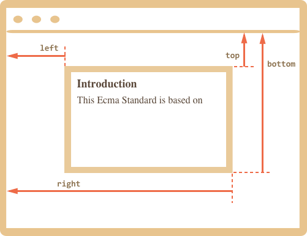
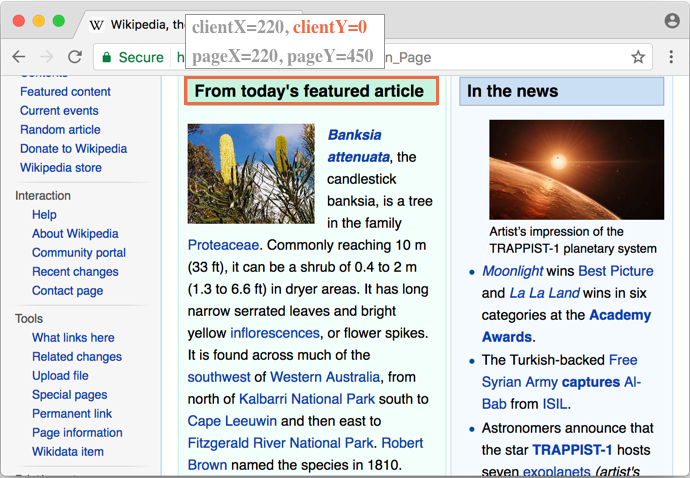

# 坐标

要移动页面的元素，我们应该先熟悉坐标。

大多数 JavaScript 方法处理的是以下两种坐标系中的一个：

1. **相对于窗口** — 类似于 `position:fixed`，从窗口的顶部/左侧边缘计算得出。
    - 我们将这些坐标表示为 `clientX/clientY`，当我们研究事件属性时，就会明白为什么使用这种名称来表示坐标。
2. **相对于文档** — 与文档根（document root）中的 `position:absolute` 类似，从文档的顶部/左侧边缘计算得出。
    - 我们将它们表示为 `pageX/pageY`。

当页面滚动到最开始时，此时窗口的左上角恰好是文档的左上角，它们的坐标彼此相等。但是，在文档移动之后，元素的窗口相对坐标会发生变化，因为元素在窗口中移动，而元素在文档中的相对坐标保持不变。

在下图中，我们在文档中取一点，并演示了它滚动之前（左）和之后（右）的坐标：


当文档滚动了：
- `pageY` — 元素在文档中的相对坐标保持不变，从文档顶部（现在已滚动出去）开始计算。
- `clientY` — 窗口相对坐标确实发生了变化（箭头变短了），因为同一个点越来越靠近窗口顶部。

## 元素坐标：getBoundingClientRect

方法 `elem.getBoundingClientRect()` 返回最小矩形的窗口坐标，该矩形将 `elem` 作为内建 [DOMRect](https://www.w3.org/TR/geometry-1/#domrect) 类的对象。

主要的 `DOMRect` 属性：

- `x/y` — 矩形原点相对于窗口的 X/Y坐标，
- `width/height` — 矩形的 width/height（可以为负）。

此外，还有派生（derived）属性：

- `top/bottom` — 顶部/底部矩形边缘的 Y 坐标，
- `left/right` — 左/右矩形边缘的 X 坐标。

```online
例如，单击下面这个按钮以查看其窗口坐标：

<p><input id="brTest" type="button" value="使用 button.getBoundingClientRect() 获取此按钮的坐标" onclick='showRect(this)'/></p>

<script>
function showRect(elem) {
  let r = elem.getBoundingClientRect();
  alert(`x:${r.x}
y:${r.y}
width:${r.width}
height:${r.height}
top:${r.top}
bottom:${r.bottom}
left:${r.left}
right:${r.right}
`);
}
</script>

如果你滚动此页面并重复点击上面那个按钮，你会发现随着窗口相对按钮位置的改变，其窗口坐标（如果你垂直滚动页面，则为 `y/top/bottom`）也随之改变。
```

下面这张是 `elem.getBoundingClientRect()` 的输出的示意图：


正如你所看到的，`x/y` 和 `width/height` 对举行进行了完整的描述。可以很容易地从它们计算出派生（derived）属性：

- `left = x`
- `top = y`
- `right = x + width`
- `bottom = y + height`

请注意：

- Coordinates may be decimal fractions, such as `10.5`. That's normal, internally browser uses fractions in calculations. We don't have to round them when setting to `style.left/top`.
- Coordinates may be negative. For instance, if the page is scrolled so that `elem` is now above the window, then `elem.getBoundingClientRect().top` is negative.

```smart header="Why derived properties are needed? Why does `top/left` exist if there's `x/y`?"
Mathematically, a rectangle is uniquely defined with its starting point `(x,y)` and the direction vector `(width,height)`. So the additional derived properties are for convenience.

Technically it's possible for `width/height` to be negative, that allows for "directed" rectangle, e.g. to represent mouse selection with properly marked start and end.

Negative `width/height` values mean that the rectangle starts at its bottom-right corner and then "grows" left-upwards.

Here's a rectangle with negative `width` and `height` (e.g. `width=-200`, `height=-100`):


As you can see, `left/top` do not equal `x/y` in such case.

In practice though, `elem.getBoundingClientRect()` always returns positive width/height, here we mention negative `width/height` only for you to understand why these seemingly duplicate properties are not actually duplicates.
```

```warn header="Internet Explorer and Edge: no support for `x/y`"
Internet Explorer and Edge don't support `x/y` properties for historical reasons.

So we can either make a polyfill (add getters in `DomRect.prototype`) or just use `top/left`, as they are always the same as `x/y` for positive `width/height`, in particular in the result of `elem.getBoundingClientRect()`.
```

```warn header="Coordinates right/bottom are different from CSS position properties"
There are obvious similarities between window-relative coordinates and CSS `position:fixed`.

But in CSS positioning, `right` property means the distance from the right edge, and `bottom` property means the distance from the bottom edge.

If we just look at the picture above, we can see that in JavaScript it is not so. All window coordinates are counted from the top-left corner, including these ones.
```




额外说明：

- 坐标可以是十进制的分数。这很正常，浏览器内部也是使用十进制分数来计算坐标。当设置元素的 `style.position.left/top` 时我们不需要舍入它们，浏览器可以支持十进制分数。
- 坐标也可以是负数的。例如当我们滚动页面向下在 `elem` 的顶部超过窗口的时候，这时候我们调用 `elem.getBoundingClientRect().top` 返回的就是负数。
- 一些浏览器（像 Chrome）还会在 `getBoundingClientRect` 的返回中增加 `width` 和 `height` 属性。我们可以通过减法计算 `height=bottom-top`，`width=right-left` 来得到这两个属性。

```warn header="坐标的右/底部和 CSS 中的属性是不同的"

如果我们把窗口的坐标和 CSS 中的位置相对照，那么其和 `position:fixed` 有明显的相似之处 — 也是相对于 viewport 的位置。

但是在 CSS 中 `right` 属性表示的是到右边界的距离，而且 `bottom` 是到底部边界的距离。

如果我们只看下面的图片，我们可以看到在 JavaScript 中并非如此。所有窗口坐标都是从左上角开始计算的，包括这些坐标。
```

## elementFromPoint(x, y) [#elementFromPoint]

调用 `document.elementFromPoint(x, y)` 方法返回窗口坐标 `(x, y)` 中最顶层的元素。

语法如下所示：

```js
let elem = document.elementFromPoint(x, y);
```

比方说，下面的代码会高亮显示并输出现在位于窗口中间元素的标签：

```js run
let centerX = document.documentElement.clientWidth / 2;
let centerY = document.documentElement.clientHeight / 2;

let elem = document.elementFromPoint(centerX, centerY);

elem.style.background = "red";
alert(elem.tagName);
```

因为它使用的是窗口坐标，基于现在滚动的位置会显示不同的元素。

````warn header="对于在窗口之外的坐标 `elementFromPoint` 返回 `null`"
方法 `document.elementFromPoint(x,y)` 只有在 `(x,y)` 坐标位于可是范围内才能正常调用。

如果其中任何坐标是负数或者超过了窗口的宽/高，那么该函数就返回 `null`。

在大多数情况下，这种行为并不是一个问题，但是我们应该记住这一点。

这里就是一个典型的错误，如果我们不检查，它就可能会发生。

```js
let elem = document.elementFromPoint(x, y);
// 如果坐标正好是超过的窗口打下，那么 elem = null
*!*
elem.style.background = ''; // Error!
*/!*
```
````

## 使用位置：fixed

大多数时候我们需要使用坐标来定位。在 CSS 中，为了相对于 viewport 来定位元素，我们同时使用 `position:fixed` 和 `left/top`（或者是 `right/bottom`）。

我们可以使用 `getBoundingClientRect` 来获取一个元素的坐标，并且之后可以在该元素附近显示一些东西。

比如说，下面的 `createMessageUnder(elem, html)` 函数在 `elem` 元素下面显示了消息：

```js
let elem = document.getElementById("coords-show-mark");

function createMessageUnder(elem, html) {
  // 创建 message 元素
  let message = document.createElement('div');
  // 在这里最好使用 css 来定义样式
  message.style.cssText = "position:fixed; color: red";

*!*
  // 分配坐标，不要忘记 “px”！
  let coords = elem.getBoundingClientRect();

  message.style.left = coords.left + "px";
  message.style.top = coords.bottom + "px";
*/!*

  message.innerHTML = html;

  return message;
}

// 使用方式：
// 在文档中添加 message 保持 5 秒
let message = createMessageUnder(elem, 'Hello, world!');
document.body.append(message);
setTimeout(() => message.remove(), 5000);
```

```online
按这个按钮来执行它：

<button id="coords-show-mark">Button with id="coords-show-mark", the message will appear under it</button>
```

我们可以修改代码从而在元素左边，右边或者下面显示消息，也可以应用 CSS 动画来营造“淡入淡出”效果等等。这很简单，因为我们有该元素所有的坐标和大小。

但是请注意一个重要的细节：当这个页面被滚动时，消息就会从按钮下流离出去。

原因显而易见：消息元素依赖于 `position:fixed`，所以当页面滚动时，它始终位于窗口的同一个位置。

如果要改变这个状况，我们需要使用基于文档的坐标和 `position:absolute` 样式。

## 文档坐标

文档相对坐标是从文档的左上角开始计算，而不是窗口。

在 CSS 中，窗口坐标对应的是 `position:fixed`，而文档坐标则类似顶部的 `position:absolute`。

我们可以使用 `position:absolute` 和 `top/left` 来把一些东西放到文档中的固定位置，以便在页面滚动时元素仍能保留在那里。但是我们首先需要正确的坐标。

为了清楚起见我们把窗口坐标叫做 `(clientX,clientY)` 把文档坐标叫做 `(pageX,pageY)`。

当页面没有滚动时，窗口坐标和页面坐标实际上是相同的，它们的零点也匹配：


如果我们滚动页面，那么 `(clientX,clientY)` 就会改变，因为它们是相对于窗口计算的，但是 `(pageX,pageY)` 不会变。

这里是垂直滚动后的同一页面：




- 包含 `"From today's featured article"` 的 header 元素 `clientY` 变成 `0`，因为这个元素现在在窗口的顶部。
- `clientX` 并没有改变，因为我们没有水平滚动。
- 元素的 `pageX` 和 `pageY` 坐标始终保持一致，因为它们是相对于文档计算的。

## 获取文档坐标 [#getCoords]

现在 Javascript 中并没有获取一个元素文档坐标的标准方法。但是这个方法写起来很容易。

两个坐标系可以通过由公式相连接：
- `pageY` = `clientY` + 文档垂直部分滚动的高度。
- `pageX` = `clientX` + 文档水平部分滚动的宽度。

函数 `getCoords(elem)` 将从 `elem.getBoundingClientRect()` 获取到窗口坐标然后加上当前滚动的长度：

```js
// 获取元素的文档坐标
function getCoords(elem) {
  let box = elem.getBoundingClientRect();

  return {
    top: box.top + pageYOffset,
    left: box.left + pageXOffset
  };
}
```

## 总结

页面上的任何点都有坐标：

3. 相对于窗口的坐标 — `elem.getBoundingClientRect()`。
4. 相对于文档的坐标 — `elem.getBoundingClientRect()` 加上当前页面滚动的长度。

窗口坐标非常适合和 `position:fixed` 一起使用，文档坐标非常适合和 `position:absolute` 一起使用。

这两个坐标系统有它们各自的“优点”和“缺点”，有些时候我们需要使用其中一个或另一个，就像 CSS `position` 中的 `absolute` 和 `fixed` 那样。
