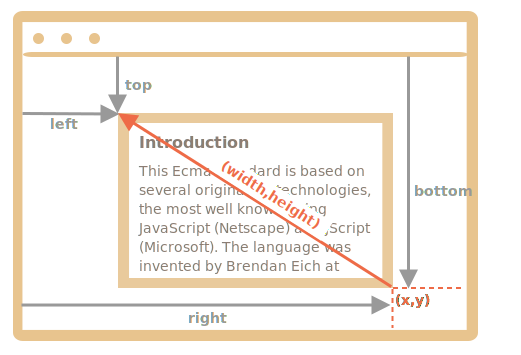

# 坐标

要移动页面的元素，我们应该先熟悉坐标。

大多数 JavaScript 方法处理的是以下两种坐标系中的一个：

1. **相对于窗口** — 类似于 `position:fixed`，从窗口的顶部/左侧边缘计算得出。
    - 我们将这些坐标表示为 `clientX/clientY`，当我们研究事件属性时，就会明白为什么使用这种名称来表示坐标。
2. **相对于文档** — 与文档根（document root）中的 `position:absolute` 类似，从文档的顶部/左侧边缘计算得出。
    - 我们将它们表示为 `pageX/pageY`。

当页面滚动到最开始时，此时窗口的左上角恰好是文档的左上角，它们的坐标彼此相等。但是，在文档移动之后，元素的窗口相对坐标会发生变化，因为元素在窗口中移动，而元素在文档中的相对坐标保持不变。

在下图中，我们在文档中取一点，并演示了它滚动之前（左）和之后（右）的坐标：


当文档滚动了：
- `pageY` — 元素在文档中的相对坐标保持不变，从文档顶部（现在已滚动出去）开始计算。
- `clientY` — 窗口相对坐标确实发生了变化（箭头变短了），因为同一个点越来越靠近窗口顶部。

## 元素坐标：getBoundingClientRect

方法 `elem.getBoundingClientRect()` 返回最小矩形的窗口坐标，该矩形将 `elem` 作为内建 [DOMRect](https://www.w3.org/TR/geometry-1/#domrect) 类的对象。

主要的 `DOMRect` 属性：

- `x/y` — 矩形原点相对于窗口的 X/Y 坐标，
- `width/height` — 矩形的 width/height（可以为负）。

此外，还有派生（derived）属性：

- `top/bottom` — 顶部/底部矩形边缘的 Y 坐标，
- `left/right` — 左/右矩形边缘的 X 坐标。

```online
例如，点击下面这个按钮以查看其窗口坐标：

<p><input id="brTest" type="button" value="Get coordinates using button.getBoundingClientRect() for this button" onclick='showRect(this)'/></p>

<script>
function showRect(elem) {
  let r = elem.getBoundingClientRect();
  alert(`x:${r.x}
y:${r.y}
width:${r.width}
height:${r.height}
top:${r.top}
bottom:${r.bottom}
left:${r.left}
right:${r.right}
`);
}
</script>

如果你滚动此页面并重复点击上面那个按钮，你会发现随着窗口相对按钮位置的改变，其窗口坐标（如果你垂直滚动页面，则为 `y/top/bottom`）也随之改变。
```

下面这张是 `elem.getBoundingClientRect()` 的输出的示意图：


正如你所看到的，`x/y` 和 `width/height` 对矩形进行了完整的描述。可以很容易地从它们计算出派生（derived）属性：

- `left = x`
- `top = y`
- `right = x + width`
- `bottom = y + height`

请注意：

- 坐标可能是小数，例如 `10.5`。这是正常的，浏览器内部使用小数进行计算。在设置 `style.left/top` 时，我们不是必须对它们进行舍入。
- 坐标可能是负数。例如滚动页面，使 `elem` 现在位于窗口的上方，则 `elem.getBoundingClientRect().top` 为负数。

```smart header="为什么需要派生（derived）属性？如果有了 `x/y`，为什么还要还会存在 `top/left`？"
从数学上讲，一个矩形是使用其起点 `(x,y)` 和方向向量 `(width,height)` 唯一定义的。因此，其它派生属性是为了方便起见。

从技术上讲，`width/height` 可能为负数，从而允许“定向（directed）”矩形，例如代表带有正确标记的开始和结束的鼠标选择。

负的 `width/height` 值表示矩形从其右下角开始，然后向左上方“增长”。

这是一个矩形，其 `width` 和 `height` 均为负数（例如 `width=-200`，`height=-100`）：



正如你所看到的，在这个例子中，`left/top` 与 `x/y` 不相等。

但是实际上，`elem.getBoundingClientRect()` 总是返回正数的 width/height，这里我们提及负的 `width/height` 只是为了帮助你理解，为什么这些看起来重复的属性，实际上并不是重复的。
```

```warn header="IE 浏览器不支持 `x/y`"
由于历史原因，IE 浏览器不支持 `x/y` 属性。

因此，我们可以写一个 polyfill（在 `DomRect.prototype` 中添加一个 getter），或者仅使用 `top/left`，因为对于正值的 `width/height` 来说，它们和 `x/y` 一直是一样的，尤其是对于 `elem.getBoundingClientRect()` 的结果。
```

```warn header="坐标的 right/bottom 与 CSS position 属性不同"
相对于窗口（window）的坐标和 CSS `position:fixed` 之间有明显的相似之处。

但是在 CSS 定位中，`right` 属性表示距右边缘的距离，而 `bottom` 属性表示距下边缘的距离。

如果我们再看一下上面的图片，我们可以看到在 JavaScript 中并非如此。窗口的所有坐标都从左上角开始计数，包括这些坐标。
```

## elementFromPoint(x, y) [#elementFromPoint]

对 `document.elementFromPoint(x, y)` 的调用会返回在窗口坐标 `(x, y)` 处嵌套最多（the most nested）的元素。

语法如下：

```js
let elem = document.elementFromPoint(x, y);
```

例如，下面的代码会高亮显示并输出现在位于窗口中间的元素的标签：

```js run
let centerX = document.documentElement.clientWidth / 2;
let centerY = document.documentElement.clientHeight / 2;

let elem = document.elementFromPoint(centerX, centerY);

elem.style.background = "red";
alert(elem.tagName);
```

因为它使用的是窗口坐标，所以元素可能会因当前滚动位置而有所不同。

````warn header="对于在窗口之外的坐标，`elementFromPoint` 返回 `null`"
方法 `document.elementFromPoint(x,y)` 只对在可见区域内的坐标 `(x,y)` 起作用。

如果任何坐标为负或者超过了窗口的 width/height，那么该方法就会返回 `null`。

在大多数情况下，这种行为并不是一个问题，但是我们应该记住这一点。

如果我们没有对其进行检查，可能就会发生下面这个典型的错误：

```js
let elem = document.elementFromPoint(x, y);
// 如果坐标恰好在窗口外，则 elem = null
*!*
elem.style.background = ''; // Error!
*/!*
```
````

## 用于 "fixed" 定位

为了显示元素附近的东西，我们可以使用 `getBoundingClientRect` 来获取其坐标，然后使用 CSS `position` 以及 `left/top`（或 `right/bottom`）。

例如，下面的函数 `createMessageUnder(elem, html)` 在 `elem` 下显示了消息：

```js
let elem = document.getElementById("coords-show-mark");

function createMessageUnder(elem, html) {
  // 创建 message 元素
  let message = document.createElement('div');
  // 在这里最好使用 CSS class 来定义样式
  message.style.cssText = "position:fixed; color: red";

*!*
  // 分配坐标，不要忘记 "px"！
  let coords = elem.getBoundingClientRect();

  message.style.left = coords.left + "px";
  message.style.top = coords.bottom + "px";
*/!*

  message.innerHTML = html;

  return message;
}

// 用法：
// 在文档中添加 message 保持 5 秒
let message = createMessageUnder(elem, 'Hello, world!');
document.body.append(message);
setTimeout(() => message.remove(), 5000);
```

```online
点击下面这个按钮来运行它：

<button id="coords-show-mark">Button with id="coords-show-mark", the message will appear under it</button>
```

我们可以修改代码以在元素左侧，右侧或下面显示消息，也可以应用 CSS 动画来营造“淡入淡出”效果等。这很简单，因为我们有该元素所有坐标和大小。

但是请注意一个重要的细节：滚动页面时，消息就会从按钮流出。

原因很显然：message 元素依赖于 `position:fixed`，因此当页面滚动时，它仍位于窗口的同一位置。

要改变这一点，我们需要使用基于文档（document）的坐标和 `position:absolute` 样式。

## 文档坐标 [#getCoords]

文档相对坐标从文档的左上角开始计算，而不是窗口。

在 CSS 中，窗口坐标对应于 `position:fixed`，而文档坐标与顶部的 `position:absolute` 类似。

我们可以使用 `position:absolute` 和 `top/left` 来把某些内容放到文档中的某个位置，以便在页面滚动时，元素仍能保留在该位置。但是我们首先需要正确的坐标。

这里没有标准方法来获取元素的文档坐标。但是写起来很容易。

这两个坐标系统通过以下公式相连接：
- `pageY` = `clientY` + 文档的垂直滚动出的部分的高度。
- `pageX` = `clientX` + 文档的水平滚动出的部分的宽度。

函数 `getCoords(elem)` 将从 `elem.getBoundingClientRect()` 获取窗口坐标，并向其中添加当前滚动：

```js
// 获取元素的文档坐标
function getCoords(elem) {
  let box = elem.getBoundingClientRect();

  return {
    top: box.top + window.pageYOffset,
    right: box.right + window.pageXOffset,
    bottom: box.bottom + window.pageYOffset,
    left: box.left + window.pageXOffset
  };
}
```

如果在上面的示例中，我们将其与 `position:absolute` 一起使用，则在页面滚动时，消息仍停留在元素附近。

修改后的 `createMessageUnder` 函数：

```js
function createMessageUnder(elem, html) {
  let message = document.createElement('div');
  message.style.cssText = "*!*position:absolute*/!*; color: red";

  let coords = *!*getCoords(elem);*/!*

  message.style.left = coords.left + "px";
  message.style.top = coords.bottom + "px";

  message.innerHTML = html;

  return message;
}
```

## 总结

页面上的任何点都有坐标：

1. 相对于窗口的坐标 — `elem.getBoundingClientRect()`。
2. 相对于文档的坐标 — `elem.getBoundingClientRect()` 加上当前页面滚动。

窗口坐标非常适合和 `position:fixed` 一起使用，文档坐标非常适合和 `position:absolute` 一起使用。

这两个坐标系统各有利弊。有时我们需要其中一个或另一个，就像 CSS `position` 的 `absolute` 和 `fixed` 一样。
