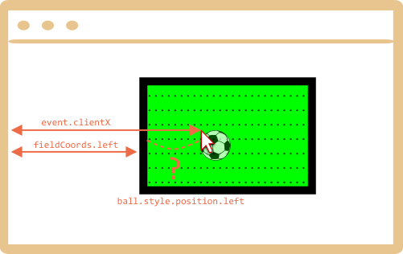

首先我们需要选择一种定位球的方法。

我们不能使用 `position:fixed`，因为滑动页面会让球在球场上移动。

因此我们应该使用 `position:absolute`，并使定位稳定，让 `field` 自身定位。

然后球相对于球场的位置：

```css
#field {
  width: 200px;
  height: 150px;
  position: relative;
}

#ball {
  position: absolute;
  left: 0; /* relative to the closest positioned ancestor (field) */
  top: 0;
  transition: 1s all; /* CSS animation for left/top makes the ball fly */
}
```

接下来我们需要指定正确的 `ball.style.position.left/top`。它们现在包含球场的相对坐标。

这是图片：



我们有 `event.clientX/clientY`—— 单击窗口时的相对坐标。

要获取单击字段的相对 `left` 坐标，我们可以减去字段的左边缘和边框宽度：

```js
let left = event.clientX - fieldInnerCoords.left - field.clientLeft;
```

通常情况下，`ball.style.position.left` 是指“元素的左边缘（球）”。因此，如果我们指定 `left`，那么球的边缘就会在鼠标光标下面。

我们需要将球的半宽度向左移动半高，使其成为中心。

因此，最后 `left` 是：

```js
let left = event.clientX - fieldInnerCoords.left - field.clientLeft - ball.offsetWidth/2;
```

使用相同的逻辑计算垂直坐标。

请注意，球的宽度/高度必须在我们进入 `ball.offsetWidth`. 时就已知。应该在 HTML 或 CSS 中指定。
