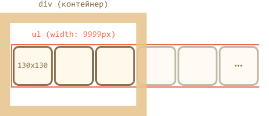
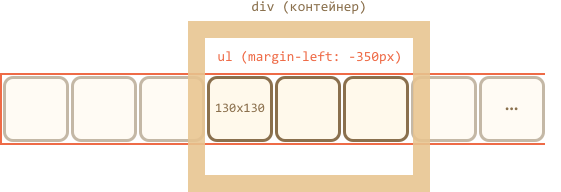

图像带可以表示为 `ul/li` 图像列表 ``。

通常情况下，这样的带是很宽的，但我们还是在其周围设置了一个固定大小的 `
` 来“剪切”它，因此只会有一部分带是可见的：

为了使列表水平显示，我们需要为 `<li>` 应用正确的 CSS 属性，比如 `display: inline-block`。

对于 `` 来说，我们应该调整 `display`，因为默认情况下它是 `inline`。由于在 `inline` 元素下方具有 "letter tails" 而存在额外空间，所以我们可以使用 `display:block` 来移除多余的空间。

我们可以移动 `<ul>` 来进行滚动。有很多方法都可以实现这一点，比如通过修改 `margin-left` 或者（性能更好）使用 `transform: translateX()`：

外部 `
` 具有固定的宽度，因此，"extra" 图像可以被剪切。

整个 carousel 是页面是一个自包含的 "graphical component"，因为我们最好将其封装成一个单独的 `
`，并对其设置样式。
