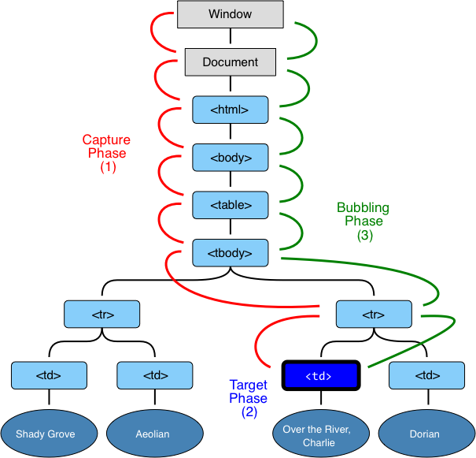

# 冒泡和捕获

我们先看一个示例。

这个处理器被分配给 `<div>`，但是如果你单击像 `<em>` 或者 `<code>` 这样的嵌套标签也是可以运行的：

```html autorun height=60
<div onclick="alert('The handler!')">
  <em>If you click on <code>EM</code>, the handler on <code>DIV</code> runs.</em>
</div>
```

这很奇怪不是么？为什么实际上是单击 `<em>`，而 `<div>` 上的处理器会运行？

## 冒泡

冒泡原理很简单。

**当事件发生在元素上，它首先会运行元素本身的处理器，然后运行父元素上的，再然后是其他祖先上的**。

比如我们有 3 层嵌套 `FORM > DIV > P`，它们都各自拥有一个处理器：

```html run autorun
<style>
  body * {
    margin: 10px;
    border: 1px solid blue;
  }
</style>

<form onclick="alert('form')">FORM
  <div onclick="alert('div')">DIV
    <p onclick="alert('p')">P</p>
  </div>
</form>
```

单击内部 `<p>` 会首先运行 `onclick`：
1. 在 `<p>` 上。
2. 然后是外部的 `<div>`。
3. 再然后是外部的 `<form>`。
4. 以此类推，直到最后的 `document` 对象。


因此，如果我们单击 `<p>`，那么我们将看到 3 个警告： `p` -> `div` -> `form`。

这个过程被称为“冒泡”，因为事件“冒泡”从内部元素向上时，会经过父节点，就像水里的气泡一样。

```warn header="*Almost* all events bubble."
这个短语的关键词是“几乎”。

例如，`focus` 事件不会冒泡。同样，我们以后还会遇到其他例子。但是这是例外，而不是规则，因为大多数事件都是冒泡的。
```

## event.target

父元素上的处理器总是可以获取事件实际发生位置的详细信息。

**引发事件的那个嵌套层级最深的元素被称为目标元素,可通过 `event.target` 访问。**

注意与 `this` (=`event.currentTarget`) 之间的区别：

- `event.target` ——  是引发事件的目标元素，它不会在冒泡过程中发生变化。。
- `this` —— 是 "current" 元素，其中有一个当前正在运行的处理器。

例如，如果我们有一个 `form.onclick` 处理器，那么它可以“抓”到所有表单内部元素上的点击事件。无论点击发生在哪里，它都会冒泡到 `<form>` 然后运行处理器。

`form.onclick` 处理器：

- `this` (`=event.currentTarget`) 是 `<form>` 元素，因为处理器在它上面运行。
- `event.target` 是表单中实际上被单击的元素。

检查：

[codetabs height=220 src="bubble-target"]

`event.target` 可能会等于 `this` —— 当单击事件发生在 `<form>` 元素上时。

## 停止冒泡

冒泡事件从目标元素开始向上冒泡。通常情况下，它向上上升到 `<html>`，然后再到 `document` 对象，一些事件甚至到达了 `window`，它们会调用路径上的所有处理器。

但是任何处理器都可以决定事件已经被完全处理，然后停止冒泡。

方法是 `event.stopPropagation()`。

例如，如果你单击 `<button>` 这里的 `body.onclick` 不会起作用：

```html run autorun height=60
<body onclick="alert(`the bubbling doesn't reach here`)">
  <button onclick="event.stopPropagation()">Click me</button>
</body>
```

```smart header="event.stopImmediatePropagation()"
如果元素在事件上有多个处理器，那么即使其中一个事件处理器停止冒泡，其他处理器也会继续执行。

换句话说，`event.stopPropagation()` 停止向上移动，但是当前元素上的其他处理器都会继续运行。

为了停止事件冒泡并阻止当前元素上的处理器运行，有一个 `event.stopImmediatePropagation()` 方法。使用之后，就不会有其他处理器会被执行。
```

```warn header="Don't stop bubbling without a need!"
冒泡很方便。不要在没有真正需求的时候阻止它：显而易见的，或者是在架构上经过深思熟虑后。

有时 `event.stopPropagation()` 会产生隐藏的陷阱，这可能会成为以后的问题。

例如：

1. 我们创建一个嵌套目录，每个子目录各自处理对自己的单击事件，并调用 `stopPropagation`，这样外层目录就不会被触发。
2. 之后我们决定去捕获在整个窗口上的点击，来追踪用户的行为（用户点击了哪里）。有些分析系统会这样做。通常代码会使用 `document.addEventListener('click'…)` 来捕获所有的点击。
3. 我们的分析不适用于点击被 `stopPropagation` 所阻止的区域。我们有一个 "dead zone"。

通常没有必要去阻止冒泡的产生。看似需要的任务，可以通过其他方法解决。其中之一就是使用自定义事件，我们稍后会进行讨论。此外，我们还可以将数据写入一个处理器中的 `event` 对象，并在另一个处理器中读取它，这样我们就可以向父处理器传递有关下层处理器的信息。
```


## 捕获

还有另一阶段的事件过程称为“捕获”。它在代码中很少被使用，但是有时是有用的。

[DOM 事件](http://www.w3.org/TR/DOM-Level-3-Events/)标准描述了事件传播的 3 个阶段：

1. 捕获阶段 —— 事件（从 Window）向下到达元素上。
2. 目标阶段 —— 事件到达目标元素。
3. 冒泡阶段 —— 事件从元素上开始冒泡。

下面是在表格中单击 `<td>` 的图片，取自规范：



即：对于 `<td>` 的单击，事件首先通过祖先链向下传递到元素（捕获），然后到达目标，最后上升（冒泡），在途中调用处理器。

**我们之前只讨论了冒泡，因为捕获阶段很少被使用。通常情况下，它对我们不可见**。

处理器 `on<event>` 属性或使用 HTML 属性或者使用 `addEventListener(event, handler)` 添加的处理器，不知道捕获，它们只知道第 2 和第 3 阶段。

要在捕获阶段捕获事件，我们需要将 `addEventListener` 的第三个参数设置为 `true`。

最后一个参数是可选的，有两个可能的值：

- 如果为 `false`（默认值），则在冒泡阶段设置处理器。
- 如果为 `true`，则在捕获阶段设置处理器。

注意，虽然形式上有 3 个阶段，但第 2 阶段（“目标阶段”：事件到达元素）没有单独被处理：捕获阶段和冒泡阶段的处理器在该阶段都会被触发。

如果将捕获阶段和冒泡阶段处理器放在目标上，捕获阶段处理器将在捕获阶段触发，而冒泡处理器将首先在冒泡阶段被触发。

我们看一下效果：

```html run autorun height=140 edit
<style>
  body * {
    margin: 10px;
    border: 1px solid blue;
  }
</style>

<form>FORM
  <div>DIV
    <p>P</p>
  </div>
</form>

<script>
  for(let elem of document.querySelectorAll('*')) {
    elem.addEventListener("click", e => alert(`Capturing: ${elem.tagName}`), true);
    elem.addEventListener("click", e => alert(`Bubbling: ${elem.tagName}`));
  }
</script>
```

代码为文档中的**每个**元素设置点击处理程序，以查看哪些元素上的点击事件处理器生效了。

如果你点击了 `<p>`，那么顺序是：

1. `HTML` -> `BODY` -> `FORM` -> `DIV` -> `P`（捕获阶段，第一个监听者），然后：
2. `P` -> `DIV` -> `FORM` -> `BODY` -> `HTML` （冒泡阶段，第二个监听者）。

请注意，`P` 出现了两次：在捕获结束和开始冒泡时。

有一个 `event.eventPhase` 属性，它告诉我们事件被捕获阶段的数量。但它很少使用，因为我们通常在处理器中了解到它。

## 总结

事件处理过程：

- 当事件发生时 —— 嵌套最深的那个元素被标记为“目标事件”(`event.target`)。
- 然后事件先从文档根节点向下移动到 `event.target`，过程中调用分配给 `addEventListener(...., true)` 的处理器。
- 再然后事件从 `event.target` 向上移动到根，调用使用 `on<event>` 和 `addEventListener` 分配的处理器，不使用第三个参数或第三个参数设置为 `false`。

每个处理器都可以访问 `event` 对象属性：

- `event.target` —— 事件最深的元素。
- `event.currentTarget` (=`this`) —— 处理事件的当前元素（有处理器在其上运行的）
- `event.eventPhase` —— 当前阶段（capturing=1, bubbling=3）。

任何事件处理器都可以通过调用 `event.stopPropagation()` 来停止事件，但不建议如此，因为我们不确定是否后续会使用冒泡上来的事件，也许是完全不同的事情。

捕获阶段很少使用，我们通常处理冒泡事件。这背后有一个逻辑。

现实世界中，当事故发生时，当地警方第一时间作出反应。他们最了解发生这件事的地方。如果需要更高级别的权威。那么就会向上申请。

事件处理却也是如此。在特定元素上设置处理器的代码了解该元素最详尽的信息。特定 `<td>` 上的处理器可能恰好适合于 `<td>`，它知道关于它的一切。所以它应该首先获得机会。然后，它的直系父节点也会获取上下文，但是会少一些，以此类推。而最顶层的元素最后才获取到信息，且只能了解到大致的情况。

冒泡和捕获为“事件委托”奠定了基础 —— 我们将在下一章中研究非常强大的事件处理模式。
